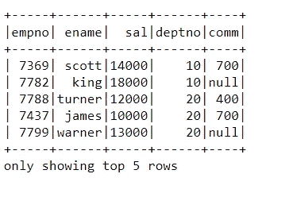
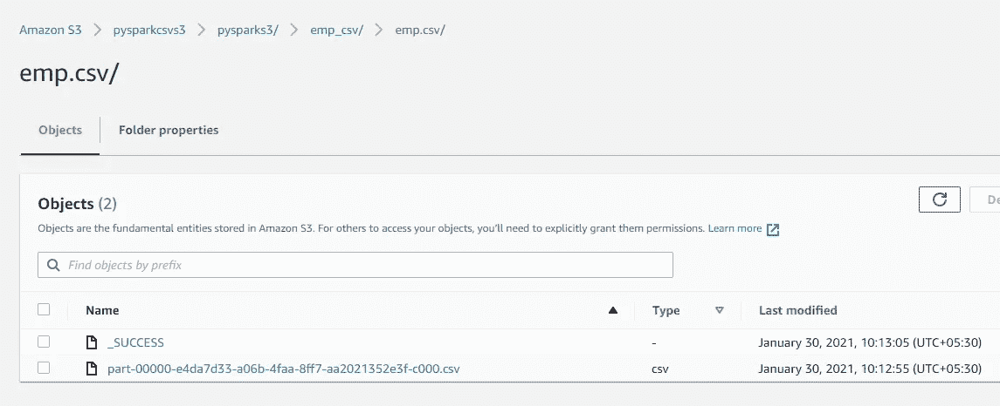
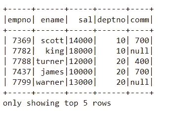
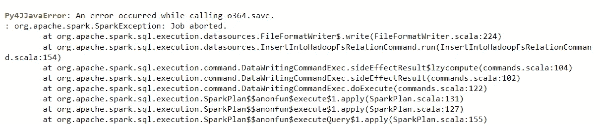
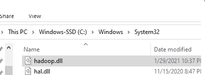

# PySpark AWS S3 读写操作

> 原文：<https://pub.towardsai.net/pyspark-aws-s3-read-write-operations-f473e5bee30f?source=collection_archive---------1----------------------->

## [云计算](https://towardsai.net/p/category/programming)

本文的目标是理解亚马逊网络存储服务 **S3** 的基本读写操作。更具体地说，使用 Apache Spark Python API PySpark 在 AWS S3 上执行读写操作。


1.  **在 Spark 独立集群上设置 Spark 会话**

```
import findspark
findspark.init()
import pyspark
from pyspark.sql import SparkSession
from pyspark import SparkContext, SparkConfimport os
os.environ['PYSPARK_SUBMIT_ARGS'] = '-- packages com.amazonaws:aws-java-sdk:1.7.4,org.apache.hadoop:hadoop-aws:2.7.3 pyspark-shell'
```

设置 Spark 属性连接到 Spark 会话:

```
#spark configuration
conf = SparkConf().set(‘spark.executor.extraJavaOptions’,’-Dcom.amazonaws.services.s3.enableV4=true’). \
 set(‘spark.driver.extraJavaOptions’,’-Dcom.amazonaws.services.s3.enableV4=true’). \
 setAppName(‘pyspark_aws’).setMaster(‘local[*]’)sc=SparkContext(conf=conf)
sc.setSystemProperty(‘com.amazonaws.services.s3.enableV4’, ‘true’)print(‘modules imported’)
```

为所有工作节点设置 Spark Hadoop 属性，如下所示:

```
accessKeyId=’xxxxxxxxxx’
secretAccessKey=’xxxxxxxxxxxxxxx’hadoopConf = sc._jsc.hadoopConfiguration()
hadoopConf.set(‘fs.s3a.access.key’, accessKeyId)
hadoopConf.set(‘fs.s3a.secret.key’, secretAccessKey)
hadoopConf.set(‘fs.s3a.endpoint’, ‘s3-us-east-2.amazonaws.com’)
hadoopConf.set(‘fs.s3a.impl’, ‘org.apache.hadoop.fs.s3a.S3AFileSystem’)spark=SparkSession(sc)
```

**s3a 写**:目前有三种方式可以读写文件:s3、s3n、s3a。在这篇文章中，我们将只讨论 s3a，因为它是最快的。请注意，s3 将不会在未来的版本中提供。

**v4 认证** : AWS S3 支持两个版本的认证——v2 和 v4。如需更多详细信息，请参考以下链接:[认证请求(AWS 签名版本 4)——亚马逊简单存储服务](https://docs.aws.amazon.com/AmazonS3/latest/API/sig-v4-authenticating-requests.html)

**2。读取本地系统上的数据集**

```
emp_df=spark.read.csv(‘D:\python_coding\GitLearn\python_ETL\emp.dat’,header=True,inferSchema=True)
emp_df.show(5)
```



**3。到 AWS S3 存储器的 PySpark 数据帧**

```
emp_df.write.format('csv').option('header','true').save('s3a://pysparkcsvs3/pysparks3/emp_csv/emp.csv',mode='overwrite')
```

验证 S3 桶中的数据集，如下所示:



我们已成功将 Spark 数据集写入 AWS S3 存储桶"**pysparcsvs 3**"。

**4。将数据从自动气象站 S3 读入 PySpark 数据帧**

```
s3_df=spark.read.csv(‘s3a://pysparkcsvs3/pysparks3/emp_csv/emp.csv/’,header=True,inferSchema=True)
s3_df.show(5)
```



在 PySpark 的帮助下，我们已经成功地将数据写入 AWS S3 存储并从中检索数据。

**5。我面临的问题**

将 PySpark 数据帧写入 S3 时，该过程多次失败，并显示以下错误。



解决方法:从[https://github . com/cdarlint/winutils/tree/master/Hadoop-3 . 2 . 1/bin](https://github.com/cdarlint/winutils/tree/master/hadoop-3.2.1/bin)下载**hadoop.dll**文件，放在 C:\Windows\System32 目录路径下。



博客到此为止。感谢大家阅读我的博客。一定要分享你的观点/反馈，它们很重要。