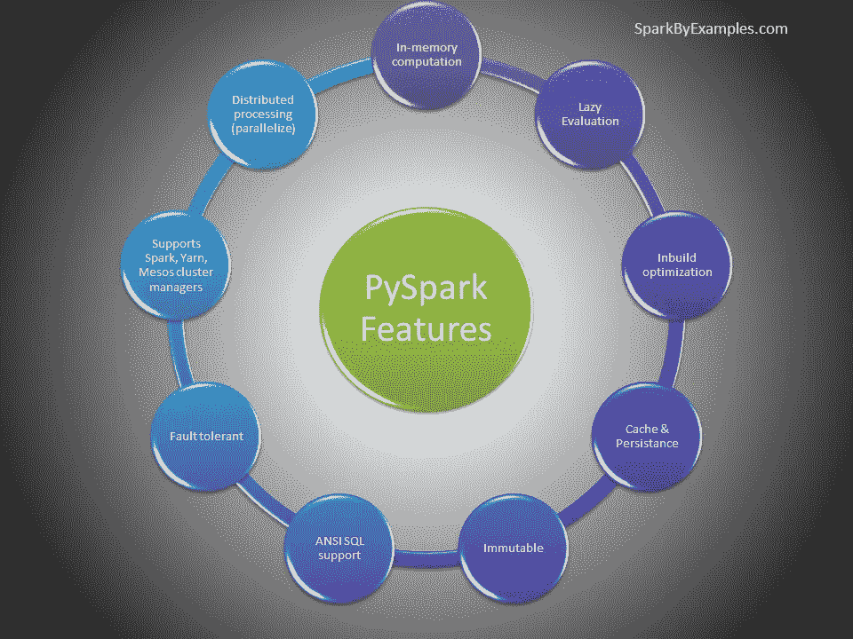
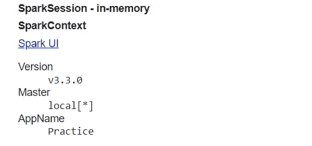
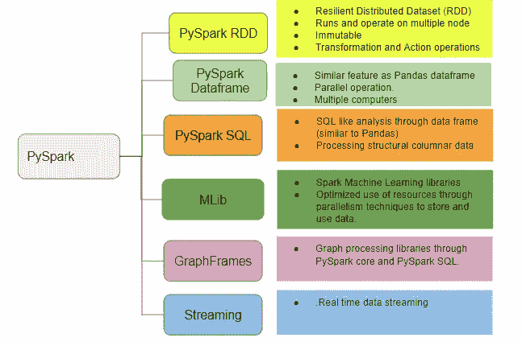
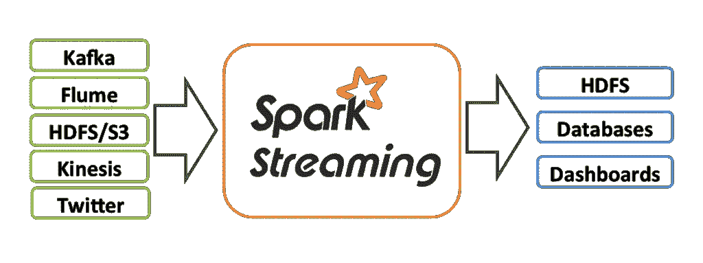

# PySpark 适合初学者

> 原文：<https://pub.towardsai.net/pyspark-for-beginners-part-1-introduction-638fb16c5092?source=collection_archive---------0----------------------->

PySpark 是一个用于 Apache Spark 的 Python API。使用 PySpark，我们可以在分布式集群(多个节点)上并行运行应用程序。


资料来源:Databricks

因此，我们将首先从理论部分开始，介绍我们为什么需要 Pyspark 以及 Apache Spark 的背景、特性和集群管理器类型，以及 Pyspark 模块和软件包。

Apache Spark 是一个用于大规模、强大的分布式数据处理和机器学习应用程序的分析处理引擎。一般来说，Spark 是用 Scala 编写的，但是为了适应工业应用，Python API——py Spark 被发布来使用 Spark 和 Python。实际上，PySpark 在机器学习和数据科学家社区中被大量使用；Spark 在分布式集群上运行数十亿和数万亿数据的操作比传统 python 应用程序快 100 倍。



Pyspark 的特性和优势

# Pyspark 建筑

Apache Spark 采用主从架构，其中主设备被称为“驱动程序”，从设备被称为“工人”。Spark Driver 创建一个 Spark 上下文作为应用程序的入口点，所有操作都在 worker 节点上运行，资源由集群管理器管理。


来源:Spark。Apache.org

# 集群管理器类型

该系统目前支持多个集群管理器。此外，我们还可以在我们的桌面/系统上本地运行 spark:

*   *独立【Spark 附带的一个简单的集群管理器，可以轻松设置集群。*
*   *Apache Mesos*——通用集群管理器，也可以运行 Hadoop MapReduce 和服务应用。(已弃用)
*   *Hadoop YARN*—Hadoop 2 和 3 中的资源管理器。最常用的集群管理器
*   Kubernetes —一个用于自动化部署、扩展和管理容器化应用的开源系统。

# Pyspark 配置、Pyspark 上下文和 Pyspark 会话:

> py spark conf:Spark conf 为任何 Spark 应用程序提供配置。要在本地集群或数据集上启动任何 Spark 应用程序，我们需要设置一些配置和参数，可以使用 SparkConf 来完成。

Pyspark 会议的特点:

*   **set(key，value)——**设置一个配置属性。
*   **setMaster(value) —** 设置要连接的主 URL。
*   **设置应用名称(值)——**设置应用名称。
*   **get(key，default value = None)——**获取某个键的配置值，否则返回默认值。
*   **setSparkHome(value)——**设置工作者节点上安装 Spark 的路径。

> py spark context:spark context 是任何 spark 功能的入口点。当我们运行任何 Spark 应用程序时，都会启动一个驱动程序，它具有主函数，并且您的 SparkContext 会在这里启动。然后，驱动程序在工作节点上的执行器内部运行操作。

Spark 驱动程序创建并使用 SparkContext 连接到集群管理器来提交 PySpark 作业，并知道与哪个资源管理器通信。它是 PySpark 应用程序的核心。

我们只能为每个 JVM 创建一个 SparkContext。为了创建另一个第一，你需要通过使用`stop()`方法停止现有的一个。SparkContext 默认为“sc”。所以创建另一个变量而不是 sc 将会产生错误。

> **Pyspark session:** 从 Spark 2.0 开始，spark session 就成为 Pyspark 与 RDD、DataFrame 合作的切入点。在 2.0 之前，SparkContext 曾经是一个入口点。SparkSession 是 2.0 版本之前所有不同上下文的组合类(SQLContext 和 HiveContext e.t.c)。因为 2.0 SparkSession 可用于 replace with SQLContext、HiveContext 和 2.0 之前定义的其他上下文。

尽管 SparkContext 在 2.0 之前曾是一个入口点，但它并没有被 SparkSession 完全取代；SparkContext 的许多特性在 Spark 2.0 和更高版本中仍然可用。SparkSession 在内部使用提供的配置创建 SparkConfig 和 SparkContext。

我们可以使用`SparkSession.builder()`或`SparkSession.newSession()`在 PySpark 应用程序中创建任意多的`SparkSession`。当您希望保持 PySpark 表(关系实体)在逻辑上分离时，需要许多 Spark 会话对象。

**创建火花会话**

```
from pyspark.sql import SparkSessionspark = SparkSession.builder.appName("Practice").getOrCreate()spark
```



# Pyspark 模块和封装



Pyspark 模块和封装

**PySpark RDD —弹性分布式数据集:**

> “弹性分布式数据集(RDD)是一种分布式内存抽象，可帮助程序员在大型集群上执行内存计算。”RDD 的重要优势之一是**容错，**这意味着如果发生任何故障，它会自动恢复。RDD 在被创建时变得不可变，即一旦被创建就不能被改变。

RDD 根据一个键将数据分成更小的部分。将数据分成更小的块的好处是，如果一个执行器节点出现故障，另一个节点仍将处理数据。因此，当相同的数据块在多个执行器节点上复制时，它能够从任何问题中快速恢复。RDD 通过绑定多个节点，提供了针对数据集快速执行函数计算的功能。

[](https://muttinenisairohith.medium.com/pyspark-for-beginners-part-4-pyspark-rdd-7b5587347b4c) [## Pyspark 初学者|第 4 部分:Pyspark RDD

### 弹性分布式数据集(rdd)是 Pyspark 的基本构件，py spark 是一个分布式内存…

muttinenisairohith.medium.com](https://muttinenisairohith.medium.com/pyspark-for-beginners-part-4-pyspark-rdd-7b5587347b4c) 

**Pyspark 数据帧:**

> DataFrame 是组织成指定列的分布式数据集合。它在概念上相当于关系数据库中的一个表或 R/Python 中的一个数据框，但是在底层有更丰富的优化。数据帧可以从各种来源构建，如结构化数据文件、Hive 中的表、外部数据库或现有的 rdd。

由于在多台机器上的所有内核上并行执行，PySpark 运行操作的速度比 pandas 更快。换句话说，pandas DataFrames 在单个节点上运行操作，而 PySpark 在多台机器上运行。

[](https://muttinenisairohith.medium.com/pyspark-for-begineers-part-2-pyspark-dataframe-60008da53e30) [## 初学者用 Pyspark |第 2 部分:Pyspark 数据框架

### DataFrame 现在是一个行业流行语，人们倾向于在各种情况下使用它。在这篇文章中，我们将学习…

muttinenisairohith.medium.com](https://muttinenisairohith.medium.com/pyspark-for-begineers-part-2-pyspark-dataframe-60008da53e30) 

**Pyspark SQL:**

> PySpark SQL 是 Spark 中的一个模块，它将关系处理与 Spark 的函数式编程 API 集成在一起。我们可以使用 SQL 查询语言提取数据。我们可以像使用 SQL 语言一样使用查询。

换句话说，Spark SQL 在 Spark 上引入了原生的原始 SQL 查询，这意味着您可以在 Spark 数据帧上运行传统的 ANSI SQL，在本 PySpark 教程的上一节中，您将详细了解如何使用 SQL `select`、`where`、`group by`、`join`、`union`等等

PySpark SQL 将易于使用，您可以扩展传统关系数据处理的限制。Spark 也支持 Hive 查询语言，但是存在 Hive 数据库的限制。开发 Spark SQL 是为了消除 Hive 数据库的缺点。

**Pyspark MLlib:**

> Apache Spark 提供了一个名为 **MLlib** 的机器学习 API。PySpark 在 Python 中也有这个机器学习 API。

它支持不同种类的算法，下面会提到

*—ml lib . clustering
—ml lib . class ification
—ml lib . fpm
—ml lib . Lina LG
—ml lib . recommendation
—ml lib . regression*

[](https://muttinenisairohith.medium.com/pyspark-mllib-classification-using-pyspark-ml-ec7e99e5176f) [## Pyspark MLlib |使用 Pyspark ML 分类

### 在前面几节中，我们讨论了 RDD、数据帧和 Pyspark 概念。在本文中，我们将讨论…

muttinenisairohith.medium.com](https://muttinenisairohith.medium.com/pyspark-mllib-classification-using-pyspark-ml-ec7e99e5176f) 

Pyspark GraphFrames:

PySpark GraphFrames 是在 Spark 3.0 版本中引入的，用于支持数据帧上的图形。在 3.0 之前，Spark 有 GraphX 库，理想情况下运行在 RDD 上，失去了所有数据帧功能。

> GraphFrames 是 Apache Spark 的一个包，它提供了基于数据帧的图形。它提供了 Scala、Java 和 Python 的高级 API。它旨在提供 GraphX 的功能和利用 Spark 数据帧的扩展功能。这种扩展的功能包括主题查找、基于数据帧的序列化和高度表达的图形查询。

**Pyspark 流:**

> PySpark Streaming 是一个可扩展、高吞吐量、容错的流处理系统，支持批处理和流工作负载。它用于处理来自文件系统文件夹、TCP 套接字、S3、Kafka、Flume、Twitter 和 Amazon Kinesis 等来源的实时数据。处理后的数据可以推送到数据库、Kafka、实时仪表盘等。



火花流

这是 Pyspark 的理论部分

浏览上面提供的内容链接，理解并实现 Pyspark。

快乐编码…