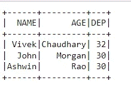
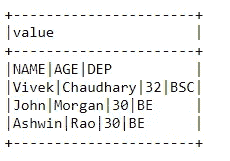
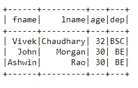
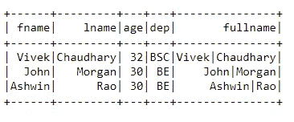
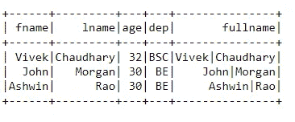

# 数据中带有列分隔符的 Pyspark 句柄数据集

> 原文：<https://pub.towardsai.net/pyspark-handle-dataset-with-columns-separator-in-data-c98069d131aa?source=collection_archive---------4----------------------->

## [编程](https://towardsai.net/p/category/programming)

这篇博客的目的是处理数据集中出现列分隔符或定界符的特殊情况。对于 Pyspark 开发人员来说，处理这种类型的数据集有时是一件令人头疼的事情，但无论如何，这是必须要处理的。在我的博客中，我将分享我应对挑战的方法，我乐于学习，所以也请分享你的方法。


来源: [PySpark](https://spark.apache.org/docs/latest/api/python/index.html)

数据集基本如下图所示:

```
#first line is the headerNAME|AGE|DEP
Vivek|Chaudhary|32|BSC
John|Morgan|30|BE
Ashwin|Rao|30|BE
```

数据集包含由分隔符“|”分隔的三列**、【姓名】、【年龄】、**。如果我们关注数据集，它还包含“|”作为列名**。**

让我们进一步看看如何进行相同的操作:

**步骤 1。使用 spark 的 read.csv()方法读取数据集:**

```
#create spark session import pyspark
from pyspark.sql import SparkSession
spark=SparkSession.builder.appName(‘delimit’).getOrCreate()
```

上面的命令帮助我们连接到 spark 环境，并让我们使用 spark.read.csv()读取数据集

```
#create dataframedf=spark.read.option(‘delimiter’,’|’).csv(r’<path>\delimit_data.txt’,inferSchema=True,header=True)df.show()
```



从文件中读取数据并将数据放入内存后，它看起来是这样的。但是等等，最后一列数据在哪里，列**年龄**必须有一个整数数据类型，但是我们看到了别的东西。这不是我们所期望的。乱七八糟完全不匹配，不是吗？答案是肯定的，一团糟。让我想起碧碧·雷克萨的歌《我一团糟》😂😂

现在，让我们学习如何解决这个问题。

**步骤 2。再次读取数据，但这次使用 read.text()方法:**

```
df=spark.read.text(r’C:\Users\lenovo\Python_Pyspark_Corp_Training\delimit_data.txt’)
df.show(truncate=0)
```



```
#extract first row as this is our header
head=df.first()[0]schema=[‘fname’,’lname’,’age’,’dep’]
print(schema)Output: ['fname', 'lname', 'age', 'dep']
```

下一步是根据列分隔符分割数据集:

```
#filter the header, separate the columns and apply the schema
df_new=df.filter(df[‘value’]!=head).rdd.map(lambda x:x[0].split(‘|’)).toDF(schema)
df_new.show()
```



现在，我们已经成功分离出了**菌株**。等等什么**应变**？不，伙计，这不是电晕病毒，这只是文本数据。留着吧，简单的伙伴。😜😜

我们已经成功地将管道“|”分隔的列(“名称”)数据分成两列。现在数据更加干净，可以轻松播放。

接下来，连接列**“fname”**和**“lname”**:

```
from pyspark.sql.functions import concat, col, lit
df1=df_new.withColumn(‘fullname’,concat(col(‘fname’),lit(“|”),col(‘lname’)))
df1.show()
```



为了验证数据转换，我们将把转换后的数据集写入一个 CSV 文件，然后使用 **read.csv()** 方法读取它。

```
df1.write.option(‘sep’,’|’).mode(‘overwrite’).option(‘header’,’true’).csv(r’<*file_path*>\cust_sep.csv’)
```

**下一步是数据验证:**

```
df=spark.read.option(‘delimiter’,’|’).csv(r<*filepath*>,inferSchema=True,header=True)
df.show()
```



数据现在看起来符合我们的要求。一个小练习，尝试使用不同的分隔符，如果发现任何异常，请告诉我。这个博客到此为止。下次会有不同的场景。

感谢大家阅读我的博客。请分享您的观点或反馈。