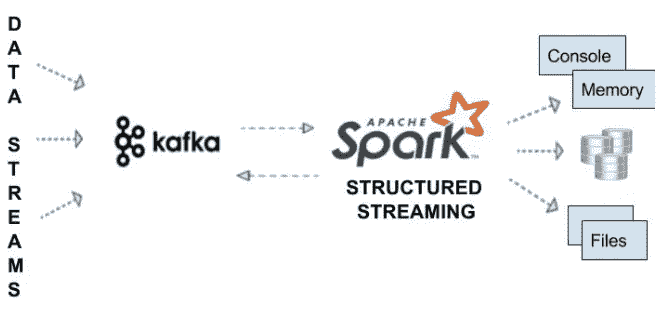
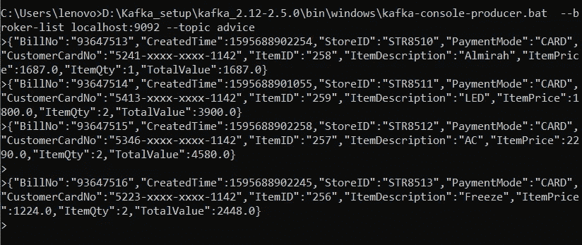

# Pyspark Kafka 结构化流数据管道

> 原文：<https://pub.towardsai.net/pyspark-kafka-structured-streaming-data-pipeline-803095b7398a?source=collection_archive---------1----------------------->

## [编程](https://towardsai.net/p/category/programming)

## 本文的目标是理解如何创建一个数据管道，使用 Apache 结构化流和 Apache Kafka 来处理数据。



来源:卡夫卡-火花流媒体

**商业案例讲解:**

让我们考虑一家商店，该商店生成客户发票，并且这些发票以实时方式到达集成平台，以通知客户他们在购物中已经赢得了多少“**Edge Reward”**积分。

新德里市内各商店的发票以实时方式传送到 Kafka Topic，根据总购物金额，我们的 Kafka 消费者计算边缘点并向客户发送通知消息。

1.  **发票数据集**

发票数据以 **JSON** 格式生成。为了便于理解，我没有创建嵌套数据集。

```
{“BillNo”:”93647513",”CreatedTime”:1595688902254,”StoreID”:”STR8510",”PaymentMode”:”CARD”,”CustomerCardNo”:”5241-xxxx-xxxx-1142",”ItemID”:”258",”ItemDescription”:”Almirah”,”ItemPrice”:1687.0,”ItemQty”:1,”TotalValue”:1687.0}
{“BillNo”:”93647514",”CreatedTime”:1595688901055,”StoreID”:”STR8511",”PaymentMode”:”CARD”,”CustomerCardNo”:”5413-xxxx-xxxx-1142",”ItemID”:”259",”ItemDescription”:”LED”,”ItemPrice”:1800.0,”ItemQty”:2,”TotalValue”:3900.0}
{“BillNo”:”93647515",”CreatedTime”:1595688902258,”StoreID”:”STR8512",”PaymentMode”:”CARD”,”CustomerCardNo”:”5346-xxxx-xxxx-1142",”ItemID”:”257",”ItemDescription”:”AC”,”ItemPrice”:2290.0,”ItemQty”:2,”TotalValue”:4580.0} 
```

**2。数据生产者:**

发票数据发送到 Kafka 主题:**建议**



建议系统卡夫卡

**3。数据消费者:**

```
import findspark
findspark.init(‘’)
import pyspark
from pyspark.sql import SparkSession
from pyspark.sql.functions import from_json, col, expr
from pyspark.sql.types import StructType, StructField, StringType, LongType, DoubleType, IntegerType, ArrayTypeprint(‘modules imported’)spark= SparkSession \
 .builder.appName(‘Kafka_read_mongo’) \
 .master(“local”) \
 .config(“spark.streaming.stopGracefullyOnShutdown”, “true”) \
 .config(“spark.jars.packages”,”org.apache.spark:spark-sql-kafka-0–10_2.11:2.3.3") \
 .getOrCreate()schema = StructType([
 StructField(“BillNo”, StringType()),
 StructField(“CreatedTime”, LongType()),
 StructField(“StoreID”,StringType()),
 StructField(“PaymentMode”, StringType()),
 StructField(“CustomerCardNo”, StringType()),
 StructField(“ItemID”, StringType()),
 StructField(“ItemDescription”, StringType()),
 StructField(“ItemPrice”, DoubleType()),
 StructField(“ItemQty”, IntegerType()),
 StructField(“TotalValue”, DoubleType())])print(‘Now time to connect to Kafka broker to read Invoice Data’)kafka_df = spark.readStream.format(“kafka”) \
 .option(“kafka.bootstrap.servers”, “localhost:9092”) \
 .option(“subscribe”, “advice”) \
 .option(‘startingOffsets’,’earliest’) \
 .load()print(‘Create Invoice DataFrames’)
invoice_df=kafka_df.select(from_json(col(“value”).cast(“string”), schema).alias(“value”))print(‘Create Notification DF’)notification_df = invoice_df.select(“value.BillNo”, “value.CustomerCardNo”,“value.TotalValue”).
withColumn(“EarnedLoyaltyPoints”, expr(“TotalValue * 0.2”))print(‘Create Final Dataframe’)#Kafka accepts data in key-value format, below piece of code caters the samekafka_target_df = notification_df.selectExpr(“BillNo as key”,
 “””to_json(named_struct(
 ‘CustomerCardNo’, CustomerCardNo,
 ‘TotalValue’, TotalValue,
 ‘EarnedLoyaltyPoints’, TotalValue * 0.2)) as value”””)################tbc##################
```

**readStream()** - Spark 通过**Spark session . read stream()**返回的 **DataStreamReader** 接口创建流数据帧

**输出模式():**

“输出”被定义为写出到外部存储器的内容。输出可以在不同的模式下定义:

*   *完成模式* —整个更新后的结果表将被写入外部存储器。由存储连接器决定如何处理整个表的写入。
*   *追加模式* —只有自上次触发后追加到结果表中的新行才会被写入外部存储器。这仅适用于结果表中现有行不会发生变化的查询。
*   *更新模式* —只有结果表中自上次触发后更新的行才会被写入外部存储器。请注意，这与完整模式的不同之处在于，该模式仅输出自上次触发后发生更改的行。如果查询不包含聚合，它将等同于追加模式。

> **#注意:**在我们的用例中，我们使用追加模式，因为用例的需求是这样的。

**4。发送通知:**

因为我们没有向客户发送文本消息的基础设施，所以这个特定的功能是通过向另一个 Kafka 主题发送 JSON 消息来满足的: **NOTIFICATION，**假设另一个下游管道从该主题读取消息，并通知客户关于赢得的忠诚度积分。

```
#################continuing#################print(‘writing to notification topic’)#At this particular moment we are able to generate the notification message to be sent to consumer with necessary details such as CardNo, Total Shopping Amount and Reward points earned.#notification_writer_query = kafka_target_df \
 .writeStream \
 .queryName(“Notification Writer”) \
 .format(“kafka”) \
 .option(“kafka.bootstrap.servers”, “localhost:9092”) \
 .option(“topic”, “notification”) \
 .outputMode(“append”) \
 .start()notification_writer_query.awaitTermination()
```


通知消息

该主题上提供了通知消息。

这里我们完成了设计一个基本应用程序的方法，该应用程序处理从商店收到的发票，计算奖励积分，并向客户发送通知。希望可以分享一下我的知识。