# Pyspark MLlib |使用 Pyspark ML 分类

> 原文：<https://pub.towardsai.net/pyspark-mllib-classification-using-pyspark-ml-ec7e99e5176f?source=collection_archive---------0----------------------->

> 在前面几节中，我们讨论了 RDD、数据帧和 Pyspark 概念。在本文中，我们将讨论 Pyspark MLlib 和 Spark ML。稍后，我们将通过对数据进行编码、特征提取和使用各种算法开发分类器模型来训练用于汽车评估数据的分类器，并评估结果。

有关 Pyspark、Pyspark RDD 和 DataFrame 概念处理缺失值的详细教程，请参考以下链接:

[](https://blog.devgenius.io/pyspark-for-beginners-part-1-introduction-638fb16c5092) [## Pyspark 适合初学者

### PySpark 是 Apache Spark 的 Python API。使用 PySpark，我们可以在分布式集群上并行运行应用程序…

blog.devgenius.io](https://blog.devgenius.io/pyspark-for-beginners-part-1-introduction-638fb16c5092) 

Spark MLlib 是 Spark 机器学习库的简称。Pyspark MLlib 是 Pyspark 核心上的一个包装器，使用机器学习算法进行数据分析。它适用于分布式系统，并且是可扩展的。我们可以在 PySpark MLlib 中找到分类、聚类、线性回归和其他机器学习算法的实现。

MLlib 是 Spark 的可扩展机器学习库，由常见的机器学习算法和实用程序组成，包括分类、回归、聚类、协同过滤和降维，以及底层优化原语。

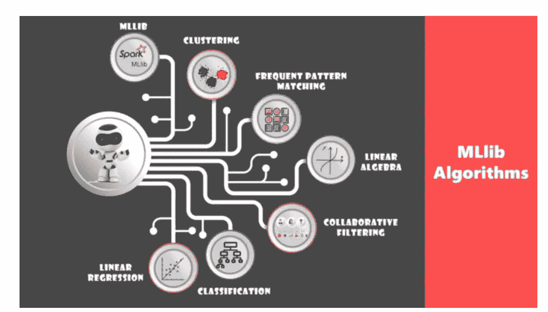

资料来源:Edureka

# 使用 Pyspark MLlib 分类

作为本文的一部分，我们将对汽车评估数据集进行分类。该数据集由描述汽车的 6 个属性和一个目标变量(包含多个类别的 car_type)组成。使用的数据集可以在 **这里找到 [**。**](https://github.com/muttinenisairohith/Encoding-Categorical-Data/blob/6e7bec3b9cbdc25da1055472c837ef8a10f569ed/data/car_data.csv)**

首先，让我们创建一个 sparkSession —

```
from pyspark.sql import SparkSessionspark = SparkSession.builder.appName("Practice").getOrCreate()
spark
```

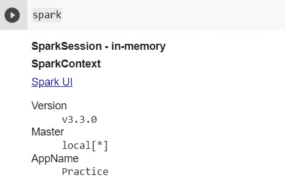

让我们从 CSV 文件中加载数据—

```
df_pyspark = spark.read.csv("car_data.csv",inferSchema=True, header=True)df_pyspark.show(5)
```

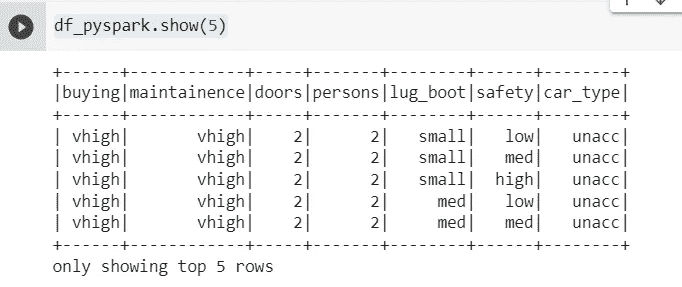

对于大多数机器学习算法来说，数字数据是必不可少的——所以让我们来看看这个数据帧的模式。

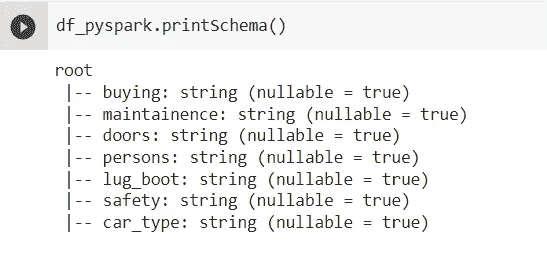

正如我们看到的，我们有字符串列。让我们用 Pyspark StringIndexer 把它们编码成整数。

```
from pyspark.ml.feature import StringIndexercategoricalColumns = ["buying","maintainence","doors","persons","lug_boot","safety","car_type"]l = []for categoricalCol in categoricalColumns: stringIndexer = StringIndexer(inputCol = categoricalCol, outputCol = categoricalCol+"_encoded").fit(df_pyspark) df_pyspark = stringIndexer.transform(df_pyspark) df_pyspark = df_pyspark.withColumn(categoricalCol+"_encoded", df_pyspark[categoricalCol+"_encoded"].cast('int'))encoded_df =  df_pyspark.select("buying_encoded","doors","maintainence_encoded","persons_encoded","lug_boot_encoded","safety_encoded","car_type_encoded")encoded_df.show(5)
```

在上面的代码中，我们导入了 StringIndexer，并将每个 String 列转换为数字列。最初，StringIndexer 以 float 格式返回数据，因此在下一步中，我们已经执行了转换，并将 float 值转换为数值。一旦我们创建了编码数据帧，我们只选择编码值。编码数据帧的输出如下—

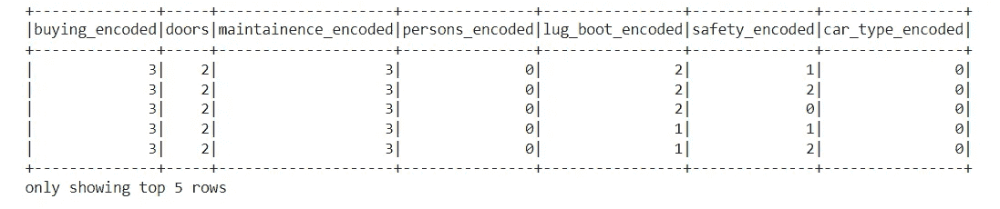

数据准备就绪后，让我们使用 Pyspark 的 VectorAssembler 执行特征提取

```
from pyspark.ml.feature import VectorAssemblerfeatureAssembler = VectorAssembler(inputCols=["buying_encoded","doors_encoded","maintainence_encoded","persons_encoded","lug_boot_encoded","safety_encoded"],outputCol="features")output = featureAssembler.transform(encoded_df)output.select("features","car_type_encoded").show(5)
```

在 Pyspark 中，与 pandas 中使用的方法不同，我们使用 VectorAssembler 将所有独立的列转换成一个特性。创建的特征用于训练。我们包含所需信息的最终数据框架如下:

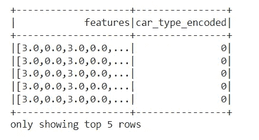

让我们把数据分开来进行训练和测试。

```
train, test = output.randomSplit([0.8, 0.2], seed=17)
```

与 scikit-learn 中的 train_test_split 不同，我们使用 Pyspark DataFrame 中的随机分割来执行分割

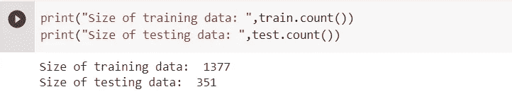

我们的数据准备好了，就来准备模型吧。

**逻辑回归**

```
from pyspark.ml.classification import LogisticRegressionlr = LogisticRegression(featuresCol = 'features', labelCol = 'car_type_encoded', maxIter=10)lrModel = lr.fit(train)
```

我们通过从 Pyspark.ml 导入逻辑回归创建了一个逻辑回归模型，我们给“features”——features col 作为自变量，给“car _ type _ encoded”——label col 作为因变量。

让我们用我们的模型来预测测试数据。

```
predictions = lrModel.transform(test)predictions.show(5)
```

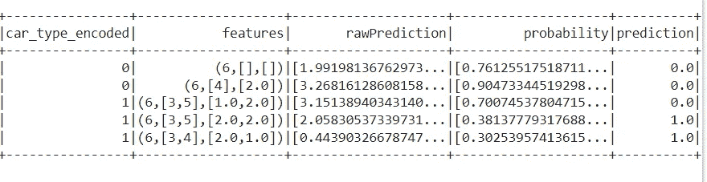

这里，我修剪了几列以显示优先级列。正如我们所看到的，我们已经预测了汽车类型。

我们来评价一下模型。与传统使用的指标不同，Pyspark 提供了以下指标—

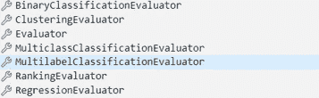

因为我们有多类数据帧，所以让我们使用多类分类赋值器。

```
from pyspark.ml.evaluation import MulticlassClassificationEvaluatorevaluator = MulticlassClassificationEvaluator()evaluator.setLabelCol("car_type_encoded")evaluator.setPredictionCol("prediction")evaluator.evaluate(predictions)
```

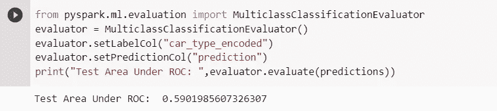

正如我们所看到的，我们的模型使用逻辑回归表现不佳，因为它包含多个类。所以让我们用决策树来提高性能。

**决策树**

决策树被广泛使用，因为它们易于解释，处理分类特征，扩展到多类分类，不需要特征缩放，并且能够捕捉非线性和特征交互。

```
from pyspark.ml.classification import DecisionTreeClassifier
from pyspark.ml.evaluation import MulticlassClassificationEvaluator#Training Modeldt = DecisionTreeClassifier(featuresCol = 'features', labelCol = 'car_type_encoded', maxDepth = 3)
dtModel = dt.fit(train)#Predictionpredictions = dtModel.transform(test)#Evaluating the performanceevaluator = MulticlassClassificationEvaluator()
evaluator.setLabelCol("car_type_encoded")
evaluator.setPredictionCol("prediction")print("Test Area Under ROC: ",evaluator.evaluate(predictions))
```

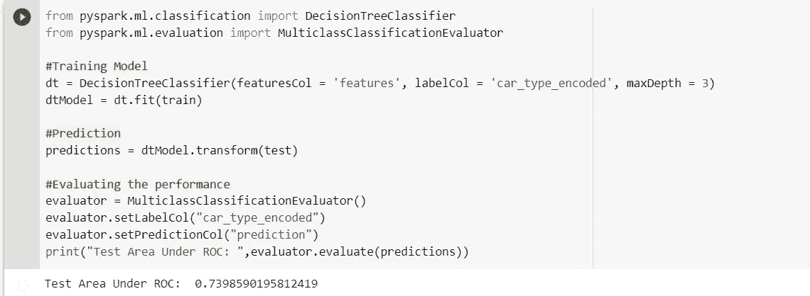

正如我们所知，尽管与逻辑回归模型相比，性能有所提高，但性能仍不令人满意。

因此，让我们使用像随机森林这样的集成方法来提高性能。

**随机森林**

```
from pyspark.ml.classification import RandomForestClassifier
from pyspark.ml.evaluation import MulticlassClassificationEvaluator#Training Model
rf = RandomForestClassifier(featuresCol = 'features', labelCol = 'car_type_encoded', numTrees = 500, maxDepth = 10)
rfModel = rf.fit(train)#Prediction
predictions = rfModel.transform(test)#Evaluating the performance
evaluator = MulticlassClassificationEvaluator()
evaluator.setLabelCol("car_type_encoded")
evaluator.setPredictionCol("prediction")
print("Test Area Under ROC: ",evaluator.evaluate(predictions))
```

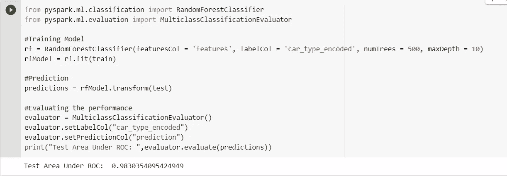

由于我们使用了超参数 numTrees 和 maxDepth，我们可以看到模型的性能得到了很大的提高，我们得到了很好的结果。

在这里，我们使用了最少的方法并获得了期望的性能。或者，我们可以使用 pyspark Ml 中的许多算法和技术来构建模型。

在本系列文章中，我们已经介绍了使用 Pyspark 的所有主要概念。

我期待听到您的宝贵反馈或问题。乐意为您提供帮助…

快乐编码…