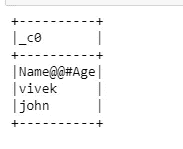
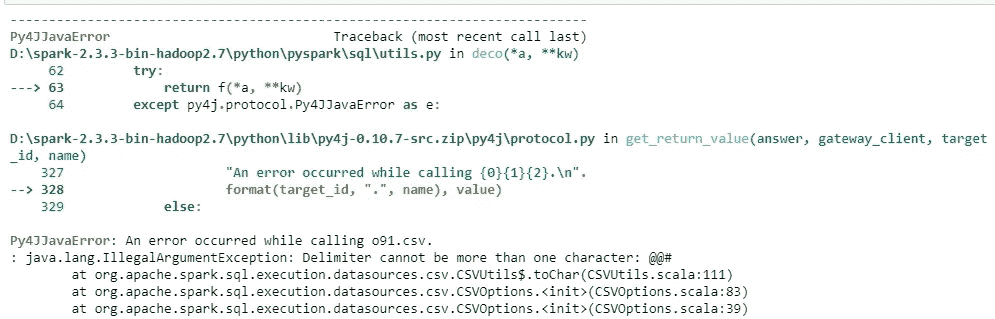
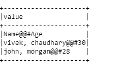
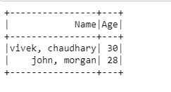

# PySpark 过程多字符分隔符数据集

> 原文：<https://pub.towardsai.net/pyspark-process-multiple-delimited-data-ef99fa05c6f7?source=collection_archive---------0----------------------->

## [编程](https://towardsai.net/p/category/programming)

本文的目标是使用 Apache spark 和 Python 编程语言处理多个分隔文件。这是一个实时场景，应用程序可以共享多个分隔文件，开发团队必须处理相同的文件。我们将学习如何应对挑战。


输入数据集如下:

```
Name@@#Age  <--Header
vivek, chaudhary@@#30  <--row1
john, morgan@@#28   <--row2
```

**方法 1:** 让我们尝试使用 **read.csv()** 读取文件，并查看输出:

```
from pyspark.sql import SparkSessionfrom pyspark.sql import SparkSession
spark= SparkSession.builder.appName(‘multiple_delimiter’).getOrCreate()test_df=spark.read.csv(‘D:\python_coding\pyspark_tutorial\multiple_delimiter.csv’)
test_df.show()
```



输出

> **#注意:**输出不是期望的输出，因此处理不会产生期望的结果

**Approach2:** 接下来，使用带有 **option()** 参数的 **read.csv()** 读取文件，并将分隔符作为值为'**@ @ # '【T15]的参数传递，并查看输出:**

```
test_df=spark.read.option(‘delimiter’,’@@#’).csv(‘D:\python_coding\pyspark_tutorial\multiple_delimiter.csv’)test_df.show(truncate=0)
```



错误

> #注意:当我们试图传递多于一个字符的分隔符时，spark 抛出错误。

**方法 3:** 下一个方法是使用**read . text()**spark 的方法。

```
mult_df=spark.read.text(‘D:\python_coding\pyspark_tutorial\multiple_delimiter.csv’)
mult_df.show(truncate=0)
```



火花.阅读.文本

> #注意:spark.read.text 返回一个 DataFrame。

文本文件中的每一行代表 DataFrame 中只有一列“**值”**的一条记录。要转换成多个列，我们将使用映射转换和拆分方法来转换和拆分列值。

```
#first() returns the first record of dataset
header=mult_df.first()[0]
print(header)
Output: 
Name@@#Age#split('delimiter') the string on basis of the delimiter
#define the schema of the Dataframe to be createdschema=header.split(‘@@#’)
print(schema)Output:
['Name', 'Age']
```

下一步是拆分行并创建单独的列:

```
#filter operation is removing the header
#map operation is splitting each record as per delimiter
#.rdd converts DF to rdd and toDF converts the rdd back to DFmult_df.filter(mult_df[‘value’]!=header).rdd.map(lambda x:x[0].split(‘@@#’)).toDF(schema).show()
```



最终输出

万岁！！我们能够根据多个分隔符' **@@#'** 来拆分数据。

# 总结:

使用 spark.read.text()方法读取多个分隔的数据集

使用 map()、filter()转换

感谢所有人阅读我的博客，如果你喜欢我的内容和解释，请在 medium 上关注我并分享你的反馈，这将永远帮助我们所有人提高我们的知识。