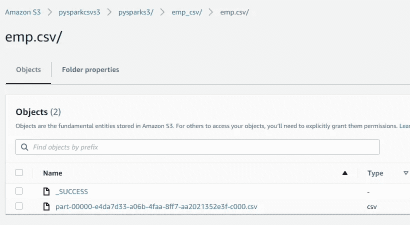
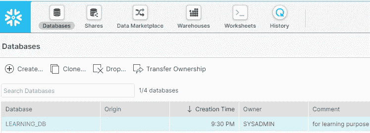
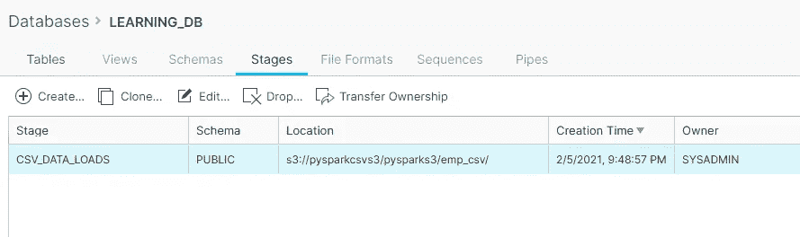
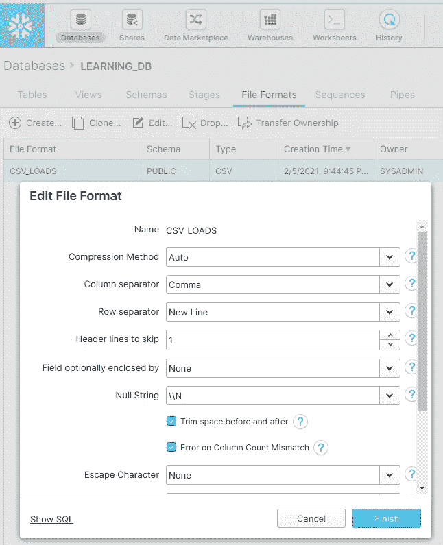
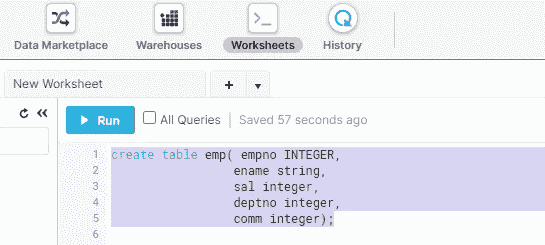
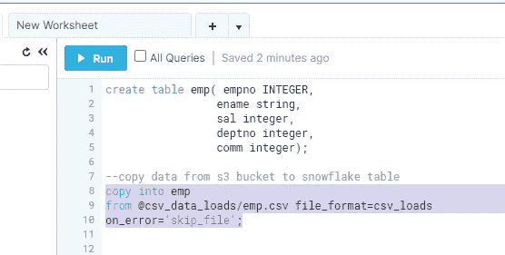
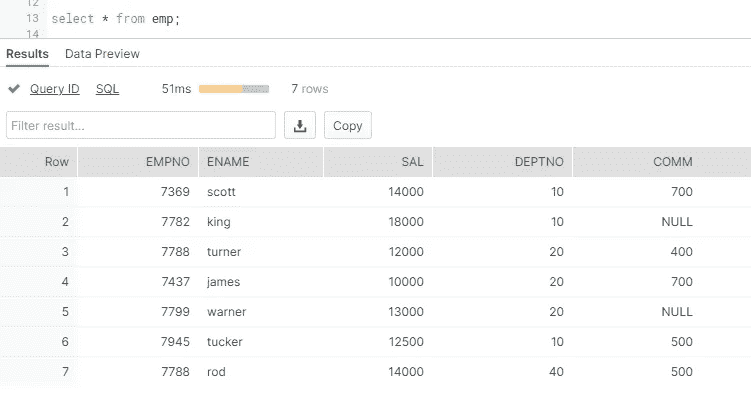
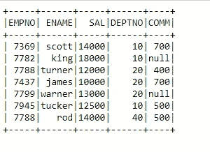

# PySpark 雪花数据仓库读写操作—第 1 部分(只读)

> 原文：<https://pub.towardsai.net/pyspark-snowflake-data-warehouse-read-write-operations-part1-read-only-3331d113635e?source=collection_archive---------2----------------------->

## [编程](https://towardsai.net/p/category/programming)

这个故事的目标是使用 Apache Spark API，Pyspark 来理解对雪花数据仓库表的读写操作。

雪花是一个基于云的数据仓库解决方案，旨在提高可扩展性和性能。在我接下来的博客中，我肯定会分享关于雪花及其组件的详细见解，但目前把它作为一个基于云的数据库系统，具有大规模并行处理和巨大的计算能力，所以现在我将只限于雪花和 Spark 相关的东西。


py spark-雪花

1.  **从亚马逊 S3 桶加载数据到雪花 DB 表**

> 雪花提供 30 天免费试用。创建您的免费等级帐户，享受学习的好处。

**AWS S3 时段中的数据:**



**雪花表加载数据前的设置:**

1.  创建**雪花自由层账户**并创建**数据库**如下:



2.创建一个指向 AWS S3 存储桶的**阶段**:



3.在**文件格式**选项卡下，创建一个 CSV 文件格式，用于将数据从 AWS S3 加载到雪花表格。



4.下一步是创建雪花表**“EMP”，**转到**工作表**选项卡，执行 SnowSQL DDL 命令创建一个表。

```
create table emp( empno INTEGER, 
 ename string, 
 sal integer, 
 deptno integer, 
 comm integer);
```



Snow DDL

5.接下来，将数据从 AWS S3 复制到雪花表。

```
copy into learning_db.emp 
from [@csv_data_loads/emp](http://twitter.com/csv_data_loads/emp).csv file_format=csv_loads
on_error=’skip_file’;
```



数据复制命令

> **csv_data_loads** 表示我们指向 S3 桶**的**阶段**位置 csv_loads** 是我们为 csv 数据集创建的**文件格式**。

使用 SnowSQL 验证数据集:



数据成功加载到雪花。

**2。使用 PySpark 读取雪花表。**

导入先决条件并设置 spark 配置:

```
import findspark
findspark.init(‘D:\spark-2.3.3-bin-hadoop2.7’)
import pyspark
from pyspark.sql import SparkSession
from pyspark import SparkContext, SparkConfimport os
os.environ[‘PYSPARK_SUBMIT_ARGS’] = ‘ — packages net.snowflake:snowflake-jdbc:3.11.1,net.snowflake:spark-snowflake_2.11:2.5.7-spark_2.4 pyspark-shell’spark = SparkSession.builder.appName(‘Pyspark_snowflake’).getOrCreate()
spark._jvm.net.snowflake.spark.snowflake.SnowflakeConnectorUtils.enablePushdownSession(spark._jvm.org.apache.spark.sql.SparkSession.builder().getOrCreate())
```

设置雪花连接属性:

```
sfOptions = {
 “sfURL” : “wa29709.ap-south-1.aws.snowflakecomputing.com”,
 “sfAccount” : “xxxxxxx”,
 “sfUser” : “xxxxxxxx”,
 “sfPassword” : “xxxxxxx”,
 “sfDatabase” : “learning_db”,
 “sfSchema” : “public”,
 “sfWarehouse” : “compute_wh”,
 “sfRole” : “sysadmin”,
}

SNOWFLAKE_SOURCE_NAME = “net.snowflake.spark.snowflake”df=spark.read.format(SNOWFLAKE_SOURCE_NAME).options(**sfOptions).option(“query”,”select * from emp”).load()
df.show()
```



数据验证成功后，我们可以连接到 spark 并将雪花表中的数据读入 Spark。

# 总结:

将 AWS S3 数据加载到雪花数据库表中

雪花阶段和文件格式创建。

SnowSQL 命令如 DDL 和复制数据。

使用 Pyspark 读取雪花表数据

感谢大家阅读我的博客。请分享您的观点和反馈。