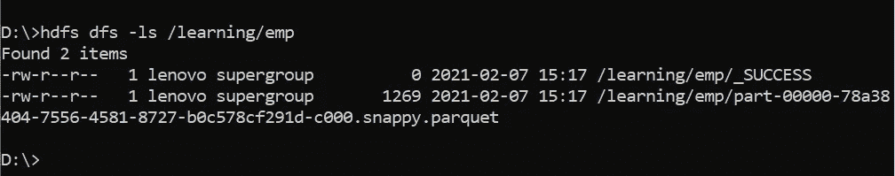
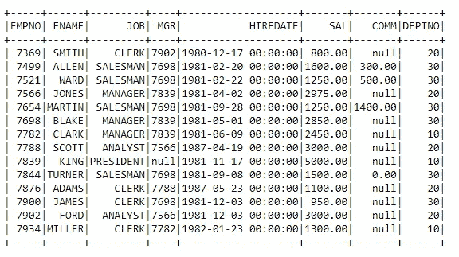
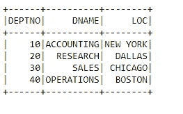
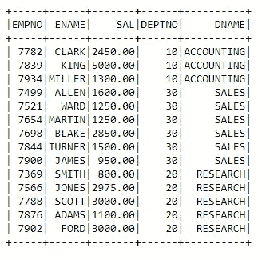
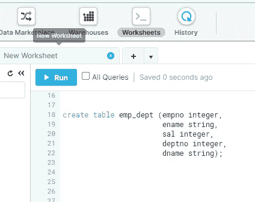
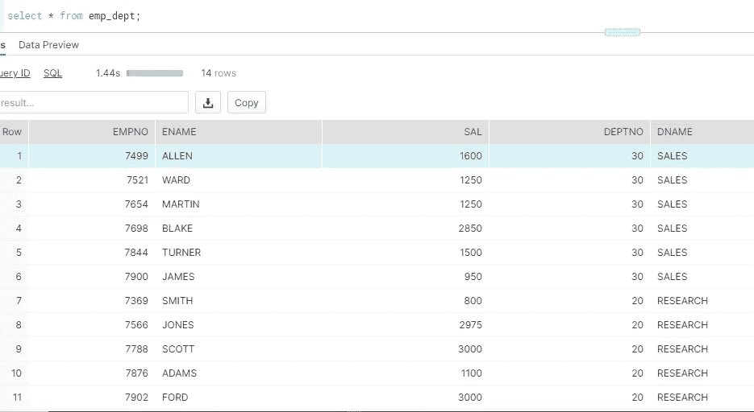

# PySpark 雪花数据仓库读写操作—第二部分(读写)

> 原文：<https://pub.towardsai.net/pyspark-snowflake-data-warehouse-read-write-operations-part2-read-write-c129a1260f7f?source=collection_archive---------2----------------------->

## [编程](https://towardsai.net/p/category/programming)

这个故事的目标是使用 Apache Spark API，Pyspark 来理解对雪花数据仓库表的读写操作。作为我上一篇关于 PySpark 雪花读操作的博客的续篇，这是我目前的博客，我已经介绍了在雪花数据库表上执行写操作的用例。


第一部分可以 b

[](https://medium.com/towards-artificial-intelligence/pyspark-snowflake-data-warehouse-read-write-operations-part1-read-only-3331d113635e) [## PySpark 雪花数据仓库读写操作—第 1 部分(只读)

### 这个故事的目标是建立对雪花数据读写操作的理解…

medium.com](https://medium.com/towards-artificial-intelligence/pyspark-snowflake-data-warehouse-read-write-operations-part1-read-only-3331d113635e) 

在这篇博客中，为了使事情更加多样化或实时，我们有多个数据源，我使用了不同的数据源，如 HDFS 上的 Apache Parquet 文件(安装在本地系统上)，Oracle 数据库。我们将提取数据，对数据集执行简单的转换，并将其写入雪花数据库。

1.  **Spark 连接和导入数据集**

```
import pyspark
from pyspark.sql import SparkSession
print(‘modules imported’)spark= SparkSession.builder.appName(‘Pyspark_snowflake’).getOrCreate()
print(‘app created’)#snowflake property setting spark._jvm.net.snowflake.spark.snowflake.SnowflakeConnectorUtils.enablePushdownSession(spark._jvm.org.apache.spark.sql.SparkSession.builder().getOrCreate())
```

从 HDFS 本地导入拼花文件:



HDFS 的拼花地板

```
 emp_df=spark.read.parquet(r’hdfs://localhost:9000/learning/emp’)
emp_df.show(15)
```



Emp 数据

导入 Oracle 数据库表记录:

```
#
dept_df = spark.read.format(‘jdbc’).option(‘url’, ‘jdbc:oracle:thin:scott/scott@//localhost:1522/oracle’).option(‘dbtable’, ‘dept’).option(‘user’, ‘scott’).option(‘password’, ‘scott’).option(‘driver’, ‘oracle.jdbc.driver.OracleDriver’).load()dept_df.show()
```



部门数据

**2。数据转换**

在数据转换中，我们将执行简单的转换，如重命名列和连接数据集，因为本故事的范围是理解与雪花的连接。

```
#rename Dataframe columnemp_df=emp_df.withColumnRenamed(‘DEPTNO’,’DEPTNO_E’)#join the emp and dept datasetsjoined_df=dept_df.join(emp_df,emp_df.DEPTNO_E==dept_df.DEPTNO, how=’inner’)#create final dataframefinal_df=joined_df.select(‘EMPNO’,’ENAME’,’SAL’,’DEPTNO’,’DNAME’)
final_df.show()
```



最终数据集

**3。雪花设置**

```
#set the below snowflake properties for connectivitysfOptions = {
 “sfURL” : “wa29709.ap-south-1.aws.snowflakecomputing.com”,
 “sfAccount” : “xxxxxxx”,
 “sfUser” : “xxxxxxxxx”,
 “sfPassword” : “xxxxxxxx”,
 “sfDatabase” : “learning_db”,
 “sfSchema” : “public”,
 “sfWarehouse” : “compute_wh”,
 “sfRole” : “sysadmin”,
}

SNOWFLAKE_SOURCE_NAME = “net.snowflake.spark.snowflake”
```

使用下面的脚本创建雪花目标表:

```
create table emp_dept (empno integer, 
 ename string, 
 sal integer, 
 deptno integer, 
 dname string);
```



雪花表

**4。将 Pyspark 数据帧加载到雪花目标**

```
#pyspark dataframe to snowflakefinal_df.write.format(“snowflake”).options(**sfOptions).option(“dbtable”, “emp_dept”).mode(‘append’).options(header=True).save()
```

使用 SnowSQL 验证雪花中的数据:



数据有效性

我们能够成功地从不同来源读取数据集，并将 Spark 数据框加载到雪花数据库表中。

感谢大家阅读我的博客。请分享您的观点和反馈。