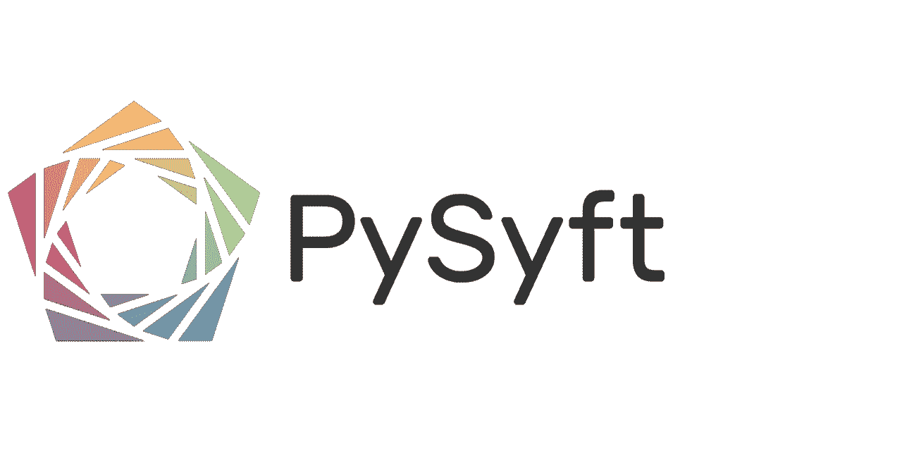
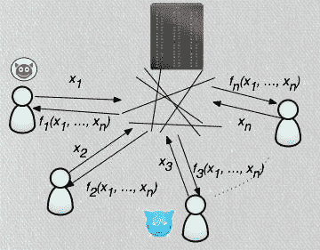
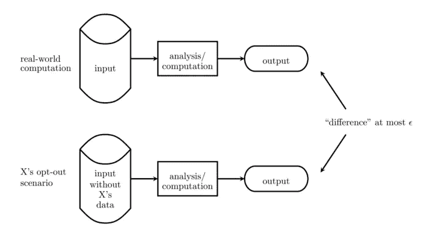
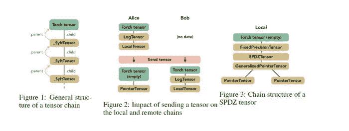

# PySyft 是一个私人深度学习的框架

> 原文：<https://pub.towardsai.net/pysyft-is-a-framework-for-private-deep-learning-f5420b01332f?source=collection_archive---------0----------------------->

## 该框架在基于 PyTorch 和 TensorFlow 构建的模型中使用差分隐私。

图片来源:PySyft

> 我最近创办了一份专注于人工智能的教育时事通讯，已经有超过 125，000 名订户。《序列》是一份无废话(意思是没有炒作，没有新闻等)的 ML 导向时事通讯，需要 5 分钟阅读。目标是让你与机器学习项目、研究论文和概念保持同步。请通过订阅以下内容来尝试一下:

 [## 序列

### 与机器学习、人工智能和数据发展保持同步的最佳资源…

thesequence.substack.com](https://thesequence.substack.com/) 

信任是深度学习应用实现的关键因素。从训练到优化，深度学习模型的生命周期与不同方之间的可信数据交换密切相关。这种动态对于实验室环境当然是有效的，但是结果容易受到各种各样的安全攻击，这些攻击操纵模型中不同参与者之间的信任关系。让我们以信用评分模型为例，该模型使用金融交易对特定客户的信用风险进行分类。用于训练或优化模型的传统机制假设执行这些操作的实体将完全访问这些财务数据集，这为各种隐私风险打开了大门。随着深度学习的发展，对在数据集和模型的生命周期中实施隐私约束的机制的需求变得越来越重要。在试图解决这一巨大挑战的技术中， [PySyft](https://github.com/OpenMined/PySyft) 是最近在深度学习社区中稳步增长的一个框架。

隐私在深度学习应用中的重要性与分布式多方模型的出现直接相关。深度学习解决方案的传统方法依赖于控制模型整个生命周期的集中各方，即使使用大型分布式计算基础设施。这是一个组织创建预测模型来管理访问其网站的客户的偏好的情况。然而，集中式深度学习拓扑已被证明在移动或物联网(IOT)等依赖于大量设备产生数据和执行模型的场景中不切实际。在这些场景中，分布式各方不仅经常产生敏感数据集，而且还执行和评估深度学习模型的性能。这种动态需要负责创建、训练和执行深度学习模型的不同方之间的双向隐私关系。

向更分布式架构的过渡是深度学习模型中对强隐私机制的需求背后的主要力量之一。这就是 PySyft 要解决的挑战，但如果没有机器学习和分布式编程的几个研究领域的发展，这是不可能的。

# 促成因素

深度学习模型中的隐私多年来一直是一个众所周知的问题，但可以提供解决方案的技术现在才达到一定的可行性水平。在 PySyft 的例子中，该框架利用了过去十年中机器学习和密码学中最引人入胜的三项技术:

*安全多方计算*

*联邦学习*

*差分隐私*

# 安全多方计算

安全多方计算(sMPC)是一种加密技术，它允许不同方对输入执行计算，同时保持这些输入的私密性。在计算机科学理论中，sMPC 通常被视为著名的[姚百万富翁问题](https://en.wikipedia.org/wiki/Yao%27s_Millionaires%27_Problem)的解决方案，该问题由计算机科学家 [Andrew Yao](https://en.wikipedia.org/wiki/Andrew_Yao) 于 20 世纪 80 年代提出。这个问题描述了一个场景，在这个场景中，多个百万富翁想知道他们中谁更富有，而不透露他们的实际财富。百万富翁的问题存在于许多现实世界的场景中，如拍卖、选举或在线游戏。

从概念上讲，sMPC 提供了安全计算，取代了对可信中介的需求。在 sMPC 模型中，一组具有私有输入的参与方计算分布式功能，例如公平、隐私和正确性等安全属性被保留。

来源:[https://www . semantic scholar . org/paper/Collaborative-network-outage-trouble shooting-with-Djatmiko-Schatzmann/e 932792557 c 785 e 7084 e 16691512d 1866 a 6264 D5/figure/0](https://www.semanticscholar.org/paper/Collaborative-network-outage-troubleshooting-with-Djatmiko-Schatzmann/e932792557c785e7084e16691512d1866a6264d5/figure/0)

## 联合学习

联合学习是一种新的学习架构，用于在高度分布式拓扑结构中运行的人工智能系统，如移动或物联网(IOT)系统。最初由谷歌研究实验室提出，联合学习代表了集中式人工智能训练的一种替代方案，在集中式人工智能训练中，在来自参与设备联盟的中央服务器的协调下训练共享的全局模型。在该模型中，不同的设备可以为模型的训练和知识做出贡献，同时将大部分数据保留在设备中。

在联合学习模型中，一方下载深度学习模型，通过从给定设备上的数据中学习来改进它，然后将这些变化总结为小的、有重点的更新。只有这个模型的更新被发送到云，使用加密的通信，在那里它立即与其他用户更新进行平均，以改进共享模型。所有训练数据都保留在原始设备上，没有单独的更新存储在云中。

来源:[https://ai . Google blog . com/2017/04/federated-learning-collaborative . html](https://ai.googleblog.com/2017/04/federated-learning-collaborative.html)

## 差异隐私

差异隐私是一种技术，用于限制统计算法对主体隐私的影响，这些主体的信息是更大数据集的一部分。粗略地说，如果一个观察者看到一个算法的输出时不能判断出计算中是否使用了某个特定个体的信息，那么这个算法就是差分私有的。差别隐私经常在识别其信息可能在数据库中的个人的上下文中被讨论。虽然它不直接涉及识别和再识别攻击，但差分私有算法可证明抵抗这种攻击。

来源:[https://towards data science . com/understanding-differential-privacy-85ce 191 e 198 a](https://towardsdatascience.com/understanding-differential-privacy-85ce191e198a)

# PySyft

PySyft 是一个框架，可以在深度学习模型中实现安全、私有的计算。PySyft 将联邦学习、安全多方计算和差分隐私结合在一个编程模型中，该模型集成到不同的深度学习框架中，如 PyTorch、Keras 或 TensorFlow。PySyft [的原理最初是在一篇研究论文](https://arxiv.org/abs/1811.04017)中概述的，它的[首次实现是由 OpenMind](https://github.com/OpenMined/PySyft) 领导的，OpenMind 是领先的去中心化人工智能平台之一。

PySyft 的核心组件是一个叫做 SyftTensor 的抽象。SyftTensors 旨在表示数据的状态/转换，并且可以链接在一起。链式结构的头部总是有 PyTorch 张量，而 SyftTensors 所体现的状态转换使用子属性向下访问，使用父属性向上访问。

来源:[https://arxiv.org/pdf/1811.04017.pdf](https://arxiv.org/pdf/1811.04017.pdf)

使用 PySyft 相对简单，与标准 PyTorch 或 Keras 程序没有太大区别。下面的动画演示了一个使用 PySyft 的简单分类模型。

PySyft 代表了在深度学习程序中启用稳健隐私模型的首批尝试之一。随着空间的发展，隐私可能会成为下一代深度学习框架的基础构件之一。