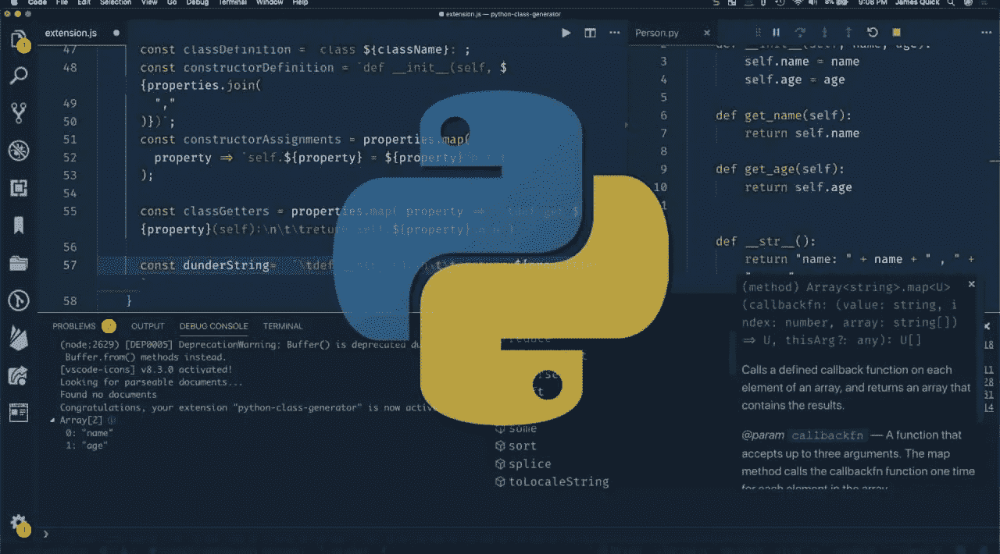
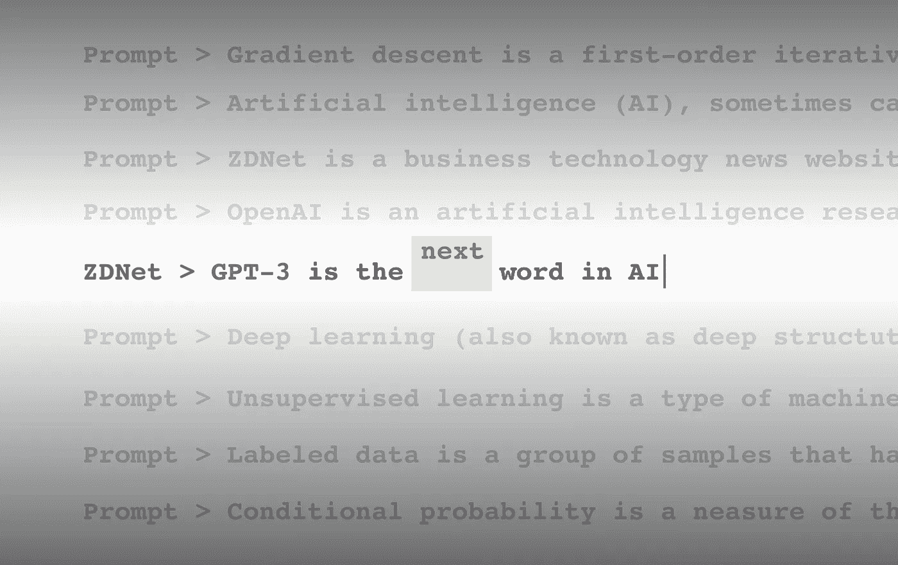
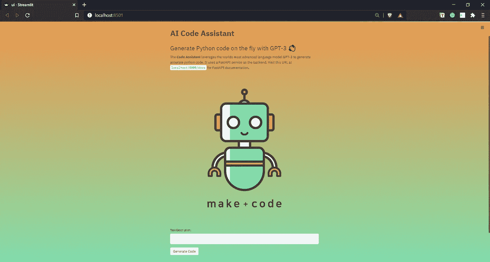
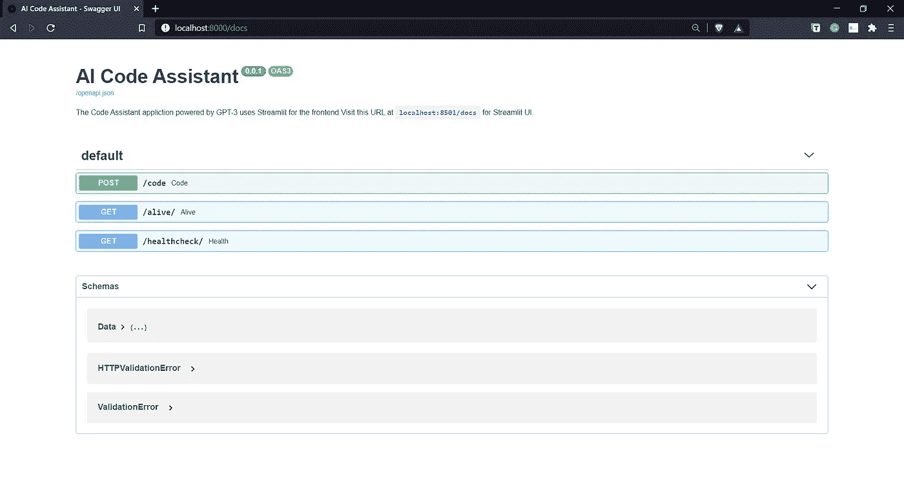

# 由 GPT-3 提供支持的 Python 代码助手

> 原文：<https://pub.towardsai.net/python-code-assistant-powered-by-gpt-3-dfecf1945925?source=collection_archive---------1----------------------->

## [自然语言处理](https://towardsai.net/p/category/nlp)

## 利用世界上最先进的语言模型，从简单的自然语言自动生成 python 代码。

任何足够先进的技术都和魔法没什么区别——亚瑟·C·克拉克

# 先决条件

我以文章的形式收集了这些点，请按照相同的顺序浏览下面的文章，将这些点连接起来，并了解 ***Python 代码助手背后的关键技术栈——由 GPT-3*** 提供支持的应用:

1.  FastAPI——超越烧瓶的美妙方式！
2.  [Streamlit —革命性的数据应用创建](https://medium.com/towards-artificial-intelligence/streamlit-revolutionizing-data-app-creation-e269177d9112)
3.  [GPT-3 简介](/email-assistant-powered-by-gpt-3-ba39dfe999d3)

# 充满希望的 GPT 3 号——它是一个新的人工智能生态系统的开端吗？

“如果你不能简单地解释一件事，你就理解得不够好。”——阿尔伯特·爱因斯坦爵士

OpenAI 的 GPT-3 不同于 21 世纪的任何其他人工智能模型，它吸引了公众的注意力。该模型在以接近人类的效率和准确性执行一系列一般化任务方面的纯粹灵活性是它如此令人兴奋的原因。它在自然语言处理(NLP)领域创造了一个范式转变，迄今为止，模型都是基于非一般化的方法进行训练，以擅长一两项任务。

GPT-3 由 OpenAI 用一种涉及 1750 亿个参数的大规模通用方法进行训练，这使它能够模仿人脑的功能(比如→ GPT-3 能够在只被喂给你想要它做的任务的几个例子后，生成令人惊讶地类似人类的文本)。像人脑一样，GPT-3 能够通过少量的训练来学习和做事情，而不像传统的方法那样在大型语料库上训练 NLP 模型，这既困难又耗时。

GPT-3 在执行许多自然语言处理任务方面非常灵活，它赋予你用自然语言做任何你能想象的事情的能力。GPT-3 的这一独特特征使它从其他 NLP 模型中脱颖而出。许多创业公司和企业已经开始探索下一代 NLP 应用生态系统。

# 应用程序演练

现在，我将带您逐步了解 Python 代码助手应用程序:

在创建任何 GPT-3 应用程序时，首先要考虑的是培训提示的设计和内容。提示设计是启动 GPT-3 模型以给出有利的上下文响应的最重要的过程。

> 作为一条经验法则，在设计训练提示时，你的目标应该是从模型中获得零反应，如果不可能，那就用几个例子，而不是提供一个完整的语料库。训练提示设计的标准流程应该是这样的: ***零投→少投→基于语料库的启动。***

为了设计 python 代码助手应用程序的训练提示，我对训练提示使用了以下结构:

*   **描述:**关于代码助手应该做什么的上下文的初始描述，并添加一两行关于其功能的内容。
*   **自然语言(英语):**该组件包括代码助手将执行的任务的最小的一行描述。它有助于 GPT-3 理解上下文，以便生成正确的 python 代码。
*   **代码:**该组件包括与作为 GPT-3 模型输入提供的英文描述相对应的 python 代码。

> ***输入→英语语言；输出→ Python 代码***

Streamlit 支持的 UI(全部用 Python 编写)

FastAPI 的魔力→即时 API 文档

让我们看一个实际例子，来真正理解 GPT-3 在从纯英语语言生成 python 代码方面的能力。在下面的例子中，我们将通过向 AI 代码助手提供最少的指令来生成 python 代码。

# 结论

随着新的创业公司和企业产品的到来，GPT-3 即将开始一场人工智能革命，这些产品将完全基于 GPT-3。与以前的人工智能语言模型相比，它正在通过生成 alpha 来冒险进入技术产品空间的所有维度。由于其纯粹的灵活性和一般化的方法，世界各地的公司都在试验 GPT-3，以推出新一代的产品来迎合 21 世纪的观众。

# 参考

1.  [https://en.wikipedia.org/wiki/GPT-3](https://en.wikipedia.org/wiki/GPT-3)
2.  [https://openai.com/blog/openai-api](https://openai.com/blog/openai-api/)
3.  [https://www . technology review . com/2021/02/24/1017797/GPT 3-best-worst-ai-open ai-natural-language/](https://www.technologyreview.com/2021/02/24/1017797/gpt3-best-worst-ai-openai-natural-language/)
4.  [https://venturebeat . com/2021/02/27/GPT-3-were-at-the-very-bee-the-been-the-been-the-been-the-been-the-been-the-begin-a-new-app-ecosystem/](https://venturebeat.com/2021/02/27/gpt-3-were-at-the-very-beginning-of-a-new-app-ecosystem/)

如果你想了解更多，或者想让我写更多关于这个主题的东西，请随时联系我们。

我的社交链接:[LinkedIn](https://www.linkedin.com/in/shubhamsaboo/)|[Twitter](https://twitter.com/Saboo_Shubham_)|[Github](https://github.com/Shubhamsaboo)

如果你喜欢这篇文章或觉得它有帮助，请花一分钟按一下拍手按钮，它增加了文章对其他媒体用户的可见性。