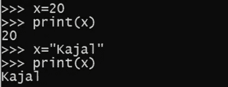
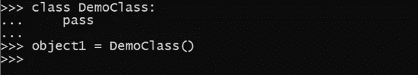
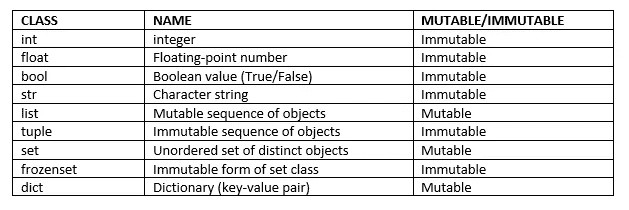
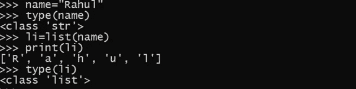
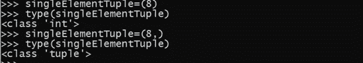
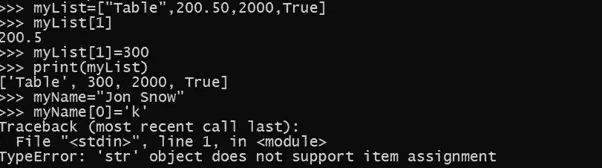
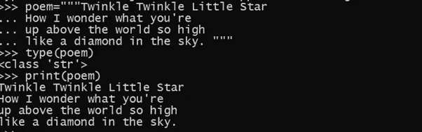
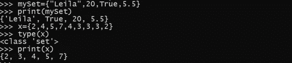
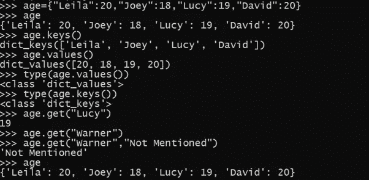

# Python 数据结构数据类型和对象

> 原文：<https://pub.towardsai.net/python-data-structures-data-types-and-objects-244d0a86c3cf?source=collection_archive---------0----------------------->

## [编程](https://towardsai.net/p/category/programming)

## python 中类对象的便捷概念


由[克林特·王茂林](https://unsplash.com/@clintadair?utm_source=medium&utm_medium=referral)在 [Unsplash](https://unsplash.com?utm_source=medium&utm_medium=referral) 上拍摄的照片

Python 是面向对象的语言，所有数据类型的基础都是由类构成的。它的变量赋值不同于 c、c++和 java。该变量没有声明，它只是一个赋值语句。

```
>>>marks=79
```

> ***Python 对象***

Python 是一种动态类型语言。在代码执行之前，它不知道变量的数据类型。因此，声明是没有用的。该值存储在某个内存位置，该位置与标识符绑定在一起，使容器的内容可以通过该标识符进行访问。因此数据类型并不重要，特定标识符的类型在运行时是已知的。

因此，标识符可以与任何对象类型相关联，并可以在以后分配给相同或不同类型的另一个对象。



变量赋值的例子。作者的照片

> ***如何创建对象？***

创建类的新对象或新实例的过程称为实例化。一般来说，我们通过调用类的构造函数来实现。



制作类和对象的例子。作者的照片

python 的许多内置类支持指定新实例的文字形式。举个例子，

```
>>> Age = 20
```

创建 **int** 类的新实例，表达式中的术语 20 是文字形式。

> ***Python 的内置类***

在继续之前，我们应该知道什么是可变和不可变的类。类的不变性意味着该类的每个对象在实例化时指向一个固定的值，并且为它分配一个唯一的对象 ID。对象的类型是在运行时定义的，以后不能更改。然而，在可变的情况下，它的状态是可以改变的。



区分数据结构类型的表

> ***布尔班***

*   用于操作逻辑值。
*   该类仅有的两个实例被表示为文本 True 和 False。
*   默认情况下，构造函数 bool()返回 False。
*   任何计算为零的表达式为假，其余为真。

```
>>> result=bool()False>>>answer=True>>>print(answer)True
```

> ***int 类***

*   用于表示任意大小的整数值。
*   在某些情况下，用二进制、八进制和十六进制来表示整数值是很方便的。

```
>>> x=20 #decimal literal>>> y=0o47 #octal literal>>> z=0x1f #hexadecimal literal>>> w=0b10101 #binary literal
```

*   默认情况下，构造函数 int()返回值 0。

> ***浮动类***

*   float 类是使用固定精度表示的主要浮点类型。
*   构造函数的 float()形式返回 0.0。
*   浮点值的另一种文字形式使用科学记数法。

数据结构的序列类型——列表、元组和字符串类

> ***列表类***

*   一个或多个数据项的有序集合可以是相同或不同的类型，用方括号括起来。

```
>>>myLIst = [“kajal”,2021,20,5.5,True]>>>myList[“kajal”,2021,20,5.5,True]
```

*   就像用其他语言声明的数组一样，索引从 0 到 n-1，其中 n 是列表的大小。列表数据类型非常灵活，因为元素不需要属于同一类型。
*   默认情况下，构造函数 list()返回一个空列表。这个构造函数可以接受任何 iterable 类型的参数。例如，



列表类的示例。作者的照片

> ***元组类***

*   与列表相同，但是不可变。
*   不可变的，因为不能在容器中添加和删除元素。
*   就地排序也做不到。
*   在 python 中，[]字符用来定界一个列表，类似地，括号()定界一个元组。


元组的例子。作者的照片

注意:对于单元素元组，表达式(element)不起作用，因为该表达式被视为简单的带括号的表达式，而不是元组元素。因此，元素后面应该跟一个逗号，如下所示:(element，)

例如，



元组的例子。作者的照片

> ***str 类***

*   字符串是字母、数字和其他符号的集合，也就是序列中的字符。使用单引号或双引号来区分字符串值和标识符。

```
>>>name=”Kajal”>>>newName=’Aman’
```

*   列表和字符串之间的一个主要区别是列表可以修改，而字符串不能，这意味着 str 类是不可变的，即列表元素可以使用赋值和索引来更改，而字符串的元素不能更改。



列表示例。作者的照片

*   三重引号用于代码中的多行字符串。这是因为换行符是自然嵌入的，而不是作为。



字符串的示例。作者的照片

> ***set 和 frozenset 类***

*   Python 使用{}作为集合的分隔符。
*   这个集合类表示集合的数学概念，即不同元素的集合(没有重复)。
*   有两个重要的限制:

1.  集合并不按照任何特定的顺序维护元素。

2.只有不可变类型的实例可以添加到 python 的集合中。

*   frozenset 类是唯一的集合，但是不可变的。
*   哈希表是基于数据结构使用的。



器械包示例。作者的照片

> ***字典类***

Python 的 dict 和字典是一样的。它是从一组不同的键到相关值的映射。

*   字典字面量也使用花括号{}，这种字面量形式{}产生一个空字典。非空字典用一系列逗号分隔的键值对来表示。



字典例子。作者的照片

> ***结论:***

python 中的数据结构非常容易学习和理解。它们是编程语言的支柱。

我希望你喜欢这篇文章。通过我的 [LinkedIn](https://www.linkedin.com/in/data-scientist-95040a1ab/) 和 [twitter](https://twitter.com/amitprius) 联系我。

# 推荐文章

1.[Python 最有用的 15 种 NumPy 方法](/15-most-usable-numpy-methods-with-python-4d20eb93e149?sk=911d2bebf042b148be8f366b907af158)
2。 [NumPy:图像上的线性代数](/numpy-linear-algebra-on-images-ed3180978cdb?source=friends_link&sk=d9afa4a1206971f9b1f64862f6291ac0)3。[Python 中的异常处理概念](/exception-handling-concepts-in-python-4d5116decac3?source=friends_link&sk=a0ed49d9fdeaa67925eac34ecb55ea30)
4。[熊猫:处理分类数据](/pandas-dealing-with-categorical-data-7547305582ff?source=friends_link&sk=11c6809f6623dd4f6dd74d43727297cf)
5。[超参数:机器学习中的 RandomSeachCV 和 GridSearchCV](/hyper-parameters-randomseachcv-and-gridsearchcv-in-machine-learning-b7d091cf56f4?source=friends_link&sk=cab337083fb09601114a6e466ec59689)
6。[用 Python](https://medium.com/towards-artificial-intelligence/fully-explained-linear-regression-with-python-fe2b313f32f3?source=friends_link&sk=53c91a2a51347ec2d93f8222c0e06402)
7 全面讲解了线性回归。[用 Python](https://medium.com/towards-artificial-intelligence/fully-explained-logistic-regression-with-python-f4a16413ddcd?source=friends_link&sk=528181f15a44e48ea38fdd9579241a78)
充分解释了 Logistic 回归 8。[数据分发使用 Numpy 与 Python](/data-distribution-using-numpy-with-python-3b64aae6f9d6?source=friends_link&sk=809e75802cbd25ddceb5f0f6496c9803)
9。 [40 种 Python 中最疯狂可用的方法](https://medium.com/pythoneers/40-most-insanely-usable-methods-in-python-a983c78f5bfd?sk=07df9058ea3e8c2fce4318a73cd8fce9)
10。[Python 中最常用的 20 种熊猫快捷方式](https://medium.com/pythoneers/20-most-usable-pandas-shortcut-methods-in-python-c9bc065ce11e?sk=1faf673d0cdfb46234975cbdeed12beb)