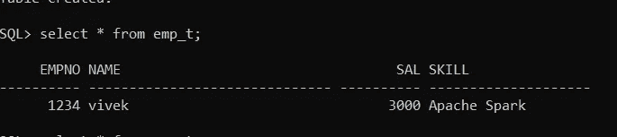
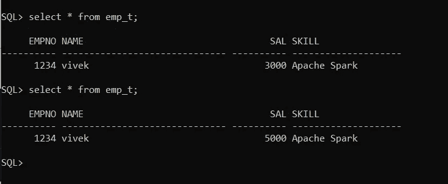
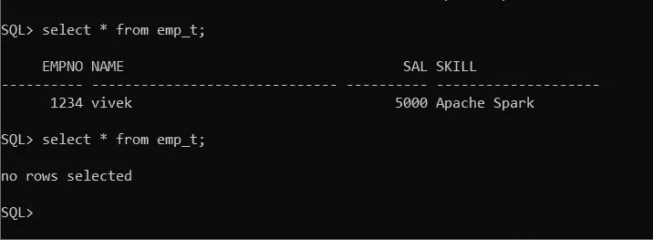

# Python DB CRUD 操作

> 原文：<https://pub.towardsai.net/python-db-crud-operations-fe1fb5144d58?source=collection_archive---------3----------------------->

## [编程](https://towardsai.net/p/category/programming)

本文的目标是了解如何为 Oracle DB connectivity 编写 Python 类来执行 CRUD 操作，包括创建、插入、更新和删除操作。此外，我将触及 OOPS **多态操作符重载**的概念。本文中使用的用于 Oracle DB 连接的 Python 库是 **cx_Oracle** 。


1.  **创建 Oracle 表:**

```
create table emp_t 
  (empno number, 
   name varchar2(30), 
   sal number, 
   skill varchar(20));
```

**2。用于 DML 操作的 Python 类:**

创建 Python EMP 类并定义构造函数 __init__()来实例化实例变量，用 ***args** 参数给出重载的味道。定义实例方法来执行各种操作。

> ***args** 是非关键字参数，用于向函数传递可变数量的参数。

```
#create class EMP and define a constructorclass Emp:def __init__(self,*args):
      #using *args pass multiple arguments in one command#variable segregation and assignment
      self.user=args[0] <--Instance variable
      self.pswd=args[1]
      self.empid=args[2]
      self.name=args[3]
      self.sal=args[4]
      self.skill=args[5]#Instance method to insert DB records
 def emp_insert(self):

 try:
 conn=cx_Oracle.connect(self.user+’/’+self.pswd+’[@oracle](http://twitter.com/oracle)’)
 print(‘Db connection is successful’)
 c=conn.cursor()
 c.execute(‘insert into emp_t values(:1,:2,:3,:4)’,(self.empid,self.name,self.sal,self.skill))
 conn.commit()

 except Exception as e:
 print(‘OOPs seems some DB issue Try Again!!!’, e)
 finally:
 conn.close()#Instance method to update DB recordsdef emp_sal_update(self):
 upd=’update emp_t set sal=:2 where empno=:1'
 try:
 conn=cx_Oracle.connect(self.user+’/’+self.pswd+’[@oracle](http://twitter.com/oracle)’)
 print(‘Db connection is successful’)
 c=conn.cursor()
 c.execute(upd,{‘1’:self.empid,’2':self.sal})
 conn.commit()

 except Exception as e:
 print(‘OOPs seems some DB issue Try Again!!!’, e)
 finally:
 conn.close()#Instance method to delete DB recordsdef emp_del(self):
 delete=’delete from emp_t where empno=:1'
 try:
 conn=cx_Oracle.connect(self.user+’/’+self.pswd+’[@oracle](http://twitter.com/oracle)’)
 print(‘Db connection is successful’)
 c=conn.cursor()
 c.execute(delete,{‘1’:self.empid})
 conn.commit()

 except Exception as e:
 print(‘OOPs seems some DB issue Try Again!!!’, e)
 finally:
 conn.close()
```

执行 DML 操作的 Python 类被创建，下一步是创建该类的**对象**并调用方法来执行插入、更新或删除数据。

**3。调用 insert()方法:**

```
#create object of EMP class and call emp_insert() methode1=Emp(‘scott’,’scott’,1234,’vivek’,’3000',’Apache Spark’)
e1.emp_insert()
```

让我们验证插入表中的新数据。



列表数据

**4。调用 update()方法:**

```
#create object of EMP class and emp_sal_update() methode1_upd=Emp(‘scott’,’scott’,1234,’’,’5000',’’)
e1_upd.emp_sal_update()
```

让我们验证更新后的记录:



更新的数据

**5。调用 delete()方法:**

```
#create object of EMP class and emp_del() methode1_del=Emp(‘scott’,’scott’,1234,’’,’’,’’)
e1_del.emp_del()
```

让我们验证删除是否成功:



删除的数据

# 总结:

Python 类创建和方法重载——使用*args

使用 cx_Oracle 的 Python-DB 连接

调用 DML 操作的对象创建和实例方法。

感谢所有人阅读我的博客，如果你喜欢我的内容和解释，请在 medium 上关注我并分享你的反馈，这将永远帮助我们所有人提高我们的知识。