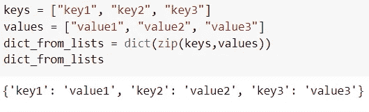
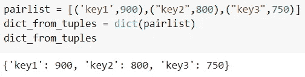
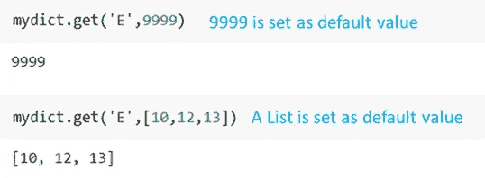
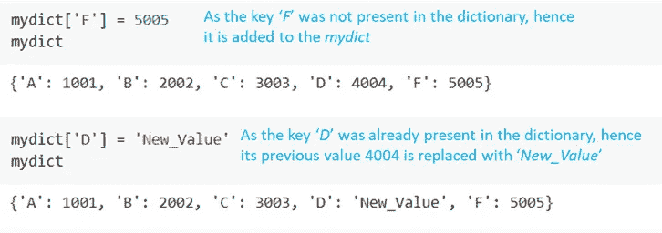
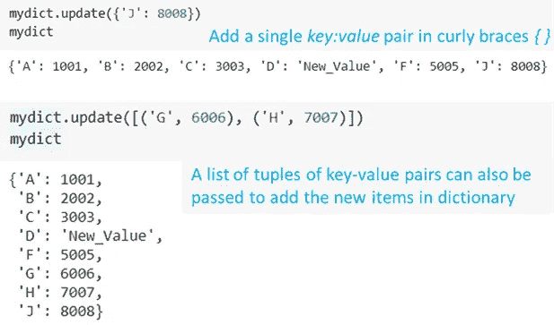
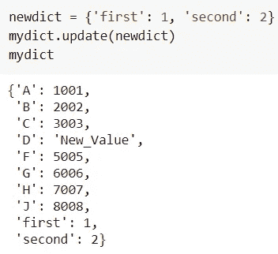
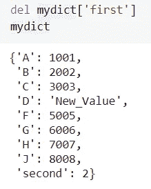
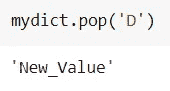
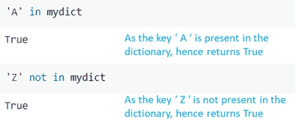

# Python 字典:你需要知道的 10 个实用方法

> 原文：<https://pub.towardsai.net/python-dictionary-10-practical-methods-you-need-to-know-cbeb1c962bed?source=collection_archive---------0----------------------->

## [编程](https://towardsai.net/p/category/programming)

## ..学习如何在 5 分钟内掌握 Python 字典！


照片由[元素 5 数码](https://unsplash.com/@element5digital?utm_source=unsplash&utm_medium=referral&utm_content=creditCopyText)在 [Unsplash](https://unsplash.com/?utm_source=unsplash&utm_medium=referral&utm_content=creditCopyText) 上拍摄

**键值对的惊人威力！！**

字典是 Python 中重要的数据结构之一。

Python 程序员使用字典方法以更 python 化的方式快速编写代码。⚡

这里有 10 个实用的、必须知道的字典方法，我在 5 分钟内就掌握了(*当然你也能*)。⏳

dictionary——一个有序的集合，用于存储`{Key:Value}`对中的数据值。你可以通过使用构造函数`dict()`或者输入花括号`{ }`来创建一个字典。

> **键是唯一的&不可变的，但是*值可以是任何东西*！！**

💡你可以在阅读的最后下载一个完整的笔记本！！

让我们跳进来吧！

# 创建新词典

最简单的方法是，在用逗号分隔的`**{ }**`中写多个`**key : value**`对。

```
# Create a dictionary with,
# keys 'A', 'B', 'C', 'D'
# values 1001, 2002, 3003, 4004 respectivelymydict = {'A': 1001,
          'B': 2002,
          'C': 3003,
          'D': 4004}
```

字典也可以从现有的键和值列表中创建！

简单来说，使用构造函数`dict()`。



根据 Python | Image 中的键和值列表创建字典(按作者)

类似地，字典也可以从键值元组列表中创建。举个例子，



根据 Python | Image 中的键、值元组创建字典(按作者)

# 访问字典项目

根据您想从下面的字典中访问的内容，有四种方法。

> 使用。keys()，。值()和。项目()

**顾名思义，*。按键()*** 和 ***。values()*** 只能用来分别访问键和值。在上面例子中已经创建的字典中，


从 Python 字典中提取键、值和键值对|按作者排序的图片

如上图所示，***key-value***对作为元组，可以用`.items()`提取。

然而，要访问单个值，只需使用*键*作为索引。举个例子，

```
mydict['A']
>>> 1001
```

或者可以使用如下图的内置方法`**.get(key)**`。

```
mydict.get('A')
>>> 1001
```

虽然，`.get(key)`比以前的方法慢了 **0.6X** ，但是如果字典中没有这个键，它不会抛出`**KeyError**`。⚡

您可以在`**.get(key, default)**`中设置一个默认值，当字典中没有该键时，将返回该默认值。



使用从字典中提取值。作者在 Python | Image 中获取(键)

在上图中，由于关键字' *E* '不在字典`mydict`中，所以返回默认值。

# 向词典中添加新项目

我们通常需要向现有字典中添加条目，而不是一次创建整个字典。

添加单个项目是一个简单的过程，语法如下:
`dict_name[key] = value`

但是，如果 ***键*** 已经存在于字典中，它将自动更新为新值。🛠️



在 Python | Image 中按作者向词典添加新项目

因此，如上所示，该方法可用于更新对应于特定`key`的值。

> **使用。update()添加单个或多个键值对！**



Python 字典。更新()|作者图片

还可以使用方法`.update()`将新字典添加到现有字典中。示例如下所示。



使用 **dict 合并两个字典。** **更新()** |图片作者

让我们进一步探讨如何从字典中删除条目。

# 从字典中删除项目

因为字典是键值对的集合，所以删除一个条目意味着删除一个 ***键值*** 对。

> 德尔，。清除()和。pop(键)是 3 种可能的方法！

方法`del`比如`**del mydict**`将删除整个字典，但是它也可以用来删除特定的 ***键值*** 对。你所需要做的就是传递方括号中的密钥`[ ]`，如下所示。



在 Python| Image 中按作者从字典中删除元素

如果您想从字典中提取一个值，并想对其进行操作，那么使用`**.pop(key, default)**`会更加 Pythonic 化！⚡



使用从 Python 的字典中删除一个键。pop() |作者图片

方法`.pop()`的一个优点是，你可以分配一个可选的默认值。因此，即使字典中没有这个键，也会返回这个默认值。

但是，`**mydict.clear()**`将删除所有的键值对，并返回一个空字典。

# 检查字典中是否存在关键字

为了检查字典中是否有这个键，我发现使用`**in**`和`**not in**`更有意思！



检查给定的关键字是否已经存在于字典|按作者排序的图像中

🎯你可以从这个 [**笔记本上下载所有这些方法！**](https://github.com/17rsuraj/data-curious/blob/master/TowardsDataScience/MasterPythonDictionary.ipynb)

总结一下，

我发现在使用 Python 进行数据分析以及复杂的自动化任务时，这些字典方法非常方便。其中一些如`.pop`和`.get()`对于有效处理`KeyError`异常很有用，同时提高了代码的可读性。

掌握这些字典方法肯定会提高您的工作效率，让您在项目中更有效地使用字典。我总是乐于倾听你在项目中使用的其他字典技巧。

⚡你可以成为 [**媒介会员**](https://medium.com/@17.rsuraj/membership) 来解锁我的全部写作权限，外加媒介的其余部分。如果您使用以下链接，我将收取您的一部分会员费，无需您支付额外费用。

[](https://medium.com/@17.rsuraj/membership) [## 加入我的推荐链接- Suraj Gurav 媒体

### 作为一个媒体会员，你的会员费的一部分会给你阅读的作家，你可以完全接触到每一个故事…

medium.com](https://medium.com/@17.rsuraj/membership) 

欢迎加入我的[邮件列表](https://medium.com/subscribe/@17.rsuraj)来了解我写作的最新进展。

**感谢您的阅读和投入时间！！**