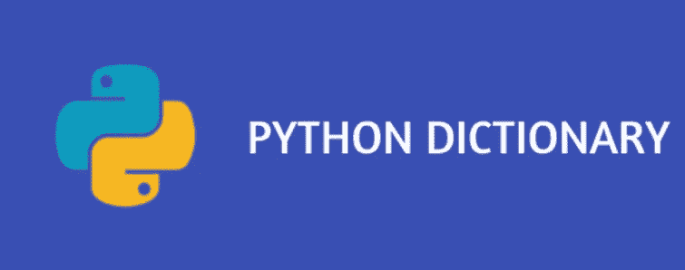
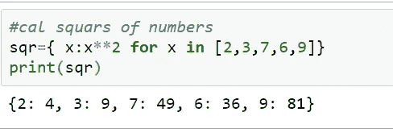
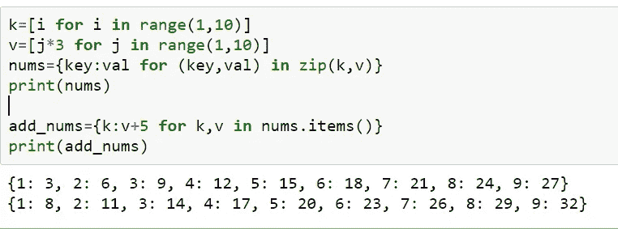
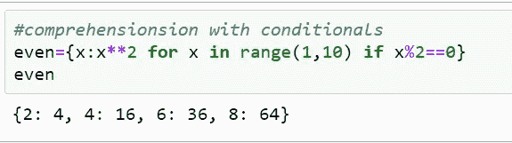
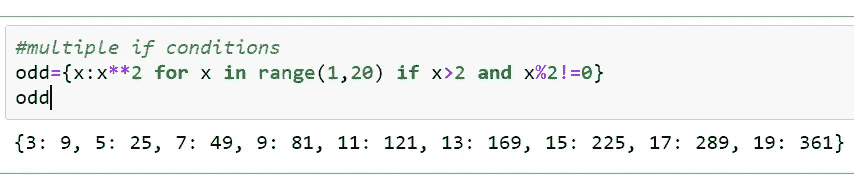
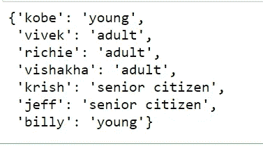
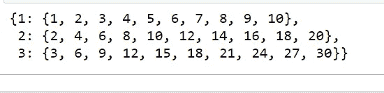

# Python 词典理解

> 原文：<https://pub.towardsai.net/python-dictionary-comprehension-e3c7ede7393f?source=collection_archive---------0----------------------->

## [编程](https://towardsai.net/p/category/programming)

字典是 python 中的数据结构，以键值对的形式存储数据。这个博客的目标是理解和实现字典理解的一些用例。理解使我们能够成为函数式编程的一部分，函数式编程的目标是使代码更加优雅、易读和单行。



**什么是字典理解？**

字典理解让我们用一行代码在字典上运行循环，类似于列表理解。

字典的语法:

> {key:在<iterable>中(key，value)的值</iterable>

Iterable 可以是列表、元组或字典，或者任何其他 python 数据结构。

1.  **用 python 数据结构创建字典。**

```
#keys are tuples and values are list
key=(1,2,3,4) →tuple
val=[‘strawberry’,’blackberry’,’cloudberry’,’blueberry’] →list#zip() function ties them up together like real life zip does
berries={key:val for (key,val) in zip(key,val)}
print(berries)
```


```
#cal squars of numbers and create a dictionary
sqr={ x:x**2 for x in [2,3,7,6,9]}
print(sqr)
```



**2。从现有字典创建新字典。**

```
#create a dictionary from lists as belowk=[i for i in range(1,10)]
v=[j*3 for j in range(1,10)]
nums={key:val for (key,val) in zip(k,v)}
print(nums)#now use above dictionary to perform dictionary comprehension#add 5 to every element of dictionary and create new one
add_nums={k:v+5 for k,v in nums.items()}
print(add_nums)
```



**3。带理解的条件句**

```
#extract even numbers and square them up to create new dict
even={x:x**2 for x in range(1,10) if x%2==0}
even
```



```
#add multiple conditions to if clause
odd={x:x**2 for x in range(1,20) if x>2 and x%2!=0}
odd
```



**4。带有理解的嵌套 if-else**

```
#lets say we have dictionary of persons and categorize them as young, adult and senior citizens as per their age
#logic age<18 young, age>18 and age<=60 adult, age>60 senior citizenper_age={‘kobe’:2,’vivek’:30,’richie’:19,’vishakha’:28,’krish’:62,’jeff’:65,’billy’:12}
age_cat={ k:(‘young’ if v<=18 else ‘adult’ if (v>=18 and v<=60) else ‘senior citizen’) for k,v in per_age.items()}
print(age_cat)
```



**5。嵌套字典理解**

```
#nested dictionary comprehension
#kind of multiplication table from numbers 1 to 3
nestd={ v1:{v2*v1 for v2 in range(1,11)} for v1 in range(1,4)}
print(nestd)
```



字典上的理解就是这样。总之，我们已经介绍了一些实现和理解字典理解的用例。

字典理解可以缩短代码并保持逻辑完整，但有时由于逻辑理解的复杂性，会降低代码的可读性，并消耗更多的内存。这适用于列表和字典理解。因此，学习理解是好的，但理解并以最佳方式实现它们也很重要。

感谢你阅读我的故事。如果你喜欢我的作品，请欣赏它鼓励你创造更多高质量作品的努力。请在媒体上与我联系，分享内容传播知识。