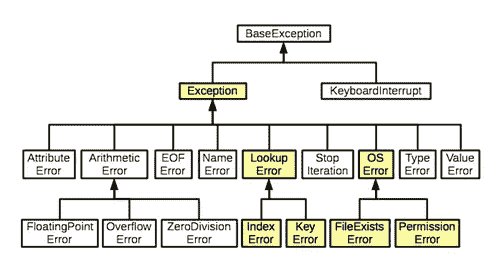

# Python 示例通过异常处理使算法更加健壮

> 原文：<https://pub.towardsai.net/python-examples-to-make-algorithm-more-robust-with-exception-handling-6bff7a127786?source=collection_archive---------0----------------------->

## [编程](https://towardsai.net/p/category/programming)

## 程序正常流程中的错误中断


由[马库斯·斯皮斯克](https://unsplash.com/@markusspiske?utm_source=medium&utm_medium=referral)在 [Unsplash](https://unsplash.com?utm_source=medium&utm_medium=referral) 上拍摄的照片

> ***异常处理***

例外的概念很简单。只有当程序的正常流程被错误中断时，才会发生异常。如果程序不能处理特定的操作，它会引发一个异常。异常只是一个表示错误的 python 对象。一旦 python 脚本引发异常，就必须立即处理。否则，程序将被终止。

> ***试除 Python 中的***

在 python 中，try-except 语句首先在 try 语句下运行程序。如果程序没有成功执行，它会在检测到错误的地方停止，并运行“except”块。这条语句帮助我们测试一段代码中的错误。

**语法:**

```
try:
    Try statementsexcept Exception_name:
    Exception statements
```

**程序:**

```
a = 2
b = 5try:
    print(“Program is running…”)
    print(a/b)
    print(“program has worked”)
    i = int(input(“Enter input : “))except ZeroDivisionError:
    print(“Error: Division by zero is not possible”)except Exception:
    print(“Invalid Input”)**Output:
// when b=5**Program is running…
0.4
program has worked
Enter input : p
Invalid Input**//when b=0**Program is running…
Error: Division by zero is not possible
```

## **说明:**

从上面的程序中，让我们考虑两种情况:

*   **当变量 b = 5 时**

在这里，程序成功地执行了前 3 条 try 语句。第四个语句是输入一个输入(由用户输入)。让我们看看，如果在应该输入整数的地方输入一个字符，会发生什么情况。

程序会将此视为错误，并执行“except”块“Exception”因此，将输出返回为“无效输入”

*   **当变量 b = 0 时**

在这里，程序成功地执行了第一个 try 语句。我们知道一个数不能被零整除；因此，这是一个错误，并直接跳转到异常块“ZeroDivisionError”。这就是我们如何接收到“错误:不能被零除”的输出

> ***清理行动***

如果程序成功执行或抛出异常，清理操作总是运行任务。为了执行清理操作，我们使用 try 语句的可选子句—最后，它将在任何条件下运行该语句下的任务。

**程序:**

```
a = 2
b = 0try:
    print(“Program is running…”)
    print(a/b)
    print(“program has worked”)
    i = int(input(“Enter input : “))except ZeroDivisionError:
    print("Error: Not possible, Division by zero")except Exception:
    print(“Invalid Input”)finally:
    print(“Program has successfully ended….”)**Output:** Program is running…
Error: Not possible, Division by zero
Program has successfully ended….
```

## **说明:**

在上面的程序中，您可以看到即使遇到异常,' finally '语句也会成功执行。但是它不会打印 try 块中剩余的语句。

[](https://medium.com/pythoneers/forget-html-and-flask-start-using-streamlit-1b394cfe4595) [## 忘记 HTML 和 Flask，开始使用 Streamlit

### 数据科学和机器学习的 WebApp 框架

medium.com](https://medium.com/pythoneers/forget-html-and-flask-start-using-streamlit-1b394cfe4595) [](/latest-programming-languages-for-ai-5252d39e1c51) [## 最新的人工智能编程语言

### 人工智能未来娱乐它的语言

pub.towardsai.ne](/latest-programming-languages-for-ai-5252d39e1c51) 

> ***内置异常***

python 程序中出现的所有异常都是类。此外，这些异常中的每一个都直接或间接地继承自 exception 类。

例如:让我们看看下面的图表。这里你可以看到“算术错误”异常继承了它的父类“异常”类。现在让我们更进一步，看看“溢出误差”此异常类直接继承自“算术错误”异常类，但间接继承自“异常”类。

**示意图:**



图像[来源](https://w3.cs.jmu.edu/lam2mo/cs240_2014_08/lab05-exceptions.html)

一些内置的例外:

*   **ZeroDivisionError** :当模运算的除数或除数为零时，会出现这种错误。
*   **缩进错误**:当程序中有不正确的缩进时，会出现这种错误。
*   **内存错误**:当一个特定的函数内存不足时，就会出现这种错误。
*   **类型错误**:当一个程序的一个函数或操作被应用到一个具有不正确类型的对象时，出现类型错误。
*   **语法错误**:当解析器遇到语法错误时，会出现这种错误。

**程序:**

```
a = 2
b = 0try:
    print(“Program is running…”)
    print(a/b)
    print(“program has worked”)
    except ZeroDivisionError as e:
    print(“Error: Division by zero is not “)except SyntaxError as e:
    print(“Error : Check your syntax”)except NameError as e:
    print(“Error : Variable not found”)finally:
    print(“Program has successfully ended….”)**Output:
// when b = 0**Program is running…
Error: Division by zero is not
Program has successfully ended….**// when a/b = a/c**Program is running…
Error : Variable not found
Program has successfully ended….
```

## **解释:**

从上面的程序中，让我们考虑两种情况:

*   **当 b = 0 时**

类似于前面的例子，我们知道一个数不能被零除。因此，程序在 try 语句的第二行停止，并跳转到“except”块。即 ZeroDivisionError 异常。

*   **当 a/b = a/c 时**

当我们将 try 语句的第二行从 a/b → a/c 改变时，程序识别出一个错误，因为变量‘c’是无效的。因此，解析器跳转到“NameError”异常。

> ***用户自定义异常***

程序员可以通过创建新的异常类来创建他们的异常。这个概念被称为用户定义的异常。

**程序:**

```
class GuessError(Exception):
    def __init__(self, message):
        self.message = messagea = int(input(“Enter the input : “))try:
    if a < 3:
        raise GuessError(“Your guess is wrong. Number is less.”) elif a > 3:
        raise GuessError(“Your guess is wrong. Number is high.”) else:
        print(“Your guess is right. The value is : {}.”.format(a))except GuessError as e:
    print(e.message)**Output:**Enter the input : 3
Your guess is right. The value is : 3Enter the input : 2
Your guess is wrong. Number is less.Enter the input : 5
Your guess is wrong. Number is high.
```

## **解释:**

您可以在上面的程序中看到，用户定义的异常“GuessError”是通过定义一个从基类“exception”继承的类来创建的创建一个构造函数来初始化该类的一个对象，以传递我们选择的错误消息。然后是通常的 try-except 语句，这些语句将按照程序应该执行的方式执行。

> ***Nzec 错误***

NZEC 错误，也称为非零退出代码，是运行时发生的错误类型。当您的代码未能返回 0 时，会出现此错误。你的程序只有在返回 0 时才能成功执行。否则程序将根据错误类型返回一个非 0 的数字。

**可能出现 NZEC 错误:**

1.  当访问负数组索引时。
2.  如果程序使用的内存超过了为运行程序分配的内存量。
3.  因为基本的编程错误，比如把一个数除以零。
4.  如果你想计算 20 以上的阶乘。

**例如**，上面代码片段的 NZEC 错误可以使用 try-except 块语句解决。

**程序:**

```
for nzec in range(int(input())):
    a=int(int())
    b=list(map(int,input().split()))
    c=0
    ls=Null for i in b:
        if n==Null or n>i:
            n=i
            c=c+1 print(c)**Solution:**try:
    for nzec in range(int(input())):
        a=int(int())
        b=list(map(int,input().split()))
        c=0
        ls=Null for i in b:
            if n==Null or n>i:
                n=i
                c=c+1 print(c)except: pass
```

## **解释:**

在上面的程序中，try-except 语句可以解决 NZEC 错误，因为程序未能返回 0(以结束程序)。这不是编程错误；相反，这是一个算法错误。因此，我们使用 try-except 语句来停止程序而不出错。

> ***结论***

总之，本文涵盖了异常处理的一些关键概念。我强烈建议阅读更多的文章，并使用 python 程序应用这些概念，因为在这个主题上有许多可以尝试的例外。

我希望你喜欢这篇文章。通过我的 [LinkedIn](https://www.linkedin.com/in/data-scientist-95040a1ab/) 和 [twitter](https://twitter.com/amitprius) 联系我。

# 推荐文章

1.[8 Python 的主动学习见解收集模块](/8-active-learning-insights-of-python-collection-module-6c9e0cc16f6b?source=friends_link&sk=4a5c9f9ad552005636ae720a658281b1)
2。 [NumPy:图像上的线性代数](/numpy-linear-algebra-on-images-ed3180978cdb?source=friends_link&sk=d9afa4a1206971f9b1f64862f6291ac0)3。[Python 中的异常处理概念](/exception-handling-concepts-in-python-4d5116decac3?source=friends_link&sk=a0ed49d9fdeaa67925eac34ecb55ea30)
4。[熊猫:处理分类数据](/pandas-dealing-with-categorical-data-7547305582ff?source=friends_link&sk=11c6809f6623dd4f6dd74d43727297cf)
5。[超参数:机器学习中的 RandomSeachCV 和 GridSearchCV](/hyper-parameters-randomseachcv-and-gridsearchcv-in-machine-learning-b7d091cf56f4?source=friends_link&sk=cab337083fb09601114a6e466ec59689)
6。[用 Python](https://medium.com/towards-artificial-intelligence/fully-explained-linear-regression-with-python-fe2b313f32f3?source=friends_link&sk=53c91a2a51347ec2d93f8222c0e06402)
7 全面讲解了线性回归。[用 Python](https://medium.com/towards-artificial-intelligence/fully-explained-logistic-regression-with-python-f4a16413ddcd?source=friends_link&sk=528181f15a44e48ea38fdd9579241a78)
充分解释了 Logistic 回归 8。[数据分发使用 Numpy 与 Python](/data-distribution-using-numpy-with-python-3b64aae6f9d6?source=friends_link&sk=809e75802cbd25ddceb5f0f6496c9803)
9。[机器学习中的决策树 vs 随机森林](/decision-trees-vs-random-forests-in-machine-learning-be56c093b0f?source=friends_link&sk=91377248a43b62fe7aeb89a69e590860)
10。[用 Python 实现数据预处理的标准化](/standardization-in-data-preprocessing-with-python-96ae89d2f658?source=friends_link&sk=f348435582e8fbb47407e9b359787e41)