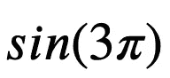
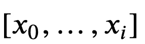
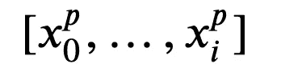

# Python 简介

> 原文：<https://pub.towardsai.net/python-for-beginners-7388aaeee696?source=collection_archive---------4----------------------->

## [编程](https://towardsai.net/p/category/programming)

在本教程中，我们将探索 Python 编程语言的基础。

改编自 [J.R .约翰逊](http://jrjohansson.github.io)

## Python 程序文件

*   Python 代码通常存储在以“`.py`”结尾的文本文件中:
*   `myprogram.py`
*   Python 程序文件中的每一行都被假定为 Python 语句或其一部分。
*   唯一的例外是注释行，它以字符`#`开始(可选地以任意数量的空白字符开头，即制表符或空格)。Python 解释器通常会忽略注释行。
*   要从命令行运行我们的 Python 程序，我们使用:
*   `$ python myprogram.py`

## IPython 笔记本

这个文件——一个 IPython 笔记本——不遵循文本文件中 Python 代码的标准模式。相反，IPython 笔记本以 [JSON](http://en.wikipedia.org/wiki/JSON) 格式存储为一个文件。优点是我们可以混合格式化文本、Python 代码和代码输出。它需要 IPython 笔记本服务器来运行它，因此不是一个独立的 Python 程序，如上所述。除此之外，进入程序文件的 Python 代码和 IPython 笔记本之间没有任何区别。

## 模块

Python 中的大多数功能都是由**模块**提供的。Python 标准库是一个大型的模块集合，它提供了通用设施的*跨平台*实现，比如访问操作系统、文件 I/O、字符串管理、网络通信等等。

## 参考

*   Python 语言参考:[https://docs.python.org/3/reference/index.html](https://docs.python.org/3/reference/index.html)
*   Python 标准库参考:[https://docs.python.org/3/library/index.html](https://docs.python.org/3/library/index.html)

要在 Python 程序中使用一个模块，首先必须将其导入。可以使用`import`语句导入一个模块。例如，要导入包含许多标准数学函数的模块，我们可以这样做:

```
import math
```

这包括整个模块，并使它在程序的后面可用。例如，我们可以这样做:

```
import math

x = math.cos(2 * math.pi)

print(x)1.0
```

我们还可以导入一个模块，并使用*作为*关键字对其进行重命名:

```
import math as m

x = m.cos(2 * m.pi)
print(x)1.0
```

**练习 1:** 计算…的值



```
m.sin(3*m.pi)3.6739403974420594e-16
```

或者，我们可以选择将模块中的所有符号(函数和变量)导入到当前的名称空间(这样我们就不需要在每次使用来自`math`模块的东西时都使用前缀“`math.`”:

```
from math import *

x = cos(2 * pi)

print(x)1.0
```

这种模式可能非常方便，但是在包含许多模块的大型程序中，通过使用`import math`模式，将每个模块的符号保存在它们自己的名称空间中通常是一个好主意。这将消除命名空间冲突的潜在混淆问题。

作为第三种选择，我们可以选择只从一个模块中导入一些选定的符号，方法是明确列出我们想要导入的符号，而不是使用通配符`*`:

```
from math import cos, pi

x = cos(2 * pi)

print(x)1.0
```

## 变量和类型

## 符号名称

Python 中的变量名可以包含字母数字字符`a-z`、`A-Z`、`0-9`和一些特殊字符如`_`。普通变量名必须以字母开头。

按照惯例，变量名以小写字母开头，类名以大写字母开头。

## 分配

Python 中的赋值运算符是`=`。Python 是一种动态类型语言，所以我们在创建变量时不需要指定变量的类型。

为新变量赋值会创建变量:

```
# variable assignments
x = 1.0
my_variable = 12.2
```

虽然没有明确指定，但是变量确实有关联的类型。该类型是从分配给它的值派生的。

```
type(x)float
```

如果我们给一个变量赋值，它的类型会改变。

```
x = 1type(x)int
```

如果我们试图使用一个尚未定义的变量，我们会得到一个`NameError`:

```
print(y)---------------------------------------------------------------------------

NameError                                 Traceback (most recent call last)

<ipython-input-13-d9183e048de3> in <module>
----> 1 print(y)

NameError: name 'y' is not defined
```

## 基本类型

```
# integers
x = 1
type(x)int# float
x = 1.0
type(x)float
```

我们也可以对浮点类型使用科学记数法:

```
x = 5e3
print(x)
print(type(x))5000.0
<class 'float'># boolean
b1 = True
b2 = False

type(b1)bool# complex numbers: note the use of `j` to specify the imaginary part
x = 1.0 - 1.0j
type(x)complexprint(x)(1-1j)print(x.real, x.imag)1.0 -1.0
```

## 铅字铸造

```
x = 1.5

print(x, type(x))1.5 <class 'float'>x = int(x)

print(x, type(x))1 <class 'int'>z = complex(x)

print(z, type(z))(1+0j) <class 'complex'>
```

我们可以使用`isinstance(obj, class)`方法来确定一个变量是否属于某个类(类型):

```
x = 3
print(isinstance(x, float))
print(isinstance(x, int))False
Truex = 3.0
print(isinstance(x, float))
print(isinstance(x, int))True
False
```

**练习 3:** 打印变量`x=3.5e3`的类型，然后将其转换为 **int**

```
x=3.5e3
print(type(x))
x=int(x)
print(x)<class 'float'>
3500
```

## 运算符和比较

Python 中的大多数操作符和比较符都像预期的那样工作:

*   算术运算符`+`、`-`、`*`、`/`、`//`(整数除法)、“**”幂

```
1 + 2, 1 - 2, 1 * 2, 1 / 2(3, -1, 2, 0.5)1.0 + 2.0, 1.0 - 2.0, 1.0 * 2.0, 1.0 / 2.0(3.0, -1.0, 2.0, 0.5)# Integer division of float numbers
3.0 // 2.01.0# Note! The power operators in python isn't ^, but **
2 ** 24
```

注意:在 Python 3.x 中,`/`操作符总是执行浮点除法。在 Python 2.x 中不是这样的，在 Python 2 . x 中，如果操作数是整数，那么`/`的结果总是整数。更具体的说，Python 3.x 中的`1/2 = 0.5` ( `float`)，Python 2.x 中的`1/2 = 0` ( `int`)(但 Python 2.x 中的`1.0/2 = 0.5`)。

*   布尔运算符拼写为单词`and`、`not`、`or`。

```
True and FalseFalsenot FalseTrueTrue or FalseTrue
```

*   比较运算符`>`、`<`、`>=`(大于或等于)、`<=`(小于或等于)、`==`相等、`is`相同。

```
2 > 1, 2 < 1(True, False)2 > 2, 2 < 2(False, False)2 >= 2, 2 <= 2(True, True)# equality
[1,2] == [1,2]True# objects identical?
l1 = l2 = [1,2]

l1 is l2True
```

## 复合类型:字符串、列表和字典

## 用线串

字符串是用于存储文本消息的变量类型。

```
s = "Hello world"
type(s)str# length of the string: the number of characters
len(s)11# replace a substring in a string with something else
s2 = s.replace("world", "test")
print(s2)Hello test
```

我们可以使用`[]`索引字符串中的一个字符:

```
s[0]'H'
```

**平视 MATLAB 用户:**索引从 0 开始！

我们可以使用语法`[start:stop]`提取字符串的一部分，提取索引`start`和`stop` -1 之间的字符(不包括索引`stop`处的字符):

```
s[0:5]'Hello's[4:5]'o'
```

如果我们从`[start:stop]`中省略`start`或`stop`中的一个(或两个),默认分别是字符串的开头和结尾:

```
s[:5]'Hello's[6:]'world's[:]'Hello world'
```

我们还可以使用语法`[start:end:step]`定义步长(正如我们在上面看到的，`step`的默认值是 1):

```
s[::1]'Hello world's[::2]'Hlowrd'
```

这种技术叫做*切片*。在这里阅读更多关于语法的内容:[http://docs . python . org/release/2 . 7 . 3/library/functions . html？高亮显示=切片#切片](http://docs.python.org/release/2.7.3/library/functions.html?highlight=slice#slice)

Python 有一套非常丰富的文本处理函数。更多信息参见例如[http://docs.python.org/2/library/string.html](http://docs.python.org/2/library/string.html)。

**练习 5:** 提取“男人的帽子是黑色的”中的“帽子”一词

```
s = "The man's hat is black"
w = s[10:13]
print(w)hat
```

**练习 6:** 把短语“男人的帽子是黑色的”中的“猫”换成“帽子”

```
s2 = s.replace('hat', 'cat')
print(s2)The man's cat is black
```

## 字符串格式示例

```
print("str1", "str2", "str3")  # The print statement concatenates strings with a spacestr1 str2 str3print("str1" + "str2" + "str3") # strings added with + are concatenated without spacestr1str2str3# this formatting creates a string
s2 = "value1 = %.2f. value2 = %d" % (3.1415, 1.5)

print(s2)value1 = 3.14\. value2 = 1# alternative, more intuitive way of formatting a string 
s3 = 'value1 = {0}, value2 = {1}'.format(3.1415, 1.5)

print(s3)value1 = 3.1415, value2 = 1.5
```

## 目录

列表非常类似于字符串，除了每个元素可以是任何类型。

在 Python 中创建列表的语法是`[...]`:

```
l = [1,2,3,4]

print(type(l))
print(l)<class 'list'>
[1, 2, 3, 4]
```

我们可以使用与字符串相同的切片技术来操作列表:

```
print(l)

print(l[1:3])

print(l[::2])[1, 2, 3, 4]
[2, 3]
[1, 3]
```

**抬头 MATLAB 用户:**索引从 0 开始！

```
l[0]1
```

列表中的元素不必都是同一类型:

```
l = [1, 'a', 1.0, 1-1j]

print(l)[1, 'a', 1.0, (1-1j)]
```

列表在 Python 中起着非常重要的作用。例如，它们用在环路和其他流量控制结构中(下面讨论)。有许多方便的函数可以生成各种类型的列表，例如，`range`函数:

```
start = 10
stop = 30
step = 2

range(start, stop, step)range(10, 30, 2)# in python 3 range generates an iterator, which can be converted to a list using 'list(...)'.
# It has no effect in python 2
list(range(start, stop, step))[10, 12, 14, 16, 18, 20, 22, 24, 26, 28]list(range(-10, 10))[-10, -9, -8, -7, -6, -5, -4, -3, -2, -1, 0, 1, 2, 3, 4, 5, 6, 7, 8, 9]
```

**练习 7:** 创建一个范围从 0 到 20 的偶数列表

```
list(range(0,22,2))[0, 2, 4, 6, 8, 10, 12, 14, 16, 18, 20]
```

## 添加、插入、修改和删除列表中的元素

```
# create a new empty list
l = []

# add an elements using `append`
l.append("A")
l.append("d")
l.append("d")

print(l)['A', 'd', 'd']
```

我们可以通过给列表中的元素赋值来修改列表。用技术术语来说，列表是可变的。

```
l[1] = "p"
l[2] = "p"

print(l)['A', 'p', 'p']l[1:3] = ["d", "d"]

print(l)['A', 'd', 'd']
```

使用`insert`在特定索引处插入一个元素

```
l.insert(0, "i")
l.insert(1, "n")
l.insert(2, "s")
l.insert(3, "e")
l.insert(4, "r")
l.insert(5, "t")

print(l)['i', 'n', 's', 'e', 'r', 't', 'A', 'd', 'd']
```

使用“移除”移除具有特定值的第一个元素

```
l.remove("A")

print(l)['i', 'n', 's', 'e', 'r', 't', 'd', 'd']
```

使用`del`移除特定位置的元件:

```
del l[7]
del l[6]

print(l)['i', 'n', 's', 'e', 'r', 't']
```

更多细节见`help(list)`，或者阅读在线文档

## 元组

元组就像列表，除了它们一旦被创建就不能被修改，也就是说它们是不可变的。

在 Python 中，使用语法`(..., ..., ...)`甚至`..., ...`创建元组:

```
point = (10, 20)

print(point, type(point))(10, 20) <class 'tuple'>
```

我们可以通过将元组分配给逗号分隔的变量列表来解包元组:

```
x, y = point

print("x =", x)
print("y =", y)x = 10
y = 20
```

## 字典

字典也类似于列表，只是每个元素都是一个键值对。字典的语法是`{key1 : value1, ...}`:

```
params = {"parameter1" : 1.0,
          "parameter2" : 2.0,
          "parameter3" : 3.0,}

print(type(params))
print(params)<class 'dict'>
{'parameter1': 1.0, 'parameter2': 2.0, 'parameter3': 3.0}print("parameter1 = " + str(params["parameter1"]))
print("parameter2 = " + str(params["parameter2"]))
print("parameter3 = " + str(params["parameter3"]))parameter1 = 1.0
parameter2 = 2.0
parameter3 = 3.0
```

**练习 8:** 为一个人创建一个属性字典，包括姓名、年龄和职业

```
p = {'name':'John Doe', 'age':20, 'profession':'student'}
```

## 控制流

## 条件语句:if，elif，else

代码条件执行的 Python 语法使用关键字`if`、`elif` (else if)、`else`:

```
statement1 = False
statement2 = False

if statement1:
    print("statement1 is True")

elif statement2:
    print("statement2 is True")

else:
    print("statement1 and statement2 are False")statement1 and statement2 are False
```

在这里，我们第一次遇到了 Python 编程语言的一个奇特而不寻常的方面:程序块是由它们的缩进级别定义的。

在 Python 中，代码块的范围由缩进级别定义(通常是一个制表符或四个空格)。这意味着我们必须小心地正确缩进我们的代码，否则我们会得到语法错误。

## 示例:

```
statement1 = statement2 = True

if statement1:
    if statement2:
        print("both statement1 and statement2 are True")both statement1 and statement2 are True# Bad indentation!
if statement1:
    if statement2:
    print("both statement1 and statement2 are True")  # this line is not properly indentedFile "<ipython-input-80-ac4109c9123a>", line 4
    print("both statement1 and statement2 are True")  # this line is not properly indented
        ^
IndentationError: expected an indented blockstatement1 = False 

if statement1:
    print("printed if statement1 is True")

    print("still inside the if block")if statement1:
    print("printed if statement1 is True")

print("now outside the if block")now outside the if block
```

**练习 9:** 使用 Ex 中创建的 person 字典。8，创建一个条件语句来验证某人是否超过 30 岁。如果是，打印他们的职业，否则打印他们的年龄。

```
if p['age'] > 30:
    print(p['profession'])
else:
    print(p['age'])20
```

## 环

在 Python 中，循环可以用多种不同的方式编程。最常见的是`for`循环，它与可迭代对象(如列表)一起使用。基本语法是:

## `**for**` **循环**:

```
for x in [1,2,3]:
    print(x)1
2
3
```

`for`循环遍历所提供列表的元素，并对每个元素执行一次包含块。在`for`循环中可以使用任何类型的列表。例如:

```
for x in range(4): # by default range start at 0
    print(x)0
1
2
3
```

注:`range(4)`不包括 4！

```
for x in range(-3,3):
    print(x)-3
-2
-1
0
1
2for word in ["scientific", "computing", "with", "python"]:
    print(word)scientific
computing
with
python
```

要迭代字典的键值对:

```
for key, value in params.items():
    print(key + " = " + str(value))parameter1 = A
parameter2 = B
parameter3 = 3.0
parameter4 = D
```

有时候，当遍历一个列表时，访问值的索引是很有用的。为此，我们可以使用`enumerate`功能:

```
for idx, x in enumerate(range(-3,3)):
    print(idx, x)0 -3
1 -2
2 -1
3 0
4 1
5 2
```

**练习 10:** 打印 0 到 100 之间的所有 3 和 5 的倍数

```
for i in range(101):
    if i%3 ==0 and i%5==0:
        print(i)0
15
30
45
60
75
90
```

## 列表理解:使用`for`循环创建列表:

一种方便而简洁的初始化列表的方法:

```
l1 = [x**2 for x in range(0,5)]

print(l1)[0, 1, 4, 9, 16]
```

## `while`循环:

```
i = 0

while i < 5:
    print(i)

    i = i + 1

print("done")0
1
2
3
4
done
```

注意，由于缩进的不同，`print("done")`语句不是`while`循环体的一部分。

## 功能

Python 中的函数是使用关键字定义的，后跟函数名、括号内的签名和冒号`:`。下面的代码是函数体，增加了一层缩进。

```
def func0():   
    print("test")func0()test
```

可选地，但是强烈推荐，我们可以定义一个所谓的“docstring ”,它是对函数目的和行为的描述。docstring 应该紧跟在函数定义之后，函数体代码之前。

```
def func1(s):
    """
    Print a string 's' and tell how many characters it has    
    """

    print(s + " has " + str(len(s)) + " characters")help(func1)Help on function func1 in module __main__:

func1(s)
    Print a string 's' and tell how many characters it hasfunc1("test")test has 4 characters
```

返回值的函数使用`return`关键字:

```
def square(x):
    """
    Return the square of x.
    """
    return x ** 2square(4)16
```

我们可以使用元组从一个函数返回多个值(见上文):

```
def powers(x):
    """
    Return a few powers of x.
    """
    return x ** 2, x ** 3, x ** 4powers(3)(9, 27, 81)x2, x3, x4 = powers(3)

print(x3)27
```

**练习 11:** 创建一个函数，它接收一个数字列表并返回另一个列表，该列表中只包含 3 和 5 的倍数

```
def multiples(l):
    newList = []
    for i in l:
        if i%3==0 and i%5==0:
            newList.append(i)
    return newList
```

或者更简单的版本:

```
def multiples(l):
    return [i for i in l if i%3==0 and i%5==0]multiples([3,15,12,20,31])[15]
```

## 默认参数和关键字参数

在函数的定义中，我们可以给函数的参数赋予默认值:

```
def myfunc(x, p=2, debug=False):
    if debug:
        print("evaluating myfunc for x = " + str(x) + " using exponent p = " + str(p))
    return x**p
```

如果我们在调用函数`myfunc`时不提供参数`debug`的值，它将默认为函数定义中提供的值:

```
myfunc(5)25myfunc(5, debug=True)evaluating myfunc for x = 5 using exponent p = 2

25
```

如果我们在函数调用中明确列出参数的名称，它们不需要按照函数定义中的顺序出现。这被称为*关键字*参数，在需要大量可选参数的函数中非常有用。

```
myfunc(p=3, debug=True, x=7)evaluating myfunc for x = 7 using exponent p = 3

343
```

**练习 12:** 创建一个接收数字列表的函数



和一个可选的指数 *p* ，然后返回对应于



```
def lExp(l, p=1):
    return [i**p for i in l]lExp([1,2,3,4])[1, 2, 3, 4]lExp([1,2,3,4], 2)[1, 4, 9, 16]
```

## 班级

类是面向对象编程的关键特征。类是表示对象和可以在对象上执行的操作的结构。

在 Python 中，一个类可以包含*属性*(变量)和*方法*(函数)。

类的定义几乎和函数一样，但是使用了`class`关键字，并且类定义通常包含许多类方法定义(类中的一个函数)。

*   每个类方法应该有一个参数`self`作为它的第一个参数。这个对象是一个自引用。
*   一些类方法名有特殊的含义，例如:
*   `__init__`:第一次创建对象时调用的方法的名称。
*   `__str__`:当需要类的简单字符串表示时调用的方法，例如在打印时。
*   还有很多，见[http://docs . python . org/2/reference/data model . html # special-method-names](http://docs.python.org/2/reference/datamodel.html#special-method-names)

```
class Point:
    """
    Simple class for representing a point in a Cartesian coordinate system.
    """

    def __init__(self, x, y):
        """
        Create a new Point at x, y.
        """
        self.x = x
        self.y = y

    def translate(self, dx, dy):
        """
        Translate the point by dx and dy in the x and y direction.
        """
        self.x += dx
        self.y += dy

    def __str__(self):
        return("Point at [%f, %f]" % (self.x, self.y))
```

要创建类的新实例:

```
p1 = Point(0, 0) # this will invoke the __init__ method in the Point class

print(p1)         # this will invoke the __str__ methodPoint at [0.000000, 0.000000]
```

调用类实例`p`中的类方法:

```
p2 = Point(1, 1)

p1.translate(0.25, 1.5)

print(p1)
print(p2)Point at [0.250000, 1.500000]
Point at [1.000000, 1.000000]
```

请注意，调用类方法可以修改特定类实例的状态，但不会影响其他类实例或任何全局变量。

这是面向对象设计的一个好处:函数和相关变量等代码被分组到单独和独立的实体中。

**练习 13:** 扩展前面的类，创建一个计算原点和点之间的欧几里德距离的方法`abs`。

```
class Point:
    """
    Simple class for representing a point in a Cartesian coordinate system.
    """

    def __init__(self, x, y):
        """
        Create a new Point at x, y.
        """
        self.x = x
        self.y = y

    def translate(self, dx, dy):
        """
        Translate the point by dx and dy in the x and y direction.
        """
        self.x += dx
        self.y += dy

    def __str__(self):
        return("Point at [%f, %f]" % (self.x, self.y))

    def abs(self):
        """
        Return the Euclidian norm of a vector from origin to the Point
        """
        return math.sqrt(self.x**2+self.y**2)p = Point(3,4)
print(p.abs())5.0
```

## 进一步阅读

*   [http://www.python.org](http://www.python.org)—Python 编程语言的官方网页。
*   [http://www.python.org/dev/peps/pep-0008](http://www.python.org/dev/peps/pep-0008)—Python 编程风格指南。强烈推荐。
*   http://www.greenteapress.com/thinkpython/—一本关于 Python 编程的免费书籍。
*   [Python 必备参考](http://www.amazon.com/Python-Essential-Reference-4th-Edition/dp/0672329786) —一本很好的 Python 编程参考书。


来源:[谷歌图片](https://travelingroup.com/wp-content/uploads/2018/05/02visit-seville-in-group.jpg)

最初，我是一名机械工程师，但一直对数学和人工智能充满热情，后来我在这两个领域都找到了理想的职业，成为一名数据科学家。我热衷于将这些学科的严谨性应用于复杂的分析问题。我热爱教学，我兼职辅导 A-Level 数学、物理和化学。我也是一个受自然启发的优化爱好者(查看我的 [*发表的 pape*](https://www.researchgate.net/publication/317803017_An_Experimental_Study_on_Competitive_Coevolution_of_MLP_Classifiers) *r)和一个板球和网球的超级粉丝。在*[*LinkedIn*](https://www.linkedin.com/in/rahullalchandani-)*上找我！*