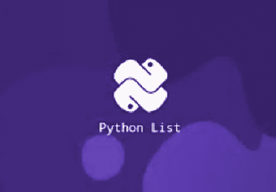
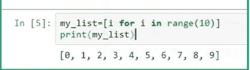
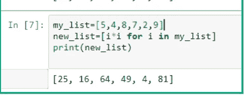
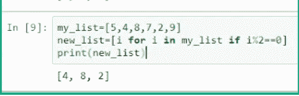
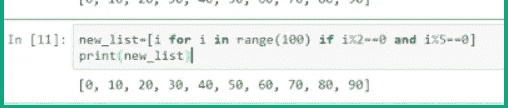
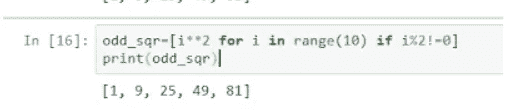
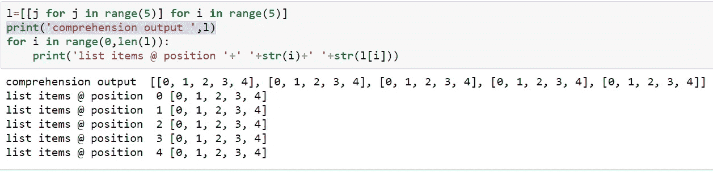

# Python 的列表理解

> 原文：<https://pub.towardsai.net/python-list-comprehensions-d84e01d8eb44?source=collection_archive---------1----------------------->

## [编程](https://towardsai.net/p/category/programming)

列表是 Python 数据结构，用于在单个变量中存储多个元素。列表理解是在 python 中定义和创建列表的更简单的方法，列表可以在一行中创建。



列表理解的语法也更容易掌握。

列表理解程序的结构如下:

*   一个表达式，它将是输出列表
*   输入序列
*   一个代表输入序列成员的变量
*   可选的谓词部分，在这里我们可以定义我们的条件语句

在任何编程语言中，执行一项任务都有多种方式，python 列表理解也是如此。
在我的文章中，我们不会直接使用列表理解，而是以一种关系的方式研究这个概念，将它与循环进行比较，然后总结研究，因为我个人发现这种方式更容易理解。

> 列表理解的语法:
> <列表>中<项>的表达式】

详细理解语法:

```
 e.g [i**2 for i in range(100) if i%2==0 and i%5==0]
 i**2 → is expression
 for i in range(100) → input sequence and i is the variable
 if i%2==0 and i%5==0 → literals and its an optional part
```

在下面的例子中，我们将更好地理解这个概念。

**1。生成从 1 到 10 的连续数字项目列表。**

```
#generate sequence of numbers 
my_list=[i for i in range(10)]
print(my_list)Output:
 [0, 1, 2, 3, 4, 5, 6, 7, 8, 9]
```



> #注意:只有一行代码使用理解

**2。列表项的正方形。**

```
#squaring list items
 my_list=[5,4,8,7,2,9]
 new_list=[i*i for i in my_list]
 print(new_list)Output: [25, 16, 64, 49, 4, 81]
```



**3。用条件句列表理解，创建一个新的偶数列表:**

```
#if-else in list comprehension
 my_list=[5,4,8,7,2,9]
 new_list=[i for i in my_list if i%2==0]
 print(new_list)Output: [4, 8, 2]
```



**4。用嵌套的 IF-ELSE 列出理解**

```
#nested if-else with comprehensions
new_list=[i for i in range(100) if i%2==0 and i%5==0]
print(new_list)Output: [0, 10, 20, 30, 40, 50, 60, 70, 80, 90]
```



**5。创建一个奇数平方列表。**

```
odd_sqr=[i**2 for i in range(10) if i%2!=0]
print(odd_sqr)Output: [1, 9, 25, 49, 81]
```



**6。嵌套列表理解。**
使用嵌套循环和列表理解创建列表列表:

```
#nested comprehension
l=[[j for j in range(5)] for i in range(5)]
print('comprehension output ',l)#looping over list items for understanding
for i in range(0,len(l)):
    print('list items @ position '+' '+str(i)+' '+str(l[i]))
```

在嵌套列表理解中，内部循环将值传递给外部循环，在上面的例子中，I 的值在每次迭代中都传递给 j。



# **总结**

列举理解语法的基本例子

用 IF-ELSE 列出感悟

用嵌套的 If-Else 列出理解

列表理解为创建奇偶数的正方形

感谢你阅读我的故事。如果你喜欢我的作品，请欣赏它鼓励你创造更多高质量作品的努力。请在媒体上与我联系，分享内容传播知识。