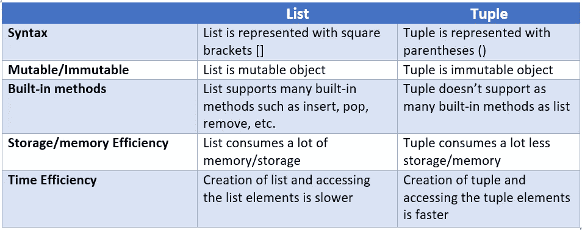

# Python 列表与 Tuple:一个深入的比较

> 原文：<https://pub.towardsai.net/python-list-vs-tuple-an-in-depth-comparison-42c59348d8a8?source=collection_archive---------0----------------------->

## [编程](https://towardsai.net/p/category/programming)


作者图片

# 介绍

即使对于初学者，列表和元组也不需要介绍。这两个是 Python 中常用的数据结构。但是两者的相同点和不同点是什么，你应该更喜欢哪一个，什么时候？这正是我们在这篇文章中要讨论的内容。让我们开始吧。

# 类似

## 序列类型

列表和元组都是**序列数据类型**，其中的元素以序列的形式存储。元素插入的顺序是保持的，这就是序列类型也被称为**有序**集的原因。

列表和元组都支持可变和不可变类型所共有的操作和函数。常见的操作有 ***串联、重复、索引、切片*** *。*常用功能有 ***最小值、最大值、长度、计数、索引*** 。

*你可能想看看我们以前的文章* [***这里***](https://pythonsimplified.com/python-sequence-types-an-introduction/) *关于* ***序列类型*** *然后再继续深入。*

## **同质/异质数据**

虽然列表和元组通常用于保存同类数据，但它们也可以包含异类数据，这意味着它们包含不同的数据类型作为元素。参考下面的例子，它显示了列表和元组可以包含同类和异类数据。

```
>>> mylist_1 = [10, 20, 30, 40, 50]
>>> mylist_2 = ["Python", "Simplified", ".com"]
>>> mylist_3 = ["Python", "Simplified", [1,2], (3,4)]>>> mytuple_1 = (10, 20, 30, 40, 50)
>>> mytuple_2 = ("Python", "Simplified", ".com")
>>> mytuple_3 = ("Python", "Simplified", (1,2), [3,4])
```

# 差异

## 句法

列表是包含在方括号 **[ ]** 中的元素集合，而元组包含在圆括号 **( )** 中。

```
>>> mylist = [10, 20, 30, 40, 50]
>>> mytuple = (10, 20, 30, 40, 50)
```

## 可变与不可变

这是列表和元组的主要区别之一。列表是可变对象，而元组是不可变对象。可变意味着一旦对象被创建，其内容可以被改变(插入、修改或删除)。在不可变对象的情况下，它们的内容一旦被创建就不能被修改。

请参考下面的列表示例，其中列表的内容发生了变化。由于列表是可变对象，我们可以修改它们的内容。

```
>>> mylist_1 = [10, 20, 30, 40, 50]
>>> mylist_1.append(60)
>>> mylist_1[0] = 100
>>> del mylist_1[-1]
>>> mylist_1
[100, 20, 30, 40, 50]
```

另一方面，由于元组是不可变的对象，所以不允许改变它们的内容。否则，您将遇到如下所示的 TypeError。

```
>>> mytuple_1 = (10, 20, 30, 40, 50)
>>> mytuple_1[0] = 100
Traceback (most recent call last):
 File "<stdin>", line 1, in <module>
TypeError: 'tuple' object does not support item assignment
```

*如果需要刷新 Python 中的可变性和不变性知识，可以通过* [***这篇***](https://pythonsimplified.com/mutability-immutability-in-python/) *文章。*

## 内置方法

由于列表是一个可变对象，我们可以插入、删除或修改它的内容。因此 list 有很多内置的方法，比如——insert 等。

另一方面，元组只支持几个内置方法，因为元组是不可变的。因为不允许修改不可变对象，所以元组没有很多内置函数是有意义的。

您可以运行 **dir(list)** 和 **dir(tuple)** 来查看 list 和 tuple 支持的内置函数。

```
>>> dir(list)
>>> dir(tuple)
```

## 存储效率

元组比列表的存储效率更高。这在行动中更好理解。

**List:** 你已经知道 List 是一个可变对象。当向列表追加元素时，Python 以特定的间隔*过度分配内存(这个间隔是由一个你不用担心的算法决定的)*。

```
prev = 56
mylist_1 = []
print(f”No. of elements: {0}, size: {sys.getsizeof(mylist_1)}, Diff: {0}”)for num in range(1, 20):
 mylist_1.append(num)
 temp_size = sys.getsizeof(mylist_1)
 diff, prev = temp_size — prev, temp_size
 print(f”No. of elements: {num}, size: {temp_size}, Diff: {diff}”)
```

该代码输出以下详细信息。正如你所看到的，一个空列表需要 56 个字节。但是当你把一个元素追加到一个空列表中时，Python 会分配 32 个字节。但是正如您所看到的，Python 额外分配了 24 个字节(超额分配)，而不是一个元素所需的 8 个字节。将第 5、第 9 和第 17 个元素追加到列表中时，也会发生同样的过度分配，依此类推。这个间隔由算法决定。

```
No. of elements: 0, size: 56, Diff: 0
No. of elements: 1, size: 88, Diff: 32
No. of elements: 2, size: 88, Diff: 0
No. of elements: 3, size: 88, Diff: 0
No. of elements: 4, size: 88, Diff: 0
No. of elements: 5, size: 120, Diff: 32
No. of elements: 6, size: 120, Diff: 0
No. of elements: 7, size: 120, Diff: 0
No. of elements: 8, size: 120, Diff: 0
No. of elements: 9, size: 184, Diff: 64
No. of elements: 10, size: 184, Diff: 0
No. of elements: 11, size: 184, Diff: 0
No. of elements: 12, size: 184, Diff: 0
No. of elements: 13, size: 184, Diff: 0
No. of elements: 14, size: 184, Diff: 0
No. of elements: 15, size: 184, Diff: 0
No. of elements: 16, size: 184, Diff: 0
No. of elements: 17, size: 256, Diff: 72
No. of elements: 18, size: 256, Diff: 0
No. of elements: 19, size: 256, Diff: 0
No. of elements: 20, size: 256, Diff: 0
```

另外，请注意，*一次创建一个包含 20 个元素*的列表和*一个接一个追加 20 个元素*是有区别的。有关内存分配的差异，请参考以下代码:

```
>>> sys.getsizeof(mylist_1)
256>>> mylist_2 = [1, 2, 3, 4, 5, 6, 7, 8, 9, 10, 11, 12, 13, 14, 15, 16, 17, 18, 19, 20]
>>> sys.getsizeof(mylist_2)
216
```

**元组:**因为元组是不可变的，所以你不能改变它们的内容。但是，如果您通过一次增加一个元素来创建一个元组，并检查元组大小，您会注意到总有 8 个字节的差异。

```
prev = 0
mytuple = ()
print(f”No. of elements: {0}, size: {sys.getsizeof(my_tuple)}, Diff: {0}”)for i in range(1, 11):
    my_tuple = tuple(range(1, i+1))
    tuple_size = sys.getsizeof(my_tuple)
    diff, prev = tuple_size — prev, tuple_size
    print(f”No. of elements: {i}, size: {tuple_size}, Diff: {diff}”)
```

输出:

```
No. of elements: 0, size: 40, Diff: 0
No. of elements: 1, size: 48, Diff: 48
No. of elements: 2, size: 56, Diff: 8
No. of elements: 3, size: 64, Diff: 8
No. of elements: 4, size: 72, Diff: 8
No. of elements: 5, size: 80, Diff: 8
No. of elements: 6, size: 88, Diff: 8
No. of elements: 7, size: 96, Diff: 8
No. of elements: 8, size: 104, Diff: 8
No. of elements: 9, size: 112, Diff: 8
No. of elements: 10, size: 120, Diff: 8
```

如果您要将上面的 **mylist_1** 转换为 **tuple** ，大小将从 **256 字节**减少到 **200 字节**，如下图所示。

```
>>> mytuple_1 = tuple(mylist_1)
>>> sys.getsizeof(mytuple_1)
200
```

## 时间效率

**创建列表&元组:**创建元组比创建列表快。在下面的例子中，我们使用了 **timeit** 模块来查看创建一个列表和一个元组 1000 万次需要多少时间。结果清楚地表明，元组是赢家。

```
>>> timeit("(1,2,3,4,5,6,7,8,9,10)", number=10_000_000)
0.20845220000046538>>> timeit("[1,2,3,4,5,6,7,8,9,10]", number=10_000_000)
1.319473100000323
```

**访问元素:**甚至从元组中访问元素都比访问列表快。虽然不会有太大的差别，但元组仍然是赢家。这是因为元组有指向其元素的直接指针，而列表使用另一个包含指向列表元素的指针的中间数组。

```
>>> my_tuple = tuple(range(100_000))
>>> my_list = list(my_tuple)>>> timeit("my_tuple[99_999]", globals=globals(), number=10_000_000)
0.7667628999988665>>> timeit("my_list[99_999]", globals=globals(), number=10_000_000)
0.7837690000014845
```

**想知道为什么元组创建和访问元组元素比列表快吗？**为了证明这一点，我们将使用 **dis** 模块。 **dis** 模块反汇编类、方法、函数和其他编译后的对象，并输出 Python 编译器使用的字节码。

在下面的例子中，我们将使用两个函数 ***my_list*** 和 ***my_tuple*** 。这两个函数都创建一个列表或元组，并访问一个元素。接下来，我们在两个函数上使用 **dis** 模块，看看需要多少字节码指令。

```
from dis import disdef my_list():
    x = [10, 20, 30, 'abc']
    y = x[0]def my_tuple():
    x = (10, 20, 30, 'abc')
    y = x[0]dis(my_list)
dis(my_tuple)
```

**dis(my_list)** 的输出:列表创建和访问列表元素各生成 6 个字节码左右的指令。

```
2            0 LOAD_CONST              1 (10)
             2 LOAD_CONST              2 (20)
             4 LOAD_CONST              3 (30)
             6 LOAD_CONST              4 ('abc')
             8 BUILD_LIST              4
            10 STORE_FAST              0 (x)

3           12 LOAD_FAST               0 (x)
            14 LOAD_CONST              5 (0)
            16 BINARY_SUBSCR
            18 STORE_FAST              1 (y)
            20 LOAD_CONST              0 (None)
            22 RETURN_VALUE
```

dis(my_tuple) 的输出:创建元组只需要 2 条指令。这是因为 Python 的 [**窥视孔优化**](https://pythonsimplified.com/optimization-in-python-peephole/) 。由于字节码指令的数量较少，显然元组创建比列表更快。但是访问元组元素会创建类似的指令。因此，基于其他因素，我们可以看到，访问元组元素可能比访问列表更快，正如我们在前面的示例中使用 **timeit** 函数所看到的那样。

```
6            0 LOAD_CONST               1 ((10, 20, 30, 'abc'))
             2 STORE_FAST               0 (x)

7            4 LOAD_FAST                0 (x)
             6 LOAD_CONST               2 (0)
             8 BINARY_SUBSCR
            10 STORE_FAST               1 (y)
            12 LOAD_CONST               0 (None)
            14 RETURN_VALUE
```



列表与元组的差异

# 那么，谁是赢家？

基于你目前为止对 list vs. tuple 的理解，你怎么看？嗯，**看情况**。

如果序列的内容(列表或元组)在程序的生命周期中没有改变，那么应该考虑使用元组，否则就考虑列表。另一种说法是，如果只是对序列进行迭代，应该使用元组。这提供了写保护**。**

# 结论

在本文中，我们讨论了 Python 开发人员的一个常见问题，即列表与元组。我们首先讨论了列表和元组之间的相似性，然后详细讨论了列表和元组之间的差异。最后我们得出结论，tuple 在所有字体(速度、存储等方面都是赢家。).然而，列表和元组之间的选择取决于用例。

希望你对这篇文章感兴趣，并从中有所收获。如果你有任何问题，请在下面的评论中告诉我们。

*原载于 2021 年 5 月 20 日*[](https://pythonsimplified.com/python-list-vs-tuple/)**。**

# *进一步阅读*

*   *[Python 中 a=a+b 和 a+=b 的区别](/the-difference-between-a-a-b-and-a-b-in-python-a7338d96e408)*
*   *[Python 中 sort()和 sorted()的区别](https://pythonsimplified.com/difference-between-sort-and-sorted-in-python/)*
*   *[最有争议的 Python 的海象算子](https://pythonsimplified.com/the-most-controversial-python-walrus-operator/)*
*   *[了解 Python 中的索引和切片](https://pythonsimplified.com/understanding-indexing-and-slicing-in-python/)*
*   *[理解 Python 中的可迭代项和迭代器](https://pythonsimplified.com/making-sense-of-python-iterables-and-iterators/)*

*我希望你喜欢阅读这篇文章。如果你喜欢我的文章并想订阅 Medium，你可以在这里订阅:*

*[](https://chetanambi.medium.com/membership) [## 通过我的推荐链接加入媒体- Chetan Ambi

### 作为一个媒体会员，你的会员费的一部分会给你阅读的作家，你可以完全接触到每一个故事…

chetanambi.medium.com](https://chetanambi.medium.com/membership)*