# Python 优先机器学习第 2 部分&数据分析

> 原文：<https://pub.towardsai.net/python-prior-machine-learning-part-2-data-analysis-c79260d28ae9?source=collection_archive---------3----------------------->

## 使用 Python 进行数据框分析

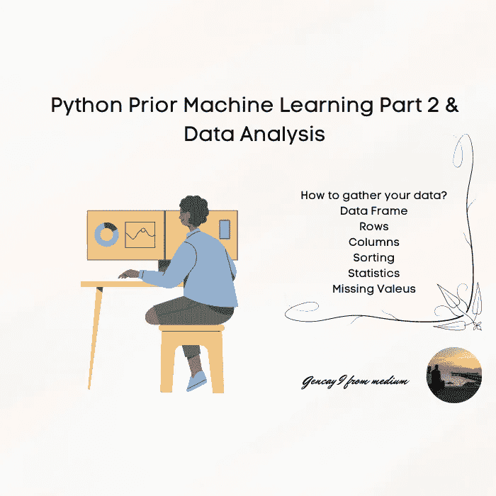

作者图片

```
**Content Table****·** [**Introduction**](#e5f3)  ∘ [Installation](#c05e)
**·** [**How to gather your data?**](#97bb)  ∘ [Example](#b94a)
· [**How long your data frame is? What are the column data types? How can I look at a little bit of my data?**](#bfc2)
  ∘ [Info](#ef8a)
  ∘ [Shape](#6453)
  ∘ [Sample](#7d88)
  ∘ [Head](#50dd)
  ∘ [Tail](#a2cd)
  ∘ [Describe](#3f42)
  ∘ [Value Counts](#297c)
· [**How to select your pre-defined row?**](#7b04)
· [**How to select multiple columns?**](#ad42)
  ∘ [First Two Columns](#adfe)
  ∘ [Select Columns with Name](#00c5)
  ∘ [Select Column with their Indexes](#768a)
· [**How can I sort the values?**](#2990)
· [**How can I look at the mean/standard deviation/max of one column per its categories?**](#652e)
· [**How can I drop the NA Values?**](#b67e)
· [**Conclusion**](#492f)
```

# 介绍

Hi 来自另一个机器学习教程。我想在这里给你们简单解释一下，认真思考一下，我该怎么简单解释呢？文章看多了可能对我有帮助。我想向你们解释熊猫图书馆的问题和它们的答案。

## 装置

现在让我们开始安装过程。

这是熊猫的[图书馆的主页。](https://pandas.pydata.org/)

Pip 或 conda，这将取决于您的设置。

```
pip install pandas
conda install pandas
```

现在是时候导入您的包了。

```
import pandas as pd
```

# 如何收集你的数据？

现在是时候下载你的数据了。

CSV 是你处理熊猫时最常用的文件类型。

```
url = " " 
col = 
df = pd.read_csv(“”)
```

*   您将下载数据的 URL。
*   要选择查看的列。
*   将数据框定义为 df。

这里是这个方法的文档，你可以看到下面的[代码。](https://pandas.pydata.org/docs/reference/api/pandas.read_csv.html)

## 例子

现在让我们看看现实生活中的例子。

Iris 数据集非常有名，你可以通过 sklearn 数据集模块或 seaborn 或通过 URL 下载。

> 这可能是模式识别文献中最著名的数据库。费希尔的论文是该领域的经典，至今仍被频繁引用。(例如，见杜达&哈特。)数据集包含 3 类，每类 50 个实例，其中每类涉及一种鸢尾植物。一个类与另一个类是线性可分的；后者彼此不是线性可分的。
> 
> 预测属性:鸢尾类植物。

下面是这个[数据集](https://archive.ics.uci.edu/ml/datasets/iris)的其余细节。

现在，让我们在数据集中实现我们的代码；

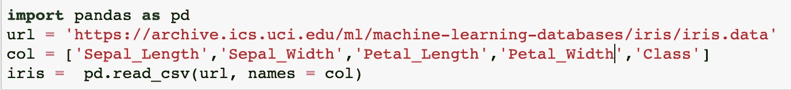

作者图片

# 你的数据帧有多长？什么是列数据类型？我怎样才能看到我的一点点数据？

## 信息

它将为您的列提供数据类型。

```
df.info()
Your column data types.
```

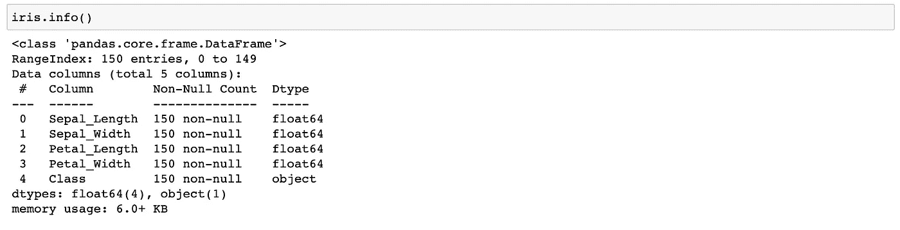

作者图片

## 形状

它会从你的数据框中给出尺寸。

```
df.shape()
Shape of your df.
```

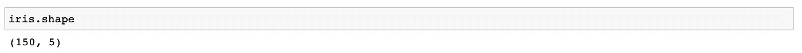

作者图片

## 样品

它会从你的数据框中随机抽取“n”个样本。

```
df.sample(5)
5 random samples of your df
```

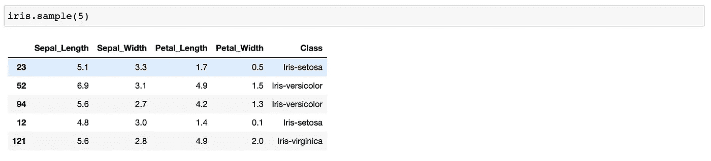

作者图片

## 头

查看数据框的前“n”行。

```
df.head(5)
Looking first 5 rows of your df.
```

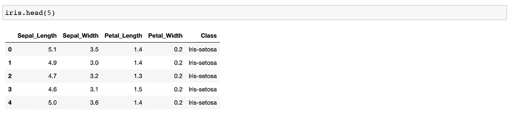

作者图片

## 尾巴

查看数据框的最后“n”行。

```
df.tail(5)
Looking last 5 rows of your df.
```

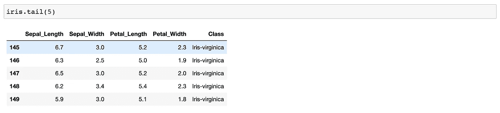

作者图片

## 形容

显示数字特征的摘要。

```
df.describe()
Shows a summary of a numerical features.
```

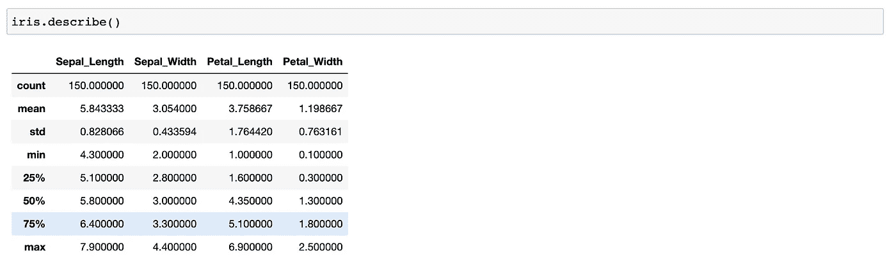

作者图片

## 值计数

查看您的分类列类型。

```
df["Column"].value_counts()
Looking this values data types.
```

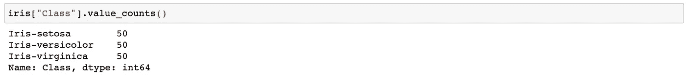

作者图片

# 如何选择预定义的行？

通过使用 loc 方法。

现在您只想查看 Iris-virginica 舱位和 Iris-virginica 舱位。

除此之外，如果你希望你的萼片长度大于 5，花瓣长度小于 5，那么你的代码就会是那样的；

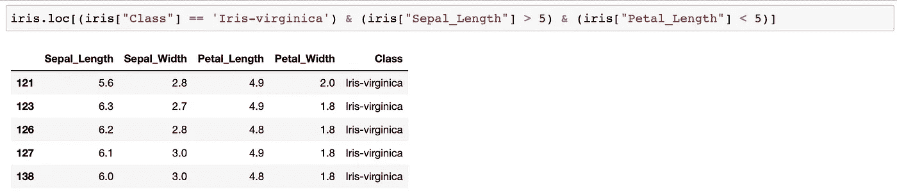

作者图片

# 如何选择多列？

## 前两列

现在首先“:”表示所有行，0:2 表示从第一列开始，从第三列结束，但不选择第三列。

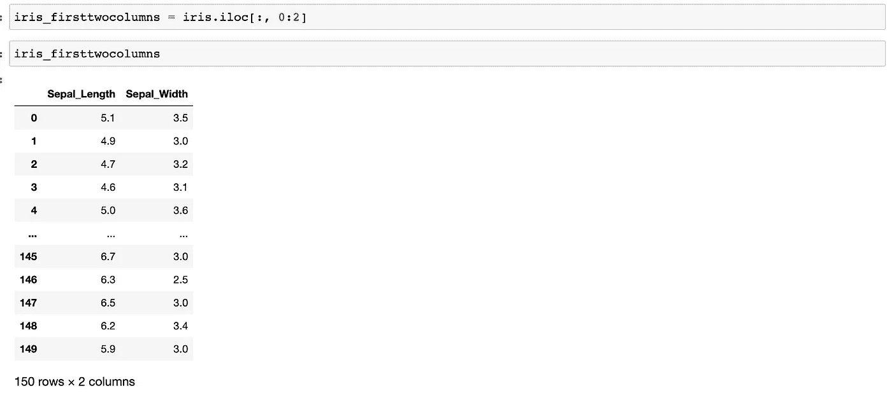

作者图片

## 选择具有名称的列

通过使用两个括号。

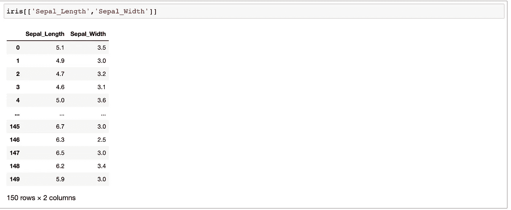

作者图片

## 选择列及其索引

通过使用索引方法选择第一列和第三列；

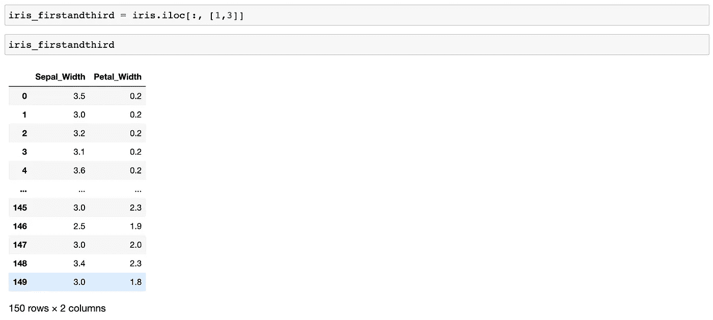

作者图片

# 如何对值进行排序？

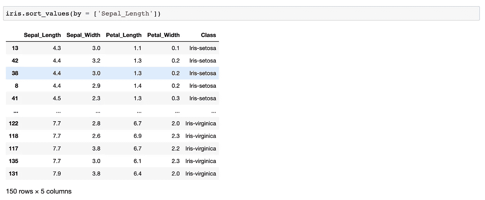

作者图片

*   by =要排序的列

如果您希望该顺序不同，则应该添加以下参数:

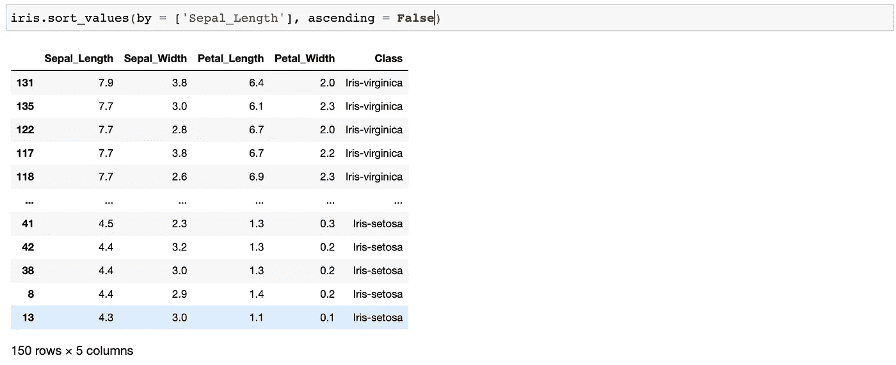

作者图片

更多信息，请访问[此处](https://pandas.pydata.org/docs/reference/api/pandas.DataFrame.sort_values.html)

# 如何查看每一列类别的平均值/标准偏差/最大值？

现在，如果你想成为一名优秀的程序员，你应该从今天开始阅读文档。

下面是解释；

> group by 操作涉及拆分对象、应用函数和组合结果的某种组合。这可用于对大量数据进行分组，并对这些组进行计算操作。

你可以查找这个方法的论据，访问这里的[并开始阅读这个图书馆的文件。](https://pandas.pydata.org/docs/reference/api/pandas.DataFrame.groupby.html?highlight=groupby#pandas.DataFrame.groupby)

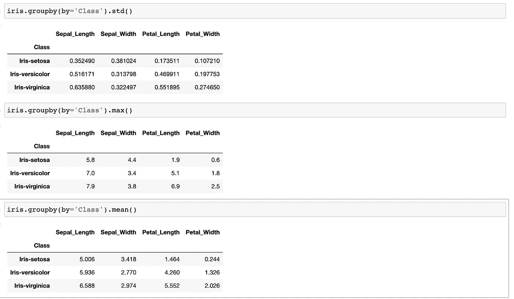

# 如何降低 NA 值？

现在有太多的方法可以做到这一点。

如果数据集很小并且不想丢失数据，可以将列的平均值填充到 NA 值。

```
df.dropna()
```

现在，我不能给你一个真实的解释，因为我的数据集不包含 NA 值，但是，正如我前面提到的，阅读图书馆文件对你有好处。

在这里你可以找到其他的例子，官方的[文件](https://pandas.pydata.org/docs/reference/api/pandas.DataFrame.dropna.html)。

# 结论

我尽量简短。

虽然有太多其他方法可能在机器学习的旅程中帮助了你，但我认为这一先验知识将可以启动你的第一个机器学习模型。

除了所有这些，感谢你对我之前文章的支持，你的反应真的激励我继续写教程和文章。

如果你想在我即将发表的文章中通过电子邮件得到关注，请点击这里；

[](https://medium.com/subscribe/@geencay) [## 每当 Gencay I .出版时，就收到一封电子邮件。

### 每当 Gencay I .出版时，就收到一封电子邮件。注册后，如果您还没有，您将创建一个中型帐户…

medium.com](https://medium.com/subscribe/@geencay) 

事实上，我之前向你们提到过我为电子书所做的准备，在这本书中，我将计划向你们详细解释所有的概念，这次不是简单地解释，而是用现实生活中的解释和数据集。

> 机器学习是人类需要创造的最后一项发明。“尼克·博斯特罗姆

谢了。