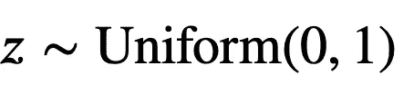
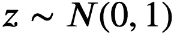
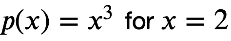
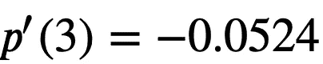
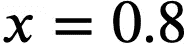
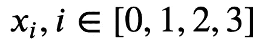

# PyTorch 教程 101

> 原文：<https://pub.towardsai.net/pytorch-basics-be7e7ac11603?source=collection_archive---------5----------------------->

## [编程](https://towardsai.net/p/category/programming)

Pytorch 是一个用于张量操作的 Python 框架，也可以用于机器学习。其主要特点包括

*   GPU 加速计算
*   自动微分
*   神经网络模块

本教程将教你操作 PyTorch 张量的基本原理。

有关其他教程，请参见[http://pytorch.org/tutorials/](http://pytorch.org/tutorials/)

我们还将使用用于科学计算的关键 python 模块 [numpy](http://www.numpy.org/) 。它为科学算法的分析和开发提供了数据结构和复杂的方法

```
import torch
import numpy as np
```

## 张量

张量是数组数据的基本对象。把它们想象成一个多维矩阵。您将使用的最常见类型是`IntTensor`和`FloatTensor`(这是默认类型)。

```
# Create uninitialized tensor of size (2,3)
x = torch.FloatTensor(2,3)
print(x)
# Initialize to zeros
x.zero_()
print(x)tensor([[1.7561e+22, 2.1230e-10, 2.2232e-10],
        [4.1585e+21, 2.6336e+20, 1.7732e+28]])
tensor([[0., 0., 0.],
        [0., 0., 0.]])# Create from numpy array (seed for repeatability)
np.random.seed(123)
np_array = np.random.random((2,3))
print(torch.FloatTensor(np_array))
print(torch.from_numpy(np_array))tensor([[0.6965, 0.2861, 0.2269],
        [0.5513, 0.7195, 0.4231]])
tensor([[0.6965, 0.2861, 0.2269],
        [0.5513, 0.7195, 0.4231]], dtype=torch.float64)# Create random tensor (seed for repeatability)
torch.manual_seed(123)
x=torch.randn(2,3)
print(x)tensor([[-0.1115,  0.1204, -0.3696],
        [-0.2404, -1.1969,  0.2093]])# special tensors (see documentation)
#Returns a 2-D tensor with ones on the diagonal and zeros elsewhere.
print(torch.eye(3)) 
#Returns a tensor filled with the scalar value 1, with the shape defined by the variable argument size.
print(torch.ones(2,3))
#Returns a tensor filled with the scalar value 0, with the shape defined by the variable argument size.
print(torch.zeros(2,3))
#Returns a 1-D tensor of size (end-start/step) with values in interval 0,1 with common difference of step.
print(torch.arange(0,3))tensor([[1., 0., 0.],
        [0., 1., 0.],
        [0., 0., 1.]])
tensor([[1., 1., 1.],
        [1., 1., 1.]])
tensor([[0., 0., 0.],
        [0., 0., 0.]])
tensor([0, 1, 2])
```

所有张量都有一个`size`和`type`

```
x=torch.FloatTensor(3,4)
print(x.size())
print(x.type())torch.Size([3, 4])
torch.FloatTensor
```

**例 1:** 我们将创建一个 10x10 的张量，其对角线范围从 0 到 9，所有其他元素都是 0

```
torch.diag(torch.arange(10))tensor([[0, 0, 0, 0, 0, 0, 0, 0, 0, 0],
        [0, 1, 0, 0, 0, 0, 0, 0, 0, 0],
        [0, 0, 2, 0, 0, 0, 0, 0, 0, 0],
        [0, 0, 0, 3, 0, 0, 0, 0, 0, 0],
        [0, 0, 0, 0, 4, 0, 0, 0, 0, 0],
        [0, 0, 0, 0, 0, 5, 0, 0, 0, 0],
        [0, 0, 0, 0, 0, 0, 6, 0, 0, 0],
        [0, 0, 0, 0, 0, 0, 0, 7, 0, 0],
        [0, 0, 0, 0, 0, 0, 0, 0, 8, 0],
        [0, 0, 0, 0, 0, 0, 0, 0, 0, 9]])
```

## 随机张量

我们可以从均匀分布中取样



```
nSamples = 10
z = torch.rand((nSamples))
print(z)tensor([0.0756, 0.1966, 0.3164, 0.4017, 0.1186, 0.8274, 0.3821, 0.6605, 0.8536,
        0.5932])
```

正态分布也是如此:



```
z = torch.randn((nSamples))
print(z)tensor([ 0.5490,  0.3671,  0.1219,  0.6466, -1.4168,  0.8429, -0.6307,  1.2340,
         0.3127,  0.6972])
```

**例 2:** 我们将创建一个 10×10 的随机张量，遵循平均值为 3 的正态分布

```
t = 3 + torch.randn((10,10))
ttensor([[2.5155, 0.9071, 2.1801, 2.5790, 2.0380, 4.2825, 3.8768, 4.6221, 2.0113,
         1.2982],
        [2.2502, 1.8715, 3.4135, 3.2892, 5.2473, 2.1964, 2.0867, 2.5796, 4.3111,
         2.7801],
        [3.2190, 3.2045, 3.5146, 3.9938, 3.8218, 3.1512, 3.1036, 0.8004, 2.9115,
         2.4388],
        [3.6716, 3.6933, 1.7215, 1.8560, 3.2436, 2.9433, 3.3784, 4.6863, 3.2553,
         2.4504],
        [2.0917, 3.3507, 4.5434, 3.1406, 4.0617, 2.0071, 1.3975, 1.9236, 3.4046,
         1.3539],
        [4.0720, 4.5026, 2.1810, 3.2686, 0.7850, 1.6807, 2.7099, 4.2767, 2.0052,
         4.2176],
        [2.7718, 4.3382, 4.9929, 4.3708, 1.9393, 0.6756, 4.2311, 1.9027, 2.0331,
         3.6712],
        [2.0595, 2.5319, 3.6455, 2.1043, 4.1124, 2.5832, 1.2894, 2.6710, 4.3966,
         2.0051],
        [1.7904, 2.4440, 0.2798, 3.5421, 3.6557, 1.5944, 1.7257, 3.4513, 2.7720,
         3.9224],
        [3.2056, 2.5030, 4.2782, 5.5501, 2.6982, 2.3297, 2.3829, 2.1666, 3.4839,
         2.8651]])
```

## 重塑张量

我们可以用`reshape`方法重塑张量:

```
z = torch.randn((12))
print(z)tensor([-1.7799,  0.6474,  0.5460,  0.8050, -1.3467, -0.6418, -0.1514, -2.4449,
        -0.0952,  0.5930, -1.6707,  0.1656])
```

如果我们想把 z 塑造成一个(3，4)张量，我们可以这样做:

```
y = z.reshape((3,4))
print(y)tensor([[-1.7799,  0.6474,  0.5460,  0.8050],
        [-1.3467, -0.6418, -0.1514, -2.4449],
        [-0.0952,  0.5930, -1.6707,  0.1656]])
```

我们还可以将-1 指定为应该自动填充的维度:

```
y = z.reshape((2,2,-1))
print(y)
print(y.shape)tensor([[[-1.7799,  0.6474,  0.5460],
         [ 0.8050, -1.3467, -0.6418]],

        [[-0.1514, -2.4449, -0.0952],
         [ 0.5930, -1.6707,  0.1656]]])
torch.Size([2, 2, 3])
```

`reshape`可以用指定的形状创建新的数据结构。然而，如果我们不想创建一个新的数据结构，而只是以不同的形式呈现数据(保持相同的底层数据表示)，我们可以使用`view`:

```
y = z.view((4,3))
print(y)tensor([[-1.7799,  0.6474,  0.5460],
        [ 0.8050, -1.3467, -0.6418],
        [-0.1514, -2.4449, -0.0952],
        [ 0.5930, -1.6707,  0.1656]])
```

**示例 3:** 生成 50 个训练样本的随机数据集(使用随机分布)，每个样本具有 3 个特征(大小为 50×3)。然后使用`view`方法将数据集分成 10 批，每批 5 个训练样本。

```
dataset = torch.rand((50,3))
batched = dataset.view((10,5,3))
batchedtensor([[[0.8118, 0.0585, 0.1142],
         [0.3338, 0.2122, 0.7579],
         [0.8533, 0.0149, 0.0757],
         [0.0131, 0.6886, 0.9024],
         [0.1123, 0.2685, 0.6591]],

        [[0.1735, 0.9247, 0.6166],
         [0.3608, 0.5325, 0.6559],
         [0.3232, 0.1126, 0.5034],
         [0.5091, 0.5101, 0.4270],
         [0.8210, 0.3605, 0.4516]],

        [[0.7056, 0.1853, 0.6339],
         [0.3894, 0.7398, 0.2288],
         [0.5185, 0.5489, 0.0977],
         [0.1364, 0.6918, 0.3545],
         [0.7969, 0.0061, 0.2528]],

        [[0.0882, 0.6997, 0.4855],
         [0.4067, 0.4168, 0.1092],
         [0.6418, 0.5125, 0.1549],
         [0.6881, 0.4900, 0.0164],
         [0.7690, 0.7674, 0.4058]],

        [[0.1548, 0.5201, 0.8773],
         [0.9577, 0.1226, 0.2742],
         [0.8893, 0.7444, 0.8095],
         [0.2511, 0.9308, 0.0890],
         [0.4759, 0.5104, 0.5840]],

        [[0.1227, 0.9587, 0.9914],
         [0.1547, 0.5185, 0.2337],
         [0.9794, 0.7788, 0.7945],
         [0.6613, 0.4502, 0.7815],
         [0.5085, 0.3176, 0.7582]],

        [[0.6569, 0.3704, 0.3630],
         [0.0578, 0.3629, 0.2974],
         [0.2275, 0.0484, 0.8916],
         [0.0532, 0.9964, 0.2377],
         [0.4616, 0.9079, 0.6650]],

        [[0.3573, 0.0975, 0.2956],
         [0.9027, 0.3112, 0.9167],
         [0.4139, 0.4362, 0.6996],
         [0.4265, 0.4958, 0.8463],
         [0.6671, 0.4801, 0.6904]],

        [[0.9355, 0.6260, 0.3534],
         [0.6638, 0.4563, 0.1091],
         [0.3069, 0.7274, 0.5164],
         [0.6845, 0.2073, 0.9727],
         [0.2913, 0.6066, 0.2557]],

        [[0.2588, 0.7239, 0.3604],
         [0.1829, 0.2956, 0.8646],
         [0.8010, 0.8044, 0.0733],
         [0.7355, 0.6248, 0.1638],
         [0.5158, 0.6000, 0.2299]]])
```

## CPU 和 GPU

张量可以在 CPU 和 GPU 之间复制。计算中涉及的所有内容都在同一台设备上，这一点很重要。

这在本教程中不适用，因为笔记本电脑没有 CUDA 兼容的 GPU。

PyTorch 使得使用 GPU 设备非常简单。你可以在这里了解更多。

## 数学、线性代数和索引

Pytorch 数学和线性代数类似于 NumPy。运算符被覆盖，因此您可以使用标准的数学运算符(`+`、`-`等)。)并期望一个张量作为结果。参见 [PyTorch 文档](https://pytorch.org/docs/stable/torch.htm)获取可用功能的完整列表。

```
x = torch.arange(0,5, dtype=torch.float)
print(torch.sum(x))
print(torch.sum(torch.exp(x)))
print(torch.mean(x))tensor(10.)
tensor(85.7910)
tensor(2.)
```

Pytorch 索引类似于 NumPy 索引。

```
x = torch.rand(3,2)
print(x)
print(x[1,:])tensor([[0.2890, 0.9078],
        [0.4596, 0.4947],
        [0.1836, 0.2010]])
tensor([0.4596, 0.4947])
```

**例 4:** 我们将使用例 2 中创建的随机张量来获取每一列的平均值。结果应该是大小为(1，10)的张量，每个列值对应于原始张量中相应列的平均值。

```
torch.mean(t,dim=0)tensor([2.7647, 2.9347, 3.0751, 3.3695, 3.1603, 2.3444, 2.6182, 2.9080, 3.0585,
        2.7003])
```

## 自动微分

象征性地计算导数可能非常耗时，在某些情况下还很棘手。

幸运的是，PyTorch 提供了一个简单的解决方案，叫做 autogradated(自动渐变)。

*   你正在区分的张量是必备的`requires_grad=True`
*   在变量上调用`.backward()`，你在求微分

对于 PyTorch 的早期版本，我们需要使用`torch.autograd.Variable`类来区分张量。在 PyTorch 1.0 之后，我们可以在创建需要微分的张量时简单地使用`requires_grad=True`参数。或者，我们可以使用就地操作`requires_grad_()`

例如，让我们计算一个简单多项式的导数:



从微积分中，我们知道


使用 PyTorch 可以获得相同的结果:

```
#Creates tensor explicitely saying that gradients are required
x = torch.tensor([2.], requires_grad=True)

#Calculate a scalar function of the variable
p = x**3

#Backward pass on p to calculate gradient w.r.t. all variables
p.backward()

#Acessing the derivative on x variable
x.gradtensor([12.])
```

对于更复杂的函数，我们也可以这样做:


```
x = torch.tensor([3.], requires_grad=True)
p = torch.exp(torch.cos(x))
p.backward()
x.gradtensor([-0.0524])
```

我们得到了



而不必显式地计算导数。

**例 5:** 我们将计算的导数



使用 PyTorch 自动签名功能

```
x = torch.tensor([0.8], requires_grad=True)
p = torch.sin(torch.log(x))
p.backward()
x.gradtensor([1.2190])
```

前面的例子使用了单个变量的函数，但是我们可以很容易地处理多个变量的函数:

例如，函数



注意，x 被初始化为向量


```
# Create variable
x = torch.arange(10,14, dtype=torch.float)

# Set requires_grad to True
x.requires_grad_()

# Calculate y=sum(x**2)
y = torch.sum(x**2)
# Calculate gradient (dy/dx=2x)
y.backward()
# Print values
print(x,y,x.grad)
print(y)
print(x.grad)tensor([10., 11., 12., 13.], requires_grad=True) tensor(534., grad_fn=<SumBackward0>) tensor([20., 22., 24., 26.])
tensor(534., grad_fn=<SumBackward0>)
tensor([20., 22., 24., 26.])
```

微分累积梯度。这有时是你想要的，有时不是。**如果执行 SGD，请确保批次之间的梯度为零，否则会得到奇怪的结果！**

```
# Create a variable
x=torch.arange(10,14, dtype=torch.float, requires_grad=True)
# Differentiate
torch.sum(x**2).backward()
print('First gradient')
print(x.grad)

# Differentiate again (accumulates gradient)
torch.sum(x**2).backward()
print('Second gradient without zeroing gradients')
print(x.grad)

# Zero gradient before differentiating
x.grad.data.zero_()
torch.sum(x**2).backward()
print('Gradient after zeroing')
print(x.grad)First gradient
tensor([20., 22., 24., 26.])
Second gradient without zeroing gradients
tensor([40., 44., 48., 52.])
Gradient after zeroing
tensor([20., 22., 24., 26.])
```


来源:[谷歌图片](https://images.app.goo.gl/nR2ev3H7vZCJ9d729)我的清晨散步；)

最初，我是一名机械工程师，但一直对数学和人工智能充满热情，后来我在这两个领域都找到了理想的职业，成为一名数据科学家。我热衷于将这些学科的严谨性应用于复杂的分析问题。我热爱教学，我兼职辅导 A-Level 数学、物理和化学。我也是一个受自然启发的优化爱好者(查看我的 [*发表的 pape*](https://www.researchgate.net/publication/317803017_An_Experimental_Study_on_Competitive_Coevolution_of_MLP_Classifiers) *r)和一个板球和网球的超级粉丝。在*[*LinkedIn*](https://www.linkedin.com/in/rahullalchandani-)*上找我！*