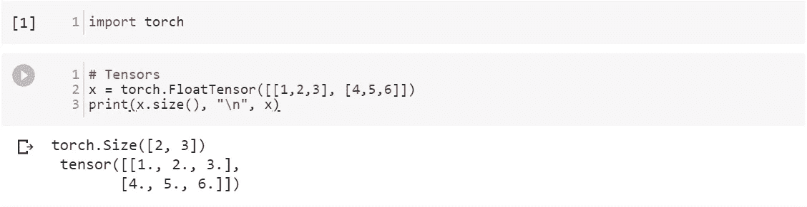
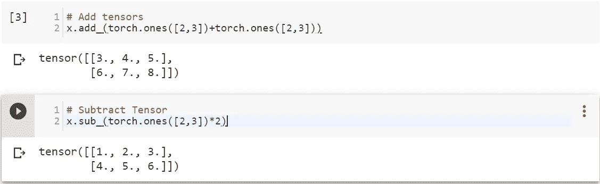
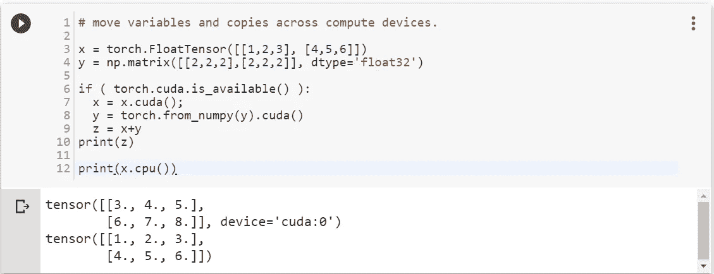
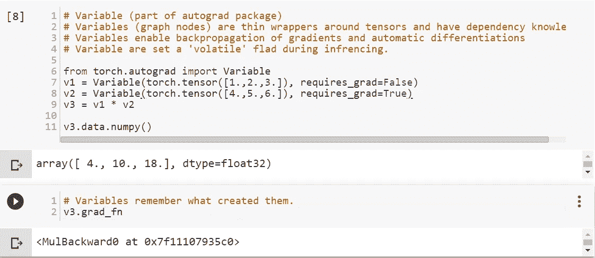
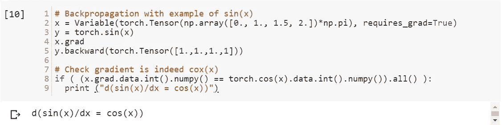
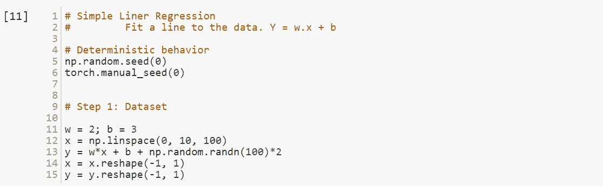
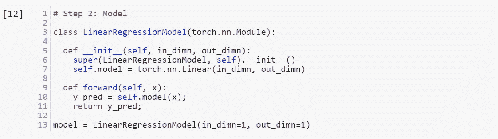
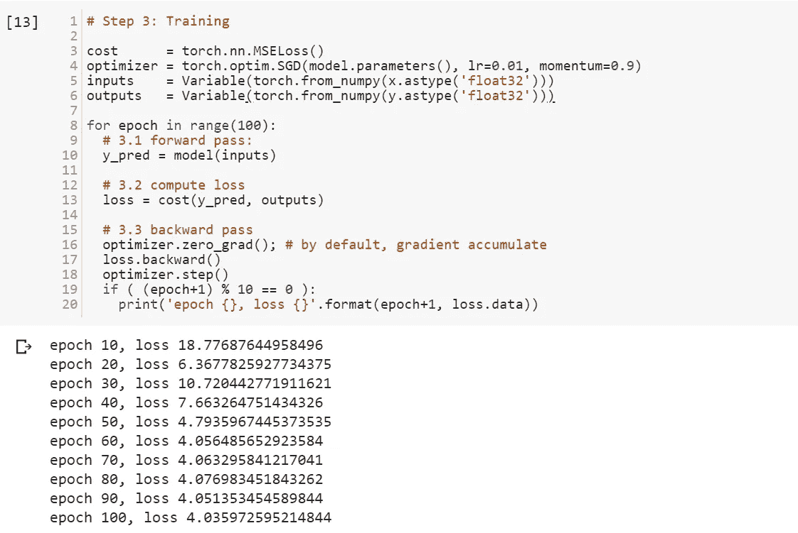
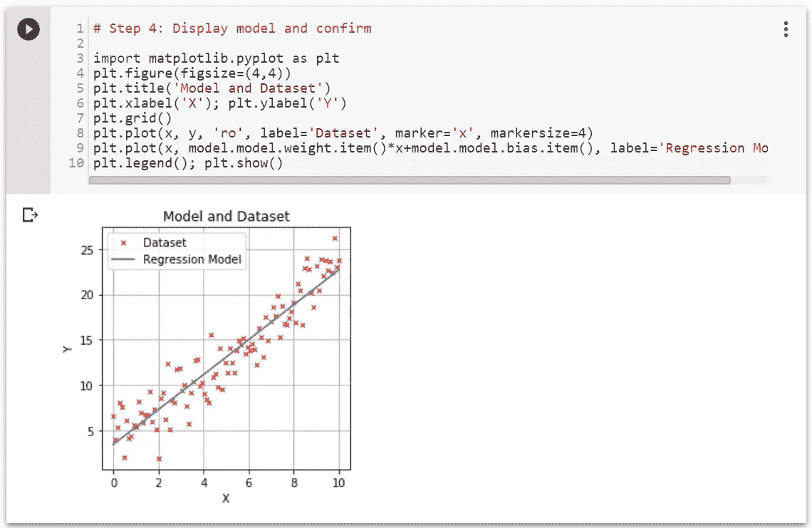

# PyTorch 的 ABC 在 4 分钟内

> 原文：<https://pub.towardsai.net/pytorch-in-2-minutes-9e18875990fd?source=collection_archive---------0----------------------->

## PyTorch 101 | [向着艾](https://towardsai.net)

## 用四分钟介绍 PyTorch 的基础知识，并附有示例代码

www.ai-techsystems.com AITS

这篇文章通过用 python 编写的代码，帮助新手在 2 分钟内开始使用 python PyTorch。对于那些不知道 [PyTorch](https://pytorch.org/) 是什么的人来说，它是一个来自[脸书](https://ai.facebook.com/tools/pytorch/)的开源深度学习平台，提供了从研究原型到生产部署的无缝路径。

事不宜迟，让我们直入主题吧。

# **张量**

它是一个多维矩阵，包含单一数据类型的元素，声明为

# **操作**

PyTorch 包含许多关于张量的数学运算。此外，它提供了许多有效序列化张量和任意类型的实用程序以及其他有用的实用程序。这里有一个张量加减的例子。

# **PyTorch 和 NumPy**

人们可以很容易地在 PyTorch 和 NumPy 之间往返。下面是一个将 np.matrix 转换为 PyTorch 并将维度更改为单列的简单示例

这里有一个有用的 [GitHub repo](https://github.com/wkentaro/pytorch-for-numpy-users) 概述 PyTorch < - > numpy 转换。

# **CPU 和 GPU**

PuTorch 允许你的变量用一个`[torch.cuda.device](https://pytorch.org/docs/stable/cuda.html#torch.cuda.device)`上下文管理器动态地改变设备。下面是示例代码:

# **PyTorch** 变量

一个**变量**只不过是一层薄薄的东西，包裹着张量。它支持几乎所有由张量定义的 API。变量被巧妙地定义为[亲笔签名包](https://pytorch.org/docs/stable/autograd.html)的一部分。它提供了实现任意标量值函数的自动微分的类和函数。

下面是 PyTorch 变量用法的一个简单示例:

# 反向传播

反向传播算法用于计算损失相对于输入权重和偏差的梯度，以在下一次优化迭代中更新权重，并最终减少损失。PyTorch 很聪明，在变量上分层定义了一个*向后*方法来执行反向传播。

这是一个反向传播计算微分的简单例子，以 sin(x)为例

# **单反:简单线性回归**

现在，我们已经收集了所有弹药，可以开始使用带有[简单线性回归](https://en.wikipedia.org/wiki/Simple_linear_regression)问题的机器学习示例。我们将通过 4 个简单的步骤来实现:

## 单反:第一步

在第一步中，我们创建一个人工数据集，该数据集是通过注入随机误差的方程 *y=w.x+b* 创建的。请参见下面的示例:

## 单反:第二步

在第 2 步中，我们定义了一个简单的类 *LinearRegressionModel* ，使用方法 forward 和构造器 [*torch.nn.Linear*](https://pytorch.org/docs/stable/_modules/torch/nn/modules/linear.html) 对输入数据进行线性转换

## 单反:第三步

下一步是用[*ms loss*](https://pytorch.org/docs/stable/_modules/torch/nn/modules/loss.html)*作为*成本函数，用 [*SGD*](https://pytorch.org/docs/stable/_modules/torch/optim/sgd.html) 作为优化器来训练模型。

## 单反:第四步

现在培训已经完成，让我们来目视检查我们的模型。

有很多东西需要学习，所以从这里展示的代码开始使用 [python 笔记本](https://github.com/srohit0/ML-Misc/blob/master/ABCs_Of_PyTorch.ipynb)。随意换，开始玩 PyTorch。

 [## PyTorch _ 概述

### 链接到包含本文中使用的示例代码的整个笔记本…

人工智能技术系统](https://cainvas.ai-tech.systems/notebooks/details/?path=rohit/Scholar%20Modules/M4%20Frameworks/PyTorch/PyTorch_Overview.ipynb) 

玩得开心。👍

# 参考资料:

1.  解说视频—[https://youtu.be/drwrMiARTQ4](https://youtu.be/drwrMiARTQ4)
2.  笔记本网址—[https://cainvas.ai-tech.systems/notebooks/details/?path = rohit/Scholar % 20 modules/M4 % 20 frameworks/py torch/py torch _ overview . ipynb](https://cainvas.ai-tech.systems/notebooks/details/?path=rohit/Scholar%20Modules/M4%20Frameworks/PyTorch/PyTorch_Overview.ipynb)
3.  [PyTorch.org](https://pytorch.org/)
4.  [深度学习的 Hello World](https://medium.com/predict/hello-world-of-deep-learning-891f37a53c88)
5.  [设计自动化中的机器智能](http://amzn.to/2paZ53b)
6.  [为 EDA 软件设计您的神经网络](https://www.linkedin.com/pulse/design-your-neural-network-eda-software-rohit-sharma/)