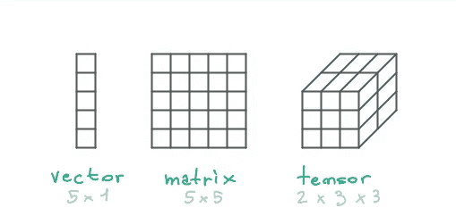
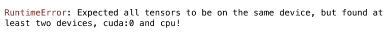
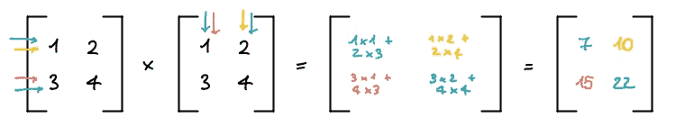
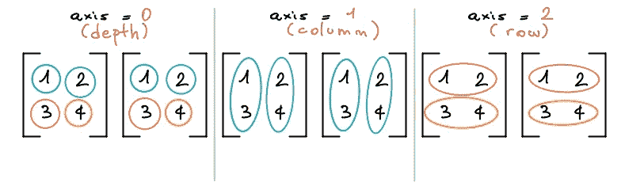
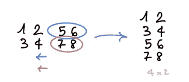
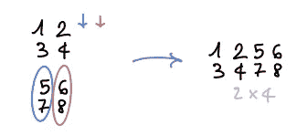
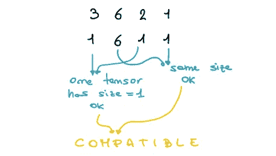
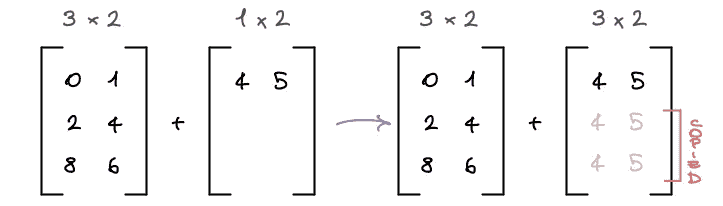

# PyTorch 入门包

> 原文：<https://pub.towardsai.net/pytorch-starter-pack-97cc5b72a4f2?source=collection_archive---------1----------------------->

## 动手深度学习

## PyTorch 中的数据操作


图片由 DALL E 2 生成图片来源: [OpenAI](https://openai.com/)

> PyTorch 是一个开源的机器学习和深度学习框架，最初由 *M* eta AI 开发，现在是 Linux 基金会的一部分。

PyTorch 正在迅速成为所有其他深度学习框架中的绝对赢家。它是开源的，非常容易学习和调试，支持 CPU 和 GPU 以及数据并行，旨在为深度神经网络实现提供良好的灵活性和高速度。对于任何对计算机视觉、自然语言处理或强化学习感兴趣的人来说，这是一个必不可少的工具。

本文将向您介绍 PyTorch 的基本概念，重点是如何使用它来操作数据。

如果你是初学者，从这里开始将为你未来的工作打下基础。

如果你已经熟悉神经网络，这篇文章将帮助你温习基本原理和底层数据交互，以便更好地理解处理它们时发生的自动化。

## 概述

*   [张量](#3bfb)
*   [创建张量](#f32c)
*   [张量元数据](#04e7)
*   [张量运算](#44cf)
*   [处理张量维度](#a55a)
*   [分度](#719b)
*   [广播](#f300)
*   去 NumPy 旅游然后回来

# 张量

> 张量，到处都是张量！

张量是 PyTorch 和机器以及一般深度学习中的中心数据结构。

我们可以天真地说张量是多维矩阵，就像矩阵可以被认为是多维向量一样。事实上，向量是一阶张量(一维)，而矩阵是二阶张量(二维)。

张量用于以数字形式表示图像、视频等数据。例如，我们可以用一个形状为`[3, 224, 224]`的张量来表示一幅图像:3 个颜色通道，高度和宽度为 224 像素。



图像 1 矢量、矩阵、张量

# 创建张量

一个简单的`torch.Tensor`对象可以通过多种方式创建。最直接的选择是定义它将包含的确切数据。我们必须首先导入 PyTorch:我们现在就这样做，把它留到下一个代码块中。

```
import torch

scalar = torch.tensor(3) # 0 dimensions
vector = torch.tensor([1, 2]) # 1 dimension
matrix = torch.tensor([[1, 2], [3, 4]]) # 2 dimensions
tensor = torch.tensor([[[1, 2], [3, 4], [5, 6]]]) # 3 dimensions
```

在上面的例子中，我们定义了一个三维张量，尽管它可以是任何 n 维数组。

深度学习经常需要创建大型张量，决定每个元素的确切值可能不是最佳选择。相反，深度学习模型通常从随机值张量开始，并在训练过程中调整这些值。因此，PyTorch 包含了一个有用的特性:

**随机张量**

定义一个随机张量的时候，只需要关注大小就可以了。

```
random = torch.rand(size=(3, 224, 224))
```

你刚刚创建了一个形状为`[3, 224, 224]`的张量。

`torch.rand`从*均匀分布*、*、*返回一个带有随机数的张量，其中每个结果的概率是相同的，`torch.randn`非常相似，但使用*标准正态分布*作为采样间隔:这在现实世界的应用中非常有用，因为这种分布代表了各种各样的现象。

**零、一张量**

除了创建随机张量之外，你可以用类似的方式创建*零*或*一*唯一张量。这可能是特别有用的，而做一些掩蔽任务。语法与随机张量的语法相同。

```
zeros = torch.zeros(size=(3, 224, 224))
ones = torch.ones(size=(3, 224, 224))
```

**距离张量**

你也可以创建一个包含一系列数字的张量，就像在 Python 中一样。基本语法是`torch.arange(start=0, end, step=1)`，唯一需要的参数是`end`。

```
zero_to_ten = torch.arange(start=0, end=10, step=1)
zero_to_ten = torch.arange(10) # same result, exploiting default keyword args
```

**张量像**

最后但同样重要的是，可以创建一个与另一个张量形状相同的张量。

```
random_like = torch.rand_like(input=zero_to_ten)
zeros_like = torch.zeros_like(input=zero_to_ten)
ones_like = torch.ones_like(input=zero_to_ten)
```

这将创建一个随机张量，一个充满了*个 0*，另一个充满了*个 1*，它们都具有形状`[10]`。

# 张量元数据

除了存储在张量中的数据，它还保存额外的属性。以下是数据操作中最重要和最广泛使用的:

*   `dtype`
*   `device`
*   `shape`

**数据类型**

张量的数据类型由`torch.dtype`属性表示。PyTorch 中有许多不同的数据类型，每种类型在特定的上下文和最终目的中都更好。

最流行和默认的类型是`torch.float32`或`torch.float`，也称为 32 位浮点。还有 16 位浮点`torch.float16`或`torch.half`和 64 位浮点`torch.float64`或`torch.double`。还有许多表示整数的类型等等。

这种多样性有助于根据您的性能和精度要求确定正确的精度水平。

```
# Default dtype
some_tensor = torch.rand(size=(3, 4))
some_tensor.dtype

>>> torch.float32

# Explicit dtype
some_tensor = torch.rand(size=(3, 4), dtype=torch.half)
some_tensor.dtype

>>> torch.float16
```


图 2 数字精度权衡

**装置**

`torch.device`指定张量被分配到的设备。在 PyTorch 中，数据可以存储在 CPU 或 CUDA 内存(GPU)中。只有当 GPU 在您的系统上可用时，您才能在 GPU 上移动张量。

```
# Default device
some_tensor = torch.zeros(size=(5, 5))
some_tensor.device

>>> device(type='cpu')

# Explicit device
some_tensor = torch.zeros(size=(5, 5), device=torch.device('cuda:0'))
some_tensor.device

>>> device(type='cuda', index=0)
```

重要的是要记住，不同设备上的张量之间的运算是不可能的。否则，您会看到类似这样的内容:



图 3 py torch 运行时错误:张量位于不同设备上时的操作

**形状**

`torch.shape`表示张量的形状。例如，这是我们之前创建随机张量时作为`size`传递的值。

```
some_tensor = torch.zeros(size=(2, 3))
some_tensor.shape

>>> torch.Size([2, 3])
```

# 张量运算

在深度学习应用中，从基本观点来看，模型通过对张量执行一系列操作来学习。其中包括:

*   基本运算:加、减、积、除
*   矩阵积
*   点积
*   聚合运算:min，max，argmin，argmax，mean，sum

**基本操作**

基本操作是基于元素的。您可以直接使用运算符或内置方法；结果是一样的。

```
some_tensor = torch.tensor([1, 2, 3])

# Addition
some_tensor + 10
torch.add(some_tensor, 10)

>>> tensor([11, 12, 13])

# Subtraction
some_tensor - 10
torch.sub(some_tensor, 10)

>>> tensor([-9, -8, -7])

# Product
some_tensor * 10
torch.mul(some_tensor, 10)

>>> tensor([10, 20, 30])

# Division
some_tensor / 2
torch.div(some_tensor, 2)

>>> tensor([0.5000, 1.0000, 1.5000])
```

值得注意的是，张量值不会原地改变。要更新张量值，需要将结果重新分配给张量本身，如下所示:

```
some_tensor = some_tensor + 10
```

这些操作也可以在两个张量之间进行；在这种情况下，它们必须具有相同的形状。

```
some_tensor = torch.tensor([1, 2, 3])
another_tensor = torch.tensor([1, 2, 3])
some_tensor + another_tensor

>>> tensor([2, 4, 6])
```

两个张量的元素乘积，也称为 *Hadamard 乘积*，总是保持张量的形状。所有其他基本操作也保持张量形状。

**矩阵乘积**

矩阵乘积是线性代数以及深度学习中众所周知的特定运算，因为它是最常见的运算之一。

它可以由专门的操作员或使用内置方法来执行。

执行矩阵乘积时的主要规则是内部尺寸必须始终匹配:`torch.Size([1, 2]) @ torch.Size([2, 1])`将起作用，因为在两种情况下内部尺寸都是 2。是的，`@`是矩阵乘积算子。结果张量形状将是最外面的维度:在上面的场景中，它将是`torch.Size([1, 1])`。

```
some_tensor = torch.tensor([[1, 2], [3, 4]])
another_tensor = torch.tensor([[1, 2], [3, 4]])

# 3 ways to write the same operation
torch.matmul(some_tensor, another_tensor)
torch.mm(some_tensor, another_tensor)
some_tensor @ another_tensor

>>> tensor([[ 7, 10],
            [15, 22]])
```



图 4 矩阵产品

**点积**

点积只适用于 1D 张量。它只是两个向量的元素乘积之和。

方法是`torch.dot(input, other)`。

```
some_tensor = torch.tensor([2, 3])
another_tensor = torch.tensor([2, 1])

torch.dot(some_tensor, another_tensor)

>>> tensor(7)
```

点积的结果总是标量。当在两个一维张量上调用矩阵乘积时，也执行点积:如果你试图在两个 1D 向量上单独执行矩阵乘积，你应该注意到你也在写点积。

**聚合操作**

聚合操作是一种特殊类型的操作，在这种操作中，可以从更多项到更少项，有时是标量。

```
# Defining the tensor
some_tensor = torch.arange(0, 20, 2)
some_tensor

>>> tensor([ 0,  2,  4,  6,  8, 10, 12, 14, 16, 18])

# Min
some_tensor.min()
>>> tensor(0)

# Max
some_tensor.max()
>>> tensor(18)

# Argmin (position of the smaller value)
some_tensor.argmin()
>>> tensor(0)

# Argmax (position of the bigger value)
some_tensor.argmax()
>>> tensor(9)

# Mean
some_tensor.type(torch.float32).mean() # The float datatype is required
>>> tensor(9.)

# Sum
some_tensor.sum()
>>> tensor(90)
```

还可以定义执行聚合的轴。以 sum 为例:

```
some_tensor = torch.tensor([[[1, 2], [3, 4]], [[1, 2], [3, 4]]])
some_tensor

>>> tensor([[[1, 2],
            [3, 4]],

           [[1, 2],
            [3, 4]]])

some_tensor.sum(axis=0)
>>> tensor([[2, 4],
            [6, 8]])

some_tensor.sum(axis=1)
>>> tensor([[4, 6],
            [4, 6]])

some_tensor.sum(axis=2)
>>> tensor([[3, 7],
            [3, 7]])
```

我们也可以直观地看到:



图 5 一个轴上的总和

作为一个容易记住哪个维度将被减少的技巧，你可以看一下`torch.Size()`:在 3D 张量的情况下，第一个数组值(`[0]`)与深度相关，因此`axis=0`将在这个维度上减少，其他维度也是如此。

值得注意的是轴的选择如何总是让输出失去这个轴。这种行为可以通过在函数调用中指定关键字`keepdim=True`来避免。

您甚至可以使用相同的逻辑提供多个轴。

# 研究张量维度

那么，还有另一套张量运算。这些影响张量维数，而不是张量值本身。其中包括:

*   重塑
*   堆叠和连接
*   挤压和解除挤压

**整形**

`torch.reshape(input, shape)`允许改变张量的形状，而不改变元素的数量和它们的值。

```
some_tensor = torch.tensor([[1, 2], [3, 4]])
some_tensor.shape

>>> torch.Size([2, 2])

some_tensor = some_tensor.reshape(4, 1)
some_tensor.shape

>>> torch.Size([4, 1])
```

整形时，唯一的规则是元素的数量必须始终相同(参数的乘积必须与大小元素的乘积相匹配)。`numel()`方法是检查张量中元素数量的一种更快的方法。

```
some_tensor.numel()
>>> 4
```

**拼接和堆叠**

`torch.cat(tensors, dim=0)`和`torch.stack(tensors, dim=0)`方法非常相似，区分它们可能很有挑战性。

简而言之:

*   `cat`连接给定维度上的张量序列。
*   `stack`沿新维度连接一个张量序列。它**堆叠**它们。

```
some_tensor = torch.tensor([[1, 2], [3, 4]])
another_tensor = torch.tensor([[5, 6], [7, 8]])
```

我们刚刚创建了两个`2x2`矩阵。让我们看看它们是如何堆叠和连接在一起的。

```
# Concatenating along rows (dim=0)
torch.cat([some_tensor, another_tensor], dim=0)

>>> tensor([[1, 2],
            [3, 4],
            [5, 6],
            [7, 8]])
```

自己检查一下:第一个(0)形状值增加了。张量从 2 行变成了 4 行。

跨行串联可以视为在第一个矩阵下添加第二个矩阵中的行。



图 6 沿行串联

对于列也是如此:

```
# Concatenating along columns (dim=1)
torch.cat([some_tensor, another_tensor], dim=1)

>>> tensor([[1, 2, 5, 6],
            [3, 4, 7, 8]])
```

我们刚刚向第一个矩阵添加了列，这些列取自旁边的第二个矩阵。



图 7 沿列串联

这同样适用于任何 N 维张量序列。

堆叠机制有点复杂。

```
# Stacking along rows (dim=0)
torch.stack([some_tensor, another_tensor], dim=0)

>>> tensor([[[1, 2],
             [3, 4]],

            [[5, 6],
             [7, 8]]])
```

沿行堆叠相当于将第二个矩阵堆叠在第一个矩阵之后，增加了一个深度维度。

```
# Stacking along columns (dim=1)
torch.stack([some_tensor, another_tensor], dim=1)

>>> tensor([[[1, 2],
         [5, 6]],

        [[3, 4],
         [7, 8]]])
```

当`dim=1`过去后，事情变得一团糟。在这种情况下，原始矩阵列创建深度维度，然后新的张量堆叠在一起。

**挤压和解除挤压**

PyTorch 中的挤压用于*挤压*张量，移除尺寸为 1 的所有维度。

```
some_tensor = torch.tensor([[[1, 2, 3]]])
some_tensor.shape

>>> torch.Size([1, 1, 3])
```

张量`some_tensor`有两个*空*维度。让我们挤压它。

```
some_tensor = some_tensor.squeeze()
some_tensor.shape

>>> torch.Size([3])
```

也可以提供施加挤压的特定尺寸。实验一下，看看会发生什么。

取消挤压与挤压相反:它在指定位置插入一个大小为 1 的新尺寸。

```
some_tensor = some_tensor.unsqueeze(0)
some_tensor.shape

>>> torch.Size([1, 3])
```

# 索引

张量元素可以通过索引直接访问，就像任何其他 Python 列表一样。

不同维度的索引可以使用额外的方括号或逗号分隔。您可以使用特殊字符`:`来选择某个尺寸的所有值。

```
some_tensor = torch.tensor([[[1, 2], [3, 4]], [[11, 22], [33, 44]]])
some_tensor.shape

>>> torch.Size([2, 2, 2])

# Only the first element in depth, all rows, and all columns
some_tensor[0, :, :]

>>> tensor([[1, 2],
            [3, 4]])

# First row and first column, complete depth
some_tensor[:, 0, 0]

>>> tensor([ 1, 11])
```

您还可以像在 Python 列表中一样，使用语法`from:to`给出一系列索引。

# 广播

广播是一种强大的机制，在执行元素操作时应该加以利用。

在对不同形状的张量执行元素运算时，广播开始发挥作用。

> 简而言之，如果 PyTorch 操作支持广播，那么它的张量参数可以自动扩展为相同的大小(无需复制数据)。

那么广播实际上是如何工作的呢？

1.  如果张量不共享相同的*秩*(轴的数量，如`torch.Tensor.ndim`所示)，则在较低秩张量的形状前加上 1，使得它们长度相同(输出`tensor.ndim`返回相同的数字)。
2.  检查张量是否在所有维度上都与**兼容。如果两个张量在一个维度上具有 **a)** 相同的大小，或者 **b)** 其中一个在该维度上的大小为 1，则称这两个张量在该维度上*相容。如果它们在所有维度上都兼容，那么它们可以一起播放。***

如果遵循这些规则，两个张量被认为是可广播的，那么对于每个维度，结果大小是两者之间的最大值。

如果一开始看起来有点困惑，不要担心；这是典型的。我们来看几个例子。

```
a = torch.rand(size=(3, 6, 2, 1))
b = torch.rand(size=(   6, 1, 1))
```

`a`和`b` *是可广播的*吗？

1.  他们不属于同一级别。`a`有 4 个维度，而`b`有 3 个维度。因此，我们必须在`b`形状前加上*和*，直到尺寸匹配。`b`形状变成了`([1, 6, 1, 1)]`。
2.  它们在所有维度上都兼容吗？



图 8 检查张量是否兼容

好吧！这两个张量是相容的。每个维度的最终大小将是两者之间的较大值:

```
(a * b).shape

>>> torch.Size([3, 6, 2, 1])
```

当一个轴上的一个张量的大小为 1，而另一个张量的大小大于 1 时，第一个张量的行为就好像它是沿着那个维度被复制的。



图 9 广播行为

复制第一行，这样得到的张量有 3 行，并且形状匹配。

正如我大学的教授曾经告诉我的那样，如果你是第一次研究这个概念，我建议你休息 24 小时，然后回来再读一遍。事情会变得更清楚。

# 往返于 NumPy

为了方便与 NumPy 交互，torch 提供了两种主要方法:

*   `torch.Tensor.numpy()`
*   `torch.from_numpy(ndarray)`

```
some_tensor = torch.ones(size=(2, 2))

# Going from PyTorch to NumPy
numpy_tensor = some_tensor.numpy()
numpy_tensor += 1

numpy_tensor
>>> [[2\. 2.]
     [2\. 2.]]

some_tensor
>>> tensor([[2., 2.],
            [2., 2.]])
```

因为张量和数组共享底层内存位置，所以对其中一个的更改会影响另一个。

```
# Going from NumPy to PyTorch
tensor_again = torch.from_numpy(numpy_tensor)
tensor_again += 1

tensor_again
>>> tensor([[3., 3.],
            [3., 3.]])

numpy_tensor
>>> [[3\. 3.]
     [3\. 3.]]
```

我真诚地希望你喜欢这篇文章。如果是这样，随时让我鼓掌或更多。

如果你有任何反馈，疑问，或建议，或者你只是想分享你的观点，请给我留下评论。

再见！

## 参考

*   [PyTorch 维基百科](https://en.wikipedia.org/wiki/PyTorch)
*   [PyTorch 文档](https://pytorch.org/docs/stable/index.html)
*   [学习 PyTorch](https://www.learnpytorch.io/)
*   [数量单据](https://numpy.org/doc/stable/user/index.html)

[](https://medium.com/@gabrielemattioli98/membership) [## 通过我的推荐链接加入 Medium-Gabriele matti oli

### 阅读 Gabriele Mattioli 的每一个故事(以及媒体上成千上万的其他作家)。您的会员费直接…

medium.com](https://medium.com/@gabrielemattioli98/membership)