# PyTorch 初学者教程

> 原文：<https://pub.towardsai.net/pytorch-tutorial-for-beginners-8331afc552c4?source=collection_archive---------0----------------------->

## [机器学习](https://towardsai.net/p/category/machine-learning)

## Pytorch 神经网络设计的基本概念综述

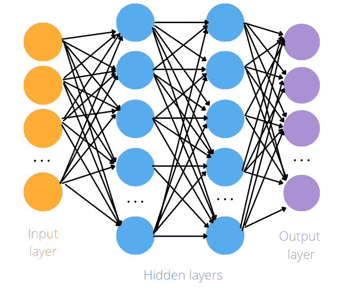

作者制作的图像

*这篇文章是 Pytorch 构建深度学习模型系列指南的第一篇。下面，是全系列:*

*第一部分:Pytorch 初学者教程(本帖)*

*第二部分:* [*操纵 Pytorch 数据集*](https://medium.com/mlearning-ai/manipulating-pytorch-datasets-c58487ab113f?sk=5d4cf7bd62d527d7c968b8db696b633f)

*第三部分:* [*了解 DL 模型中的张量维度*](/understanding-tensor-dimensions-in-deep-learning-models-with-pytorch-4ee828693826)

*第四部分:* [*CNN &特征可视化*](https://medium.com/dataseries/visualizing-the-feature-maps-and-filters-by-convolutional-neural-networks-e1462340518e)

*第五部分:* [*超参数调谐用 Optuna*](/tuning-pytorch-hyperparameters-with-optuna-470edcfd4dc)

*第六部分:* [*K 折交叉验证*](https://medium.com/dataseries/k-fold-cross-validation-with-pytorch-and-sklearn-d094aa00105f?sk=2466aaedc4e454b89f880a32604a2e0a)

*第七部分:* [*卷积自动编码器*](https://medium.com/dataseries/convolutional-autoencoder-in-pytorch-on-mnist-dataset-d65145c132ac)

*第八部分:* [*去噪*](https://ai.plainenglish.io/denoising-autoencoder-in-pytorch-on-mnist-dataset-a76b8824e57e)

*第九部分:* [*变型自动编码器*](https://medium.com/dataseries/variational-autoencoder-with-pytorch-2d359cbf027b)

本系列的目标是通过实现示例尽可能使 Pytorch 更直观、更容易理解。互联网上有许多教程可以使用 Pytorch 构建多种类型的具有挑战性的模型，但同时也会令人困惑，因为当您从一个教程转到另一个教程时，总会有轻微的差异。在这个系列中，我想从最简单的主题开始，到更高级的主题

# 介绍

Pytorch 是脸书人工智能研究实验室于 2016 年开发的深度学习框架。它以面向计算机视觉的应用而闻名。此外，它的特点是简单，强大的 GPU 支持，并实现了深度学习算法。由于这些特性，它也是学术研究中使用最多的图书馆之一。

网上有很多 Pytorch 教程，Pytorch 网站上也有很多文档。但是太多的信息会使人困惑，并且会浪费很多时间。我的目标是展示 Pytorch 中可用的基本函数和类的概述以及一些示例。在本教程中，我将简单直观地展示在开始构建神经网络之前需要了解的主题。

# 内容:

1.  [**张量**](#c495)
2.  [**矩阵乘法**](#d159)
3.  [**从 Pytorch 到 NumPy 反之亦然**](#f40a)
4.  [**辨于亲笔**](#72e7)
5.  [**单层神经网络**](#e95c) **k**
6.  [**简单神经网络**](#2a7f)

# 1.张量

一个**张量**是一个 Pytorch 对象，表示一个多维数组。的确，它类似于 NumPy 的数组。为了更好地理解构建张量的主要函数，我也将使用 Numpy 来举例，以说明逻辑是相同的。

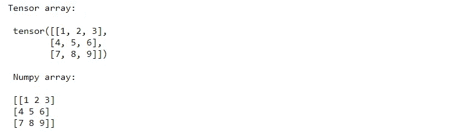

Numpy 和 Pytorch 使用许多相似的函数来创建矩阵:

*   `randn`创建随机矩阵
*   `zeros`构建充满零的矩阵
*   `ones`返回带有 1 的矩阵

构建单位矩阵的函数有一个例外。Pytorch 使用函数`eye`，而 NumPy 使用函数`identity`。

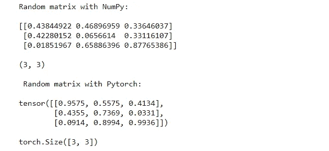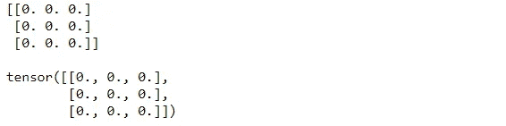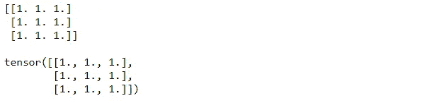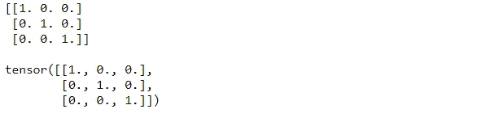

# 2.矩阵乘法

当训练神经网络的模型时，有许多矩阵乘法。我将展示两种乘法。

在 NumPy 中，函数`dot`和`matmul`用于两个矩阵之间的乘积。如果您想避开这些函数，也可以使用@操作符。

Pytorch 的功能`matmul`和 NumPy 一样。另一种可能是`torch.mm`功能。两者的区别在于 torch.mm 不支持广播。

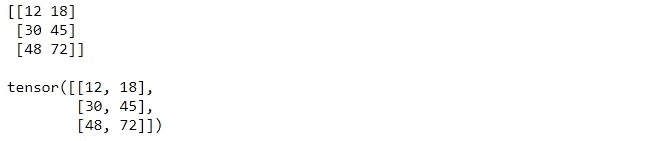

在逐元素乘法的情况下，NumPy 使用`multiply`，而 Pytorch 使用简单的操作符`*`

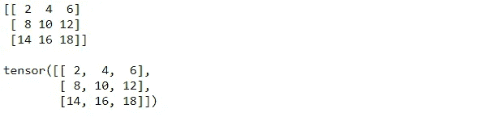

# 3.从 **Pytorch 到 NumPy，反之亦然**

Nupy 数组可以使用函数`from_numpy`转换成张量。通过功能`numpy`可以进行相反的操作。

# 4.亲笔签名的差异

导数构成了神经网络的一个基本方面。事实上，梯度下降算法使用导数来学习模型。该算法的目标是最小化损失函数 j。然后，参数的值将改变，直到我们没有获得 j 的最优值。该方法的著名更新规则是:

> w = w -学习率* dJ(w)/dw
> 
> b = b -学习率* dJ(b)/db

该规则将使学习更快或更慢，这取决于两个特征，即损失函数相对于所考虑的参数 w 或 b 的**学习速率**和**导数**。我想重点介绍导数的概念。

这是什么意思？

它代表一个函数的斜率。当导数的值很高时，函数快速变化，而当它接近 0 时，函数不变，这可能是神经网络环境中学习的一个问题。在这个例子中，我比较了直线、抛物线和双曲线。

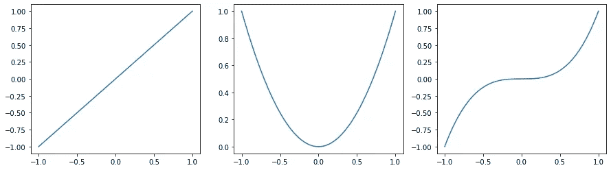

作者制作的图像

与抛物线和双曲线相比，直线具有较小的导数，而抛物线和双曲线具有较高的值。可以观察到，抛物线的值是直线值的 4 倍，而双曲线的值是抛物线值的 3 倍，所以变化比抛物线快 3 倍。

# 5.神经网络的单层

在神经网络中，数据集中的每个特征列表示为一个输入神经元，而每个加权值表示为一个从特征列到输出神经元的箭头。我们将这些特征乘以权重并求和，然后添加一个偏差并将其传递给激活函数。这样，我们获得了网络的输出。

例如，如果我们有一个 1 行 10 列的输入向量，我们将有 10 个神经元。

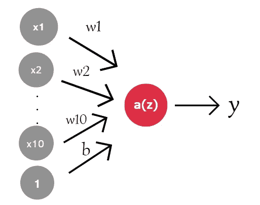

作者制作的图像

数学上，它看起来像:

> z = w₁ x₁ + … + w₁₀ x₁₀ + b
> 
> y = a(z) = a(w₁ x₁ + … + w₁₀ x₁₀ + b)

在代码中，我通过`matmul`函数创建了一个输入向量，它用于创建矩阵，矩阵中填充了均值为 0、方差为 1 的正态分布中的随机数。

加权矩阵将具有与输入相同的大小，但具有不同的值。偏差由正态分布的单个值组成。我们可以使用`matmul`在输入和权重之间进行矩阵乘法，然后我们可以应用激活函数`sigm`(称为 sigmoid)来映射 0 和 1 之间的任何值。

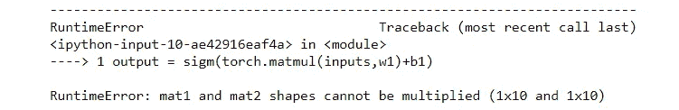

代码返回一个错误。当你训练一个神经网络时，出现这种错误是很常见的。这是因为**输入的列数不等于 w1** 的行数。为了解决这个问题，我们需要改变重物的形状。Pytorch 有三种方法可以做到这一点:

*   `w1.reshape(10,1)` 返回一个新的张量，其数据与 w1 相同，但形状为(10，1)
*   `w1.view(10,1)` 返回一个与 w1 数据相同，形状不同的新张量(10，1)。
*   `w1.resize_(10,1)`返回形状不同的**相同的**张量(10，1)

# 6.简单神经网络

现在，我们将研究神经网络的最简单模型，称为全连接网络。一层中的每个神经元都与下一层中的每个神经元相连。

下面考虑的架构有一个输出层、两个隐藏层和一个输出层。如前所述，我们使用函数`randn`获得输入、权重和偏差。我们不是只对一层进行计算，而是对每一层进行计算。

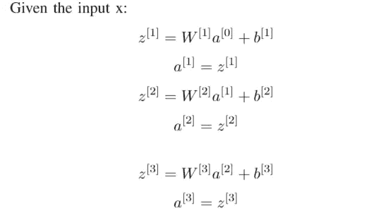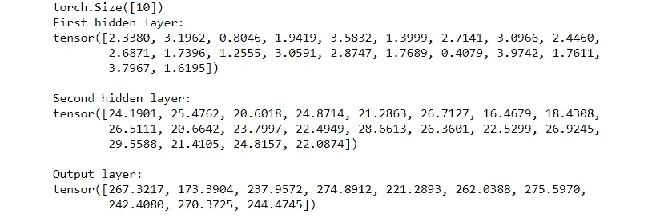

下面我将展示如何定义一个类，它定义了网络并继承自`nn.Module`。完全连接的层是通过`nn.Linear(in_features,ou_features)`构建的。第一个参数是输入单元的数量，而第二个参数是输出单元的数量。

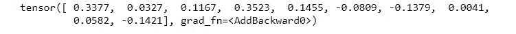

# **最终想法:**

我希望这篇教程通过一个概述帮助你更好地理解 Pytorch。

有时候编程时很容易阻塞，可能是因为有些东西不清楚，或者看得太快，没有时间好好记忆。这里的 GitHub 代码是[这里是](https://github.com/eugeniaring/Medium-Articles/blob/main/Pytorch/pytorch-for-beginners.ipynb)。

感谢阅读。祝您愉快！

你喜欢我的文章吗？ [***成为会员***](https://eugenia-anello.medium.com/membership) ***每天无限获取数据科学新帖！这是一种间接的支持我的方式，不会给你带来任何额外的费用。如果您已经是会员，*** [***订阅***](https://eugenia-anello.medium.com/subscribe) ***每当我发布新的数据科学和 python 指南时，您都可以收到电子邮件！***