# 量化分类器的性能

> 原文：<https://pub.towardsai.net/quantify-the-performance-of-classifiers-f73c33199631?source=collection_archive---------2----------------------->

在这篇文章中，我们将讨论下面的问题，并试图找到答案。

*   文章的题目是什么意思？
*   什么是混淆矩阵？
*   什么是准确度、精确度和召回率？
*   F1-score 是什么？
*   ROC 和 AOC 分别代表什么？
*   如何用 python 实现这些东西？

# 文章的题目是什么意思？

在机器学习中，在用训练数据集训练模型之后，我们现在必须用测试数据评估训练好的模型。在回归模型中，我们有不同的度量标准，如 R 平方得分、均方误差等。度量在回归问题中，精确度通常用实际值和预测值之间的差异来衡量。在分类问题中，使用所生成的混淆矩阵来测量模型的可信度，即预测真阳性和真阴性的准确程度。那么，现在让我们来理解混淆矩阵。

# 什么是混淆矩阵？

它是一个矩阵，用于评估任何分类器的性能。换句话说，混淆矩阵可视化并总结了分类算法的性能。让我们来做一个简单的二进制分类，然后混淆矩阵会看起来像下面的图片。

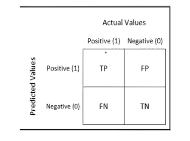

二元混淆矩阵

**真阳性(TP):** 被分类模型预测为阳性并且也是阳性的结果

**真阴性(TN):** 被分类模型预测为阴性并且也是阴性的结果

**假阳性(FP):** 分类模型预测为阳性但实际为阴性的结果

**假阴性(FN):** 被分类模型预测为阴性但实际为阳性的结果。

# 什么是精确度和召回？

## 精确度:

准确度可以说是定义为正确分类的总数除以分类的总数。

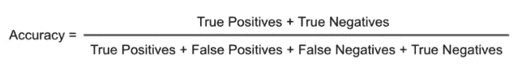

## 精度:

精确度是在所有积极的预测中，有多少实际上是积极的。

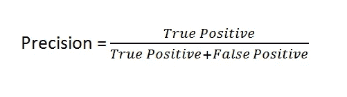

我们已经看到了公式和精度的定义，但为了更好地理解，让我们举个例子。假设我们有一个问题陈述，我们必须对一个人是否有罪进行分类。因此，在这种情况下，我们必须建立一个模型，专注于准确预测真正的阳性(即他/她有罪)。通过这样做，模型可能会丢失一些真正有罪的人。因为如果我们认为释放一个犯了罪的人比释放一个没有犯罪企图但被判有罪的人更好。因此，通过使用精度，我们可以测量模型如何在实际的阳性和假阳性中预测真阳性。

## 回忆:

召回率是对阳性结果总数和模型正确预测的阳性结果数量的衡量。它显示了该模型仅在正面结果方面的相关性。

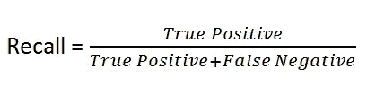

我们已经看到了回忆的公式和定义，但为了更好地理解，让我们举个例子。假设我们有一个问题陈述，我们必须对患者是否患有癌症进行分类。因此，在这种情况下，我们必须建立一个模型，专注于预测尽可能多的癌症患者。在这个过程中，该模型可能预测患者没有患癌症为真。但是，如果我们认为，预测一个患有癌症的患者比不预测一个实际上患有癌症的患者更好。

## 精确度和召回率之间的权衡

精确度和召回率显示了它们之间的一种奇怪的关系，就好像你想要达到精确度，那么模型的召回率就会下降，反之亦然。让我们举一个例子来想象一个场景，其中的要求是模型召回所有没有还贷的违约者。假设有 10 个这样的违约者，回想这 10 个违约者，模型给你 20 个结果，其中只有 10 个是真正的违约者。现在，模型的召回率是 100%，但准确率下降到 50%。

我们可以在下图中观察到这种行为。

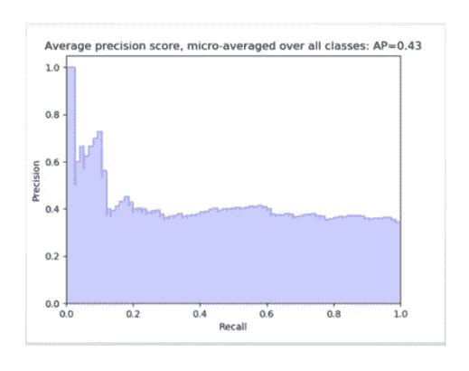

正如我们可以观察到的，如果我们提高召回率，那么精确度就会急剧下降。因此，问题来了，我们如何选择什么是正确的度量标准来评估我们的模型。所以，最简单的答案是，这取决于问题陈述。如果你预测癌症，你需要 100 %的回忆。但是假设你在预测一个人是否无辜，你需要 100%的精度。但另一个问题是，我们如何衡量模型的整体性能。所以答案就是 F1 的分数，我们接下来会理解。

# F1-score 是什么？

很明显，我们需要一个同时考虑精确度和召回率的指标来评估一个模型。一个这样的指标是 F1 分数。F1 分数被定义为精确度和召回率的调和平均值。

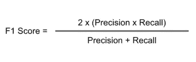

# ROC 和 AOC 分别代表什么？

在我们跳到了解 ROC 和 AOC 之前。我们首先明白我们为什么需要它们。所以，如果我们观察到大多数分类模型给我们一个类的概率，它不会给出像 0 和 1 这样的硬值。这就有了门槛的概念。设定一个阈值，任何低于阈值的概率值都是负面结果，任何高于阈值的都是有利或正面结果。

现在的问题是，理想的阈值应该是多少？要回答这个问题，我们先来了解 ROC。

## 受试者工作特性曲线

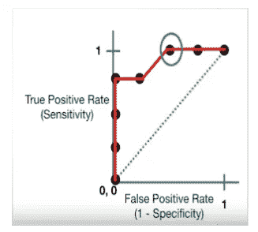

在数学上，它代表了不同阈值的不同混淆矩阵。每个黑点是一个混淆矩阵。绿色虚线表示真阳性率等于假阳性率的情况。从曲线中可以明显看出，当我们从最右边的点向左移动时，在某个阈值之后，假阳性率降低。一段时间后，假阳性率变为零。用绿色圈出的点是最好的点，因为它正确地预测了所有的值，并将误报率保持在最低。但这不是经验法则。根据要求，我们需要选择一个阈值点。ROC 曲线回答了我们选择哪个阈值的问题。

假设我们使用了不同的分类算法，并且已经绘制了相应算法的不同 roc。问题是:现在选择哪种算法？要回答这个问题，我们先来理解 AOC。

## 曲线下面积

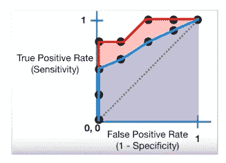

AOC 帮助我们在绘制 ROC 曲线的模型中选择最佳模型。最好的模型是包含其下最大面积的模型。

# 如何用 python 实现这些东西？

现在，我们已经从理论上学习了所有的东西，让我们来写一些代码。

从 python 导入基本模块和包。

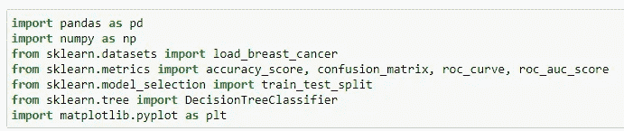

从 sklearn 加载玩具数据集。

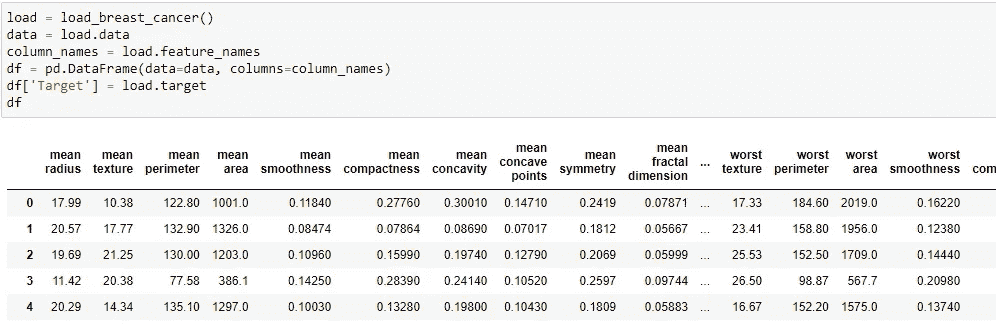

现在，训练测试分成两部分，因为我们关注的是准确性、F1 分数等。因此，我们不会对数据集进行预处理或执行任何 EDA。

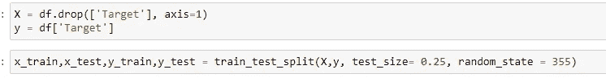

训练和预测数据。

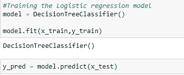

现在，我们将评估您的分类器的性能。

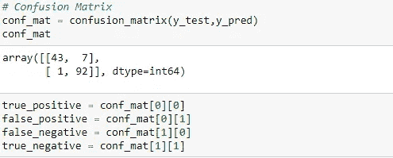

精确度:

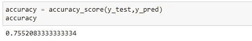

精确度和召回率:

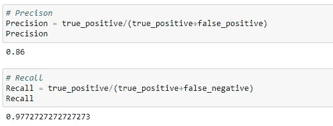

F1 分数:

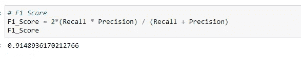

> *本文使用的笔记本链接:*

 [## articles _ Blogs _ Content/量化分类器的性能。ipynb at main …

### 这个知识库包含了 jupyter 关于发表在博客上的文章的笔记本。…

github.com](https://github.com/Akashdawari/Articles_Blogs_Content/blob/main/Quantify%20the%20Performance%20of%20Classifiers.ipynb) 

喜欢并分享如果你觉得这篇文章有帮助。还有，关注我的 medium，了解更多机器学习和深度学习相关的内容。