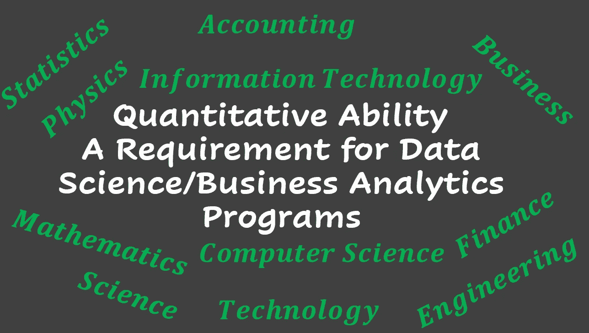

# 定量能力——数据科学/业务分析项目的要求

> 原文：<https://pub.towardsai.net/quantitative-ability-a-requirement-for-data-science-business-analytics-programs-bc17926581a3?source=collection_archive---------3----------------------->

Benjamin O. Tayo 的图片

## [数据科学](https://towardsai.net/p/category/data-science)，[教育](https://towardsai.net/p/category/education)

## 分析各种四年制学位课程，为你攻读数据科学或商业分析硕士学位做准备

## 一.导言

随着一些企业和组织转向数据来寻找可以推动决策的见解，对数据科学家和业务分析师的需求持续增长。对熟练数据专业人员的高需求也导致了世界各地几所大学提供的数据科学和业务分析硕士课程(面对面和在线)的激增。因为数据科学领域仍然相当新，所以针对数据科学家或业务分析师的大部分学术培训都是在研究生阶段进行的。

如果你正在考虑数据科学或商业分析的硕士课程，你可能会思考以下问题:

***数据科学或商业分析硕士项目的录取要求是什么？***

***我是否具备成功攻读数据科学或商业分析硕士课程的必要背景？***

为了回答这些问题，我们研究了各种提供商业分析或数据科学硕士学位的大学的入学要求，如哈佛大学、哥伦比亚大学、堪萨斯州立大学、杜克大学、雪城大学、瓦尔登大学和加州大学伯克利分校。 ***我们发现，对于绝大多数此类项目来说，最重要的入学要求是量化学科的学士学位*。**

在下一节中，我们将讨论学术培训项目列出的一些技能，这些技能是商业分析或数据科学硕士项目成功所必需的基本技能。

## 二。数据科学/业务分析项目所需的一般技能

A)高水平的定量能力

b)解决问题的心态

c)编程能力

d)有效沟通的能力

e)团队工作能力

## 三。可以为你攻读数据科学或商业分析硕士学位做准备的学位课程

在考察了几个商业分析和数据科学学术培训项目后，普遍的共识是，你需要一个定量学科的学士学位，GPA 3.0 及以上才有竞争力。请记住，由于高需求，这些项目的录取竞争非常激烈。现在让我们来看看具体的项目及其入学要求。数据科学或商业分析的入学要求非常相似，所以我们不会对两者进行任何区分。关于额外入学要求的更多信息，欢迎您访问每个项目的项目网站。

杜克大学(Duke University):在项目开始时获得科学、技术、工程、数学、商业、经济或同等数量专业的学士学位。

**堪萨斯州立大学**:完成 STAT 350 和 STAT 351(或同等统计学课程)。强烈建议熟悉计算机编程和应用。

**哥伦比亚大学**:工程或科学相关领域的学士学位。

哈佛大学(Harvard University):没有必修课，但是定量经验对你在这个项目中的成功至关重要。

雪城大学:商业、统计、数学、工程、金融、信息技术、物理、供应链或经济学本科学位。

塔尔萨大学:四年制商业、工程或科学学位。

瓦尔登大学:数据科学、计算机科学、信息技术或同等学科的学士学位。

## **四。总结和结论**

总之，我们已经讨论了几个四年制学位项目，它们可以作为获得数据科学或商业分析硕士学位的途径。任何有正确动机和热情的人都可以学习数据科学的基础。然而，一个分析学科的背景，如物理、数学、计算机科学、工程或经济学，将成为一个额外的优势，并有助于提高你在该计划中的成功机会。

## 其他数据科学/机器学习资源

[数据科学最低要求:开始从事数据科学工作需要知道的 10 项基本技能](https://towardsdatascience.com/data-science-minimum-10-essential-skills-you-need-to-know-to-start-doing-data-science-e5a5a9be5991)

[数据科学课程](https://medium.com/towards-artificial-intelligence/data-science-curriculum-bf3bb6805576)

[机器学习的基本数学技能](https://medium.com/towards-artificial-intelligence/4-math-skills-for-machine-learning-12bfbc959c92)

[进入数据科学的 5 个最佳学位](https://towardsdatascience.com/5-best-degrees-for-getting-into-data-science-c3eb067883b1)

[数据科学的理论基础——我应该关心还是仅仅关注实践技能？](https://towardsdatascience.com/theoretical-foundations-of-data-science-should-i-care-or-simply-focus-on-hands-on-skills-c53fb0caba66)

[机器学习项目规划](https://towardsdatascience.com/machine-learning-project-planning-71bdb3a44349)

[如何组织你的数据科学项目](https://towardsdatascience.com/how-to-organize-your-data-science-project-dd6599cf000a)

[大型数据科学项目的生产力工具](https://medium.com/towards-artificial-intelligence/productivity-tools-for-large-scale-data-science-projects-64810dfbb971)

[数据科学作品集比简历更有价值](https://towardsdatascience.com/a-data-science-portfolio-is-more-valuable-than-a-resume-2d031d6ce518)

***如有疑问，请发邮件给我***:benjaminobi@gmail.com