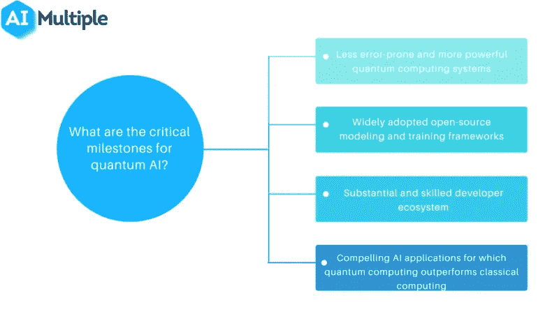

# 量子计算和人工智能

> 原文：<https://pub.towardsai.net/quantum-computing-ai-64d63b6152e5?source=collection_archive---------0----------------------->

## [量子计算](https://towardsai.net/p/category/quantum-computing)

*我的文章中使用的图像是各自组织的财产，在此仅用于参考、说明和教育目的。(图片来源:Google【除了部分图片，在图片下方特别提到了其来源】)*

谷歌梧桐时间水晶

量子计算和人工智能都是巨大而强大的技术，人工智能很可能需要量子计算来实现显著的进步。虽然 AI 用经典计算机产生功能性应用，但受限于经典计算机的计算能力。量子计算可以为人工智能提供计算动力，使其能够处理更复杂的问题，并帮助改善 AGI(人工通用智能，更多关于此处的

“量子计算”中的量子是指系统用来计算输出的量子力学。正如在物理学中一样，量子是任何物理属性中最小最离散的单位。它通常指电子、光子、中微子等。

# 什么是量子计算？

量子计算是一个计算领域，专注于开发基于量子理论(在原子和亚原子水平上解释能量和材料的行为)原则的计算机技术。

它研究如何利用量子物理中的现象来创造新的计算方式。

今天使用的计算机只能用取值为 1 或 0 的比特对信息进行编码，这限制了它们的能力。

而量子计算使用量子位或量子位。(一个量子位是量子计算中信息的基本单位)。它利用了亚原子粒子的独特能力，允许它们存在于多个状态中(即同时存在 1 和 0)。

来源:AI Multiple

# 量子人工智能的优点

*   更少的错误和更强大的量子计算系统。
*   广泛采用的开源建模和培训框架。
*   丰富而熟练的开发者生态系统。
*   量子计算优于经典计算的引人注目的人工智能应用。

# 为什么量子 AI 很重要？

*来源:艾多*

虽然 AI 在过去十年取得了快速的进步，但它仍未克服技术限制。凭借量子计算的独特功能，可以消除实现 AGI(人工通用智能)的障碍。

量子计算可以用于 ML 模型的快速训练和创建优化的算法。量子计算提供的优化和稳定的 AI 可以在短时间内完成多年的分析，并导致技术的进步。

神经形态认知模型、自适应 ML 或不确定性下的推理是当今人工智能的一些基本挑战。量子 AI 是下一代未来 AI 的解决方案之一。

来源:AI Multiple

# 量子计算在人工智能中的应用

*   **量子博弈论:**经典博弈论是在 AI 应用中广泛使用的建模过程。这个理论延伸到量子领域就是量子博弈论。它可以成为克服量子通信中的关键问题和实现量子人工智能的有前途的工具。
*   **决策问题的量子算法:**经典的决策问题是以决策树的形式来表述的。获得解集的一种方法是从某些点创建分支。但是，当每个问题都过于复杂，无法通过不断将其一分为二来解决时，这种方法的效率就会下降。基于哈密顿时间演化的量子算法可以比随机行走更快地解决由多个决策树表示的问题。
*   **用于学习的量子算法:**开发用于经典学习模型的量子推广的量子算法。它可以在深度学习训练过程中提供加速或其他改进。量子计算对经典机器学习的贡献可以通过快速呈现人工神经网络权重的最优解集来实现。
*   **量子搜索:**大多数搜索算法都是为经典计算设计的。经典计算在搜索问题上胜过人类。另一方面，Lov Grover 提供了他的 Grover 算法，并声明量子计算机甚至可以比经典计算机更快地解决这个问题。由量子计算提供动力的人工智能在加密等近期应用中前景广阔。

# 进一步研究的方向

[微软 Azure](https://azure.microsoft.com/en-us/overview/what-is-quantum-computing/#how-it-works)量子计算介绍。

[量子计算是 AI 的未来吗？](https://www.datanami.com/2021/11/11/is-quantum-computing-the-future-of-ai/)作者 Datanami

[量子计算。](https://www.investopedia.com/terms/q/quantum-computing.asp)按投资媒介

[谷歌量子人工智能](https://quantumai.google/)

感谢阅读，快乐学习！