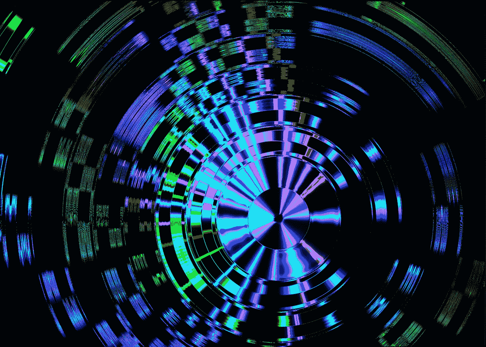

# 汽车工业中的量子计算

> 原文：<https://pub.towardsai.net/quantum-computing-in-the-automotive-industry-286eb95ac324?source=collection_archive---------0----------------------->

## [量子计算](https://towardsai.net/p/category/quantum-computing)

## 许多用例，如人工智能培训和自动驾驶的验证

摄影:[飞:D](https://unsplash.com/@flyd2069?utm_source=unsplash&utm_medium=referral&utm_content=creditCopyText) 上 [Unsplash](https://unsplash.com/s/photos/quantum?utm_source=unsplash&utm_medium=referral&utm_content=creditCopyText)

量子计算使用量子力学科学来成倍地提高计算能力。[量子力学](https://simple.m.wikipedia.org/wiki/Quantum_mechanics)，简单来说，“解释了宇宙如何在比原子更小的尺度上运作。”量子计算引入了量子比特或量子比特，而不是经典计算中的二进制比特。一个量子位可以得到 0，1 的值，或者两者的量子叠加，这是无限的。**量子技术可以比传统计算机更快地传输、计算和存储数据。**

本文将关注量子计算在汽车行业的用例。理论上，需要大量计算能力的复杂问题可以使用量子至上来解决问题。混合解决方案也是可能的，经典计算机和量子计算机执行不同的任务。**最终，通用量子计算机的发展将显著影响云计算在许多应用程序和用户之间共享计算能力。**

# 自动驾驶和人工智能:

在自动驾驶中实现高度复杂的功能需要人工智能和机器学习，例如预测和分类任务。**这种基于人工智能的组件的训练和验证需要很高的计算工作量，量子计算机可以完成。**当汽车制造商希望在现场发布新版本的软件并通过无线方式更新时，这种方法更具成本效益。**通过减少培训、测试和验证时间，量子计算有可能大幅减少持续集成/持续部署(CI/CD)的流程时间。**

量子技术可以在未来彻底改变雷达或 GPS 等量子传感器。量子传感器可以更精确地测量数据。**泰雷兹正在研究用量子导航传感器取代 GPS(全球定位系统)。**

# 电动汽车成本降低

戴姆勒和 IBM 正在合作研究锂离子电池内部的化学反应，以使用锂氧技术减轻重量，提高电池的能量密度。**量子计算可以加快模拟时间，缩短研究时间得到结果。**

# 汽车制造，机器人技术

在需要复杂和耗时计算的地方，我们可以使用量子计算机。**汽车制造业可以从量子计算机中受益，优化所有机器人和机器的合作。**

# 网络安全

加密是基于解决质因数分解问题的复杂性。这就是为什么目前的加密算法有效，因为用经典计算机破解加密算法需要很多年。**但随着量子计算的发展，一些现有的加密技术不再安全，公钥容易受到量子技术的攻击，而不需要私钥。**这意味着当网络罪犯提前接触到量子技术时，他们会监听我们所有人。

量子密钥分发(QKD)是两个实体之间安全通信的一种新方法，它使用量子技术并通过光缆传输光粒子。中国已经建立了[世界上第一个完整的量子通信网络](https://scitechdaily.com/china-builds-the-worlds-first-integrated-quantum-communication-network/)总长度超过 4600 公里。 [NIST](https://csrc.nist.gov/projects/post-quantum-cryptography) 建议为移动网络的后量子加密做好准备。**每个 IT 公司都应该为后量子加密定义一个路线图，并做好量子准备。**

# 交通流的优化和路由

大众汽车与谷歌和加拿大量子计算公司 D-Wave System 合作，优化一个地区所需的出租车数量。他们使用量子计算，根据智能手机从客户和车辆接收的数据，将出租车从一个地点安排到另一个地点。**大众交通管理系统，可以估计乘客数量并优化路线，以实现每辆车的最快路线。**数量有限的车辆可能不需要量子计算，只有需要大量数据的问题才可能是量子计算的良好用例。

这一特性也有助于电动汽车优化行驶距离和能源，以增加电动汽车的行驶里程。像戴姆勒和福特这样的汽车制造商有着同样的计划，除了作为汽车制造商的主要职业之外，还提供移动解决方案。**重点是利用量子计算优化资源和能源，以实现这一目标。**

# 观点

包括汽车制造商和供应商在内的汽车行业将不会是量子计算的主要参与者，他们将使用量子计算作为一种服务来解决他们的问题。**云提供商将提供基础设施，将经典计算问题转化为量子计算问题。**所有云提供商，如 IBM、Google、阿里巴巴、亚马逊和微软，都已经开始开发和引入这样的基础设施，供客户进行量子计算即服务的实验。

对于汽车制造商及其各自的供应商来说，使用现有的基础设施作为剩余云应用和服务的一部分，而不是构建他们的量子基础设施，这将更具成本效益。**特别是对于混合解决方案，包括经典和量子计算，最好通过云集中决定哪个任务应该分配给哪个经典或量子计算机。**

容错量子计算机是当前的研究热点，也是实现通用量子计算机的必由之路。 **IBM** [**计划**](https://singularityhub.com/2020/09/25/ibm-plans-to-have-a-1000-qubit-quantum-computer-by-2023/) **到 2023 年将 Condor 处理器中的错误率降低到 0.0001 以下，同时将量子位的数量增加到 1000 个以上。**

> 在未来，我们将有更多的数据可用，这将有助于更好地预测和优化。但是，分析大量数据需要更多的计算能力，量子计算机可以实现。

汽车供应商和制造商应该准备好在汽车行业应用量子技术，而不仅仅是关注制造用例。他们应该考虑整个车辆的寿命，从设计到部署和车辆在野外的操作。 **IT 架构师必须了解自己的任务，并为需要高计算能力的应用设计优化的量子基础设施。**