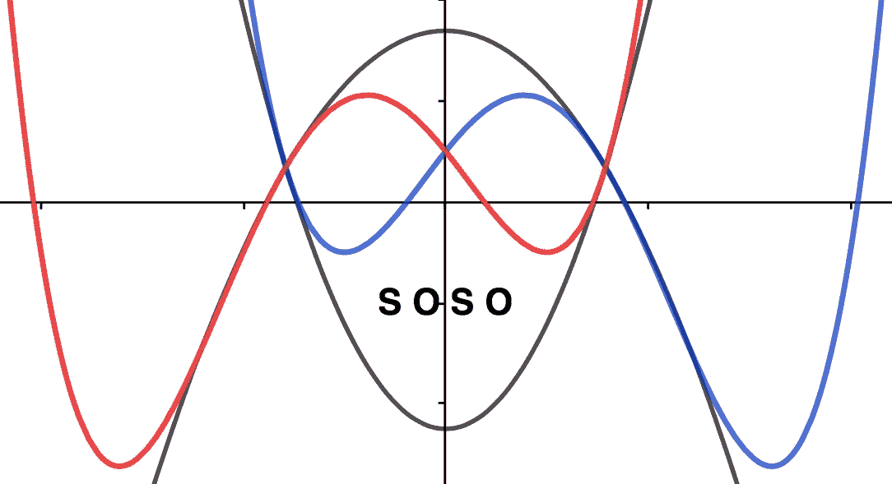
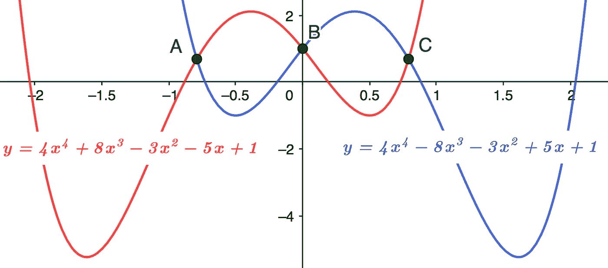
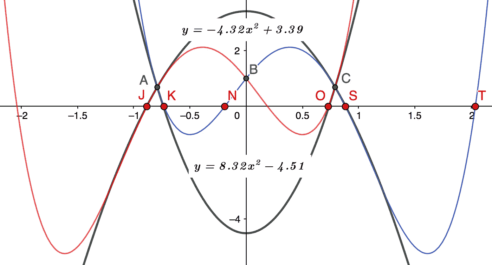
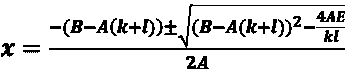

# 四次多项式根-带二次数学和 SOSO

> 原文：<https://pub.towardsai.net/quartic-polynomial-roots-with-quadratic-math-and-soso-8920f555dc57?source=collection_archive---------4----------------------->

## 使用二次曲线和 SOSO 的四次根近似

这篇文章提出了一个可行的四次方根解决方案，使用一个配制的 Y 轴 180 度旋转镜像**‘SOSO’**双函数，用两个相反的二次曲线来复制根。玩弄机器人功能设计时的直觉玩法，没有法拉利方程式的复杂性。

对于任何四次多项式，只需要找到 2 个根，因为其他 2 个根可以使用我在 [*三次多项式中提出的扩展二次方程找到——一种更简单的方法*](https://medium.com/swlh/cubic-polynomials-7b3cd2dc154e?sk=4fedf5ac00cdb51233afad5b2baedbc0) *。* 为了完整起见，我将在这篇文章中介绍这个方法。

SOSO 重述

**SOSO** 是一个配制好的双四次函数，具有**S**ame**O**p posite**S**ame**O**p posite**+-**系数。它为牛顿或其他近似方法的应用创建战略节点截距。此处已涵盖，但如需进一步了解，您可能希望参考 [*四次多项式——使用双函数节点*](https://gregmath1.medium.com/quartic-polynomials-calculate-roots-with-soso-288143d978bf) *计算根。*

参考下图 1，该图显示:

我们分析的主要功能，***y=4x⁴–8x-3x+5x+1****，是蓝色显示的*，它的**搜搜**双胞胎 ***y=4x⁴+8x -3x -5x+1 是红色显示的*** 。

图表 1 SOSO 双胞胎

M方法

***节点 A*** 、 ***B、*** 和 ***C*** 是由孪生函数的截距创建的，这些函数为两个二次多项式创建坐标点，它们具有与四次函数相同的坐标梯度。正如我们将看到的，这些二次曲线的根非常接近四次曲线的根。

> 注:镜像对称使根和因子与 SOSO 四次项相等、相反。

C计算节点

***y=4x⁴–8x-3x+5x+1***与搜搜双生:

产生非零截距的 y=4x⁴+8x-3x-5x+1；

***y=-16x +10x*** *，* 因此***x =+-SqRt【0.625】***因此:

***节点 A=-0.7905*** 和 ***节点 C=+0.7905*** 赠送；

***A=(-0.7905，0.69)*** 和 ***C=(0.7905，0.69)***

C计算渐变

**节点 A——红色四次孪晶**

设 ***y=ax +c*** 表示与 **SOSO (** red)在 ***节点 A*** 处斜率相同的截取二次曲线，因此:

***y=4x⁴+8x -3x -5x+1。*** 在***x =-0.7905***；

**dy/dx = 16x+24x-6x-5 = 6.836**

> 注意这也=**dy/dx(-Node C)***蓝色由于 SOSO Y 轴镜像对称。*

***节点 A —蓝色四次曲线***

****y=4x⁴-8x-3x+5x+1***。再用***x =-0.7905***；*

****dy/dx = 16x-24x-6x+5 =-13.158****

> *再次注意这个**=-节点 C** 红色渐变。*

*问 **无人机拦截功能***

*参见下图 2，图中以黑色显示了两个相对的二次曲线，分别在 ***节点 A*** 和 ***C*** 处相交。注意它们与四次曲线 ***节点*** 和根的曲率匹配的有多紧密。*

*这两个二次方程的解将产生这些根的非常好的近似值。*

**

*图 2 二次匹配*

*Q*

*红色 ***节点 A*** :设 ***y=ax +c*** ，***@ x =-0.7905***；*

1.  ****dy/dx = 2ax =-1.581 a = 6.836***因此: ***a=-4.324*** 和；*
2.  ****y = ax+c = 0.69***，因此:***c = 4.324 * 0.625+0.69 = 3.393***；因此:*
3.  ****y=-4.324x +3.393*** 带 ***根 J****S*:*
4.  ****x =+-SqRt[3.393/4.324]=+-0.886***因此:*
5.  *四次 ***根 S=0.886*** 与实际 ***根 S=0.883****

*Q*

*蓝色 ***节点 A*** :设 ***y=ax +c*** ，***@ x =-0.7905***；*

1.  ****dy/dx = 2ax =-1.581 a =-13.158***因此: ***a=8.323*** 和；*
2.  ****y=ax +c=0.69)*** 因此:***c =-8.323 * 0.625+0.69 =-4.512***因此:*
3.  ****y = 8.323 x-4.512***带 ***根 K*** 和 ***O*** :*
4.  ****x =+-SqRt[4.512/8.323]=+-0.736***因此:*
5.  *四次方根 ***K=-0.736*** 与实际根 ***K=-0.73****

*F **油膏设计***

***SOSO** twin Quadratics 的另一个特点是调整设计的简单性。例如:*

****y =-4.324 x+3.393***有 ***根 S*** 渐变:*

****dy/dx =-4.324 * 2 * 0.883 =-7.66***或使用判别式时调整常数 ***c*** 或系数 ***a*** :*

***dy/dx =+-SqRt[-4ac]=+-SqRt[-4 *-4.324 * 3.393]=-7.66***

*一个结果很容易计算，如果你想增加或减少它，使功能变化容易。关于二次根梯度的背景，你可以参考我的帖子， [*从根向上推导二次方程*](https://www.cantorsparadise.com/deriving-the-quadratic-equation-from-the-roots-up-d9b1d6c2f162?source=your_stories_page-------------------------------------) *。**

*Re 维护**根 N和**T*****

****根 N*** 和 ***T*** 简单地从我在 [*三次多项式中提出的扩展二次方程中下载——四次应用中的一种更简单的方法*](https://medium.com/swlh/cubic-polynomials-7b3cd2dc154e?sk=4fedf5ac00cdb51233afad5b2baedbc0) 如下:*

**

*扩展二次方程*

*其中 ***A*** 到 ***E*** 为函数 ***的系数和常数项【y=ax⁴+bx+CX+dx+e******k******l***为已知因子。*

*鉴于***y=4x⁴-8x-3x+5x+1***:*因此 ***A=4，B=-8*** 和 ***E=1*****

*****根 S = 0.886******根 K =-0.736****于是赋值；***k =-0.886******l = 0.736***。***

***于是: ***根 N=-0.188*** (实际 ***1.90*** )和 ***根 T=2.038*** (实际 ***2.037*** )。***

***S小结***

***用两个相反的二次曲线求根在数学上是直观的，给出了非常好的近似。它还应该有助于机器人设计应用，其中四次构造以容易可视化的截距节点和相反的二次构造开始，它们的简单梯度引导根扩散。***

***使用 **SOSO** 节点优于任何随机*值选择，因为两个根(根=-因子)可以从相同的节点高度 ***y*** 计算中计算出来。除此之外，这些节点为功能的架构提供了一些规则和“视觉”视角。****

***无论如何，如果你只是想知道根，计算器是很难击败的，但它不是很有趣，也不会教你很多关于多项式的过程！***

*****一些半相关的工具箱方法文章:*****

***[*三次方根——卡丹诺公式与二次方程的推广*](https://gregmath1.medium.com/cubic-roots-cardanos-formula-with-the-extended-quadratic-equation-6234dc96214?source=your_stories_page-------------------------------------)***

***[*六次多项式——一种实用的方法*](https://www.cantorsparadise.com/sextic-polynomials-a-practical-approach-9232acb848af)***

***[*多项式根-扇形圆弧和牛顿近似加一点点*](https://www.cantorsparadise.com/polynomial-roots-newtons-approximation-plus-a-little-bit-76f487b8300?source=your_stories_page-------------------------------------)***

***[*多项式——余数除法(B 部分)*](https://gregmath1.medium.com/polynomials-division-by-vision-with-remainders-part-b-ac9ce7af4db3?source=your_stories_page-------------------------------------)***