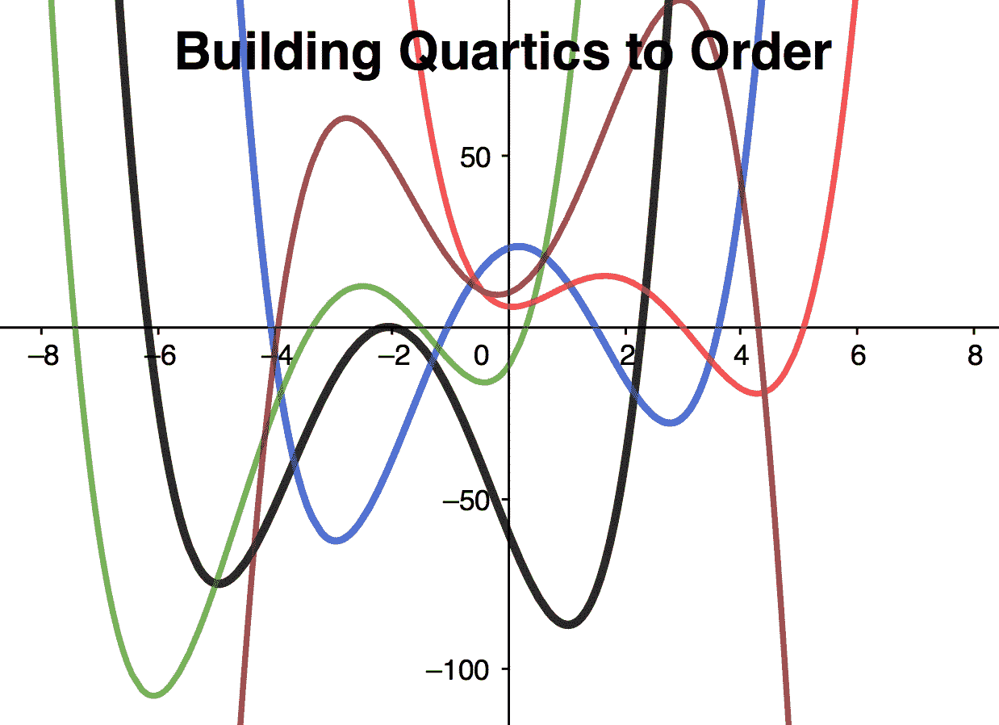
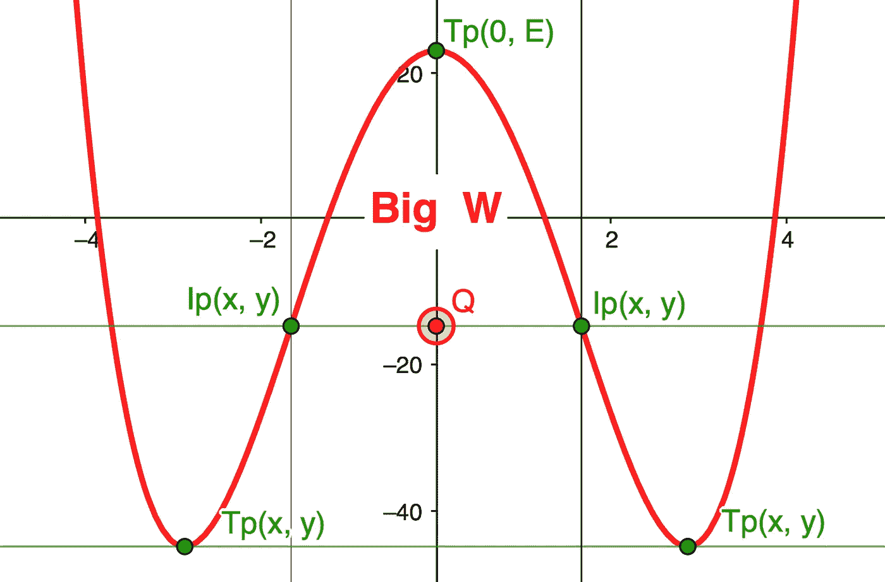
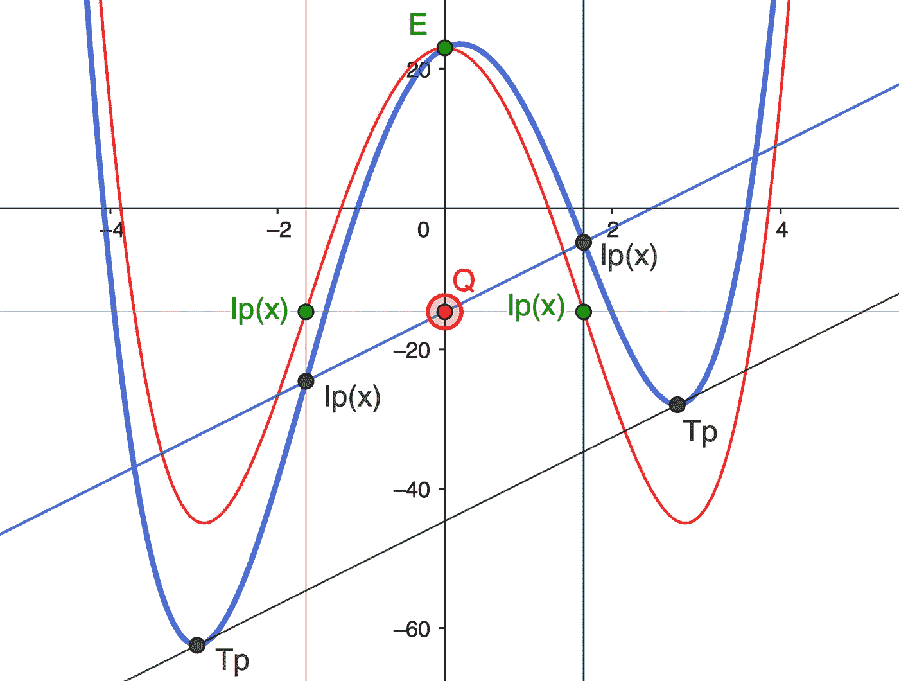
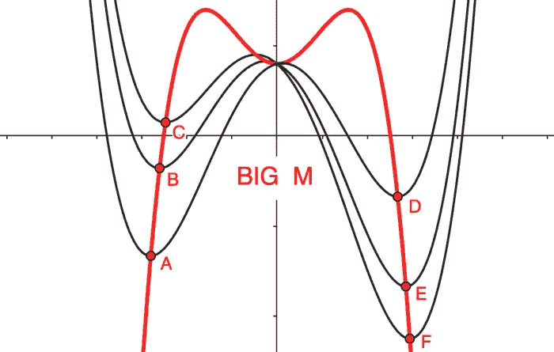
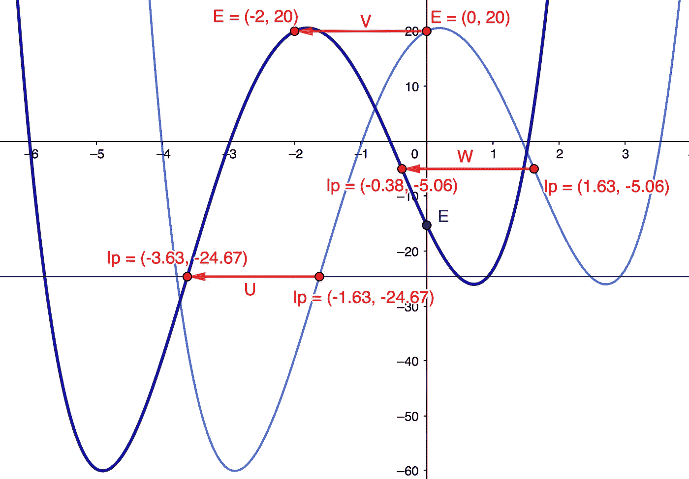
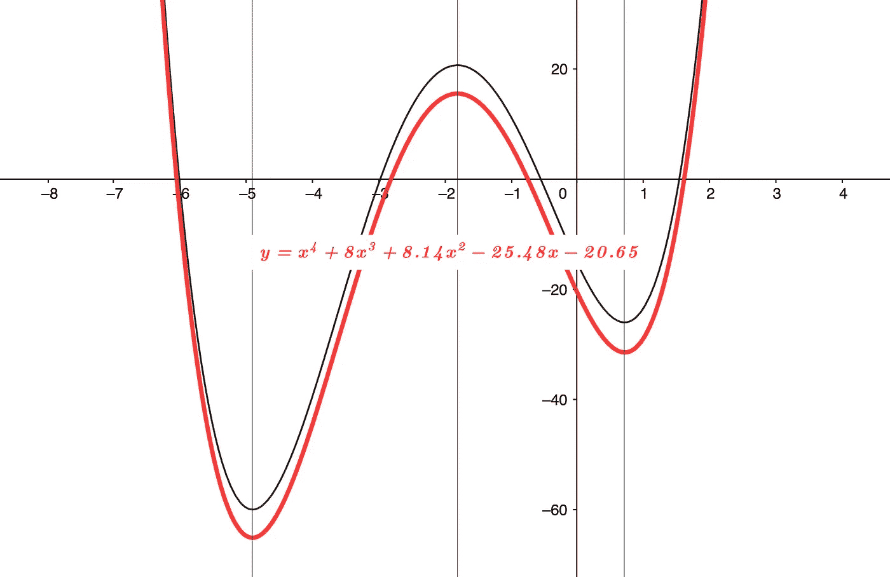

# quartics-在 X-Y 网格中的任何地址定制

> 原文：<https://pub.towardsai.net/quartics-built-to-order-at-any-address-in-the-x-y-grid-92942b45f24d?source=collection_archive---------2----------------------->

**按订单生产的石英玻璃**

## 构建您自己的四次多项式，以便在网格中的任何地址！

学生的任务是寻找多项式的根，而不需要详细了解底层功能架构或关键指标在 X-Y 网格中的位置。我认为，这个数据驱动的时代需要一种更全面的方法，让学生更好地准备设计满足特定要求的功能。

在本文中，我们设计了一个四次多项式来排序，使用底层遗传'**大 W'** 架构，然后针对指定的拐点、转折点和常数项进行调整，最后在 X-Y 网格中重新定位。

这篇文章假设了高中水平的数学。一如既往，我希望它能鼓励人们更形象地思考数学！

*注:贯穿本帖，为简单起见，我们使用***系数****a = 1****作为它不改变根或* ***x*** *坐标和转折点。**

***基础大 W***

*底层典型的四次***y=ax⁴+bx+CX+dx+e***是我所说的其遗传**大 W** 架构， ***y=Ax⁴+Cx +E*** 其中没有 ***Bx*** 三次或 ***Dx*** 线性项，如下图 1 中红色所示。它以 Y 为中心，关于 Y 轴对称，具有等跨 Y 轴的拐点***【Ip(x，Y)】***(即在 ***x=0*** )，两个外部转折点***【Tp(x，y)*** 彼此水平，并且 ***Tp(0，E)***倾斜度*

****点 Q*** (目标为红色)是穿过 ***Ips*** ， ***y= Q，*** 与 Y 轴相交的地方。我们将看到，这是四次设计中的一个关键转变指标。*

**

***图 1 大 W Y 为中心***

> *注意:要产生一个 ***大 W* ，** *系数* **A** 和 **C** 必须是相反的符号，并且 **C** 比 **A** 多几倍或少几倍才能得到最终形状。常数 **E** 可以是+ve 或-ve。*

***添加一点渐变*Dx****

*通过添加渐变 ***Dx*** ，形状呈现出更为熟悉的“草书”形式，如下图 2 所示，其中***y=ax⁴+cx+dx+e****。**

*重要的是， ***Ip(x 的)*** 保持不变， ***Ip(y 的)*** 不变，并且通过它们截距的线与 ***Tp*** 截距具有匹配的梯度，与***dy/dx =系数 D*** 。这也等于 ***E*** 处的梯度，其中 ***x=0*** 。*

> *再次注意；**点 Q** 是通过各自 **Dx** 创建的**IP**的所有线的公共截距。*

**

*Diag 2 添加了一点草坡*

*将 ***Dx*** 添加到**大 W** 可以通过指定 ***x=0、*** 处的梯度来完成，这可能有一个应用程序，比如机器人的起飞速率，或者如本文所述，指定实际较低的转折点'***【Tp(y)***坐标，以引入更多的整体功能。*

> *注:所示函数具有+ve 系数 **A** ，负系数 **C** 。反过来这些只会简单的生成一个 ***大 M*** 而不是***大 W*** ，(不要和下面的 ***大 M*** 混淆)。*

***大 M***

*说到一个**大 m，**在早先的帖子中， [*带有指定转折点的四次多项式使用大 M*](https://medium.com/towards-artificial-intelligence/designing-quartic-polynomials-from-specified-turning-points-af0db707a6d7) *，*我做了一个简单的推导，其中每一个四次多项式都有一个遗传的**大 M** ， ***y=-3Ax⁴-Cx +E*** 来追踪转折点，如下图 3 所示，其中 ***A，b，*** 和*

******

***图 3 大 M 遗传***

> ***正如我们将在后面看到的，这使得用指定的*设计函数变得简单，因为它避免了生成带有三次和线性项的四次函数！****

******X-Y 网格中的大 W 地址******

****学生可能熟悉四次函数在移动以消除 ***Bx*** 项时在 X-Y 网格中的形状保持性，从而使根更容易找到。我自己的帖子， [*压抑的四次多项式-翻译数学简化版*](https://medium.com/@gregmath1/depressed-quartic-polynomials-translation-math-simplified-2992e503eeec) *，*以简单的方式做到了这一点，没有多项式乘法，同时保持了对形状保持的关注。****

> ****本帖反其道而行之，我们使用简化的 y 中心函数**y=ax⁴+cx+dx+e***，然后将其移动到指定的 X-Y 网格坐标**点 Q** 。*****

*****通过指定关键度量，我们获得了合成函数的公式，不出所料，它将很可能包含一个三次***【bx】***，并修改了 ***D*** 和 ***E*** 项:***y=ax⁴+bx+CX+dx+e***。*****

*******四次 Y 中心规格*******

*****这里使用的关键度量是拐点 ***Ip(x，y)***转折点 ***Tp(x，y)***常数 ***E、*** 和 ***点 Q*** 。*****

## *****基本以 y 轴为中心的 y=Ax⁴+Cx +Dx+E*****

*****给定 ***A=1。*** 设 Y 轴为中心的函数规格如下:*****

1.  ********Ip(x 的)=-1.625 和+1.625********
2.  *****常数 ***E=20********
3.  *****一个转折点=***【x，-60】********

*****从设计的角度来看，这是我们定义功能所需的所有信息。*****

*******按订单生产，以 Y 轴为中心*******

## *****系数 C*****

********Ip(x)*** 规格完全取决于常数 ***C/A*** 的比值，因此:*****

********y=ax⁴+cx+dx+20***和给定 ***A=+1*** 。因此:*****

********dy/dx = 4x+2Cx+D********

********d y/dx = 12x+2C = 0***，*sub in***x =-1.625*********

********d y/dx = 31.688+2C = 0***因此；*****

********C =-15.844********

## *****系数 D*****

*****做到了，***y=x⁴-15.844x+dx+20***我们可以确定*由等价于一个指定的***【TP(x，-60)*** 利用遗传**大 M** 如下:******

*******大 m**:***y=-3x⁴+15.844x+20 =-60；*** 让 ***u=x*** 于是:*****

********y =-3u+15.844 u+80 = 0***由此得 ***u=-3.16，+8.44*** 于是:*****

********x =+-sqrt[8.44]=-2.905***sub in***y=x⁴-15.844x+dx+20 =-60********

********y = 71.234-133.708-2.905d+80 = 0********

********D=+6.033********

## *****常数 E*****

*****指定 ***y=(0，20)********

*****计算 Q 点*****

*****由于点***Q(y)= Ip(y)***使用**大 W** 计算如下:*****

********ip(y)=x⁴-15.844x+20 @ x =+1.625***，因此；*****

*******Q(y)= 6.973–41.838+20 =-14.865。*******

*******方程式移动—横向*******

*****由此产生的以 y 为中心的方程，蓝色的***y=x⁴-15.844x+6.033 x+20***，准备转移到深蓝色的 ***Q=(-2，-14.865)*** 坐标与方程***【y=x⁴+bx+CX+dx+e***。*****

**********

*****图表 4 横向移动*****

*****向量 **U、V** 和 **W** 显示向左移动 2 个单位的选定位移坐标。注意形状保持。*****

*******新方程式*******

*****同样，转换将导致方程的变化，但不会改变其形状。定义横向移动方程有 3 个步骤，最后一个步骤是使用 ***点 Q*** 坐标确定常数***【E】***垂直移动，如下所示:*****

## *****横向移动*****

*******1)使用 Ip(x)** 计算 B 和 C*****

********d y/dx = 12x+6Bx+2C = 0***，简化***d y/dx = x+0.5 bx+0.167 c = 0***。*****

*****给定 ***Ip(x)=-3.625*** 和 ***-0.375*** 遂用和积；***0.167 c =-3.625 *-0.375 = 1.359***和***0.5B =-3.625-0.375 =-4***，因此；*****

********B=8，C=8.137*** 。给予:*****

> *******y=x⁴+8x +8.137x +Dx+E*******

*******2)计算 Ip 处的 D-梯度(-1.625，y)*******

********dy/dx = 4x-31.688 x+6.033；*中的**sub**中的*x =-1.625 =-17.164+51.493+6.033 = 40.362*中的*******

*****用 ***B*** 和 ***C*** 替换为 ***x=-3.625********

********y=x⁴+8x+8.137 x+dx+e********

********dy/dx = 4x+24x+16.274 x+D = 40.362 @ x-3.625***因此；*****

*******D = 40.362+190.539–315.375+58.993 =-25.481。给予:*******

> *******y=x⁴+8x+8.137 x-25.481 x+e*******

*******3)使用 y=20 @ x=-2** 计算 E*****

********y=x⁴+8x+8.137 x-25.481 x+e = 20***sub 于 ***x=-2********

********y = 16–64+32.548+50.962+E = 20***因此；*****

********E = 20–16+64–32.548–50.962 =-15.51*。给予:*******

> *******y=x⁴+8x+8.137 x-25.481 x-15.51*******

## *****垂直移位*****

*****为了满足指定的要求，即 ***点 Q=(-2，-20)*** 使用**大 W** ***Q(x，y)=Q(0，-14.865)*** ，进行如下操作，从而调整常数；*****

********E =-15.51-20+14.865 =-15.51-5.135 =-20.645***结果方程如下图 5 中红色所示:*****

> *******y=x⁴+8x+8.14 x-25.48 x-20.65*******

**********

*******图表 5 完成班次*******

*****最后，我们将检查关键度量 ***点 Q*** 是否确实在指定的 ***Q(-2，-20)*** :*****

********y=x⁴+8x+8.14 x-25.48 x-20.65********

********dy/dx = 4x+24x+16.28 x-25.48********

********d y/dx = 12x+48x+16.28***因此:*****

********Ip(x)=-3.625*** 和 ***-3.75*** 分别根据需要而定。因此；*****

*******t29】IP(-3.625，y)=y=x⁴+8x+8.14 x-25.48 x-20.65 = 172.676–381.078+106.965+92.365–20.65 =-29.722t31】*******

*******t33】IP(-0.375，y)=y=x⁴+8x+8.14 x-25.48 x-20.65 = 0.020–0.422+1.145+9.555–20.65 =-10.352t35】*******

*****按要求取 ***点以来的平均值 Q(x)=(-3.625-0.375)/2 =-2***。遂；*****

********点 Q(-2，y)=(-2，-20.037)*** Ok 结果。*****

*****回顾*****

*****这篇文章提供了一个**大 W** 通用公式和关键指标来支持特定的功能设计，并使用一个**大 M** 关联来大大简化特定转折点的合并。*****

*****因此，将**大 W** 和**大 M** 整合到您的设计中，让数学为您工作，而不是您为它工作！*****