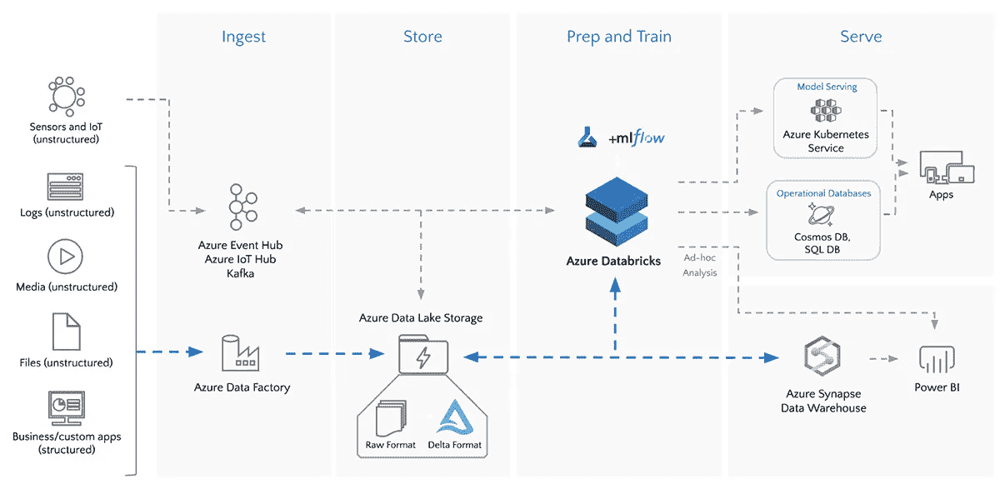
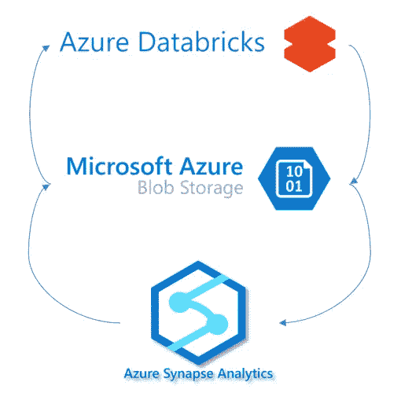
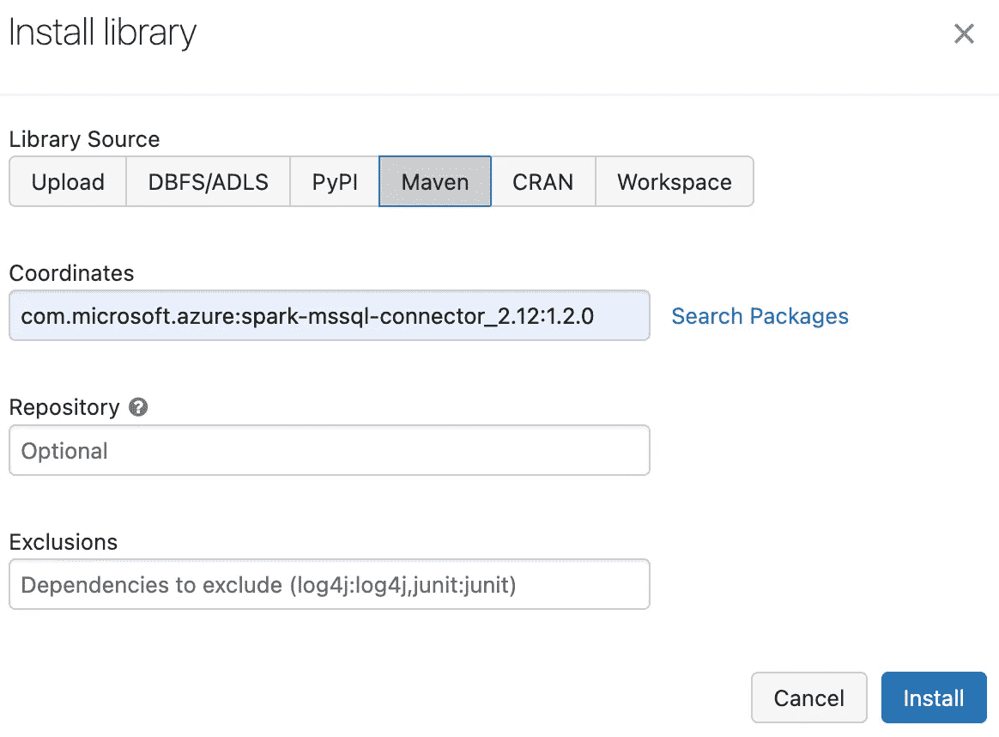
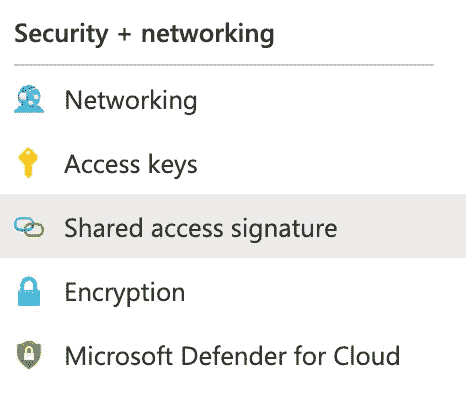
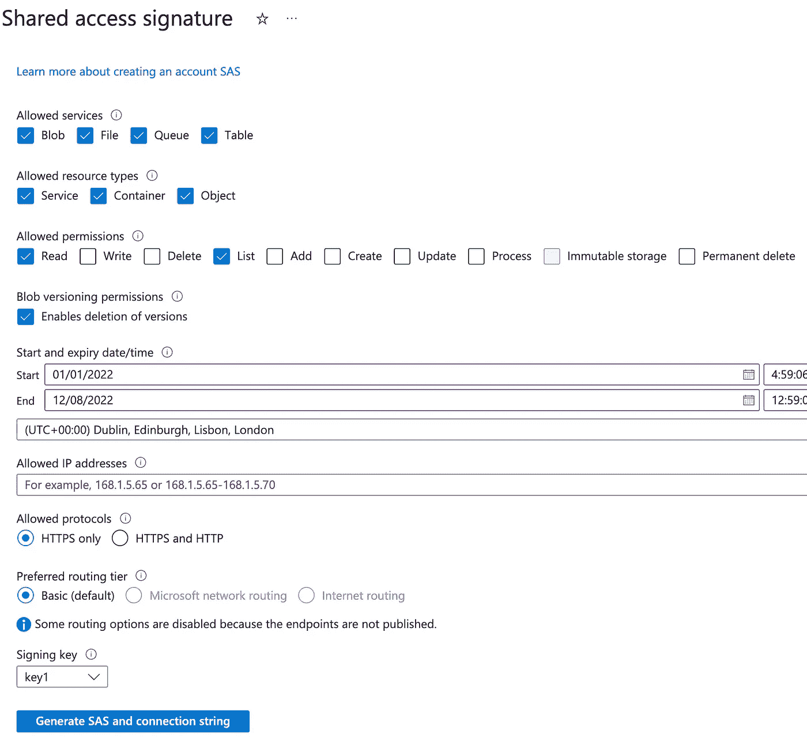
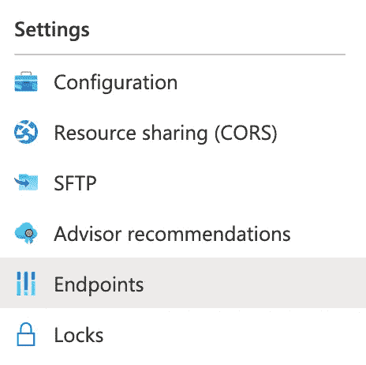
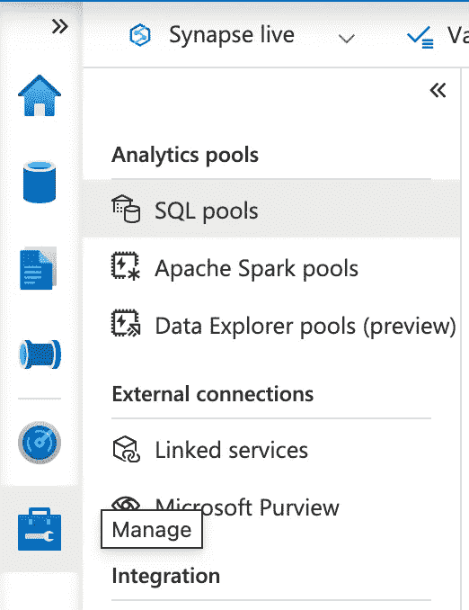
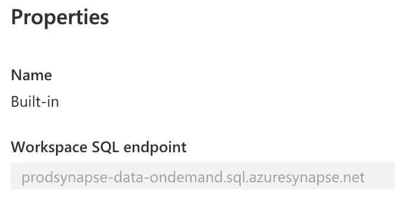

# 从数据块中查询 Synapse Analytics Delta Lake

> 原文：<https://pub.towardsai.net/querying-synapse-analytics-delta-lake-from-databricks-aef7473160f4?source=collection_archive---------0----------------------->



由[数据块](https://www.databricks.com/blog/2020/03/06/connect-90-data-sources-to-your-data-lake-with-azure-databricks-and-azure-data-factory.html)生成的图像

关于如何从专用池和无服务器池的数据块中连接(查询)Azure Synapse Analytics Delta Lake 数据的分步指南。

# 问题陈述

近年来，特别是随着 Delta lake 的出现，使用数据块作为处理的主要来源和使用内部服务(如 Azure Synapse Analytics)来管理对所述资源的访问变得越来越普遍。



Azure Databricks、Data Lake Gen 2 和 Synapse Analytics trifactor

然后，要求通过数据块读取存储在 Synapse Analytics 中的数据变得越来越常见，尤其是当您对通过数据块进行复杂的分析或机器学习感兴趣时。然而，这个过程并不简单，而且在撰写本文时，文档资料严重缺乏。

如果您通过[外部表](https://learn.microsoft.com/en-us/azure/synapse-analytics/sql/develop-tables-external-tables?tabs=hadoop)或[外部视图](https://learn.microsoft.com/en-us/azure/synapse-analytics/sql/query-delta-lake-format)抽象您存储的对象——例如，Delta 文件——这个需求可能特别重要。

# 解决办法

该解决方案由三个简单但漫长的步骤组成:

1.  选择和配置合适的数据块连接器
2.  配置 Azure Synapse 分析
3.  将数据块连接到 Azure Synapse Analytics

## 1.选择和配置合适的数据块连接器

[如本指南所述](https://learn.microsoft.com/en-us/azure/databricks/external-data/synapse-analytics)，Databricks 为 Azure Synapse Analytics 提供了一个现成的连接器。然而，这个**连接器只适用于专用的 SQL 池**。如果你想连接到一个无服务器的 SQL 池，你将不得不使用[微软的 Apache Spark 连接器:SQL Server & Azure SQL](https://learn.microsoft.com/en-us/sql/connect/spark/connector?view=sql-server-ver16) 。

要安装连接器并使其可用于集群实例，可以通过 Databricks 集群中的安装向导直接安装连接器，或者使用 Maven 坐标。



Maven 坐标的数据块依赖项安装向导

然而，这不是一个容易维护的过程，尤其是如果您想要使用 *dbx* 来部署您的实例。通过使用 *dbx* 来管理您的部署(CI/CD ),可以简化这个过程。要将它合并到 *dbx* 中，请将下面一行添加到您的 *deployment.json* ( [请参见官方文档，了解如何在这里](https://dbx.readthedocs.io/en/latest/guides/general/dependency_management/#adding-jvm-dependencies-to-your-python-project)添加 maven 依赖项的详细信息):

```
libraries:
  - maven: 
    coordinates:"com.microsoft.azure:spark-mssql-connector_2.12:1.2.0"
```

## 2.配置 Azure Synapse 分析

这个过程中最困难的——也可能是最令人困惑的——部分包括配置 Azure Synapse Analytics 以允许外部实体查询您的对象。

**2.1-(可选)创建数据库级主密钥**

第一步是确保您的数据库有一个用于保护凭证的主密钥。
注意:如果您已经设置了数据库，可以跳过这一步。

```
USE database_name;
CREATE MASTER KEY ENCRYPTION BY PASSWORD = 'strong_password';
```

**2.2-创建数据库范围的凭据**

第二步要求我们设置一个限定范围的凭证，该凭证管理对数据湖容器中使用的存储文件的访问。

这一步需要一个共享访问签名 SAS 令牌。

要检索它，请打开您的 Azure 门户，导航到存储帐户，选择您的存储帐户，然后打开共享访问签名菜单:

> Azure 门户>存储帐户>存储帐户>容器>共享访问签名



Azure 存储帐户(安全+网络)共享访问签名选项卡

然后，我们需要生成一个 SAS 令牌。确保仅选择所需的权限，并点击“生成服务协议”按钮:



Azure 存储帐户共享访问签名生成器

在底部，您会发现一系列包含我们的 SAS 令牌的生成块。

> **注**:令牌格式为“ ***？sv=202******"*** ，粘贴到 SQL 脚本时必须忽略问号前缀，*？*。意，秘“*？sv=202******"* 变成了" ***"***

```
CREATE DATABASE SCOPED CREDENTIAL ProdReadAccess
WITH IDENTITY='SHARED ACCESS SIGNATURE',
SECRET='sv=your_secret'
GO
```

**2.3-创建外部数据源**

由于我们的数据存在于 Azure Blob 存储容器中，我们必须通过外部数据源的概念使其对 Azure Synapse Analytics 可用。
在这种情况下，我们将创建一个名为 *prod_lake* 的外部数据源，分配 *ProdReadAccess* 凭证，最后指定 Delta Lake 存储位置:

注意:如果您不知道您的存储位置地址，请继续步骤 2.3.1。

```
IF NOT EXISTS (SELECT * FROM sys.external_data_sources WHERE name = 'prod_lake')
CREATE EXTERNAL DATA SOURCE [prod_lake]
WITH (
LOCATION = 'https://yourstorage.dfs.core.windows.net/your_container',
CREDENTIAL = ProdReadAccess
)
```

**2.3.1-(可选)检索数据湖存储端点**

在前面的步骤中，位置参数是在假设它事先已知的情况下插入的。如果您不知道该参数的值，请打开您的存储帐户，转到端点部分并检索数据湖存储链接。

> Azure 门户>存储帐户>存储帐户>容器>端点



Azure 存储帐户(设置)“端点”选项卡

**2.4-创建认证凭证**

**2.4.1-创建一个登录**

首先创建一个名为 *databricks_synapse* 的登录名:

```
CREATE LOGIN databricks_synapse WITH PASSWORD = 'your_strong_password';
```

**2.4.2-通过登录**创建一个用户

```
CREATE USER databricks_synapse FROM LOGIN databricks_synapse;
```

**2.4.3-授予用户读取容器项目的权限**

```
GRANT REFERENCES ON DATABASE SCOPED CREDENTIAL::[ProdReadAccess] TO [databricks_synapse];
```

**2.4.3-更改用户角色以允许从 SQL 实例中读取数据**

```
ALTER ROLE db_datareader ADD MEMBER [databricks_synapse];
```

**2.4.4-(可选)在增量资源上创建视图或外部表**

使用创建的数据源 *prod_lake* 在外部增量资源上创建一个视图(或外部表):

```
CREATE VIEW dw.test_view AS
  SELECT *
  FROM OPENROWSET(
  BULK 'test_delta/',
  DATA_SOURCE = 'prod_lake',
  FORMAT = 'DELTA'
  )
  AS [r];
```

## **3。将数据块连接到 Azure Synapse Analytics**

最后，我们需要指示 Databricks 连接到 Azure Synapse Analytics 并查询特定的表——或者执行查询。

**3.1。检索(专用或无服务器)池主机名**

为了连接到专用或无服务器池，我们需要其特定的 SQL 端点地址。这允许我们基于所需的工作负载选择池实例。

最简单的检索方法是通过 Synapse Analytics 工作区。打开 SQL pools 分隔符并访问所需的 SQL 池—默认情况下是内置的，或者是无服务器的。

> Azure 门户> Azure Synapse 分析> *选择您的实例* >打开 Synapse Studio >管理> SQL 池



Synapse Analytics Studio 管理分隔符，指向 SQL 池管理器

通过选择所需的 SQL 池，弹出一个包含所需信息的*属性*窗口:



“内置”SQL 池的属性窗口

**3.2。查询 Azure Synapse 分析端点**

本微软指南详细介绍了这一部分及其细节。

```
spark.conf.set("fs.azure.account.key.<your-storage-account-name>.dfs.core.windows.net",
  "<your-storage-account-access-key>")

hostname: str = "prodsynapse-data-ondemand.sql.azuresynapse.net"
database: str = "your_database_name"
port: int = 1433
user: str = "databricks_synapse"
password:str = "your_strong_password"
table_name: str = "dw.test_view"

display(spark.read
      .format("jdbc")
      .option("driver", "com.microsoft.sqlserver.jdbc.SQLServerDriver")
      .option("url", f"jdbc:sqlserver://{hostname}:{port};database={database}")
      .option("user", user)
      .option("password", password)
      .option("dbtable", table_name)
      .load().limit(10))
```

如果您想改为执行查询，请用查询和相应的参数替换 *dbtable* 选项:

```
spark.conf.set("fs.azure.account.key.<your-storage-account-name>.dfs.core.windows.net",
  "<your-storage-account-access-key>")

hostname: str = "prodsynapse-data-ondemand.sql.azuresynapse.net"
database: str = "your_database_name"
port: int = 1433
user: str = "databricks_synapse"
password:str = "your_strong_password"
query: str = "select top(10) * from dw.test_view"

display(spark.read
      .format("jdbc")
      .option("driver", "com.microsoft.sqlserver.jdbc.SQLServerDriver")
      .option("url", f"jdbc:sqlserver://{hostname}:{port};database={database}")
      .option("user", user)
      .option("password", password)
      .option("query", query)
      .load().limit(10))
```