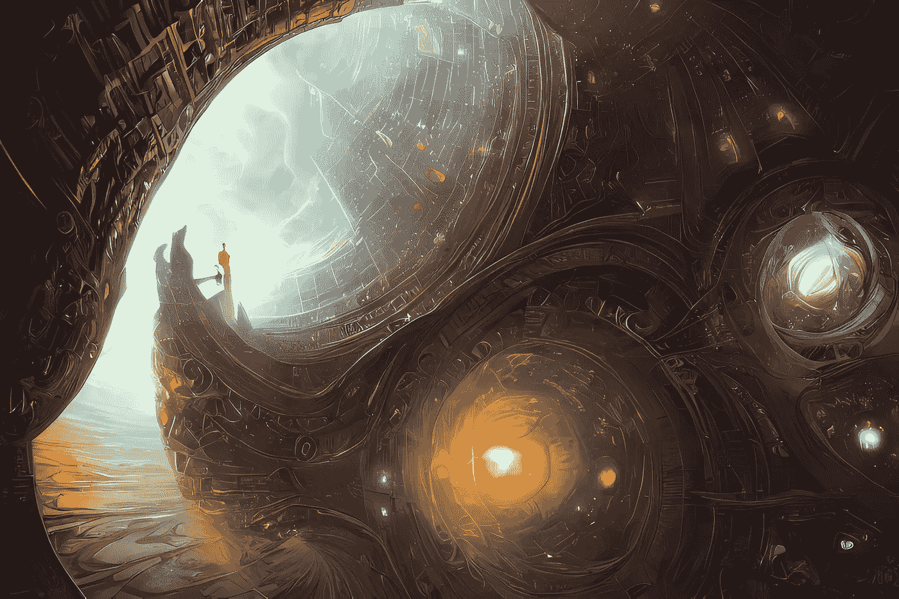
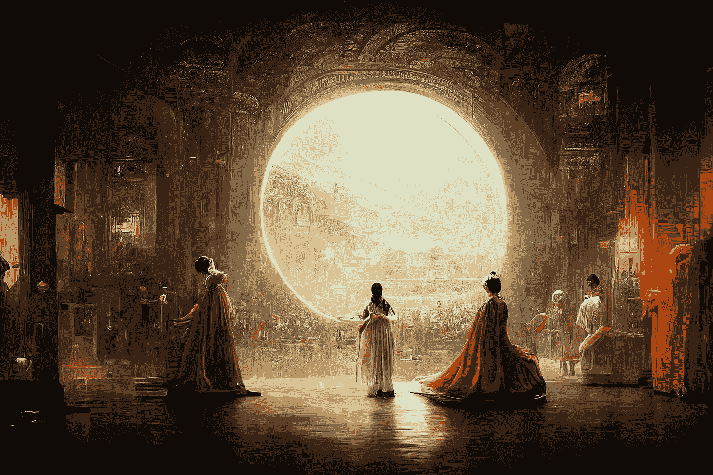
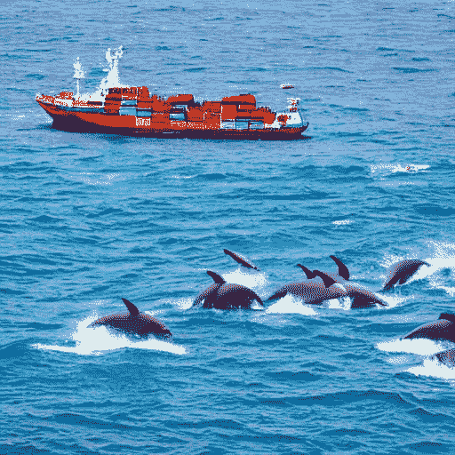
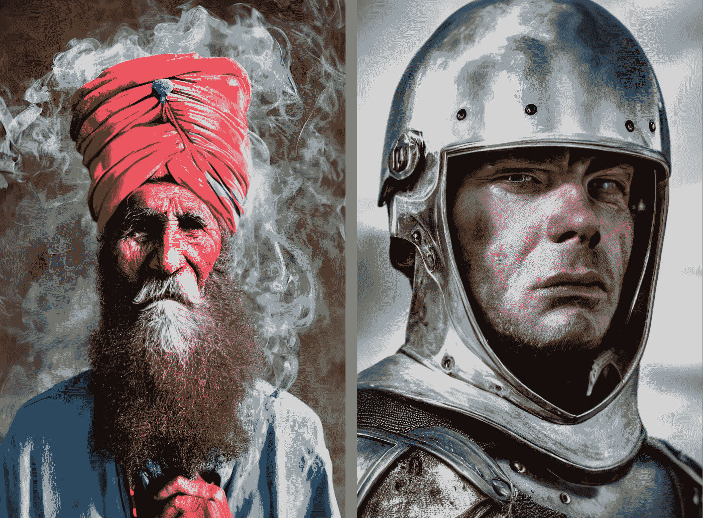

# 使用人工智能快速将文本转换为图像——使用稳定扩散

> 原文：<https://pub.towardsai.net/quick-take-on-text-to-image-conversion-with-ai-using-stable-diffusion-a3dee12efb?source=collection_archive---------1----------------------->

虽然转换工具已经存在多年，但稳定的扩散确实使任何人*都有可能创造出逼真的艺术！*

**

*礼遇:[稳定扩散](https://stability.ai/blog/stable-diffusion-public-release)*

# *什么是文本到图像的转换模型？*

*简单地说，这是一个生成尽可能与所提供的文本描述相匹配的图像的模型。它属于生成式人工智能的领域，是深度学习的用例之一。*

# *生成人工智能*

*尽管人工智能还处于萌芽阶段，但它已经走过了漫长的道路，渗透到我们互动、参与和表达的方式中。生成式人工智能是这种进化的一个方面，它允许算法将单词和声音想象成图片和表情。它创造了无偏见的结果，这些结果通常来自人类的思想和经验。*

> *生成式人工智能是指可以使用文本、音频文件或图像等现有内容来创建新的可信内容的人工智能模型。*

*生成式人工智能模型主要基于生成式对抗网络(GANS)、变形器和可变自动编码器等技术。*

# *艺术中的人工智能*

*虽然我不太懂艺术，但我绝对被人工智能为我做这件事的想法迷住了！*

*最近，一个人工智能生成的艺术作品赢得了一场国际比赛，引起了很多热议。虽然这种艺术永远不会超越历史上全球各种艺术家的遗产和时代，但我相信它一定会让艺术更容易被大众接受，并开辟出自己的一席之地。*

**

*杰森·艾伦(Jason Allen)的人工智能作品《太空剧院》(Thétre D ' opéra Spatial)在科罗拉多州博览会上获得了数码类的第一名。图片提供:纽约时报&杰森·艾伦*

*在纽约时报阅读完整的文章。*

> *艾伦先生的这幅作品是由 Midjourney 创作的，mid journey 是另一个人工智能程序，可以将文本转化为超现实的图形。*

# *什么是稳定扩散，它是如何工作的？*

*文本到图像的转换器已经存在了相当长一段时间，但今年(2022 年)发布的工具——如 DALL-E 2、Imagen、Midjourney 和 Stable Diffusion——使几乎任何人都可以通过键入一些文本来创建照片级的作品。*

*虽然有多种程序支持文本到图像的转换，但在本文中，我们将稳定扩散作为其中一种模型进行探讨。*没有具体的选择理由——只是因为我发现第一次尝试它很简单！:D**

> *通过在公共展示空间为[稳定扩散](https://huggingface.co/spaces/stabilityai/stable-diffusion)模型提供提示来建立您自己的艺术。*

**它是如何工作的？*从用户的角度来看，这非常简单。你用文字输入你的想象力，模型就会粗制滥造出有趣的艺术作品。它使用一种复杂的“扩散”过程将文本转化为图像。*

*在文本到图像转换的情况下，该模型试图学习输入的基本模式，然后使用该信息生成接近的图像。它可能不总是产生新的图像，而是试图通过混合和匹配已有的图像来达到最接近的结果。*

# *无限的可能性*

*我试着给稳定扩散模型一些提示，这让我大吃一惊——*

## *“酒吧里戴墨镜的猫。”*

**

*创造于:[稳定扩散的公共空间](https://huggingface.co/spaces/stabilityai/stable-diffusion)*

## *“印度洋上五彩缤纷的地平线。一艘在一群海豚旁边游弋的船*

**

*创建于:[稳定扩散的公共空间](https://huggingface.co/spaces/stabilityai/stable-diffusion)*

## *"空手道腰带上的胡萝卜"*

**

*创建于:[稳定扩散的公共空间](https://huggingface.co/spaces/stabilityai/stable-diffusion)*

> *附注:艺术只会随着你的想象力在文字中的表现而变得更好。所以，写得更好！😁*

## *一些来自稳定扩散博客的用户生成的图片—*

******

*礼貌:[https://stability.ai/blog/stable-diffusion-public-release](https://stability.ai/blog/stable-diffusion-public-release)*

# *挑战—主流拦截器*

*大多数模型都是通过网络抓取图像来训练的，因此不需要仔细检查。截至今天，在撰写本文时，这可能会导致潜在的误用、不可预测的结果，以及与该技术的广泛使用相关的其他伦理问题。*

*虽然我们离人工智能有能力做大多数人类杂务的阶段不远了，但将伦理建模到其核心的挑战仍然是一个未解决的难题。*

# *结论*

*正如我们所说的，生殖人工智能是一个正在迅速成为主流的领域。随着文本到图像转换、图像到图像转换、图像分辨率增强、人脸老化、照片到表情符号、音频合成、情感分析和趋势评估等用例的不断增加，它对我们来说是一个福音。*

*进步可能会增加，生成式设计技术可能会让机器不仅仅做体力劳动，还能承担创造性任务。*

# *包装它*

*请在评论中分享💬你对这个超级酷的艺术生成模型的想法，它的未来，以及你想如何进一步使用它。*

*也一定要和我分享你用[稳定扩散](https://huggingface.co/spaces/stabilityai/stable-diffusion)产生的有趣艺术。😃*

*   *👏—如果这个快速总结在某些方面对你有所帮助，请鼓掌*
*   *🔗—一定要与想探索的好奇者分享这篇文章*
*   *➕——按下**跟随**,围绕*云*、*技术和科学*调整更多此类简化的东西*

*在 [LinkedIn](https://www.linkedin.com/in/ketanbhavsar20/) 上与我联系。*