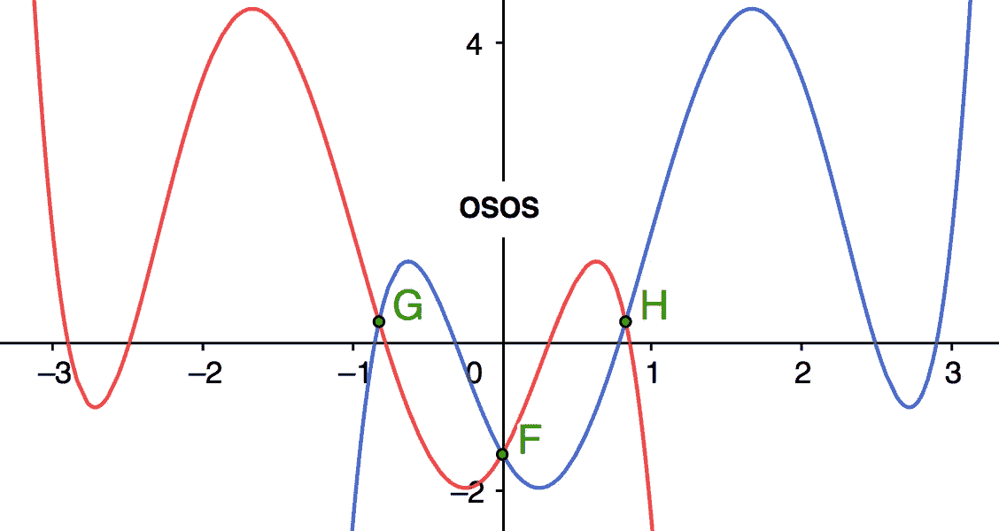
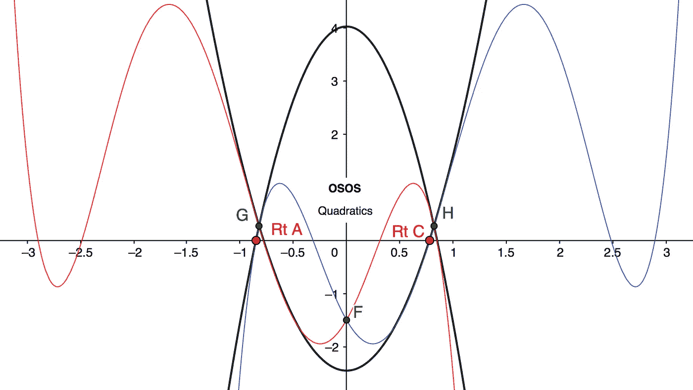
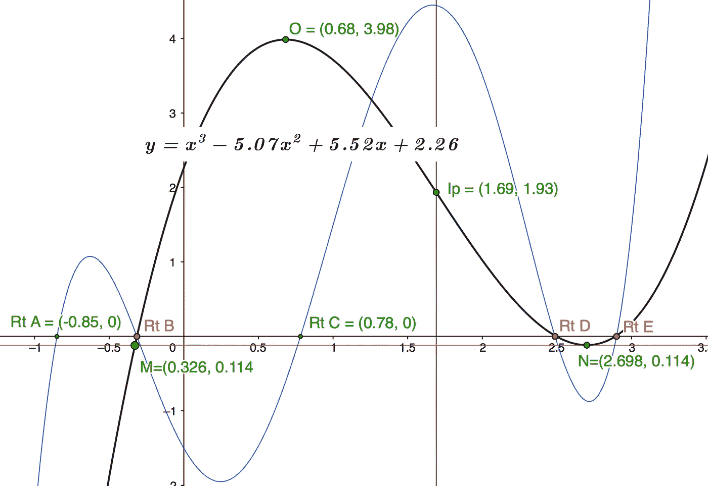
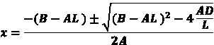

# 五次多项式根——带有“OSOS”四次项和一个复杂的三次项

> 原文：<https://pub.towardsai.net/quintic-polynomial-roots-with-osos-quads-and-a-tricky-cubic-3033af08ebf3?source=collection_archive---------2----------------------->

## 从“OSOS”二次方程开始寻找五次多项式根的工具包

这篇文章介绍了可行的五次方根解决方案，使用一个配制好的 Y 轴 180 度旋转镜像**‘OSOS’**孪生函数，用两个相反的二次方根复制 2 个方根，然后用一个三次方根混合 1 个方根，最后 2 个方根。

对于任何一个 5 次多项式，只需要找到 3 个根，因为其他 2 个根都是从我在 [*三次多项式中提出的扩展二次方程中简单导出的——一种更简单的方法*](https://medium.com/swlh/cubic-polynomials-7b3cd2dc154e?sk=4fedf5ac00cdb51233afad5b2baedbc0) *。* 为了完整起见，我将在这篇文章中介绍这个方法。

OO**SOS**

**OSOS** 是一个配制好的双四次函数，系数为'**O**p posite**S**ame**O**p posite**S**ame '**+-**。它为牛顿或其他近似方法的应用创建战略节点截距。我最近贴出了 [*四次多项式根——用二次数学和 SOSO*](/quartic-polynomial-roots-with-quadratic-math-and-soso-8920f555dc57) 提供了类似的二次替代方法。

参考下图 1，该图显示:

我们进行分析的主要函数，***【y=x⁵-5x⁴+4.5x+6x-3.5x-1.5】****以蓝色显示，其'**osos**twin***y=-x⁵-5x⁴-4.5x+6x+3.5x-1.5***以红色显示。*

*截距 ***G*** 和*H 对称，截距 ***F=(0，F*** 常数项 ***)*****

**图表 1**

****

****图表 1 OSOS 双胞胎****

> **注意:镜像对称使得根和因子与 **OSOS** 孪晶大小相等，方向相反。**

*****节点 F、G、*** 和 ***H、*** 由孪生函数的截距创建，2 个非零节点为 2 个二次多项式创建坐标点，其坐标梯度与五次函数相同。**

**下图 2 中以黑色显示的这两个二次曲线的根非常接近红色的四次曲线' ***Rt A*** 和 ***Rt C*** 。**

**Q **无人机拦截功能****

**请注意，二次曲线与五次曲线在节点以外的曲率非常接近，尤其是在五次曲线的根处。这两个二次方程的解将产生这些根的非常好的近似。**

**图表 2**

****

**图 2 OSOS 二次曲线**

## ****计算节点****

*****y=x⁵-5x⁴+4.5x+6x-3.5x-1.5***带 **OSOS** 双胎:**

*****y=-x⁵-5x⁴-4.5x+6x+3.5x-1.5***屈服；**

*****【y=2x⁵+9x -7x=2x(x⁴+4.5x-3.5】*****代入 ***u=x*** 并用标准二次方程求解:****

*****x =+-SqRt【0.676】***因此:**

*****节点 G(x)=-0.822*** 和 ***节点 H(x)=+0.822*** 给出；**

*****G=(-0.822，0.27)*** 和 ***H=(0.822，0.27)*****

## ****计算五次梯度****

****节点 G —蓝色五分点****

*****y=x⁵-5x⁴+4.5x+6x-3.5x-1.5。***At***x =-0.822***；**

*****dy/dx=5x⁴-20x+13.5 x+12x-3.5 = 9.149*****

> ***注意这也是* =- **dy/dx(节点 H)** *红色由于****【OSOS】****Y 轴镜像对称。***

****节点 H —蓝色五分图****

*****y=x⁵-5x⁴+4.5x+6x-3.5x-1.5。***At***x =+0.822***；**

*****dy/dx=5x⁴-20x+13.5 x+12x-3.5 = 6.661*****

> ***再注意一下这个****=*-节点 G** *红色渐变。***

## **二次匹配**

*****节点 G/根 A*****

**设 ***y=ax +c*** 表示与 **OSOS (** 蓝色)在 ***节点 G(-0.822，0.27)*** 处斜率相同的截距二次曲线，因此:**

1.  *****y = ax+c = 0.27***，因此:***c = 0.27–0.672 a***；**
2.  *****dy/dx = 2ax =-1.644 a = 9.149***因此；**
3.  ****T5 a =-5.565。短接于 1；****
4.  *****c = 0.27–0.672 a = 0.27+3.74 = 4.01***因此；**

*****y =-5.565 x+4.01***带根***-0.85******+0.85*****

**根与实际五次方根 ***Rt A=-0.85*****

*****节点 H/根 C*****

**设 ***y=ax +c*** 表示在 ***【节点 H(0.822，0.27)*** 【处】与 **OSOS (** 蓝色)等斜率的截距二次曲线，因此:**

1.  *****y=ax +c=0.27*** ，因此:***c = 0.27–0.675 a***；**
2.  *****dy/dx = 2ax = 1.644 a = 6.66***因此；**
3.  ****a = 4.051。短接于 1；****
4.  *****c = 0.27–0.675 a = 0.27–2.734 =-2.464***因此；**

*****y = 4.05 x-2.464***带根***-0.78******+0.78*****

**与实际的五次方 ***Rt C=0.78*** 进行精确比较**

**Cubic 菜单**

**找到 OSOS 的 2 个根后，剩下的 3 个我们有了很多选择。我自己的一些帖子是:**

**[*多项式根-扇形弧和牛顿近似加一点点*](https://www.cantorsparadise.com/polynomial-roots-newtons-approximation-plus-a-little-bit-76f487b8300)**

**[*最简单的立方根*](https://www.cantorsparadise.com/the-simplest-cube-root-eab21fd97ea0)**

**[*三次多项式旋转求根*](https://www.cantorsparadise.com/cubic-polynomials-rotation-to-calculate-roots-89e2fd22235d)**

> **但是正如我们将会看到的，牛顿的近似将会做得很好！**

**师师**何手我们已经打过交道了****

**在我们开始之前，让我们来看一下当我们用五次曲线除以现在已知的二次曲线***y =(x+0.85)(x-0.78)= x+0.07 x-0.663***时的商三次曲线。**

**使用我早先帖子的一个版本， [*带余数的视觉除法-A 部分*](https://medium.com/swlh/polynomials-division-by-vision-with-remainders-part-a-3f0f36a88a45) 我们可以产生一个没有余数的立方商，如下所示:**

**将***x⁵-5x⁴+4.5x+6x-3.5x-1.5***除以**

*****x+0.07 x-0.663*****

**除以 Vis:商***y = x+(B-B)x+[(C-C)-(B-B)B]x+F/C***因此:**

*****y = x-5.07 x+[5.163-(-5.07 * 0.07)]x+2.262***因此:**

> *****立方 y=x -5.07x +5.52x+2.26*****

**如下面图 3 中黑色部分所示，根 ***Rt B*** 、 ***Rt D、*** 和 ***Rt E*** 为红色。**

**图表 3**

****

**图 3 立方根**

****观察结果****

**为了决定使用哪种求根方法，使用容易计算的坐标来研究函数的架构是值得的，因为不是所有的方法在单次迭代中都给出令人满意的结果。**

**在这种情况下，转折点 ***O(0.682，3.98)******N(2.698，-0.114)*** 显示*N***-0.114***仅在 X 轴下方！***

**对于大多数直线近似方法来说，这是一个**最坏情况**场景，因为梯度的快速变化发生在***Rt******D***和 ***Rt E*** 附近。**

> **然而，它呈现了“孤独” **Rt B** 的**最佳**情况场景，其非常接近 X 轴，并且在**节点 M** 处具有接近恒定的梯度，截距为 ***y=-0.114*** 。**

**这表明采用牛顿近似法的单次迭代是最佳选择。幸运的是 ***节点 M*** 简单计算如下:**

**给定 Std 立方 ***y=Ax +Bx +Cx+D*** 用 ***A=1*** :**

**使用系数之和***2 * N(x)+M(x)=-系数 B*** 因此:**

*****2 * 2.698+M(x)=系数 B=5.07*** 因此；**

*****M(x)= 5.07–5.396 =-0.326***如绿色所示。**

****牛顿近似法****

**从 ***节点 M*** 应用牛顿近似法:**

*****y = x-5.07 x+5.518 x+2.26 @ x =-0.326*****

*****dy/dx = 3x-10.14 x+5.518 = 0.319+3.306+5.518 = 9.143***因此:**

**三角形的邻边***δx =-0.114/9.143 =-0.0125***因此；**

*****根 B =-0.326+0.0125 =-0.3135***与五次实际 ***Rt B=-0.31*** 。**

## **剩余根**

**剩下的 2 个根， ***Rt D*** 和 ***Rt E*** 可以简单地从在 [*三次多项式中提出的扩展二次方程 I 中下载——四次应用中更简单的方法*](https://medium.com/swlh/cubic-polynomials-7b3cd2dc154e?sk=4fedf5ac00cdb51233afad5b2baedbc0) ,如下:**

*****y = Ax+Bx+Cx+D*；****

****

**扩展的二次方程-立方应用**

**其中 ***A*** 到 ***D*** 是通常的三次多项式系数和函数的常数项***y = Ax+Bx+Cx+D******L***本例中已知因子 ***=0.3135*** 。**

**屈服:***x = 2.692+-0.1628 =+2.53***和 ***+2.86*** 。**

**与五次实际值相比；***Rt D =+2.49******Rt E = 2.90*****

> **爱好者注意:用很小的因子除常数时，需要去 4 位小数才能得到好的结果。**

**年代年代**摘要****

**用两个相反的二次曲线求根在数学上是直观的，给出了非常好的近似。它还应该有助于函数设计应用，其中五次构造以容易可视化的截距节点开始，而相反的二次构造以其简单的梯度引导所需的根值。**

**使用 **OSOS** 节点优于任何随机的*值选择，因为(根=-因子)可以从相同的节点高度 ***y*** 计算中计算出来。除此之外，这些节点为功能的架构提供了一些规则和“视觉”视角。***

**无论如何，如果你只是想知道根，计算器是很难击败的，但它不是很有趣，也不会教你很多关于多项式的过程。毕竟数学是图形！**