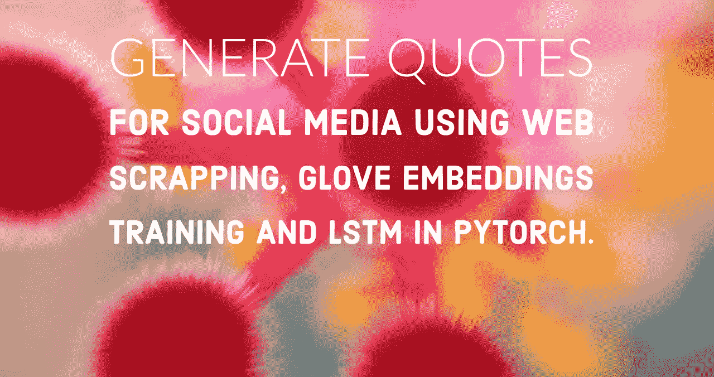
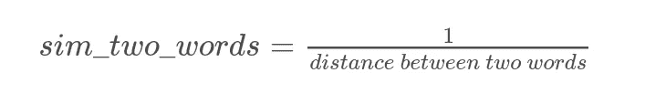
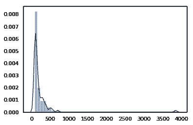
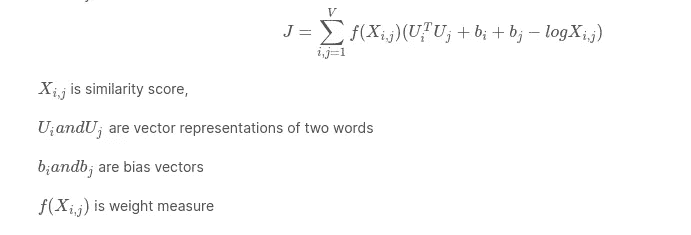
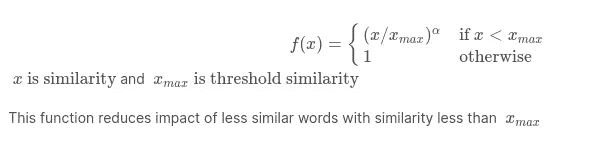
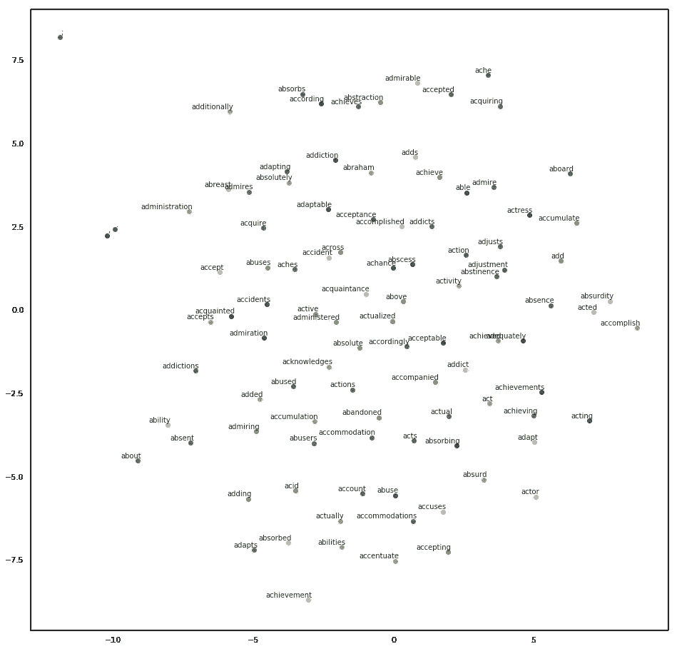

# 使用 Pytorch 中的网络报废、手套嵌入和 LSTM 生成报价

> 原文：<https://pub.towardsai.net/quotes-generation-for-social-media-with-web-scrapping-glove-embeddings-training-and-lstm-in-e07c03491f15?source=collection_archive---------4----------------------->



# 介绍

随着自然语言处理特别是语言模型研究的进展，文本生成——一个经典的机器学习任务使用递归网络来解决。

在本文中，我们将使用单词级语言模型从头开始生成英语引语。Web 报废以获得数据集
2。手套嵌入训练
3。LSTM 型号
4。预言；预测；预告

# Web 报废

我们使用网络报废从网站[收集名言警句](http://www.wiseoldsayings.com/)。这个网站有近 4000 个不同类别的报价。我不会在这篇文章中讲述如何做到这一点，因为这超出了本文的范围。但在“robots.txt”允许的情况下，从这个网站上删除是合法的。

由于这个网站的主页列出了所有类别，每个类别的爬行不同于主页 URL 的唯一后缀，首先，收集所有类别，在下一步中，爬行每个类别，并从页面中提取报价。
**注意:**一个类别可能包含多个页面，如第 1 页、第 2 页……

**我已经在 Kaggle 上传了这些提取的报价作为数据集。**

[](https://www.kaggle.com/santhalnr/quotations) [## 英语语录

### 4000 个英文报价网站被废弃](https://www.kaggle.com/santhalnr/quotations) 

# Glove(单词表示的全局向量)

对于语言模型来说，单词到嵌入的映射使得维数空间比一键向量编码低，因为词汇大小非常大。

glove 方法捕获单词对的全局上下文和局部上下文。
在[这里](https://nlp.stanford.edu/pubs/glove.pdf)阅读更多关于手套的文章。

使用[预训练的](https://nlp.stanford.edu/projects/glove/)手套权重正确地将单词表示到维度空间中，但是在本文中，我们为单词实现了自己的手套嵌入。
词汇中的单词被表示为嵌入，并用手套方法进行训练。因此，在从原始数据集中获取报价时，要准备好词汇。

```
Read quotes with minimum word count of 5 (User Choice) to maintain minimum length quotation.
As quotes contain ',' '.', and '-' next to a word like "Ciao Bello, Howdy? ", for better tokenization add space between words and special characters.
Also append ';' as end-of-quote token.
```

在每段引语中，使用独特的词，组成词汇。

此外，单词不能直接用于神经网络，将单词映射到整数，将整数映射到单词，以获得单词。

```
To train glove embeddings we need co-occurance matrix between words in vocabulary.
Follow sliding window method by fixing window size (context range between words) iterating each quote, and calcuate similarity as a function of reciprocal of distance between two words with in window.
```

共现矩阵捕捉语料库中单词的全局上下文。共现矩阵是一个字典，以词对作为关键字，以值作为相似性得分。



观察词与词之间相似度得分的分布:

```
topk,ind=torch.topk(torch.tensor(list(co_occ_matrix.values())),200)
sns.distplot(topk)
```



该图显示了前 200 个相似性得分的分布，这些得分大多低于 100。这是由于语料库的规模较小。

```
elem_den = []
for i **in** co_occ_matrix.values():
    if i > 0 **and** i < 10:
        elem_den.append(i)
sns.violinplot(x = elem_den)
```


Violin plot 显示，对于给定的上下文范围 5，语料库中出现的大多数百分比的词对非常罕见，相似度小于 1。

这些作为关键字存储在字典中的词对捕获本地上下文，并且我们使用这些关键字来训练嵌入。

Glove 试图通过移动接近全局上下文相似性的局部上下文词对的维度来表示接近全局上下文和局部上下文的向量嵌入。

像所有的神经网络一样，手套嵌入通过定义如下所示的损失函数来训练。



想象零件乘积和偏差相加作为经典的 MLP 网络输出
y-hat，我们训练这些向量以减少接近于零的损失，将 y-hat 映射到 y，y 在这里是相似性得分的对数。

损失函数是具有加权求和的定制损失，其中权重表示当前单词对在通过减少倒数幂中的稀有单词对分数来计算损失时的影响程度。



在上面的表达式中，alpha 小于 1，相似性得分小于阈值相似性的词对被赋予较小的权重，而相似性高于阈值的词对保持原样。

我们使用 128 个维度进行单词嵌入，并且只训练 100 个时期，以避免由于语料库规模小而过度拟合。

手套模型的输入是形状为 **( batch_size，indices _ 1，index _ 2)**的批中单词对的矢量表示，其中**索引**是给定批中单词的数字整数，Pytorch 嵌入层自动创建形状为 **(vocab_len，num_dim)** 的这些索引的矢量维度。

在手套模型中训练的权重具有形状 **(Vocab_len，num_dim)** 是每个单词在具有维度 **num_dim 的词汇表中的嵌入。**

由于我们将单词对副本存储为 **a-b** 和 **b-a** 类型以增加输入大小，我们简单地添加了两个权重 **Ui** 和 **Uj。**

```
emb_i = glove.ui.weight.cpu().data.numpy()
emb_j = glove.uj.weight.cpu().data.numpy()
emb = emb_i + emb_j
```

**emb** 是维 **(Vocab_len，num_dim)词汇表中单词的最终单词嵌入。**

通过使用 TSNE 将高维向量空间映射到 2D 来可视化这些嵌入。



2D 首次推出 100 个单词

[](https://colab.research.google.com/drive/1MlsQUliIUiyWe42gS5OkItwFpe-FuwpV) [## 报价 _ 世代 _ 手套 _LSTM_Pytorch](https://colab.research.google.com/drive/1MlsQUliIUiyWe42gS5OkItwFpe-FuwpV) 

如果需要，可以在 Google Colab 中运行模型。

# 报价生成— LSTM 模型

像所有语言模型一样，可变长度的序列不能直接馈入网络，因为神经网络只接受固定维度的输入。为此，我们采用固定大小的序列长度，并为下一个输入中断额外的序列。
我们遵循经典的文本生成模型，传递一个固定的输入序列，得到序列中的下一个单词作为输出。我们通过获取固定大小的输入序列并作为当前序列后的下一个单词输出来准备数据集。我们对语料库中的所有引用都这样做。

```
**Ex:** Sequence "Love means never having to say you're sorry . ;"
';' is end-of-sequence. If fixed input length 7 then input and next word as output are input                              next word
_______________________________________    _________________________
Love means never having to say you're              sorry
means never having to say you're sorry               .
never having to say you're sorry .                   ; 
```

我们使用一个简单的模型来生成文本，在密集层之后有一个单 LSTM 层，以利用损失函数 Cross_Entropy_Loss 来获得下一个单词的概率。

对于每个时期**，单元状态(h_c)** 和**隐藏激活(h_h)** 必须重新初始化，否则丢失不会减少，也不会有训练。由于词汇表非常大，并且计算值可能很大，这取决于网络的大小，因此使用梯度裁剪可以防止模型发生梯度爆炸，从而导致 **nan** 丢失。

# 生成报价

在训练输出给定输入序列的下一个词的概率的模型之后，通过将初始种子馈送到网络以获得下一个词的概率来进行报价生成，使用技术[温度](https://towardsdatascience.com/how-to-sample-from-language-models-682bceb97277)对这些概率进行采样，并将生成的下一个词添加到最后一个索引，同时移除先前输入中的第一个词以保持窗口大小以馈送到网络。重复此操作，直到输出的引号字符或 generated_length 小于 max_len。

具有很少的训练时期、小规模的语料库并且没有超参数调整模型生成的报价:

```
"there is no one love was . life being you'll or and the , is all her all heaven comes with order they to you . , you hurt get when hope that for , of the which for for no others having take being the gone free is me the by knows where for"
```

Kaggle 笔记本:

[](https://www.kaggle.com/santhalnr/quote-generation-glove-training-lstm-pytorch) [## 报价生成手套培训+LSTM pytorch

www.kaggle.com](https://www.kaggle.com/santhalnr/quote-generation-glove-training-lstm-pytorch) 

Github 回购:

[](https://github.com/santhalakshminarayana/Quotation_Generation_Glove_LSTM_Pytorch) [## santhalakshminarayana/Quotation _ Generation _ Glove _ LSTM _ py torch

### 报价生成使用 LSTM - Pytorch 与自定义嵌入训练手套模型。

github.com](https://github.com/santhalakshminarayana/Quotation_Generation_Glove_LSTM_Pytorch)