# QWeb:使用 DQN 解决网页导航问题

> 原文：<https://pub.towardsai.net/qweb-solvingweb-navigation-problems-using-dqn-8d40ac6a7a5e?source=collection_archive---------0----------------------->

## 学习导航网络| [走向人工智能](https://towardsai.net)

## 学习准确浏览网页

照片由 [Unsplash](https://unsplash.com/s/photos/web-navigation?utm_source=unsplash&utm_medium=referral&utm_content=creditCopyText) 上的[émile Perron](https://unsplash.com/@emilep?utm_source=unsplash&utm_medium=referral&utm_content=creditCopyText)拍摄

# 介绍

模型强化学习算法在很多现实游戏中都取得了惊人的成绩，比如 [Alpha Go](https://deepmind.com/research/case-studies/alphago-the-story-so-far) 和 [OpenAI Five](https://openai.com/five/) 。在本文中，我们讨论了强化学习的一个更贴近生活的应用，称为网络导航问题，其中一个代理按照一些指令学习导航网络。具体来说，我们讨论了一种由 Gur 等人在 2019 年 ICLR 会议上提出的名为 QWeb 的算法，该算法利用 DQN 来解决网络导航问题。

尽管这里没有进行数学推理，但我仍然放了许多数学表达式来说明底层的过程。为了更好的可读性，你可能想参考[我的个人博客](https://xlnwel.github.io/blog/reinforcement%20learning/QWeb/)。

# 预赛

## 网页导航问题的简单介绍

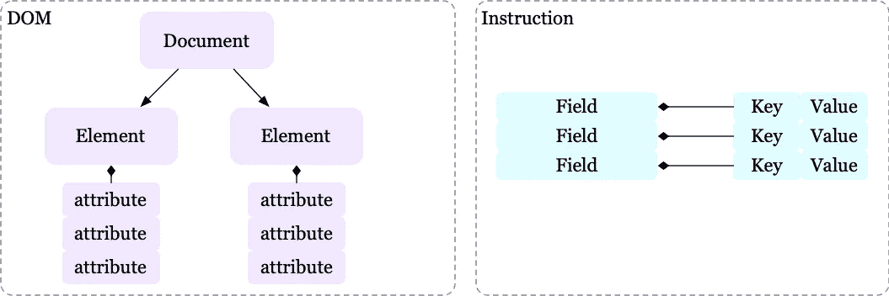

web 导航问题中的 DOM 树和指令示例

我们首先介绍网络导航问题中的两个术语:

*   DOM 是网页的树形表示，其元素被表示为一列命名属性。
*   **指令**是由键值对表示的字段列表。

代理的目标是导航网页(即，修改 DOM 树)以使其符合指令。下图演示了几个 MiniWoB web 任务:

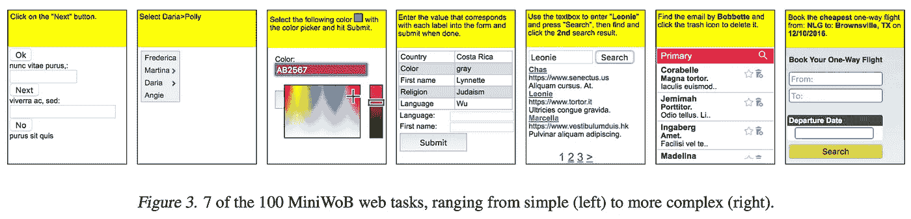

资料来源:石等《比特的世界:一个开放域的网络代理平台》

## 问题设置

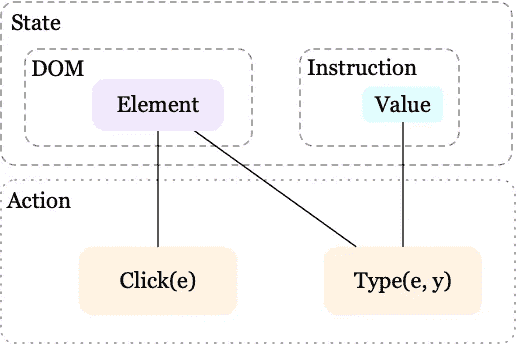

QWeb 的状态和动作空间

我们首先为我们的问题制定 MDP， *M= < S，𝜌，a，p，r，g，𝛾 >* ，其中𝜌表示初始状态分布，转移函数 *P* 是确定性的，目标 *G* 由指令指定，𝛾是贴现因子。其余符号定义如下:

*   **状态空间、** *S、*由指令和 DOM 树组成。
*   **动作空间，** *A，*包含两个复合动作 *Click(e)* 和 *Type(e，y)* ，其中 *e* 是一个叶子 DOM 元素， *y* 是一个指令中字段的值。我们进一步引入三个原子动作来表达这些复合动作: *a^D* 选择一个 DOM 元素 *e* ， *a^C* 指定一个点击或键入动作， *a^T* 生成一个类型序列。现在我们可以用*a^d=e**a^c='click'*和*类型(e，y)*a^d=e*a^c='type'*来表示*点击(e)* 。
*   **奖励，** *R，*是一集最终状态和最终目标状态的函数。如果这些状态相同，则为 *+1* ，否则为 *-1* 。不给予中间奖励。

# QWeb

QWeb 使用深度 Q 网络(DQN)来为每个状态和每个原子动作生成 Q 值，从而解决了上述问题。在奖励增加和一些课程学习方法的帮助下，培训过程几乎与传统的 DQN 相同，我们将在后面讨论。但是现在让我们首先关注 QWeb 的架构，它本质上是这个算法最有成果的部分。

## 体系结构

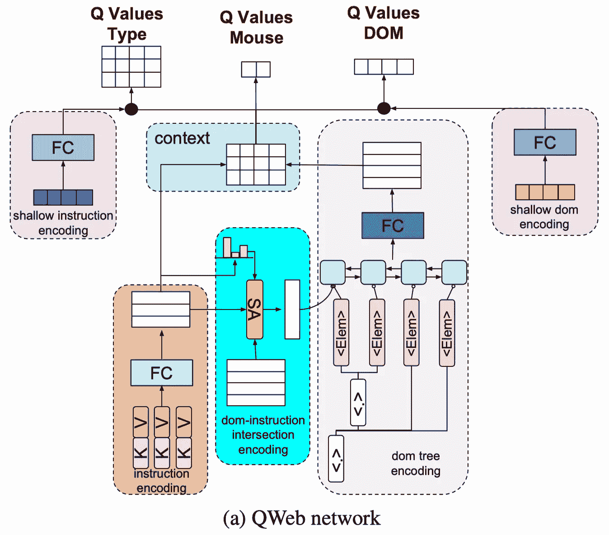

来源:Gur 等人,《学会浏览网页》

我们详细讨论了上图中的每个部分

**编码用户指令**:正如我们在预备知识中看到的，一条用户指令由一系列字段组成，即键值对 *< K，V >* 。为了产生一个表示，我们首先对关键字中的单词进行编码，对于第 *i* 对的关键字中的第 *j* 个单词，给出我们 *f(i，j)* 。然后我们将一个关键字表示为这些嵌入的平均值，即*f _ K(I)= { 1 \ over N } \ sum _ { j } f _ { K }(I，j)* ，其中 *N* 是关键字的字数。我们也遵循相同的过程来编码值，具有嵌入 *f_V(i，j)* 和 *f_V(i)* 。然后通过全连接层进一步编码键和值嵌入的串联产生指令字段，即 *f(i)=FC([f_K(i)，f_V(i)])* ，其中*【。】*表示矢量拼接。整个指令现在可以表示为 *f=Stack(f(i))* ，一个矩阵，它的行是指令字段。

**编码 DOM-指令交集**:我们首先通过平均每个序列和每个属性上的单词嵌入来编码 DOM 元素 *j* ，这给了我们 *D(j)* 。然后对于每个指令字段 *f(i)* 和每个嵌入 *D(j)* 的元素，我们通过编码器 *E(f(i)，D(j))* 进行编码。 *D(j)* 的条件嵌入可以表示为这些嵌入的加权平均，即*E _ { cond }(j)= \ sum _ { I } p _ { I } E(f(I)，D(j))* ，其中概率 *p_i=softmax(u*f(i))* ，其中 *u* 为可训练向量。人们可以把 *E_C* 作为一个自我关注模块，其中 *Q=u，K=f，*和 *V=E(f，D)* 。(如果你想了解更多关于自我关注的信息，请参考[这篇文章](https://medium.com/towards-artificial-intelligence/attention-is-all-you-need-transformer-4c34aa78308f)

**编码 DOM 树**:我们将条件 DOM 元素嵌入 *E_{cond}(j)* 与 DOM 元素嵌入 *D(j)* 连接起来，为每个 DOM 元素生成一个向量， *E_{conc}(j)=[E_{cond}(j)，D(j)】*。然后，我们在 DOM 元素列表的顶部运行一个双向 LSTM(biLSTM)网络来编码 DOM 树。biLSTM 的每个输出向量然后通过具有 tanh 的全连接层进行变换，以生成 DOM 元素表示，即*E _ { tree }(j)= tanh(FC(bil STM(E _ { conc }(j)))*。

**生成 *Q* 值**:我们计算每个字段和每个 DOM 元素之间的成对相似性，以生成一个上下文矩阵 *M=fE_{tree}^T* ，其中 *M* 的行和列分别显示当前状态下每个字段和每个 DOM 元素的后验值——注意 *M[i][j]* 是 *f(i)* 和 *E_{tree}(j)的点积我们现在使用 *M* 的行作为每个指令字段的 *Q* 值，即 *Q(s，a^t=i)=m[i】*。我们计算每个 DOM 元素的 *Q* 值，通过全连接层变换 *M* 并对行求和，即 *Q(s，a^D)=sum(FC(M^T)，1)* ，其中 *M^T* 是 *M* 的转置。最后，通过使用另一个全连接层，即*【q(s,a^c)=fc(m^t】*，将 *M* 的行转换成 *2* 维向量，生成 DOM 元素上的点击和键入动作的 *Q* 值。*

**结合浅层编码**:在回报稀少且输入词汇较多的情况下，例如在有数百个机场的机票预订环境中，仅使用单词嵌入很难学习到良好的语义相似性。Gur 等人提出用浅层指令和 DOM 树编码来扩充深层 *Q* 网络，以缓解这个问题。对于浅层编码，我们首先将指令字段和 DOM 元素的嵌入矩阵定义为基于单词的相似性，例如 Jaccard 相似性、诸如子集或超集的二进制指示符。我们举一个具体的例子，看看这个嵌入矩阵是什么样子的。假设指令字段的语料库由 *["loc "，" date "，" name"]* 组成，DOM 元素的语料库由 *["name "，" loc"]* 组成，对应的浅层编码矩阵如下所示

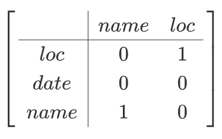

Jaccard 相似性示例

通过分别对浅编码矩阵的列或行求和，生成 DOM 元素或指令字段的浅输入向量。举上面的例子；如果我们有一个指令字段 *["loc" "name"]* ，那么得到的输入向量就是 *[0，1] +[1，0]=[1，1]* 。然后，使用带有 tanh 的全连接层对这些浅层输入向量进行转换，并通过可训练变量进行缩放，以生成相应的浅层 *Q* 值。最终值是深值和浅值的组合

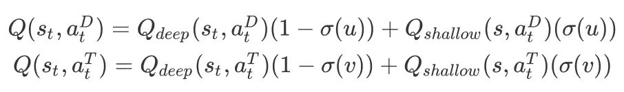

DOM 和 type action 的最终 Q 值，其中 u 和 v 是训练期间学习的标量变量

## 奖励增加

关于架构就说这么多，现在让我们把注意力转移到奖励函数上。预备中定义的环境奖励函数极其稀疏——代理仅在情节结束时获得奖励，更糟糕的是，成功状态是总状态空间的一小部分，这使得成功奖励更加稀疏。因此，作者介绍了潜在的补救奖励。具体来说，它们定义了一个势函数 *Potential(s，g)* ，该函数计算当前状态 *s* 和目标状态 *g* 之间匹配 DOM 元素的数量。然后，潜在回报函数被计算为下一状态和当前状态的两个潜在值之间的比例差:

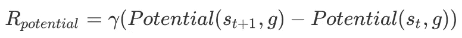

潜在回报

# 课程学习

作者还提出了两种加速学习过程的课程学习策略:

*   热启动:为了加快学习过程，我们通过选择接近目标状态的初始状态来热启动一集。这些初始状态可以通过随机选择 DOM 元素的子集并让 oracle 代理执行正确的操作来获得。热启动的初始状态和目标状态之间的距离随着训练的进行而增加——这可以通过缩小所选子集来容易地实现。
*   **目标模拟**:我们也像 [HER](https://arxiv.org/abs/1707.01495) 所做的那样，将初始状态附近的状态重新标记为子目标，但是这里这些状态是由 oracle 代理生成的。和以前一样，子目标和初始状态之间的距离随着训练的进行而增加。

## 算法

算法现在应该很清楚了:

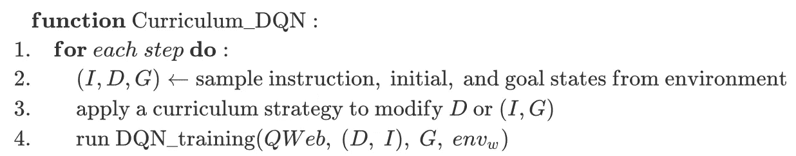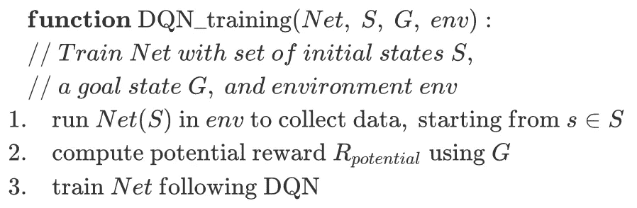

# MetaQWeb

在上面的方法中，我们求助于 oracle 代理来加速稀疏回报问题中的学习过程，然而，有时拥有 oracle 代理是一种奢侈。Gur 等人建议将任意导航策略视为某个隐藏指令的专家指令遵循策略。如果我们能够恢复潜在的指令，我们就可以自主地生成新的专家演示，并使用它们来进行课程学习。直观地说，从策略生成指令比遵循指令更容易，因为我们不需要导航器与动态网页交互并采取复杂的动作。在这一节中，我们首先看到如何创建一个任意的导航策略，然后给出一种方法来推断给定策略的指令。为了完整起见，我们将把它们放在一起。

# 基于规则的随机策略(RBRP)

基于规则的随机化策略(RBRP，出于某种隐晦的原因，作者将其命名为 RRND，为了便于理解，我们采用这个缩写)迭代地访问当前状态下的每个 DOM 元素并采取行动。它在访问完所有 DOM 元素后停止，并返回最终状态作为目标状态以及所有中间状态-动作对。我们把这些状态-动作对看作是由某种最优策略产生的。

# 指令生成环境

为了训练从目标状态推断指令的代理，我们定义了具有以下属性的指令生成环境:

*   我们为每个环境预定义了一组可能的指令密钥
*   状态空间由采样的目标和指令中的单个密钥组成，采样时不替换预定义密钥集中的密钥
*   指令动作是由 1) *a^D* 和 2)*a^a*组成的复合动作，前者选择一个 DOM 元素，后者生成一个对应于当前键的值。
*   在每个动作之后，如果相应键的生成值是正确的，代理将收到一个正奖励(+ *1* ),否则将收到一个负奖励( *-1* )。初始状态和目标状态采用 QWeb 等课程学习策略进行采样。

# INET

INET 将指令键和目标 DOM 树作为输入，并输出实现目标的完整指令。这是通过顺序填充由指令生成环境预定义的每个键的值来完成的。值由一个复合动作生成:找到一个 DOM 元素；从元素中选择一个 DOM 属性作为值。接下来，我们介绍 INET 架构。

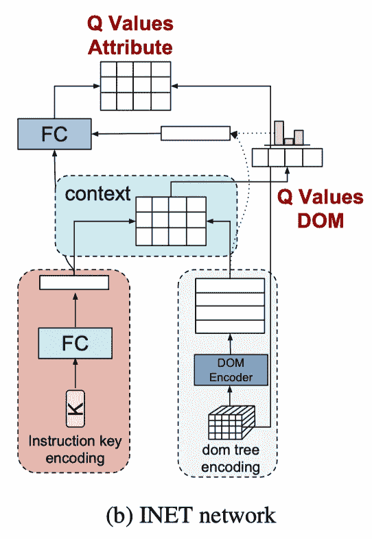

来源:Gur 等人,《学会浏览网页》

INET 使用与 QWeb 类似的结构来编码指令键和 DOM 树，导致分别为键和树嵌入 *f_K(i)* 和 *E_{tree}* 。然后我们计算出 *a^D* 的 *Q* 值为*q^i(s_t,a^d)=f_k(i)e_{tree}^t*，a^A 的 *Q* 值为 *Q^I(a,a^A，a^d=j)=fc([e_{tree}[j],f_k(i】)*其中*。】*表示矢量拼接。

## 算法

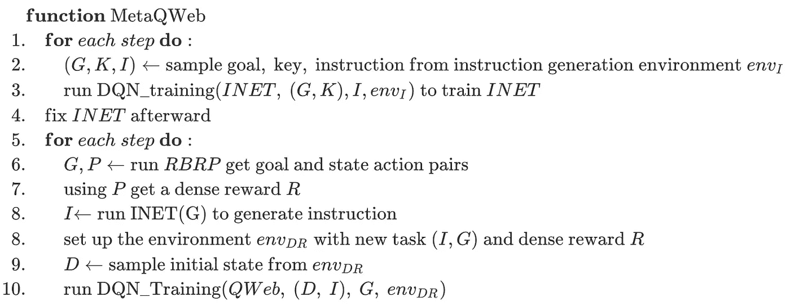

MetaQWeb 算法

在 MetaQWeb 中，RBRP 随机生成一个目标和一个从当前 DOM 状态实现该目标的“最优”策略，然后 INET 试图找到将代理引向该目标的底层指令。然后这些数据被输入到 QWeb 来训练我们的网络导航算法。

如果我们把国家-行动对看作由某种最优政策产生的最优轨迹，那么密集报酬可能是某种示范损失。然而，作者似乎采取了基于潜力的奖励，如前一节所述。

# 实验结果

正如我们所看到的，QWeb 能够在基于 DQN 的实验中表现出出色的性能。

# 参考

Izzeddin Gur，Ulrich Rueckert，Aleksandra Faust，Dilek Hakkani-Tur。学习在 2019 年的 ICLR 浏览网页