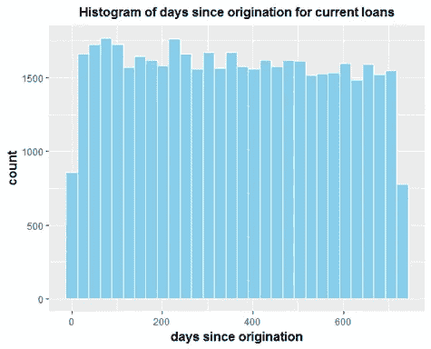
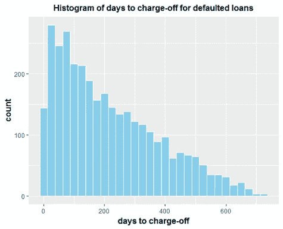
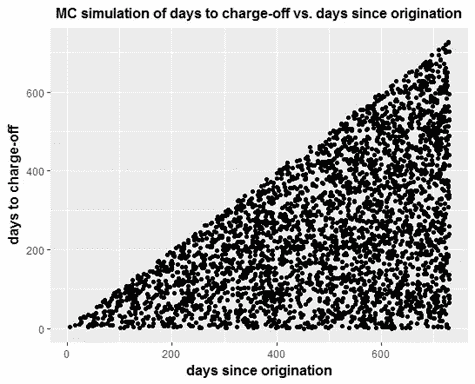

# 数据科学编码练习的 r 脚本

> 原文：<https://pub.towardsai.net/r-script-for-data-science-coding-exercise-633800dd63ec?source=collection_archive---------1----------------------->


萨法尔·萨法罗夫在 [Unsplash](https://unsplash.com?utm_source=medium&utm_medium=referral) 上拍摄的照片

## 一些编码挑战问题会指定一个正式的项目报告与一个 Jupyter 笔记本或 R 脚本文件一起提交

# 一.导言

带回家的挑战问题或编码练习是数据科学家面试流程中最重要的一步。这通常是一个数据科学问题，例如机器学习模型、线性回归、分类问题、时间序列分析等。一般来说，面试团队会给你提供项目方向和数据集。

一些编码挑战问题会指定一个正式的项目报告与一个 Jupyter 笔记本或 R 脚本文件一起提交。在本文中，我们给出了一个带回家的挑战问题的示例 R 脚本。

# 二。项目说明

*在这个问题中，你将预测贷款组合的结果。每笔贷款计划在 3 年内偿还，结构如下:*

*   *首先，借款人收到资金。这一事件被称为起源。*
*   *然后，借款人定期还款，直到发生以下情况之一:*

*(i)借款人在 3 年期限结束前停止付款，通常是由于财务困难。这一事件被称为销账，然后贷款被称为已销账。*

*(ii)借款人继续还款，直到发放日之后 3 年。至此，债务已全部还清。*

*在附加的 CSV 中，每行对应一笔贷款，列的定义如下:*

*   *标题为“自发起以来的天数”的列表示发起和数据收集日期之间经过的天数。*
*   *对于在收集数据之前已经销账的贷款，标题为“从发起到销账的天数”的列表示发起和销账之间经过的天数。对于所有其他贷款，此栏为空白。*

***目标*** *:我们希望您估计这些贷款在全部 3 年期限结束时将会被冲销的比例。请包括你如何得到你的答案的一个严格的解释，并且包括你使用的任何代码。你可以做出简化的假设，但是请明确地陈述这些假设。* ***请随意以您喜欢的任何格式提交您的答案；特别是 PDF 和 Jupyter 笔记本都不错*** *。此外，我们希望这个项目不会占用您超过 3-6 个小时的时间。*

# 三。用于执行数据分析的 r 脚本

在为数据科学编码练习准备 Jupyter notebook 的 R 脚本时，请确保您的代码组织良好，并且它应该能够很好地反映预测建模的工作流:数据导入、探索性数据分析、模型选择、模型构建、模型测试和模型评估。

```
***# R CODE FOR PREDICTING LOAN STATUS****#author: Benjamin O. Tayo
#Date: 11/22/2018****#IMPORT NECESSARY LIBRARIES***library(readr)
library(tidyverse)
library(broom)
library(caret)***#IMPORTATION OF DATASET***df<-read_csv("loan_timing.csv",na="NA")
names(df)=c("origination","chargeoff")***#Partition dataset into two: default (charged off ) and current***index<-which(!(df$chargeoff=="NA"))
default<-df%>%slice(index)
current<-df%>%slice(-index)***# EXPLORATORY DATA ANALYSIS*****#Figure 1: Histogram of days since origination for current loans**current%>%ggplot(aes(origination))+geom_histogram(color="white",fill="skyblue")+ xlab('days since origination')+ylab('count')+ ggtitle("Histogram of days since origination for current loans")+ theme(plot.title = element_text(color="black", size=12, hjust=0.5, face="bold"),axis.title.x = element_text(color="black", size=12, face="bold"),axis.title.y = element_text(color="black", size=12, face="bold"),legend.title = element_blank())***#Figure 2: Histogram of days to charge-off for defaulted loans***default%>%ggplot(aes(chargeoff))+geom_histogram(color="white",fill="skyblue")+ xlab('days to charge-off')+ylab('count')+ ggtitle("Histogram of days to charge-off for defaulted loans")+ theme(plot.title = element_text(color="black", size=12, hjust=0.5, face="bold"), axis.title.x = element_text(color="black", size=12, face="bold"), axis.title.y = element_text(color="black", size=12, face="bold"), legend.title = element_blank())***#Figure 3: Histogram of days since origination for defaulted loans***default%>%ggplot(aes(origination))+geom_histogram(color="white",fill="skyblue")+ xlab('days since origination')+ylab('count')+ ggtitle("Histogram of days since origination for defaulted loans")+ theme(plot.title = element_text(color="black", size=12, hjust=0.5, face="bold"),axis.title.x = element_text(color="black", size=12, face="bold"),axis.title.y = element_text(color="black", size=12, face="bold"), legend.title = element_blank())***#Figure 4: Plot of days to charge-off vs. days since origination for defaulted loans***default%>%ggplot(aes(origination,chargeoff))+geom_point()+ xlab('days since origination')+ylab('days to charge-off')+ ggtitle("days to charge-off vs. days since origination")+ 
theme( plot.title = element_text(color="black", size=12, hjust=0.5, face="bold"), axis.title.x = element_text(color="black", size=12, face="bold"), axis.title.y = element_text(color="black", size=12, face="bold"),legend.title = element_blank())***#Figure 5: Monte Carlo Simulation of Defaulted Loans***set.seed(2)
N <- 3*365 ***# loan duration in days***
df_MC<
data.frame(u=round(runif(15500,0,N)),v=round(runif(15500,0,N)))
df_MC<-df_MC%>%filter(v<=u)
df_MC<-df_MC%>%filter(u<=730 & v<=730)***#select loans within 1st 2 yrs***df_MC[1:nrow(default),]%>%ggplot(aes(u,v))+geom_point()+ xlab('days since origination')+ylab('days to charge-off')+ ggtitle("MC simulation of days to charge-off vs. days since origination")+ theme(plot.title = element_text(color="black", size=12, hjust=0.5, face="bold"),axis.title.x = element_text(color="black", size=12, face="bold"),axis.title.y = element_text(color="black", size=12, face="bold"),legend.title = element_blank())***#Predicting fraction of these loans will have charged off by the time all of their 3-year terms are finished***set.seed(2)
B<-1000
fraction<-replicate(B, {
df2<-data.frame(u=round(runif(50000,0,N)),v=round(runif(50000,0,N))) df2<-df2%>%filter(v<=u) 
b2<-(df2%>%filter(u<=730 & v<=730))
total<-(nrow(df2)/nrow(b2))*nrow(default)
100.0*(total/50000.0)})***#Figure 6: Histogram for fraction of charged off loans after 3-year term using N = 1000 samples***fdf<-data.frame(fraction=fraction)
fdf%>%ggplot(aes(fraction))+geom_histogram(color="white",fill="skyblue")+ xlab('fraction of charged off loans after 3-year term')+ylab('count')+ ggtitle("Histogram of total fraction of charged off loans")+ 
theme( plot.title = element_text(color="black", size=12, hjust=0.5, face="bold"),axis.title.x = element_text(color="black", size=12, face="bold"),axis.title.y = element_text(color="black", size=12, face="bold"),legend.title = element_blank())***#Calculate Confidence Interval for Percentage of Defaulted Loans After 3-year Term***mean<-mean(fraction)
sd<-sd(fraction)
confidence_interval<-c(mean-2*sd, mean+2*sd)
```

# 四。数据分析的输出



**图 1** :当前贷款发放后天数柱状图。



**图 2** :违约贷款销账天数直方图。


**图 3** :违约贷款发放以来天数柱状图。


**图 4** :违约贷款的核销天数与发放后天数的关系图。



**图 5** :违约贷款的核销天数与发放后天数的蒙特卡洛模拟。


**图 6** :使用 N = 1000 个样本的 3 年期后核销贷款比例直方图。

**置信区间结果**:通过创建 1000 次随机试验，我们获得了 3 年贷款期限内违约贷款比例的如下分布(见**图 6** )。根据我们的计算，3 年贷款期限后将被冲销的贷款部分的 95%置信区间相应地为 14.8% +- 0.2%。

# 动词 （verb 的缩写）摘要

总之，我们已经为数据科学编码练习展示了一个示例 R 脚本。数据集、代码和项目报告可从以下链接下载:[贷款状况蒙特卡洛模拟](https://github.com/bot13956/Monte_Carlo_Simulation_Loan_Status)。

# 参考

1.  [贷款状态的蒙特卡洛模拟](https://github.com/bot13956/Monte_Carlo_Simulation_Loan_Status)。
2.  [数据科学家编码练习](https://medium.com/towards-artificial-intelligence/data-scientist-coding-exercise-e62f4de7df9e)。
3.  [数据科学家面试流程——个人经历。](https://medium.com/towards-artificial-intelligence/data-scientist-interview-process-a-personal-experience-33295495b4a0)