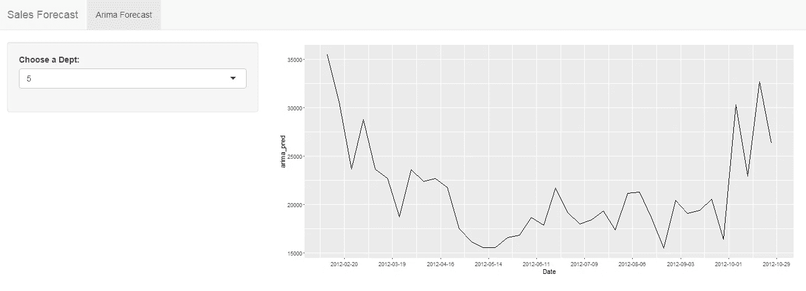

# 使用 R Shiny 创建仪表板

> 原文：<https://pub.towardsai.net/r-shiny-6592adf9479?source=collection_archive---------3----------------------->

Shiny 是一个 R 包，用于构建交互式仪表盘，用来显示预测。程序员可以使用它以有效的方式向组织成员传达数据的发现。在这篇文章中，我将展示使用 Shiny 开发仪表板的过程。我将使用一家跨国零售公司的数据，并通过点击一个按钮来预测各个部门的价值。数据集信息和可以使用的各种模型已经在上一篇文章中讨论过了。

[](https://medium.com/towards-artificial-intelligence/predicting-sales-using-r-programming-84b66d11c35d) [## 使用 R 编程预测销售额

### 在本文中，我将预测一家跨国零售公司的销售额。这方面的数据集可以在…上找到

medium.com](https://medium.com/towards-artificial-intelligence/predicting-sales-using-r-programming-84b66d11c35d) 

要使用 Shiny 创建 web 应用程序，您必须创建以下文件:

**ui。r**<——这个文件包含了关于你的仪表板前端的信息。代码类似于一个 HTML 文件。你可以用 CSS 主题、HTML 小部件和 JavaScript 动作来扩展你闪亮的应用程序。

*   navbarPage:创建一个包含顶级导航栏的页面，该导航栏可用于切换一组 tabPanel 元素。
*   tabPanel:创建一个可以包含在标签集中的标签面板。标签集对于将输出分成多个独立的可视部分非常有用。
*   sidebarLayout:创建一个带有侧边栏和主区域的布局。侧边栏以独特的背景色显示，通常包含输入控件。主区域占据水平宽度的 2/3，通常包含输出。
*   sidebarPanel:创建一个包含输入控件的侧边栏面板，这些控件可以传递给 sidebarLayout。
*   mainPanel:创建包含输出元素的主面板。

```
navbarPage(

   "Sales Forecast",

   tabPanel(
         "Arima Forecast",

          sidebarLayout( 
              sidebarPanel(
                selectInput("Dept", "Choose a Dept:",
                            list(1,2,3,4,5,6,7,8,9,10,11,12,13,14,15,16,17,18,19,20,21,22,23,24,25,26,27,28,29,30,31,32,33,34,35,36,37,38,39,40,41,42,43,44,45,46,47,48,49,50,51,52,53,54,55,56,57,58,59,60,61,62,63,64,65,66,67,68,69,70,71,72,73,74,75,76,77,78,79,80,81,82,83,84,85,86,87,88,89,90,91,92,93,94,95,96,97,98,99)

                                )
                          ) ,

                mainPanel(
                  plotOutput("result")

                         )

                      )

         )

   )
```

**服务器。r**<——这个文件包含关于后端的信息。它将包含关于所使用的库、所使用的数据集、ML 模型信息和图形信息的信息。

*   所需库: *dplyr，forecast，reshape，ggplot2，tidyverse，shiny*
*   renderPlot:渲染适合指定给输出槽的反应图。

```
function(input,output){library(dplyr)
library(forecast)
library(reshape)
library(ggplot2)
library(tidyverse)
library(shiny)train <- read.csv("C:/Users/hp/Desktop/Walmart_forecasting/train.csv")
test <-  read.csv("C:/Users/hp/Desktop/Walmart_forecasting/test.csv")output$result <- renderPlot({dept1_train <- train %>% filter(Store == "1") %>% filter( Dept %in% input$Dept)
dept1_test <- test %>% filter(Store == "1") %>% filter( Dept %in% input$Dept)
#dept1_test$ Weekly_Sales <- 0dept1_train$Date <- as.Date(dept1_train$Date , format = "%Y-%m-%d")
sample_train <- dept1_train %>% filter(Date < as.Date("2012-02-06"))
sample_test <- dept1_train %>% filter(Date >= as.Date("2012-02-06"))#ts_train <- ts(sample_train , start = c(2010,5) , frequency = 52)ts_train_uni <- ts(sample_train$Weekly_Sales , start = c(2010,5) , frequency = 52)arima_model <- auto.arima(ts_train_uni , seasonal.test = "seas"   )
 arima_pred = forecast(arima_model , h = nrow(sample_test))
 arima_pred <- as.data.frame(arima_pred$mean)
pred_data <- sample_test %>% add_column(arima_pred = arima_pred$x)
#plot(forecast(arima_model , h=38)) #arima plot
ggplot(pred_data , aes(x = Date , y = arima_pred)) + geom_line() + scale_x_date(date_breaks = "4 week")})}
```

**app。r**<——这是你合并其他两个文件并运行应用程序的父文件。

*   shinyApp:在 R 控制台使用这个函数时，闪亮的 App 对象会自动传递给运行 app 的`print()`函数。如果在函数中间调用这个函数，这个值将不会传递给`print()`，应用程序也不会运行。要运行应用程序，将应用程序对象传递给`print()`或`runApp()`。

```
library(dplyr)
library(forecast)
library(reshape)
library(ggplot2)
library(tidyverse)
library(shiny)source("ui.R")
source("server.R")shinyApp(ui = ui , server = server)
```

输出:



部门 5 的预测


部门 98 的预测

我们可以使用 R Shiny 构建交互式应用程序，并以图表、文本或表格的形式显示输出。任何熟悉 R 的人都可以利用 R 的统计和数据分析能力，并使用 R Shiny 应用程序动态显示结果。此外，与其他可视化工具相比，它是开源的并且具有成本效益。在上面的例子中，我们能够使用 ARIMA 模型预测不同部门的销售额，并且能够使用一个使用 shiny 构建的简单下拉菜单将其可视化。

*感谢您阅读本文。如果你喜欢这篇文章，请鼓掌并发表评论:)。*