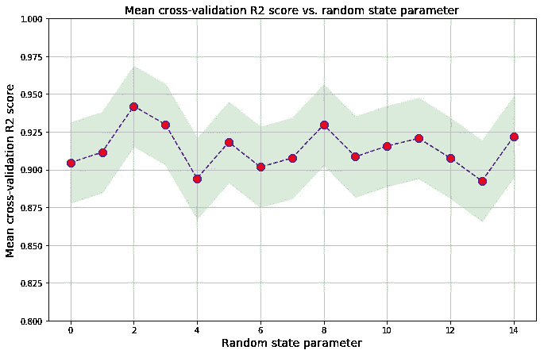

# 机器学习中的随机误差量化

> 原文：<https://pub.towardsai.net/random-error-quantification-in-machine-learning-846f6e78e519?source=collection_archive---------2----------------------->

## 每个机器学习算法都有一个固有的随机误差，必须对其进行评估和量化



Benjamin O. Tayo 的图片

# 一.导言

每个机器学习模型都有固有的随机误差。此错误源于数据集被划分为训练集和测试集的随机性。使用 sklearn，特征矩阵(X)和目标变量(y)可以划分如下:

```
from sklearn.model_selection import train_test_splitX_train, X_test, y_train, y_test = train_test_split( X, y, 
                                      test_size=0.3, random_state=i)
```

注意，通过改变 **random_state** 参数(将 I 设置为不同的整数值)，我们可以随机选择不同的训练和测试集。这种随机过程将在模型的准确性中引入随机波动。在本文中，我们将展示如何评估和量化机器学习模型中的随机误差。

# 二。数据集和模型选择

我们将使用游轮数据集[**cruise _ ship _ info . CSV**](https://github.com/bot13956/ML_Model_for_Predicting_Ships_Crew_Size)**来说明我们的随机误差量化的例子。**在之前的文章中( [**使用协方差矩阵图**](https://medium.com/towards-artificial-intelligence/feature-selection-and-dimensionality-reduction-using-covariance-matrix-plot-b4c7498abd07) 进行特征选择和维数缩减)，显示了在数据集中的 6 个预测特征[' **年龄**'、**吨位**'、**乘客**'、**长度**'、**客舱**、'**乘客密度** ]中，如果我们假设重要特征具有 那么目标变量“**乘员**”与 4 个预测变量:“**吨位**”、“**乘客**”、“**长度**、“**车厢**”强相关。 因此，我们能够将特征空间的维数从 6 降低到 4。

现在，假设我们想要建立一个线性回归模型来预测船员变量。我们的模型可以用以下形式表示:


为了评估我们的模型，我们将使用 R2 评分标准。在本文中，我们将表明，由于机器学习模型固有的随机性质，R2 分数是一个随机变量。然后，我们将计算 R2 评分的平均值和 95%的置信区间，并显示不同随机状态参数下 R2 评分的变化。

# 三。随机误差评估和量化

我们将通过改变用于将数据集划分为训练集和测试集的随机状态参数，以及 k-fold 交叉验证来评估随机误差。这个过程的伪代码如下所示:

```
n = number of random states to usefor i in range (n): X_train, X_test, y_train, y_test = train_test_split( X, y, 
                                      test_size=0.3, random_state=i) perform k-fold cross validation on X_train train_score(i) = average of R2 score over the k-foldsR2 mean value = average of train_score over n random statesR2 standard deviation = std of train_score over n random states
```

现在让我们将伪代码转换成 python 代码。

## III A .导入必要的库

```
import numpy as npimport pandas as pdimport matplotlib.pyplot as pltfrom sklearn.metrics import r2_scorefrom sklearn.model_selection import cross_val_scorefrom sklearn.model_selection import train_test_splitfrom sklearn.preprocessing import StandardScalerfrom sklearn.decomposition import PCAfrom sklearn.linear_model import LinearRegressionfrom sklearn.pipeline import Pipelinepipe_lr = Pipeline([('scl', StandardScaler()),('pca', 
                  PCA(n_components=4)),('slr', LinearRegression())])
```

## 读取数据集并选择预测值和目标变量

```
df=pd.read_csv("cruise_ship_info.csv")cols_selected = ['Tonnage', 'passengers', 'length', 'cabins','crew']X = df[cols_selected].iloc[:,0:4].values   

y = df[cols_selected]['crew'] 

sc_y = StandardScaler()train_score = []test_score =  []
```

## 模型建立、评估和随机误差量化

```
n = 15for i in range(n): X_train, X_test, y_train, y_test = train_test_split( X, y, 
                                      test_size=0.3, random_state=i) y_train_std = sc_y.fit_transform(y_train[:,   
                                           np.newaxis]).flatten() train_score = np.append(train_score, 
                            np.mean(cross_val_score(pipe_lr, 
                            X_train, y_train_std, 
                            scoring ='r2' , cv = 10)))train_mean = np.mean(train_score)train_std = np.std(train_score)print('R2 train: %.3f +/- %.3f' % (train_mean,train_std))
```

此代码的输出结果是:R2 火车:0.914 +/- 0.013。这表明该模型获得的总 R2 分数是一个随机变量，其平均值为 0.914，标准偏差为 0.013。

## III D .不同随机状态下平均交叉验证 R2 评分变化的可视化

```
plt.figure(figsize=(11,7))plt.plot(range(n),train_score,color='blue', linestyle='dashed', 
         marker='o',markerfacecolor='red', markersize=10)plt.fill_between(range(n),
                 train_score + 2*train_std,
                 train_score - 2*train_std,
                 alpha=0.15, color='green')plt.grid()plt.ylim(0.8,1)plt.title('Mean cross-validation R2 score vs. random state parameter', size = 14)plt.xlabel('Random state parameter', size = 14)plt.ylabel('Mean cross-validation R2 score', size = 14)plt.show()
```


不同随机状态的平均交叉验证 R2 分数。浅蓝色区域代表平均交叉验证 R2 评分的 95%置信区间。

该图显示了作为随机状态参数的函数绘制的平均交叉验证 R2 评分。我们看到 R2 分数是一个随机变量。浅绿色阴影区域显示了计算的 R2 分数的 95%置信区间。因此，即使总的 R2 分值是:0.914 +/- 0.013，我们看到 R2 分值对于不同的随机状态参数是不同的。

# 四。总结和结论

我们在本文中已经表明，R2 分数是一个随机变量。为了评估和量化与 R2 评分计算相关的随机误差，我们对数据集的不同随机分区进行了 k 重交叉验证，分为训练集和测试集。对于给定的模型，我们发现 R2 分数是一个随机变量，平均值为 0.914，标准偏差为 0.013。重要的是，在评估机器学习模型的预测能力时，交叉验证是针对数据集到训练集和测试集的不同随机分区实现的。这将确保用于模型评估的指标报告值的可靠性。

本文的数据集和 Jupyter 笔记本可以从这个 Github 资源库下载:[**https://Github . com/bot 13956/Random _ error _ quantization _ in _ ML**](https://github.com/bot13956/Random_error_quantification_in_ML)**。**

# 参考

1.  [使用协方差矩阵图进行特征选择和降维](https://medium.com/towards-artificial-intelligence/feature-selection-and-dimensionality-reduction-using-covariance-matrix-plot-b4c7498abd07)。
2.  拉什卡、塞巴斯蒂安和瓦希德·米尔贾利利**。** *Python 机器学习，第二版*。Packt 出版公司，2017 年。
3.  Benjamin O. Tayo，*预测船只船员规模的机器学习模型*，[https://github . com/bot 13956/ML _ Model _ for _ Predicting _ Ships _ Crew _ Size](https://github.com/bot13956/ML_Model_for_Predicting_Ships_Crew_Size)。

由[向艾](https://towardsai.net/)发布