# 用于二进制分类的随机森林:Scikit-Learn 实践

> 原文：<https://pub.towardsai.net/random-forest-for-binary-classification-hands-on-with-scikit-learn-4909e29c29f5?source=collection_archive---------0----------------------->

## 使用 Python 和 Google Colab

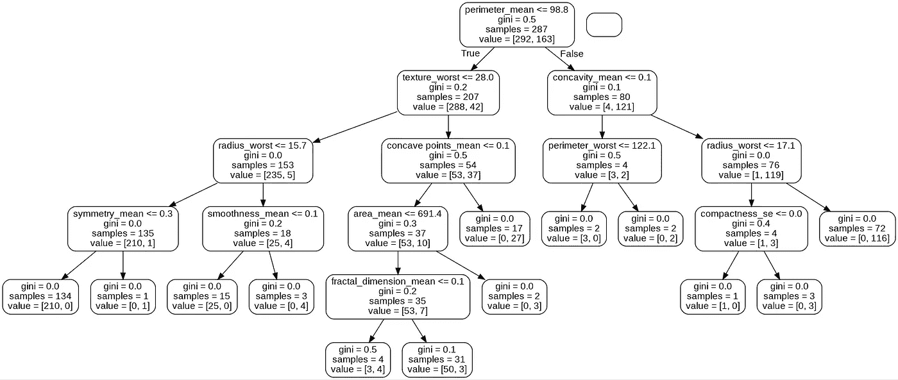

随机森林算法属于集成决策树的一个子组。如果你想了解更多关于决策树的知识，可以在这里阅读我之前的文章[。](/decision-and-classification-tree-cart-for-binary-classification-hands-on-with-scikit-learn-b59474b2c039)


[https://pub . toward sai . net/decision-and-class ification-tree-cart-for-binary-class ification-hands-on-with-sci kit-learn-b 59474 B2C 039](/decision-and-classification-tree-cart-for-binary-classification-hands-on-with-scikit-learn-b59474b2c039)

在一个随机森林模型中，多个 D [决策树](/decision-and-classification-tree-cart-for-binary-classification-hands-on-with-scikit-learn-b59474b2c039)被构建和组合，这产生了一个随机森林树(通常是一个更加精确的决策树)。在生长树时，随机森林方法以随机方式搜索下一个节点(或要素)，这增加了创建的不同树的数量。当树被组合时，它导致模型不会过度拟合(因为特征是随机搜索的，而不仅仅是包括最佳特征)，同时保持分类精度。

最好的理解方式就是做自己的项目。如果您有一个数据库，您可以按照本教程进行操作，只需更改必要的代码以包含您的数据集名称和要素名称。如果您想尝试使用样本数据，可以从本文使用的 [Kaggle](https://www.kaggle.com/datasets/yasserh/breast-cancer-dataset) 下载 [breast-cancer.csv](https://www.kaggle.com/datasets/yasserh/breast-cancer-dataset) 数据集。


该数据集由 569 个细胞损伤的观察结果组成，其特征为 30 个特征。结果就是诊断，其中 0 代表良性，1 代表恶性。在我们的项目中，我们将使用随机森林算法来预测基于 30 个可用特征的结果。

为了启动项目，我们将导入必要的库:

```
import pandas as pd
import numpy as np
from sklearn.model_selection import train_test_split
from sklearn.ensemble import RandomForestClassifier
from sklearn.tree import export_graphviz
import pydot
import matplotlib.pyplot as plt
import seaborn as sns
```

我们需要将数据库上传并加载到我们的 Google Colab 会话中:

```
df = pd.read_csv('/content/breast-cancer.csv')
df
```

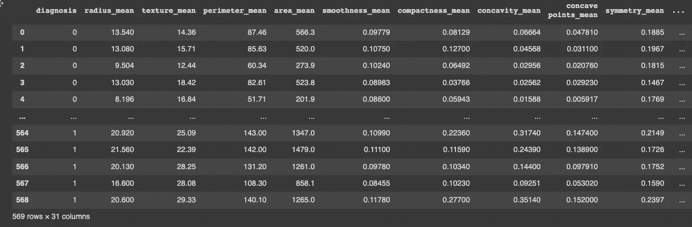

我们有一个大表，有 31 列，1 个输出分类器(良性 0，恶性 1)和 30 个特征。这 30 个变量使得很难一眼就解释和可视化数据集。所以我们将进行一个非常简单的探索性数据分析:

```
df.describe()
```

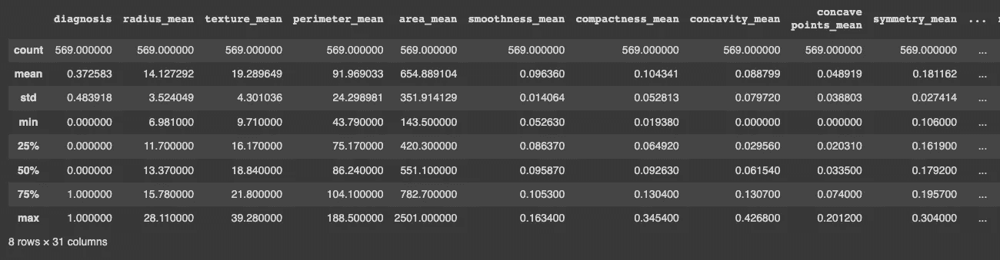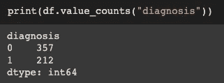

为了直观地观察这两个结果在我们的数据集中是如何分布的，我们可以建立一个配对图。这将提示我们有多少数据被清楚地分为两类。请注意，为包含 30 列的数据集构建配对图可能需要一些时间。

```
**#Exploring dataset:**
sns.pairplot(df, kind="scatter", hue="diagnosis")
plt.show()
```

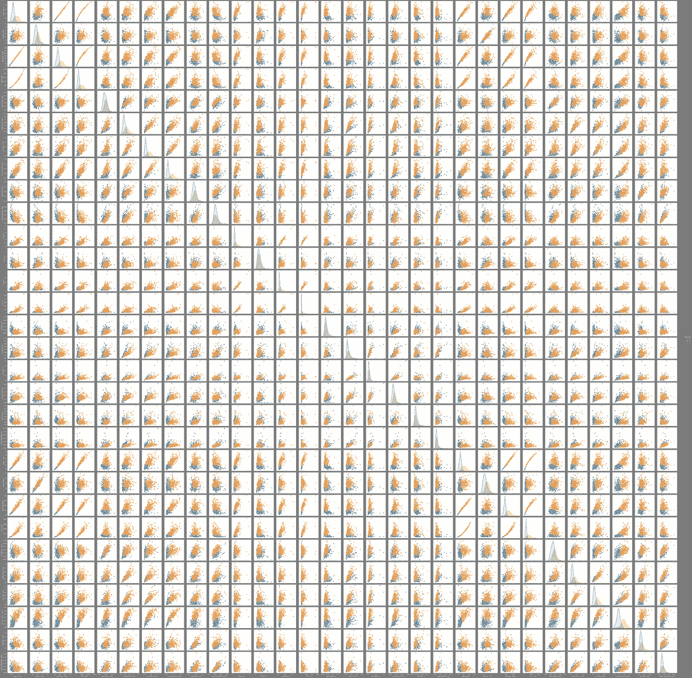

在 30 个特征中，发现它们之间的多重共线性是可以预期的。我们将检查变量之间是如何相互关联的，但是，我们不会在本文中探索任何降维技术。

```
**#Drop the outcome:** df_corr = df.drop(["diagnosis"], axis=1)**#Build heatmap:** corr_matrix=df_corr.corr()
mask = np.zeros_like(corr_matrix)
mask[np.triu_indices_from(mask)] = True
sns.heatmap(corr_matrix, mask=mask, square=True)
```

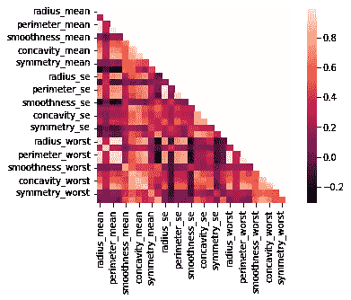

下一步是探索这两个类中的变量分布。因为我们有 30 个变量要研究，所以我们将打印一个包含所有列名的列表，以便于下一步构建分布图。

```
**#Get the full list of column names:** for col in df.columns:
    print(col)
```

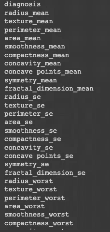

现在我们可以构建直方图。我们将使用 6 行 5 列在同一幅图像中绘制 30 个直方图:

```
**#Define an output image with 6 lines and 5 columns, with inside image size of 20x25:** 
fig, axs = plt.subplots(6, 5, figsize=(20, 25))**#Build the 30 histograms:** sns.histplot(data=df, x="radius_mean", hue="diagnosis", kde=True, color="skyblue", ax=axs[0, 0])
sns.histplot(data=df, x="texture_mean", hue="diagnosis", kde=True, color="skyblue", ax=axs[0, 1])
sns.histplot(data=df, x="perimeter_mean", hue="diagnosis", kde=True, color="skyblue", ax=axs[0, 2])
sns.histplot(data=df, x="area_mean", hue="diagnosis", kde=True, color="skyblue", ax=axs[0, 3])
sns.histplot(data=df, x="smoothness_mean", hue="diagnosis", kde=True, color="skyblue", ax=axs[0, 4])
sns.histplot(data=df, x="compactness_mean", hue="diagnosis", kde=True, color="skyblue", ax=axs[1, 0])
sns.histplot(data=df, x="concavity_mean", hue="diagnosis", kde=True, color="skyblue", ax=axs[1, 1])
sns.histplot(data=df, x="concave points_mean", hue="diagnosis", kde=True, color="skyblue", ax=axs[1, 2])
sns.histplot(data=df, x="symmetry_mean", hue="diagnosis", kde=True, color="skyblue", ax=axs[1, 3])
sns.histplot(data=df, x="fractal_dimension_mean", hue="diagnosis", kde=True, color="skyblue", ax=axs[1, 4])
sns.histplot(data=df, x="radius_se", hue="diagnosis", kde=True, color="skyblue", ax=axs[2, 0])
sns.histplot(data=df, x="texture_se", hue="diagnosis", kde=True, color="skyblue", ax=axs[2, 1])
sns.histplot(data=df, x="perimeter_se", hue="diagnosis", kde=True, color="skyblue", ax=axs[2, 2])
sns.histplot(data=df, x="area_se", hue="diagnosis", kde=True, color="skyblue", ax=axs[2, 3])
sns.histplot(data=df, x="smoothness_se", hue="diagnosis", kde=True, color="skyblue", ax=axs[2, 4])
sns.histplot(data=df, x="compactness_se", hue="diagnosis", kde=True, color="skyblue", ax=axs[3, 0])
sns.histplot(data=df, x="concavity_se", hue="diagnosis", kde=True, color="skyblue", ax=axs[3, 1])
sns.histplot(data=df, x="concave points_se", hue="diagnosis", kde=True, color="skyblue", ax=axs[3, 2])
sns.histplot(data=df, x="symmetry_se", hue="diagnosis", kde=True, color="skyblue", ax=axs[3, 3])
sns.histplot(data=df, x="fractal_dimension_se", hue="diagnosis", kde=True, color="skyblue", ax=axs[3, 4])
sns.histplot(data=df, x="radius_worst", hue="diagnosis", kde=True, color="skyblue", ax=axs[4, 0])
sns.histplot(data=df, x="texture_worst", hue="diagnosis", kde=True, color="skyblue", ax=axs[4, 1])
sns.histplot(data=df, x="perimeter_worst", hue="diagnosis", kde=True, color="skyblue", ax=axs[4, 2])
sns.histplot(data=df, x="area_worst", hue="diagnosis", kde=True, color="skyblue", ax=axs[4, 3])
sns.histplot(data=df, x="smoothness_worst", hue="diagnosis", kde=True, color="skyblue", ax=axs[4, 4])
sns.histplot(data=df, x="compactness_worst", hue="diagnosis", kde=True, color="skyblue", ax=axs[5, 0])
sns.histplot(data=df, x="concavity_worst", hue="diagnosis", kde=True, color="skyblue", ax=axs[5, 1])
sns.histplot(data=df, x="concave points_worst", hue="diagnosis", kde=True, color="skyblue", ax=axs[5, 2])
sns.histplot(data=df, x="symmetry_worst", hue="diagnosis", kde=True, color="skyblue", ax=axs[5, 3])
sns.histplot(data=df, x="fractal_dimension_worst", hue="diagnosis", kde=True, color="skyblue", ax=axs[5, 4])**#Print the final result:** plt.show()
```

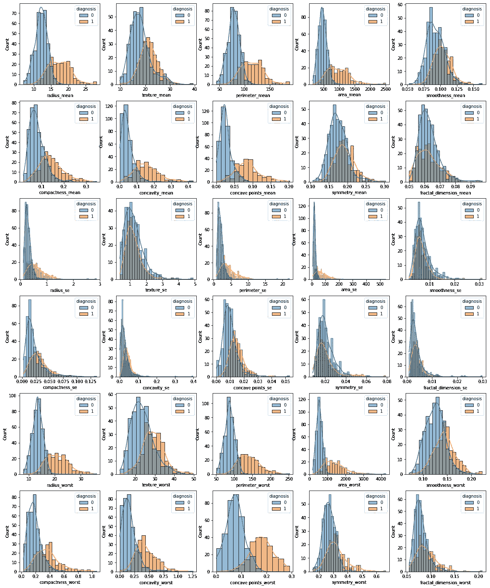

我们可以将相同的技术用于箱线图:

```
fig, axs = plt.subplots(6, 5, figsize=(20, 25))sns.boxplot(x=df["diagnosis"], y=df["radius_mean"], ax=axs[0, 0])
sns.boxplot(x=df["diagnosis"], y=df["texture_mean"], ax=axs[0, 1])
sns.boxplot(x=df["diagnosis"], y=df["perimeter_mean"], ax=axs[0, 2])
sns.boxplot(x=df["diagnosis"], y=df["area_mean"],ax=axs[0, 3])
sns.boxplot(x=df["diagnosis"], y=df["smoothness_mean"], ax=axs[0, 4])
sns.boxplot(x=df["diagnosis"], y=df["compactness_mean"], ax=axs[1, 0])
sns.boxplot(x=df["diagnosis"], y=df["concavity_mean"], ax=axs[1, 1])
sns.boxplot(x=df["diagnosis"], y=df["concave points_mean"], ax=axs[1, 2])
sns.boxplot(x=df["diagnosis"], y=df["symmetry_mean"], ax=axs[1, 3])
sns.boxplot(x=df["diagnosis"], y=df["fractal_dimension_mean"],ax=axs[1, 4])
sns.boxplot(x=df["diagnosis"], y=df["radius_se"], ax=axs[2, 0])
sns.boxplot(x=df["diagnosis"], y=df["texture_se"], ax=axs[2, 1])
sns.boxplot(x=df["diagnosis"], y=df["perimeter_se"], ax=axs[2, 2])
sns.boxplot(x=df["diagnosis"], y=df["area_se"], ax=axs[2, 3])
sns.boxplot(x=df["diagnosis"], y=df["smoothness_se"], ax=axs[2, 4])
sns.boxplot(x=df["diagnosis"], y=df["compactness_se"],ax=axs[3, 0])
sns.boxplot(x=df["diagnosis"], y=df["concavity_se"], ax=axs[3, 1])
sns.boxplot(x=df["diagnosis"], y=df["concave points_se"], ax=axs[3, 2])
sns.boxplot(x=df["diagnosis"], y=df["symmetry_se"], ax=axs[3, 3])
sns.boxplot(x=df["diagnosis"], y=df["fractal_dimension_se"], ax=axs[3, 4])
sns.boxplot(x=df["diagnosis"], y=df["radius_worst"], ax=axs[4, 0])
sns.boxplot(x=df["diagnosis"], y=df["texture_worst"],ax=axs[4, 1])
sns.boxplot(x=df["diagnosis"], y=df["perimeter_worst"], ax=axs[4, 2])
sns.boxplot(x=df["diagnosis"], y=df["area_worst"], ax=axs[4, 3])
sns.boxplot(x=df["diagnosis"], y=df["smoothness_worst"], ax=axs[4, 4])
sns.boxplot(x=df["diagnosis"], y=df["compactness_worst"], ax=axs[5, 0])
sns.boxplot(x=df["diagnosis"], y=df["concavity_worst"], ax=axs[5, 1])
sns.boxplot(x=df["diagnosis"], y=df["concave points_worst"],ax=axs[5, 2])
sns.boxplot(x=df["diagnosis"], y=df["symmetry_worst"], ax=axs[5, 3])
sns.boxplot(x=df["diagnosis"], y=df["fractal_dimension_worst"], ax=axs[5, 4])plt.show()
```

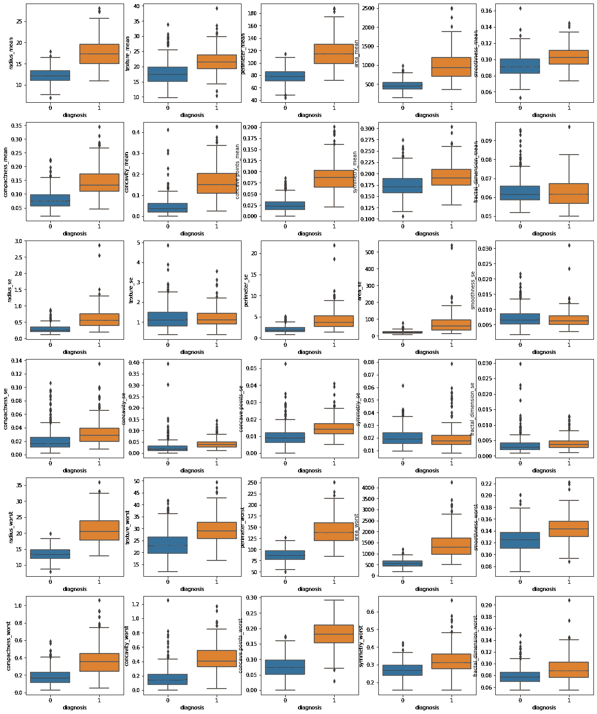

正如我们所看到的，一些变量在区分这两个类方面表现很好，因此我们可以期待一个具有良好准确性的模型。现在是时候建立我们的模型了:

```
**#Define the features and output:**
y = np.array(df['diagnosis'])
X = df.drop('diagnosis', axis=1)**#Split data into train an test, with test size of 20%:**
X_train, X_test, y_train, y_test = train_test_split(X, y, test_size = 0.20)**#Build the model:**
rf = RandomForestClassifier()
rf.fit(X_train, y_train)**#Evaluate the model:** print("accuracy on training set: %f" % rf.score(X_train, y_train))
print("accuracy on test set: %f" % rf.score(X_test, y_test))
```

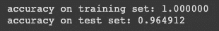

当我们最终有了我们的模型，类似于决策树，就有可能评估特征的重要性，并因此选择要包含的特征的数量来构建保持准确性的简单模型。

```
**#Print features importance:**
rf.feature_importances_
```

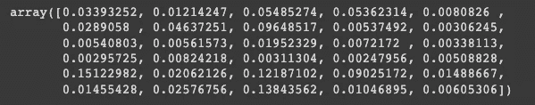

```
**#Build a graphical visualisation of feature importance:** import matplotlib.pyplot as plt
plt.plot(rf.feature_importances_, 'o')
plt.xticks(range(X.shape[1]), X.columns, rotation=90)
plt.ylim(0, 1)
```

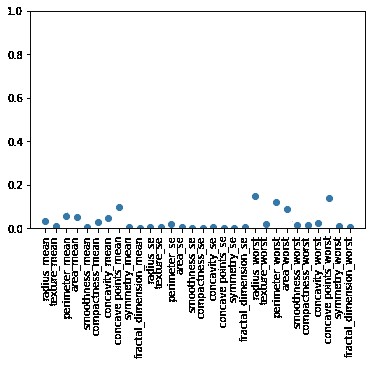

正如我们所看到的，大约 5 个特性比所有其他特性更重要，因此我们将构建一个只有 5 个节点的树:

```
**#Using only 5 nodes:** rf_5 = RandomForestClassifier(max_depth=5)
rf_5.fit(X_train, y_train)print("accuracy on training set: %f" % rf_5.score(X_train, y_train))print("accuracy on test set: %f" % rf_5.score(X_test, y_test))
```


为了构建具有 5 个节点的树的图形可视化，我们使用 Graphviz 函数:

```
**# Pull out one tree from the forest:**
tree = rf_5.estimators_[5]**# Export the image to a dot file:** export_graphviz(tree, out_file = 'tree.dot', feature_names = X.columns, rounded = True, precision = 1)**# Use dot file to create a graph:** (graph, ) = pydot.graph_from_dot_file('tree.dot')**# Write graph to a png file:** graph.write_png('tree.png')
```

运行代码后，您会发现**。png** 文件放在你的数据库的同一个目录下。


在构建随机森林时要记住的一件事是准确性的可变性，因为树是随机构建的，并且预期可变性很小(通常小于 2%)。

感谢您的阅读！如果您对本教程有任何建议，请告诉我，不要忘记订阅以接收关于我未来出版物的通知。

**如果:**你喜欢这篇文章，别忘了关注我，这样你就能收到关于新出版物的所有更新。

**其他如果:**你想在 Medium 上阅读更多，可以通过 [**我的推荐链接**](https://cdanielaam.medium.com/membership) 订阅 Medium 会员。它不会花你更多的钱，但会支付我一杯咖啡。

**其他:**谢谢！