# 使用决策树的信用违约建模

> 原文：<https://pub.towardsai.net/random-forest-medium-article-736c3f9514f4?source=collection_archive---------2----------------------->

## 使用基于树的技术检测信用价值


瑞安·博恩摄于 [Unsplash](https://unsplash.com/photos/x8i6FfaZAbs)

历史上，机器学习算法一直用于信用和欺诈领域。随着计算能力的提高，行业已经从基于树的 Logit 模型转向更先进的机器学习技术，包括打包和提升。行业。这篇文章旨在为读者提供决策树、Bagging 和随机森林算法的数学观点。在最后一节，作者讨论了如何利用 LendingClub 的数据将这些技术用于信用违约和欺诈防范。

# **决策树**

## 1.介绍

决策树背后的基本直觉是以二叉树的形式绘制出所有可能的决策路径。用使用萼片长宽比(x1)和花瓣长宽比(x2)来识别花类型(y)的例子来展示相同的内容

x1>1.7 的初始分裂有助于识别花类型 y=1

在 x2>2.8 处的下一个节点分裂有助于识别 y=2 和 y=3

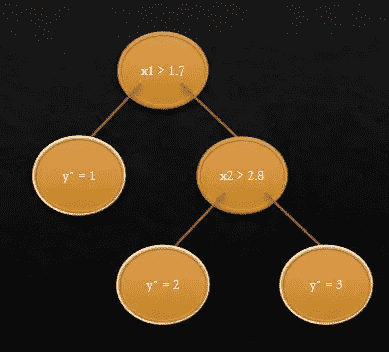

决策树的示例

数学上，**决策树**使用二元决策规则将输入 **x ∈ R^d** 映射到输出 **y** :

## 树中的每个节点都有一个拆分规则

*   基于自顶向下贪婪算法的分裂
*   每个叶节点都与一个输出值相关联

## 每个拆分规则的形式如下

*   h(x) = 1{xj > t}

## 2.分割标准

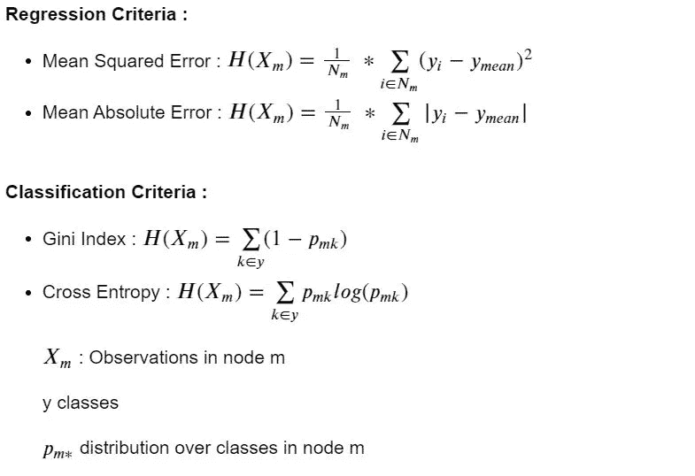

## 3.几何视图

## 动机:

*   对空间进行分区，使一个区域中的数据具有相同的预测
*   每个分区代表二维平面中的一条垂直线或水平线

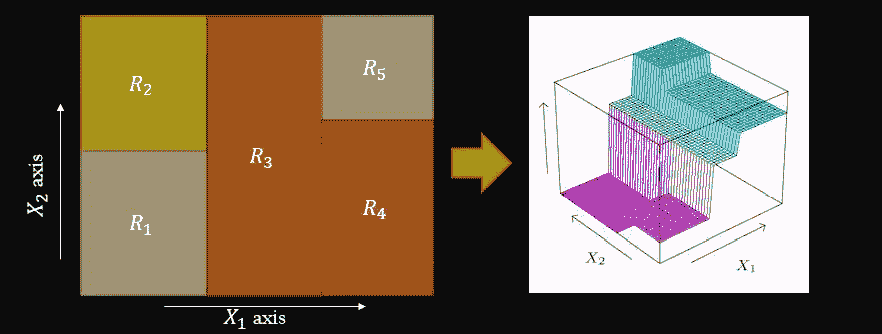

决策树的几何视图

## 4.挑战

*   决策树不能推断

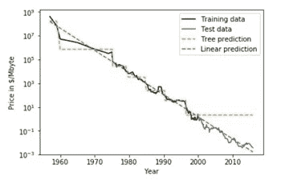

*   数据变化的高方差或不稳定性:通过数据的微小变化，我们可以看到决策树结构的变化
*   决策树中高方差的原因在于它们是基于贪婪算法的事实。它侧重于优化手头的节点分裂，而不是考虑分裂如何影响整个树。贪婪的方法使决策树运行得更快，但也使它们容易**过度拟合**。

在接下来的部分中，我们将讨论如何克服这些挑战


不同的整体建筑——托马斯·格里斯贝克[在](https://unsplash.com/@jack_scorner?utm_source=unsplash&utm_medium=referral&utm_content=creditCopyText) [Unsplash](https://unsplash.com/s/photos/forest?utm_source=unsplash&utm_medium=referral&utm_content=creditCopyText) 上拍摄的照片

# 引导聚合器

## 1.动机

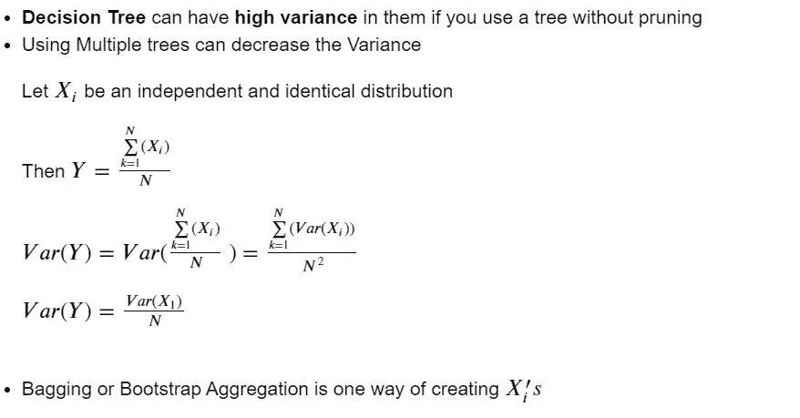

## 2.算法

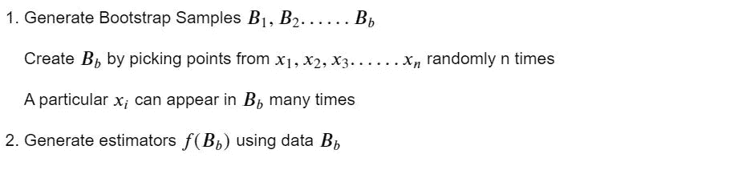

# 随机森林

## 1.动机

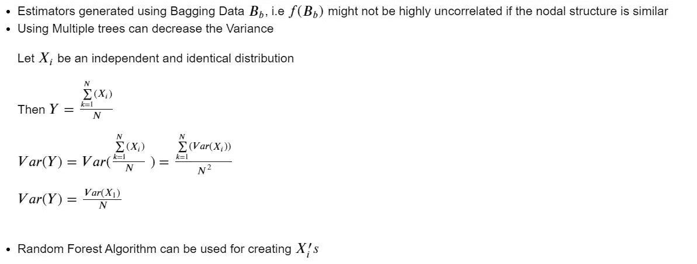

## 2.算法

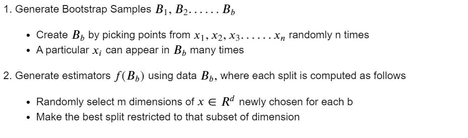

随机森林的另一个优势是它不需要维持数据集，因此可以有效地处理较小的数据集。我们可以计算出袋外(OOB)误差，而不是测试误差。其框架如下所示:

## 3.出包错误

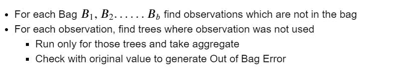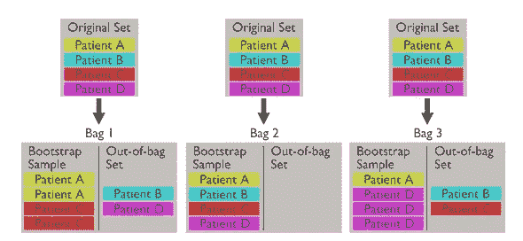

创建袋外器械包的示例

# 朱庇特实验室

在这里，我们探索来自 LendingClub.com 的数据

考虑到许多不同的因素，包括借款人的 FICO 分数、利率，甚至贷款的目的，我们试图预测某笔贷款是否会全额偿还。

## 为什么选择决策树/随机森林？

决策树是一种伟大的“粗略且现成的”ML 技术，可以应用于许多不同的场景。它们直观、快速，可以处理数字和分类数据。决策树最大的缺点是它们倾向于过度拟合给定的数据，导致方差或偏差的错误。随机森林通过对数据的随机样本采用许多不同的决策树来解决这个问题，因此在选择 ML 模型时通常是更明智的选择。

## 进口

```
import pandas as pd
import numpy as np
import seaborn as sns
import matplotlib.pyplot as plt
%matplotlib inline
```

## 探索性分析

```
loans = pd.read_csv('loan_data.csv')loans.head()
```


“未完全支付”列是我们有兴趣预测的一列。

```
loans.info()<class 'pandas.core.frame.DataFrame'>
RangeIndex: 9578 entries, 0 to 9577
Data columns (total 14 columns):
 #   Column             Non-Null Count  Dtype  
---  ------             --------------  -----  
 0   credit.policy      9578 non-null   int64  
 1   purpose            9578 non-null   object 
 2   int.rate           9578 non-null   float64
 3   installment        9578 non-null   float64
 4   log.annual.inc     9578 non-null   float64
 5   dti                9578 non-null   float64
 6   fico               9578 non-null   int64  
 7   days.with.cr.line  9578 non-null   float64
 8   revol.bal          9578 non-null   int64  
 9   revol.util         9578 non-null   float64
 10  inq.last.6mths     9578 non-null   int64  
 11  delinq.2yrs        9578 non-null   int64  
 12  pub.rec            9578 non-null   int64  
 13  not.fully.paid     9578 non-null   int64  
dtypes: float64(6), int64(7), object(1)
memory usage: 1.0+ MBloans.describe()
```

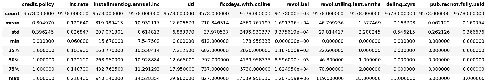

## **部分栏目信息**

*   credit.policy:如果客户符合 LendingClub.com 的信用核保标准，则为 1，否则为 0。
*   目的:贷款的目的(取值“信用卡”、“债务合并”、“教育”、“主要购买”、“小型企业”和“所有其他”)。
*   int.rate:贷款的利率，以比例表示(11%的利率将存储为 0.11)。被 LendingClub.com 判断为风险较高的借款人会被分配较高的利率。
*   分期付款:借款人所欠的每月分期付款，如果贷款是有资金的。
*   log.annual.inc:借款人自报年收入的自然日志。
*   dti:借款人的债务收入比(债务额除以年收入)。
*   fico:借款人的 FICO 信用评分。
*   days.with.cr.line:借款人拥有信用额度的天数。
*   revol.bal:借款人的循环余额(信用卡账单周期结束时未支付的金额)。
*   revol.util:借款人的循环额度利用率(相对于可用信贷总额的已用信贷额度)。
*   inq.last.6mths:最近 6 个月内债权人对借款人的查询次数。
*   拖欠 2 年:在过去的 2 年中，借款人拖欠还款超过 30 天的次数。
*   pub.rec:借款人的贬损公共记录数量(破产申请、税收留置权或判决)。

## 数据可视化

```
plt.figure(figsize=(11,7))
sns.countplot(loans['purpose'], hue = loans['not.fully.paid'])We split our target function with respect to the purpose for which a loan was taken. 
```

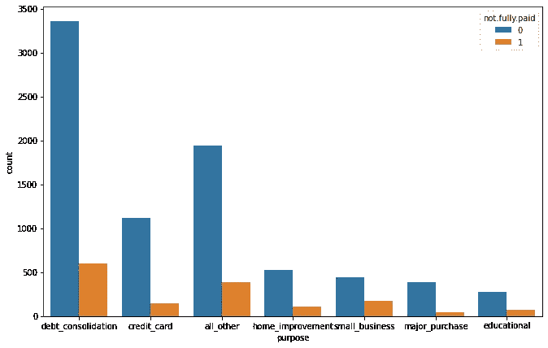

```
new_df = loans.groupby('purpose')['not.fully.paid'].value_counts(normalize=True)
new_df = new_df.mul(100).rename('Percent').reset_index()new_df1 = new_df[new_df["not.fully.paid"]==1]new_df1=new_df1.sort_values("Percent")g=sns.catplot(x="purpose", y='Percent', kind='bar', data=new_df1, aspect=2)
g.ax.set_ylim(0,30)

for p in g.ax.patches:
    txt = str(p.get_height().round(1)) + '%'
    txt_x = p.get_x()
    txt_y = p.get_height()
    g.ax.text(txt_x,txt_y,txt,fontsize=18,verticalalignment='bottom',multialignment='right')We would like to understand the risk as a percentage hence we look at proportion of unpaid loans in each purpose type
```

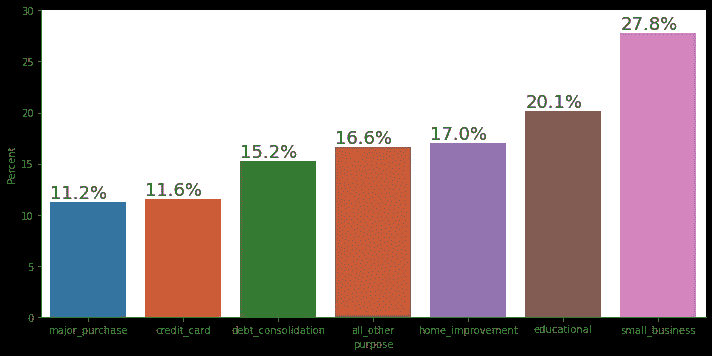

```
sns.boxplot(data =loans, x ='purpose', y= loans['int.rate']).legend().set_visible(False)Given the knowledge of risk basis purpose, we would like to understand if the APR offered to a customer take into account purpose. 
```

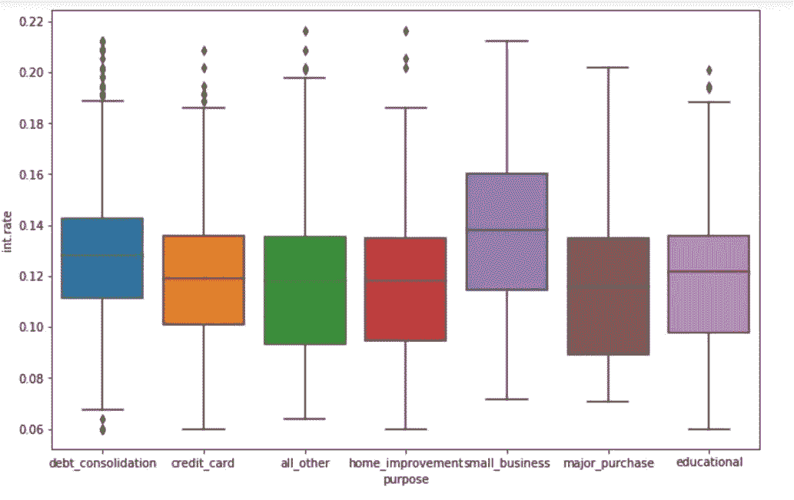

```
df=loans
f,(ax1,ax2,ax3)= plt.subplots(1,3,figsize=(25,10))
sns.distplot(df['int.rate'], bins= 30,ax=ax1)
sns.boxplot(data =df, x ='credit.policy', y= df['int.rate'],ax=ax2).legend().set_visible(False)
sns.boxplot(data = df['int.rate'], ax=ax3)
print("Interest Rate Distribution, Credit Policy range based on the Credit policy , General Interest rate")

Interest Rate Distribution, Credit Policy range based on the Credit policy , General Interest rate
```

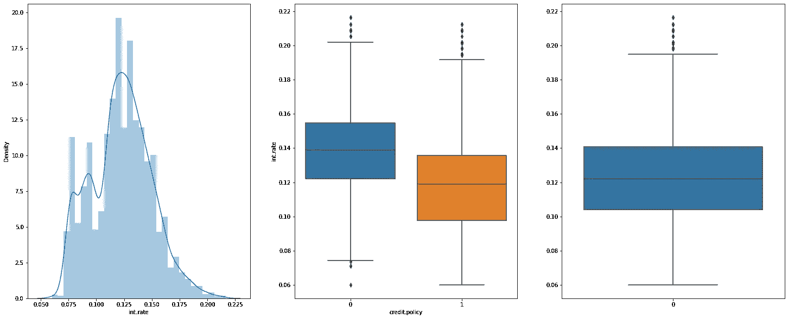

```
plt.figure(figsize=(10,6))
loans[loans['credit.policy']==1]['fico'].hist(alpha=0.5,color='blue',
                                              bins=30,label='Credit.Policy=1')
loans[loans['credit.policy']==0]['fico'].hist(alpha=0.5,color='red',
                                              bins=30,label='Credit.Policy=0')
plt.legend()
plt.xlabel('FICO')Text(0.5, 0, 'FICO')To understand if Credit Policy Underwriting from Lending Club have FICO based cut-off for applying customers, we look at the following histogram. 
```

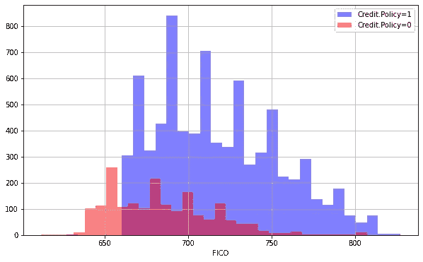

```
sns.boxplot(data =loans, x ='credit.policy', y= loans['fico']).legend().set_visible(False)Credit Policy promotes individuals with Higher FICO 
```

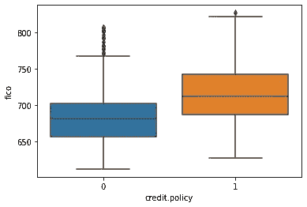

让我们在数字数据之间绘制一个 seaborn pairplot:

```
sns.pairplot(loans.drop(['credit.policy', 'purpose',
       'inq.last.6mths', 'delinq.2yrs', 'pub.rec', 'not.fully.paid'], axis=1))<seaborn.axisgrid.PairGrid at 0x1d9e00432c8>
```


## 清洁

让我们将“目的”列转换为虚拟变量，这样我们就可以将它们包含在我们的分析中:

```
final_data = pd.get_dummies(loans,columns = ['purpose'], drop_first=True)final_data.head()
```

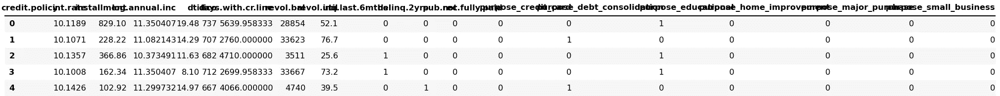

```
from sklearn.model_selection import train_test_splitX= final_data.drop('not.fully.paid', axis=1)
y= final_data['not.fully.paid']
X_train, X_test, y_train, y_test = train_test_split(X,y,test_size = 0.3, random_state = 101)
```

## 决策树:

```
from sklearn.tree import DecisionTreeClassifierdtree = DecisionTreeClassifier(class_weight=None, criterion='gini', max_depth=None,
            max_features=None, max_leaf_nodes=None,
            min_impurity_decrease=0.0, min_impurity_split=None,
            min_samples_leaf=1, min_samples_split=2,
            min_weight_fraction_leaf=0.0,  random_state=None,
            splitter='best')dtree.fit(X_train, y_train)DecisionTreeClassifier()pred = dtree.predict(X_test)
```

## 估价

```
np.array((pred==y_test)).sum()2104from sklearn.metrics import classification_report, confusion_matrixprint(classification_report(y_test,pred))precision    recall  f1-score   support

           0       0.86      0.82      0.84      2431
           1       0.19      0.23      0.21       443

    accuracy                           0.73      2874
   macro avg       0.52      0.53      0.53      2874
weighted avg       0.75      0.73      0.74      2874print(confusion_matrix(y_test,pred))[[2000  431]
 [ 339  104]]
```

## 随机森林:

```
from sklearn.ensemble import RandomForestClassifierdfor = RandomForestClassifier()dfor.fit(X_train, y_train)RandomForestClassifier()pred2 = dfor.predict(X_test)
```

## 估价

```
(y_test == pred2).sum()2427
```

我们可以看到这比一棵树做出了更好的预测

```
print(classification_report(y_test,pred2))precision    recall  f1-score   support

           0       0.85      0.99      0.92      2431
           1       0.42      0.02      0.05       443

    accuracy                           0.84      2874
   macro avg       0.64      0.51      0.48      2874
weighted avg       0.78      0.84      0.78      2874print(confusion_matrix(y_test,pred2))[[2416   15]
 [ 432   11]]
```

## 超级参数调整~随机森林

*   n _ 估计量:随机森林中的树的数量
*   max_features:每次分割要考虑的最大特征数
*   max_depth:每个估计器的最大深度
*   min_sample_split:有效分割所需的最小样本
*   min_samples_leaf:每个叶节点所需的最小样本数

```
from sklearn.model_selection import RandomizedSearchCV
# Number of trees in random forest
n_estimators = [int(x) for x in np.linspace(start = 200, stop = 2000, num = 10)]
# Number of features to consider at every split
max_features = ['auto', 'sqrt']
# Maximum number of levels in tree
max_depth = [int(x) for x in np.linspace(10, 110, num = 11)]
max_depth.append(None)
# Minimum number of samples required to split a node
min_samples_split = [2, 5, 10]
# Minimum number of samples required at each leaf node
min_samples_leaf = [1, 2, 4]
# Create the random grid
random_grid = {'n_estimators': n_estimators,
               'max_features': max_features,
               'max_depth': max_depth,
               'min_samples_split': min_samples_split,
               'min_samples_leaf': min_samples_leaf,
               }
print(random_grid){'n_estimators': [200, 400, 600, 800, 1000, 1200, 1400, 1600, 1800, 2000], 'max_features': ['auto', 'sqrt'], 'max_depth': [10, 20, 30, 40, 50, 60, 70, 80, 90, 100, 110, None], 'min_samples_split': [2, 5, 10], 'min_samples_leaf': [1, 2, 4]}
```

## k 倍交叉验证

交叉验证(CV)技术最好用最常用的方法 K 倍 CV 举例说明。当我们处理机器学习问题时，我们确保将数据分成训练集和测试集。在 K-Fold CV 中，我们进一步将我们的训练集分成 K 个子集，称为折叠。然后，我们迭代拟合模型 K 次，每次在第 K-1 个褶皱上训练数据，并在第 K 个褶皱上评估(称为验证数据)。

```
# Use the random grid to search for best hyperparameters
# First create the base model to tune
rf = RandomForestClassifier()
# Random search of parameters, using 3 fold cross validation, 
# search across 100 different combinations, and use all available cores
rf_random = RandomizedSearchCV(estimator = rf, param_distributions = random_grid, n_iter = 100, cv = 3, verbose=2, random_state=42, n_jobs = -1)
# Fit the random search model
rf_random.fit(X_train, y_train)Fitting 3 folds for each of 100 candidates, totalling 300 fits

RandomizedSearchCV(cv=3, estimator=RandomForestClassifier(), n_iter=100, n_jobs=-1,
param_distributions={'max_depth': [10, 20, 30, 40, 50, 60,
                           70, 80, 90, 100, 110,None], 'max_features': ['auto', 'sqrt'],
'min_samples_leaf': [1, 2, 4],
'min_samples_split': [2, 5, 10],
'n_estimators': [200, 400, 600, 800,1000, 1200, 1400, 1600,
                                  1800, 2000]},      random_state=42, verbose=2)rf_random.best_params_{'n_estimators': 200,
 'min_samples_split': 10,
 'min_samples_leaf': 2,
 'max_features': 'sqrt',
 'max_depth': 110}
```

## 参考

1.  [https://www . ka ggle . com/bdmj 12/random-forest-lending club-project/notebook](https://www.kaggle.com/bdmj12/random-forest-lendingclub-project/notebook)
2.  [https://www . ka ggle . com/megr 25/lending-club-decision-tree-and-random-forest](https://www.kaggle.com/megr25/lending-club-decision-tree-and-random-forest)
3.  【https://www.kaggle.com/megr25/lending-club-loans/version/1 
4.  [http://www.cs.columbia.edu/~amueller/comsw4995s18/schedule/](http://www.cs.columbia.edu/~amueller/comsw4995s18/schedule/)
5.  [https://medium . com/@ appaloosastore/string-similarity-algorithms-comparated-3f 7 B4 d 12 f 0 ff](https://medium.com/@appaloosastore/string-similarity-algorithms-compared-3f7b4d12f0ff)
6.  [https://Stanford . edu/~ shervine/teaching/cs-229/cheat sheet-deep-learning](https://stanford.edu/~shervine/teaching/cs-229/cheatsheet-deep-learning)
7.  [https://towards data science . com/random-forests-algorithm-explained-with-a-real-life-example-and-some-python-code-afbffa 942 c](https://towardsdatascience.com/random-forests-algorithm-explained-with-a-real-life-example-and-some-python-code-affbfa5a942c)
8.  [https://www . kdnugges . com/2017/08/machine-learning-abstracts-decision-trees . html](https://www.kdnuggets.com/2017/08/machine-learning-abstracts-decision-trees.html)
9.  Clements，J. M .，Xu，d .，n .和 Efimov，d.《使用表格财务数据进行信用风险监控的顺序深度学习》。arXiv 预印本 arXiv:2012.15330，2020