# Python 随机数生成器教程

> 原文：<https://pub.towardsai.net/random-number-generator-tutorial-with-python-3b35986132c7?source=collection_archive---------1----------------------->

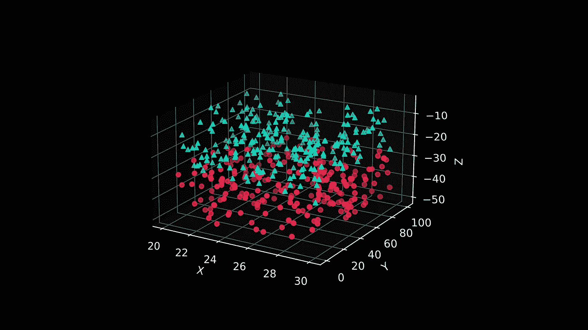

图片由作者提供，使用 Python 生成，用于说明散点图中随机数的生成。

## [数据科学](https://towardsai.net/p/category/data-science)，[编辑](https://towardsai.net/p/category/editorial)，[编程](https://towardsai.net/p/category/programming)

## 为什么随机数在机器学习和数据科学中至关重要？我们如何为我们的项目构建一个随机数生成器？

**作者:**苏扬·希罗，[罗伯托·伊里翁多](https://mktg.best/vguzs)

**本教程的代码可在**[**Github**](https://github.com/towardsai/tutorials/tree/master/random-number-generator)**上获得，其完整实现也可在**[**Google Colab**](https://colab.research.google.com/drive/1xNXH-Vr9FKRA1GOAj69FDKkPN963SQDX?usp=sharing)**上获得。**

> *🤖走向 AI 是一个讨论人工智能、数据科学、数据可视化、深度学习、机器学习、NLP、计算机视觉、相关新闻、机器人、自动驾驶汽车、编程、技术等的社区！* [***加入我们***](https://towardsai.net/backers) *🤖*

随机数在我们的生活中无处不在，无论是赌场中的轮盘赌，密码学，统计抽样，还是像扔骰子一样简单的给我们一个 1 到 6 之间的随机数。

在本教程中，我们将深入了解什么是伪随机性，它在机器学习和数据科学中的重要性，以及如何使用流行的库在 Python 中创建一个随机数生成器来生成伪随机数。

> 📚查看我们的[神经网络](https://towardsai.net/p/machine-learning/building-neural-networks-from-scratch-with-python-code-and-math-in-detail-i-536fae5d7bbf)从头开始教程。📚

# 什么是伪随机性？

为了理解伪随机性，我们首先需要理解什么是随机性。当我们生成随机数时，它们是完全不可预测和不确定的数字序列。随机数序列有两个统计特性:

1.  **均匀性:**一个区间内每个数出现的概率都是相同的。
2.  **独立性:**当前随机值与之前的随机值没有关系。

如前所述，掷骰子或掷硬币的输出“确实”是随机的，但同时也是机械的，因此，生成这些大样本需要大量的时间和工作，而这是我们大多数人所不具备的。

接下来，计算机出现了，使任务变得简单快捷。然而，**计算机不能产生真正的随机数，因为计算机是可预测的、确定的、可重复的**。他们只做我们想让他们做的事。这就是为什么不可能产生真正的随机数，相反，计算机产生了伪随机数。

当我们使用确定性过程来生成数字时，当我们拥有足够多的数字时，它们看起来接近随机。

要生成伪随机数，我们需要用一个种子来初始化它们。种子是一个真正的随机数，它可以是任何整数—例如，以毫秒为单位的当前时间。

有几种算法可以生成伪随机数，所有算法都使用种子进行初始化。

最早的方法之一是由约翰·冯·诺依曼在 1946 年提出的。他取一个初始随机数(种子)，对其求平方，选取得到的平方数的中间数字，将其添加到一个随机数序列中，对新选取的数求平方，然后继续这个过程。

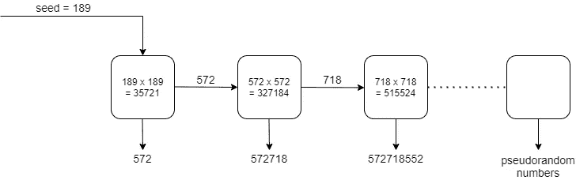

图 1:约翰·冯·诺依曼的中平方方法。

# 随机数在数据科学和机器学习中的重要性

在数据科学和机器学习领域，随机性无处不在，无论是数据收集、模拟、将数据分成训练和测试、数据评估、算法、神经网络，还是其他。

*   我们如何收集样本数据？我们从总体中挑选真正随机的数据点，这些点越随机，就越能代表总体。有几种方法定义了随机抽样过程:简单随机抽样、系统随机抽样、分层随机抽样等等。
*   有时，如果我们已经知道我们应该处理的数据的分布，我们就不需要收集实际的数据——节省了大量的时间和精力。例如，假设我们知道一辆车的里程服从正态分布。我们可以为我们的研究生成正态分布的随机数。这个过程叫做模拟。
*   我们将数据分为训练和测试数据。我们使用训练数据来训练我们的模型，然后使用测试数据来测试训练好的模型。一般训练数据是 80%，测试数据是可用数据的 20%。这种数据分割必须是随机的，这样我们的模型才能高效运行。
*   我们通过在可用数据的不同随机子集上测试其准确性来评估我们的模型的更好性能。选择这些子集是真正随机的——这个过程被称为交叉验证。
*   随机性在大多数机器学习算法中起着至关重要的作用，如随机梯度下降中每个历元之前的 shuffling 训练数据，随机森林算法中的随机输入特征。
*   神经网络算法从权重和偏差的随机初始化开始，然后改变每个历元的值，以最小化误差并提高精度。

# 伪随机数发生器

伪随机数发生器(PRNG)，也称为确定性随机位发生器(DRBG)，是一种用于生成数字序列的算法，该数字序列的属性近似于随机数序列[【1】](https://en.wikipedia.org/wiki/Pseudorandom_number_generator)的属性。

有几种产品可供选择。它们是我们需要调用的函数，它返回一个随机数。每次我们调用这个函数时，它都会根据种子值返回一个不同的随机数。像 Python 这样的编程语言允许我们将随机性作为整数、浮点、特定分布、特定范围等等[ [3](https://www.codingninjas.com/blog/2020/11/06/how-to-generate-random-number-in-python/) ]。正如我们已经讨论过的，要生成伪随机数，序列必须以一个数作为种子。该数字可以是任何整数。如果种子没有显式初始化，则默认种子值是以毫秒为单位的当前时间。

既然理论概念已经很清楚了，让我们进入用 Python 例子生成伪随机数的编码部分。

# 用 Python 的标准库生成伪随机数

Python 有一个名为 *random* 的内置模块，可以生成各种伪随机数。但是，建议不要将此模块用于安全目的，如加密。然而，使用标准库非常适合机器学习和数据科学。这个 Python 模块使用了一个名为 [**梅森图**](https://en.wikipedia.org/wiki/Mersenne_Twister) 的**伪随机数发生器** (PRNG)。

1.  **初始化发生器** : *seed()* 是一个用于对发生器进行播种的函数。它需要一个整数值。如果我们传递一个字符串值，它被转换成一个整数，如果没有传递值，默认值是当前系统时间。

```
# importing the module
import random # initialize the seed to 25random.seed(25)
```

2.**一个范围内的随机数** : *randrange()* 和 *randint()* 是两个可以互换使用的函数，产生一个指定范围内的随机数。

```
random.seed(25) # generate a random number between 10 and 20(both excluded)
random.randrange(10, 20) # generate a random number between 10 and 20(both included)
random.randint(10, 20)
```

输出:

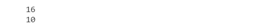

图 2:使用 Python 中称为 Mersenne Twister 的伪随机数发生器(PRNG)的代码片段的输出。

3.**来自序列的随机元素**:也可以使用函数 *choice()* 从序列中获取随机元素，通常是任何数据类型的列表。

```
# initialize the seed to 2
random.seed(2)  # setting up the sequence
myseq = ["Towards", "AI", "is", 1]  # randomly choosing an element from the sequence
random.choice(myseq)
```

输出:


图 3:使用序列的随机输出。

4.**具有不同可能性的多个随机选择**:假设我们想要从随机选择的序列中选择多个元素，我们使用函数 *choices()。*它还允许我们指定序列中每个元素的权重、含义和出现的可能性。随机选择随着替换而减少。

```
# initialize the seed to 25
random.seed(25)  # setting up the sequence
myseq = ["Towards", "AI", "is", 1]  # random selection of length 15
# 10 time higher possibility of selecting 'Towards'
# 5 time higher possibility of selecting 'AI'
# 2 time higher possibility of selecting 'is'
# 2 time higher possibility of selecting 1
random.choices(myseq, weights=[10, 5, 2, 2], k=15)
```

输出:

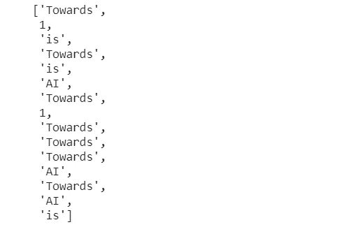

图 4:序列中多种可能性的随机输出。

5.**没有替换的序列中的随机元素**:我们已经看到了 *choice()，*随机选择元素，但是有替换，这意味着同一个元素可以被选择多次。函数 *sample()* 用于从序列中随机选择元素而不替换，这意味着一旦选择了一个元素，它就不会再出现。因此，我们选择的元素数量应该总是小于或等于原始序列的长度。

```
# initialize the seed to 25
random.seed(25)  # setting up the sequence
myseq = ["Towards", "AI", "is", 1]  # randomly choosing an element from the sequence
random.sample(myseq, 2)
```

输出:

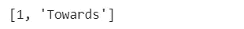

图 5:没有替换的序列的随机输出。

6.**重新排列顺序** : *shuffle()* 是用来重新排列顺序元素顺序的功能。

```
# initialize the seed to 25
random.seed(25)  # setting up the sequence
myseq = ["Towards", "AI", "is", 1]  # rearranging the order of elements of the sequence
random.shuffle(myseq)
print(myseq)
```

输出:


图 6:通过重新排列序列的随机输出。

7.**浮点随机数**:函数 *random()* 用于得到一个 0 到 1 之间的随机浮点数。

```
#initialize the seed to 25
random.seed(25)#random floating number between 0 and 1
random.random()
```

输出:


图 7:使用浮点的随机输出。

8.**实值分布**:许多函数返回实值分布。我们将讨论*均匀()*和*高斯()。uniform()* 返回指定范围内的随机浮点数，包括上限和下限*。gauss()* 返回具有指定平均值和标准分布的正态分布浮点数。

```
# initialize the seed to 25
random.seed(25)  # random float number between 10 and 20 (both included)
print(random.uniform(10, 20))  # random float number mean 10 standard deviation 4
print(random.gauss(10, 4))
```

输出:

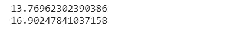

图 8:具有实值分布的随机输出。

# 用 NumPy 生成伪随机数

在机器学习中，我们很可能会使用 scikit-learn 和 Keras 等库。这些库在幕后使用 NumPy，这个库使得处理向量和数字矩阵非常有效[【2】](https://machinelearningmastery.com/how-to-generate-random-numbers-in-python/)。

Numpy 的随机数例程使用一个位生成器和一个生成器的组合来产生伪随机数，位生成器创建序列，生成器使用这些序列从不同的统计分布中采样[【3】](https://numpy.org/devdocs/reference/random/index.html)。作为一名程序员，我们不需要担心它是如何工作的。

与 Python 标准库不同，在 Python 标准库中，我们需要通过函数循环来生成多个随机数，NumPy 总是返回一个包含 1-D 和 3-D 随机数的数组，而不需要循环。我们将看到它是如何工作的。它还允许我们从一些流行的统计分布中生成随机数，如二项式、[、T3、、T5、卡方等。NumPy 伪随机生成器必须用种子值初始化；否则，当前系统时间被用作种子值。](https://news.towardsai.net/pd)

1.  **均匀分布浮点数**:函数 *rand()* 用于生成均匀分布的随机浮点数。它有两个参数，row 和 column，指定行数和列数。如果没有传递参数，它将返回一个随机数。

```
# importing numpy
import numpy as np  # initialize the seed to 25np.random.seed(25)  # single uniformly distributed random number
np.random.seed(25)
np.random.rand()  # uniformly distributed random numbers of length 10: 1-D array
np.random.seed(25)
np.random.rand(
    10
)  # uniformly distributed random numbers of 2 rows and 3 columns: 2-D array
np.random.seed(25)
np.random.rand(2, 3)
```

输出:

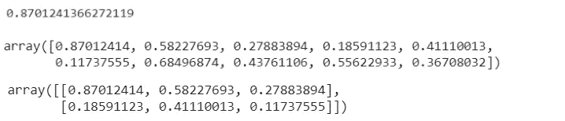

图 9:使用 NumPy 的随机数生成输出。

2.**正态分布浮点值**:在这些情况下，我们需要正态分布浮点值。我们使用名为 *randn()的函数。*它接受的参数与函数 *rand()相同。*唯一的区别是分布的类型。

```
# initialize the seed to 25
np.random.seed(25)  # single narmally distributed random number
np.random.seed(25)
np.random.randn()  # normally distributed random numbers of length 10: 1-D array
np.random.seed(25)
np.random.randn(
    10
)  # normally distributed random numbers of 2 rows and 3 columns: 2-D array
np.random.seed(25)
np.random.randn(2, 3)
```

输出:

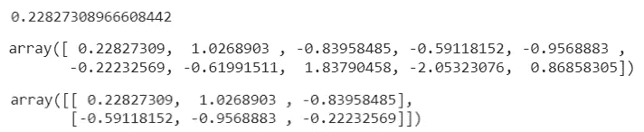

图 10:使用带有正态分布浮点值的 NumPy。

3.**给定范围内均匀分布的整数**:函数 *randint()* 返回指定范围内均匀分布的整数。这里，我们使用一个名为“size”的参数，它接受一个指定所需数组维数的元组值。

```
# initialize the seed to 25
np.random.seed(25)  # single uniformly distributed random integer between 10 and 20
np.random.randint(
    10, 20
)  # uniformly distributed random integer between 0 to 100 of length 10: 1-D array
np.random.randint(
    100, size=(10)
)  # uniformly distributed random integer between 0 to 100 of 2 rows and 3 columns: 2-D array
np.random.randint(100, size=(2, 3))
```

输出:

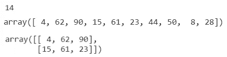

图 11:对给定范围内的均匀分布整数使用 NumPy。

4.**已定义列表中的随机元素** : NumPy 还允许我们从任何数据类型的已定义元素列表中随机选择一个或多个元素。它将定义的列表和大小作为参数。如果没有定义大小，默认情况下，它从列表中返回一个随机元素。

```
# initialize the seed to 25
random.seed(25)  # setting up the sequence
myseq = ["Towards", "AI", "is", 1]  # randomly choosing an element from the sequence
np.random.choice(myseq)  # randomly choosing elements from the sequence: 2-D array
random.seed(25)
np.random.choice(myseq, size=(2, 3))
```

输出:

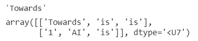

图 12:使用 NumPy 从一个定义的列表中用一个随机元素生成随机数。

我们也可以在随机选择的同时，设置列表中每个元素出现的概率。记住，给定的概率总和必须是 1。例如，我们将“朝向”的概率设为 0.1，“AI”设为 0.6，“是”设为 0.05，1 设为 0.25。现在 0.1+0.6+0.05+0.25 = 1。由于“AI”的出现概率最高，我们可以看到它在结果数组中出现的次数最多，其次是 1。

```
# initialize the seed to 25
random.seed(25)  # setting up the sequence
myseq = [
    "Towards",
    "AI",
    "is",
    1,
]  # randomly choosing elements from the sequence with defined probabilities
# The probability for the value to be 'Towards' is set to be 0.1
# The probability for the value to be 'AI' is set to be 0.6
# The probability for the value to be 'is' is set to be 0.05
# The probability for the value to be 1 is set to be 0.25np.random.choice(myseq, p=[0.1, 0.6, 0.05, 0.25], size=(2, 3))
```

输出:

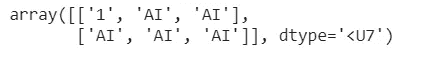

图 13:使用定义的概率从 NumPy 序列中生成随机数。

5.**二项式分布值**:函数*二项式()取三个参数 n-试验次数，p-每次试验发生的概率，返回数组的大小-形状。返回的数组值是二项式分布的。*

```
# initialize the seed to 25
np.random.seed(25)  # 10 number of trials with probability of 0.5 each
random.binomial(n=10, p=0.5, size=10)
```

输出:


图 14:用二项式分布值生成随机数。

6. [**泊松分布**](https://news.towardsai.net/pd) **值**:函数*泊松()取两个参数 lam-rate，size-shape 返回的数组。返回的数组值是泊松分布的。这估计了一个事件以指定的速率发生的次数。*

输出:

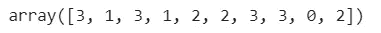

图 15:泊松分布值的随机数生成。

7.**卡方分布值**:函数 *chisquare()* 用于从卡方分布中生成样本。它需要两个参数 df-自由度和返回数组的大小- *形状。*

```
# initialize the seed to 25
np.random.seed(25)  # degree of freedom 2 and size (2, 3)
random.chisquare(df=2, size=(2, 3))
```

输出:

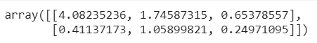

图 16:使用卡方分布值生成随机数。

# 摘要

感谢您阅读我们的**随机数生成器**教程的这一部分。在本教程中，我们学习了。

*   什么是随机性
*   什么是伪随机性
*   为什么不可能产生真正的随机数
*   随机性在机器学习和数据科学中的重要性
*   什么是伪随机数发生器(PRNG)
*   如何使用 Python 标准库生成伪随机数: *random* 和 *NumPy*

**免责声明:**本文表达的观点仅代表作者个人观点，不代表卡内基梅隆大学或其他(直接或间接)与作者相关的公司的观点。这些文章并不打算成为最终产品，而是当前思想的反映，同时也是讨论和改进的催化剂。

**除非另有说明，所有图片均来自作者。**

通过[向 AI](https://towardsai.net/) 发布

# 资源

[Github 库](https://github.com/towardsai/tutorials/tree/master/random-number-generator)。

[Google colab 实现](https://colab.research.google.com/drive/1xNXH-Vr9FKRA1GOAj69FDKkPN963SQDX?usp=sharing)。

# 参考

[1]伪随机数发生器，维基百科，【https://en.wikipedia.org/wiki/Pseudorandom_number_generator 

[2]Python 中机器学习的随机数生成器介绍，Machine Learning Mastery，[https://Machine Learning Mastery . com/how-to-generate-Random-numbers-in-Python/](https://machinelearningmastery.com/how-to-generate-random-numbers-in-python/)

[3]随机抽样，NumPy 开发者文档，[https://numpy.org/devdocs/reference/random/index.html](https://numpy.org/devdocs/reference/random/index.html)

【4】如何在 Python 中生成随机数，编码忍者，[https://www . Coding Ninjas . com/blog/2020/11/06/How-to-generate-random-number-in-Python/](https://www.codingninjas.com/blog/2020/11/06/how-to-generate-random-number-in-python/)