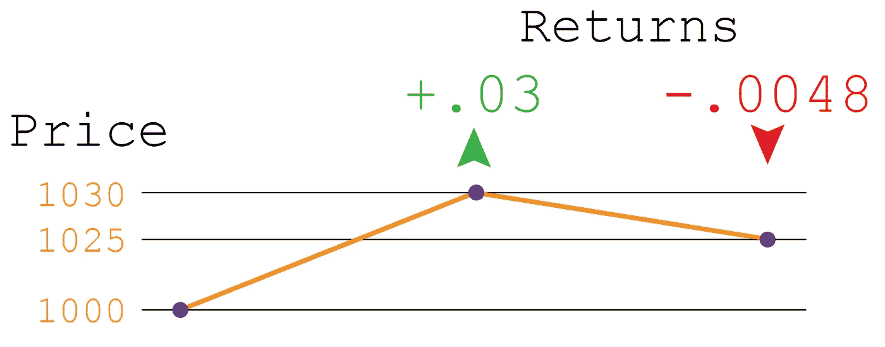
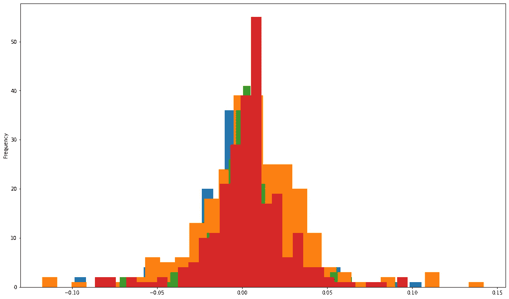
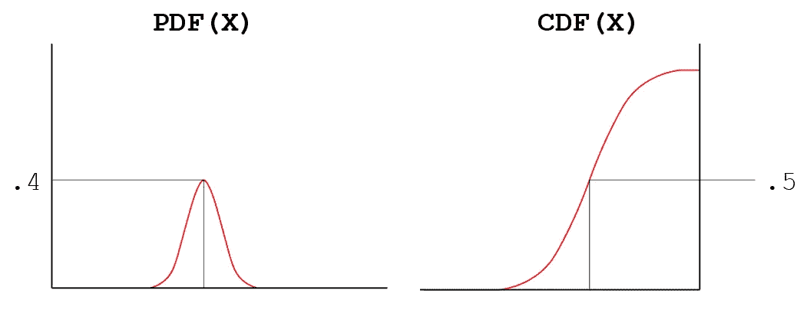
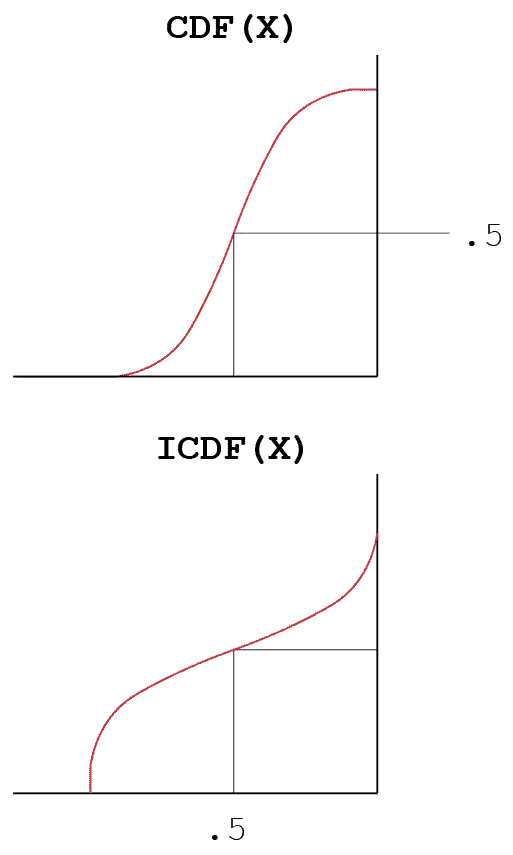
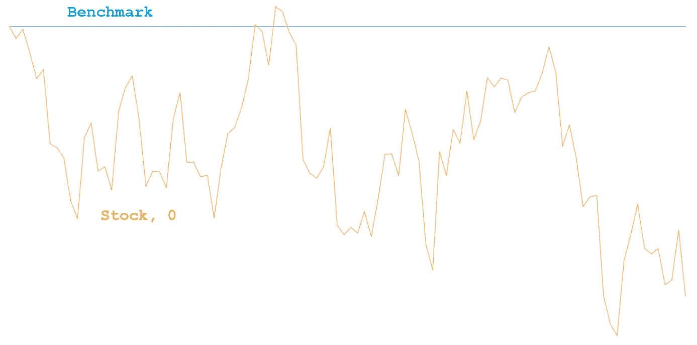
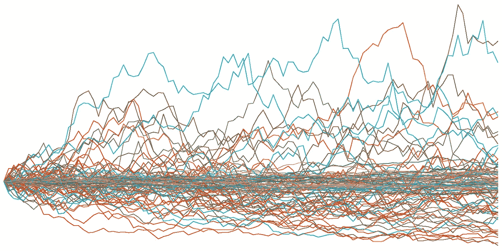

# 随机股票生成器——金融中的蒙特卡罗模拟

> 原文：<https://pub.towardsai.net/random-stock-generator-monte-carlo-simulations-in-finance-b9951a174271?source=collection_archive---------0----------------------->

## 金融，[机器学习](https://towardsai.net/p/category/machine-learning)

## 了解如何生成 n 个程序库存。全部代码可在[我的回购](https://github.com/arditoibryan/Projects/tree/master/20200820_Stock_Simulator)获得。

在本文中，我将关注如何从无到有地创建一个过程化的股票，它在每次迭代中都会随机地上下移动。虽然你可能认为创建一个随机的股票(或它们的序列)是无用的，因为它不能反映任何真实的场景，但它是一个工具，可以证明自己对技术分析有用，或者在部署到市场之前强调任何算法/模型。

## 股票走势背后的数学

根据随机游走理论，股票走势(所谓的回报)似乎完全是随机的。但这并不能简单地解决问题。如果问题是随机性，我可以简单地从第 0 天的价格 1000 开始，每天生成-100 到 100 之间的随机数，将它们添加到前一天的价格中。这种随机性的想法并没有错，只是太简单了。

这个想法是随机模拟一个股票运动，但尽可能接近现实。因此，选择一个随机数添加到每次迭代中是一种草率的现实表现方式。

## 股票收益

股票价格在迭代之间的移动(简单地说，股票从第 0 天移动到第 1 天，然后从第 1 天移动到第 2 天的方式……)通过使用特定的价值度量来测量:回报。



价格和回报之间的差异

计算股票回报最简单的方法是计算一次迭代和下一次迭代之间的百分比变化，如图所示。模拟股票的运动，我唯一需要做的就是创建一个迭代序列，在这个序列中，股票价格随着模拟的回报而运动。这是价格随时间的变化，我不会直接影响它。

## 例子

例如，如果我想模拟上面的图片，我知道我的股票价格在第 0 天从 1000 点开始。我将生成第一个回报(+0.03)，并用它来提高第一天的股价:

```
#day_1 stock price
1000*(1+0.03) = 1030
```

对于第 2 天的价格，我将生成-.0048 的回报:

```
#day_2 stock price
1030*(1+-0.0048) = 1025
```

## 产生随机回报

这就是有趣的地方。要随机生成回报，您需要应用 PDF(概率分布函数)的知识。不要像掷骰子那样考虑回报，在掷骰子的情况下，2%的股票波动可能有相当于 10%的股票波动概率(均匀分布)，我可以给我的分布我想要的形状。默认情况下，股票收益将遵循正态分布。



许多不同股票的收益图

* * *请注意，股票回报不仅遵循正态分布，还可以遵循不同的模式，如拉普拉斯分布或偏斜正态分布。如果你分析任何一只股票，并把收益代入柱状图，你会发现最常见的形式是正态分布。

## 生成正态分布的数字

如果您不熟悉数学过程，一旦有了分布，您将需要使用不同的工具来生成随机数:

1.  构建 PDF(概率分布函数)，在这种情况下，正态分布。
2.  从 PDF，建立 CDF(累积分布函数)
3.  从 CDF，建立 ICDF(逆累积分布函数):只有通过使用 ICDF，你可以生成随机数。

现在，我将解释产生随机回报背后的数学过程。稍后，我还将打印代码。

## 1.生成股票收益的正态分布

为了构建遵循正态分布形状的概率分布函数(PDF ),我需要:

*   平均
*   标准偏差(适马)

平均值表示分布的中心，如果你愿意，也可以表示峰值。在金融数学中，如果均值为正(假设+0.02)，所有回报为正的几率更高，如果均值低于 0，则相反。

标准差表示风险水平。适马越低，高波动次数越少。例如，如果你看上面的图表，它的适马大约是 0.03。这意味着像 0.05 或 0.07 或更高的价格波动不会经常发生。相反，你可能会发现大量低于 0.03 的波动。如果一天的价格只有 3%的波动，那么你的股票就不会波动，风险就会降低。

我想创建一个平均值为 0，适马为 0.02 的 PDF。这些数字表明，一只股票不会有更大的涨跌机会，而且波动性非常低:一种长期回报较低的安全投资。

## 2.生成累积分布函数



从 PDF 到 CDF 的过渡

虽然 PDF 的输出对我们没有用，但累积分布函数显示了小于一个值的总体百分比(实际上是分布中随机选取的概率)。

比如一次随机收益≤ 0 的概率是 50%。同样的，有一个值> 0 的概率是 50%。该函数的输入是股票的收益率，输出是概率。

## 3.生成逆累积分布函数



从民防部队到 ICDF

通过使用 CDF，我们只能输入收益。相反，通过使用 CDF 的逆函数，即 ICDF，我们可以反转输入和输出。我可以输入 0 到 1 之间的任何数，结果是，我会在总体中有等量的数。简而言之，要生成随机回报，我只需要生成一堆 0 到 1 之间的随机值，然后我将获得相应的值。

通过遵循这一过程，我将确保产生的回报遵循正确的分布，并且 2%的回报比 5%的波动发生的机会更大(这对于普通股票来说是非常罕见的)。

# 整个算法

我现在将使用一种算法来生成尽可能多的模拟股票。我可以将每只股票的长度(以天为单位)和分布参数(趋势和波动性)作为变量传递。

```
from scipy.stats import skewnorm
import pandas as pd
import numpy as np
import matplotlib.pyplot as plt
```

## 创建主函数

```
def simulate_stock(initial_price, drift, volatility, trend, days):
```

## 便携文档格式

```
def create_pdf(sd, mean, alfa):
    #invertire il segno di alfa
    x = skewnorm.rvs(alfa, size=1000000) 
    def calc(k, sd, mean):
      return (k*sd)+mean
    x = calc(x, sd, mean) #standard distribution
```

## ICDF

```
 #pick one random number from the distribution
    #formally I would use icdf, but I just have to pick randomly from the 1000000 samples
    #np.random.choice(x)
    return x
```

## 构建空数据框架

```
def create_empty_df(days):
    #creare un empty DataFrame con le date
    empty = pd.Series(
        pd.date_range("2019-01-01", periods=days, freq="D")
    )
    empty = pd.DataFrame(empty)
    #si tagliano ore, minuti, secondi
    empty#si tagliano ore, minuti, secondi
    empty.index = [str(x)[0:empty.shape[0]] for x in list(empty.pop(0))]
    empty#final dataset con values
    stock = pd.DataFrame([x for x in range(0, empty.shape[0])])
    stock.index = empty.index
    return stock
```

## 填充数据框

```
#skeleton
  stock = create_empty_df(days)#initial price
  stock[0][0] = initial_price#create entire stock DataFrame
x = create_pdf(volatility, drift, trend)
  for _ in range(1, stock.shape[0]):
    stock.iloc[_] = stock.iloc[_-1]*(1+np.random.choice(x))return stock
```

## 绘制股票图表

```
def graph_stocks(stock):
  #graph all stocks
  plt.figure(figsize=(28, 14))
  for c in stock.columns.values:
    #print(c)
    fig = plt.plot(stock.index, stock[c], lw=1, alpha=1)
  #plt.legend(loc='upper left', fontsize=12)
  #plt.ylabel('price in $')#remove axis labels
  plt.gca().axes.get_yaxis().set_visible(False)
```

## 生成多种股票

```
#create multiple stocks
stock_list = list()
column_name = list()#creating a benchmark stock
column_name.append('benchmark')
stock_list.append(simulate_stock(1000, 0, 0.0, 0, 100))n_iter = 1
n_days = 100for _ in range(n_iter):
  #naming the stocks
  text = 'stock, '
  column_name.append(text + str(_))#creating the simulated stock
  stock_list.append(simulate_stock(1000, 0.00, 0.02, 0, n_days))#join the stocks together
stock = pd.concat([x for x in stock_list], axis=1)
stock.columns = column_namestock
```

## 图形结果

```
graph_stocks(stock)
```



基准+随机生成股票的图表，0

## 导出数据帧

在您创建了几个随机库存(您想要多少就有多少)后，您可以将结果导出为. csv 文件。

```
stock.to_csv('stock.csv')
```



100 只模拟股票，使用不同的波动水平