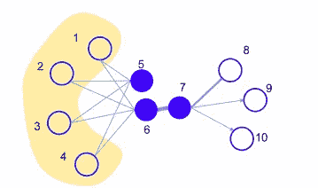
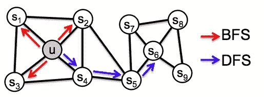
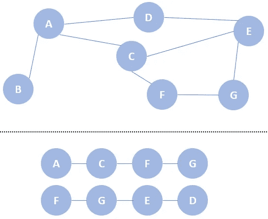
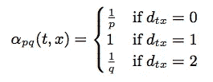
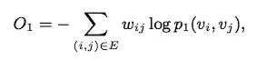
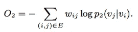
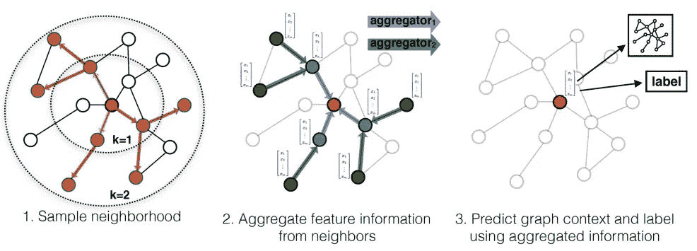

# 节点嵌入中的随机行走(DeepWalk、node2vec、LINE 和 GraphSAGE)

> 原文：<https://pub.towardsai.net/random-walk-in-node-embeddings-deepwalk-node2vec-line-and-graphsage-ca23df60e493?source=collection_archive---------0----------------------->

## 图形嵌入

史蒂文·魏在 [Unsplash](https://unsplash.com?utm_source=medium&utm_medium=referral) 上的照片

> 我们可以考虑使用图形神经网络(GNN)来执行节点分类问题，而不是使用传统的机器学习分类任务。通过提供节点的显式链接，该分类问题不再被分类为独立的问题，而是利用了诸如节点度的图结构。图形属性的有用性假设单个节点与其他相似节点相关。
> 
> 典型的例子是社交媒体网络。想象一下，脸书是如何根据你喜欢的帖子、你在哪里签到等将你和其他人联系起来的。一个图表能够代表这种关系，我们可以利用它来训练 GNN。GNN 的详细用例将在后面的故事中介绍。

在最后一个[故事](https://medium.com/towards-artificial-intelligence/a-gentle-introduction-to-graph-embeddings-c7b3d1db0fa8)中，我们经历了知识图嵌入。它涵盖了一个通过 TransE 训练图嵌入的框架，并且是大规模的复杂。在这个故事中，我们将讨论图结构和基于随机游走的学习图嵌入的模型。以下部分涵盖了 [DeepWalk](https://arxiv.org/pdf/1403.6652.pdf) (Perozzi 等人，2014)[node 2 vec](https://cs.stanford.edu/~jure/pubs/node2vec-kdd16.pdf)(Grover 和 Leskovec，2016)[LINE](https://arxiv.org/pdf/1503.03578.pdf)(Tang 等人，2015)[graph sage](https://arxiv.org/pdf/1706.02216.pdf)(Hamilton 等人，2018)。

# 图形结构

在 ego 通过那些基于随机行走的模型之前，我们需要理解一些基本的图结构。

*   一阶邻近性:称为同向性。如果两个节点相连，则它们是同向的或具有一阶邻近性。
*   二阶接近度:如果两个节点共享许多连接，则它们具有更高的二阶接近度。即下图 1 中的节点 5 和节点 6。尽管节点 5 和节点 6 没有直接相连，但它们共享完全相同的邻居节点。这表明它们有一定程度的相似性。另一方面，它有助于收敛那些较少的邻居节点。
*   结构对等:指相似的结构角色。例如，如果两个节点连接到三个不同的节点，则两个节点是结构等价的。即下图 2 中的节点 u 和节点 s6。

图 1(唐等，2015)

图 2(格罗弗和莱斯科维奇，2016 年)

# DeekWalk

[引入 DeepWalk](https://arxiv.org/pdf/1403.6652.pdf) (Perozzi 等人，2014)通过随机行走和 word2vec (Mikolo 等人，2013) [word2vec](https://towardsdatascience.com/3-silver-bullets-of-word-embedding-in-nlp-10fa8f50cc5a) 算法学习节点嵌入。在自然语言处理(NLP)中，我们可以应用跳格模型和输入一个句子(一系列单词)来训练单词嵌入。简而言之，训练目标是使用中心单词来预测周围的单词。你可以查看这个[故事](https://towardsdatascience.com/3-silver-bullets-of-word-embedding-in-nlp-10fa8f50cc5a)的细节。

回到 DeepWalk，它随机选取一个节点，然后随机“行走”到一个邻居节点，直到它达到最大长度(或某个随机长度)。给定下面的知识图(上半部分)，我们分别选取“A”和“F”作为起点。稍后，我们将节点“A”移动到节点“C ”,依此类推。

上图:知识图。下图:随机漫步序列

在这种情况下，我们将节点和一系列节点分别视为“单词”和“句子”。稍后，我们可以重用 skip-gram 算法来收敛节点嵌入。

# node2vec

[node2vec](https://cs.stanford.edu/~jure/pubs/node2vec-kdd16.pdf) (Grover 和 Leskovec，2015)是 DeepWalk (Perozzi 等人，2014)的高级版本。DeepWalk (Perozzi et al .，2014)的一个局限是你无法控制路径。node2vec (Grover 和 Leskovec，2015)也使用随机行为，但有权重。

作者引入宽度快速采样(BFS)和深度优先采样(DFS)来控制随机行为，而不是随机“行走”。BFS 到达直接邻居，而 DFS 更喜欢远离源的节点。

BFS:广度优先抽样。DFS:深度优先采样(Grover 和 Leskovec，2016 年)

为了提供这种灵活性，随机游走概率不再是不加权的，而它可以通过以下设置来实现。dtx 表示到源的距离，而 p 和 q 是参数。较大的 p 确保对被访问节点进行采样的机会较小。q 允许我们控制我们想要 BFS 还是 DFS。较大的 q 倾向于围绕中心随机游走。

# 线条

[LINE](https://arxiv.org/pdf/1503.03578.pdf) (唐等，2015)，又名 LINE 大规模信息网络嵌入，提出利用一阶近似和二阶近似来学习节点嵌入。

为了最小化一阶邻近目标，连接的节点将在嵌入空间中彼此收敛。注意，它只适用于无向图。

一阶邻近目标(唐等人，2015 年)

同上，我们需要最小化共享相似邻居节点的收敛节点的二阶邻近目标。

二阶邻近目标(唐等，2015)

# 图表法

[GraphSAGE](https://arxiv.org/pdf/1706.02216.pdf) (Hamilton et al .，2018)，又名 Graph SAmple and aggreGatE，。是一个动态生成节点嵌入的模型。与其他模型不同，它不训练特定的节点嵌入，而是训练一个聚合器。由于这种性质，它可以处理看不见的节点。

该方法包括采样邻居节点和聚集邻居节点两个主要步骤。下图说明了该步骤:

1.  选择一个节点(即该图的中心)。在每层中挑选一些邻居节点(即 k=1，k=2)。
2.  聚合每层(蓝色层和绿色层)中的节点
3.  向神经网络输入嵌入信息并进行预测

GraphSAGE 样本和集合方法(Hamilton 等人，2018 年)

如前所述，在每个小批量中，它只采样一些邻居节点进行训练。使用随机行走方法，并且它是不加权的(与深度行走相同)。

但是我们如何聚合它呢？作者提出了均值聚合、LSTM 聚合和汇集聚合四种方法。

*   均值聚合器:取邻居的平均值并与目标节点连接。
*   GCN 聚集器:连接邻居和节点后取平均值。与均值聚合器相比，顺序正好相反。实践证明，该方法取得了较好的效果。
*   LSTM 聚合器:随机排列邻居订单并馈入 LSTM 层。
*   汇集聚合器:提供给多层感知器(MLP)并执行最大汇集。

# 拿走

*   DeepWalk 的想法很简单，但有一些限制。由于这是一个纯粹的随机行走(未加权)，频率或重要性不能影响嵌入和说明图的结构。因为它需要“行走”来从邻居那里获得信息，所以很难支持看不见的数据。
*   node2vec 解决了 DeepWalk 的一些限制，例如未加权问题。然而，它可能遭受更高的计算要求。
*   DeepWalk 和 LINE 分别对所有节点使用深度优先搜索(DFS)策略，对低度节点使用广度优先搜索(BFS)策略。另一方面，node2vec 混合了 BFS 和 DFS 来学习节点嵌入。

# 延伸阅读

*   [DeepWalk](https://github.com/phanein/deepwalk) 仓库
*   [node2vec](https://github.com/aditya-grover/node2vec) 储存库
*   [GraphSAGE](https://github.com/williamleif/GraphSAGE) 存储库
*   PyTorch 周正，[https://arxiv.org/abs/1903.02428](https://arxiv.org/abs/1903.02428)

# 关于我

我是湾区的数据科学家。专注于数据科学、人工智能，尤其是 NLP 和平台相关领域的最新发展。欢迎在 [LinkedIn](https://www.linkedin.com/in/edwardma1026) 上与 [me](https://makcedward.github.io/) 联系，或者在 [Medium](https://medium.com/@makcedward/) 或 [Github](https://github.com/makcedward) 上关注我。

# 参考

*   B.佩罗齐，R. A. Rfou 和 S. Skiena。[深度行走:在线学习社交表征](https://arxiv.org/pdf/1403.6652.pdf)。2014
*   J.唐、瞿、王、张、严军、梅青。[线:大规模信息网络嵌入](https://arxiv.org/pdf/1503.03578.pdf)。2015
*   A.格罗弗和 j .莱斯科维奇。 [node2vec:网络的可扩展特征学习](https://cs.stanford.edu/~jure/pubs/node2vec-kdd16.pdf)。2016
*   W.l .汉密尔顿、r .英和 j .莱斯科维奇。[大型图上的归纳表示学习](https://arxiv.org/pdf/1706.02216.pdf)。2018