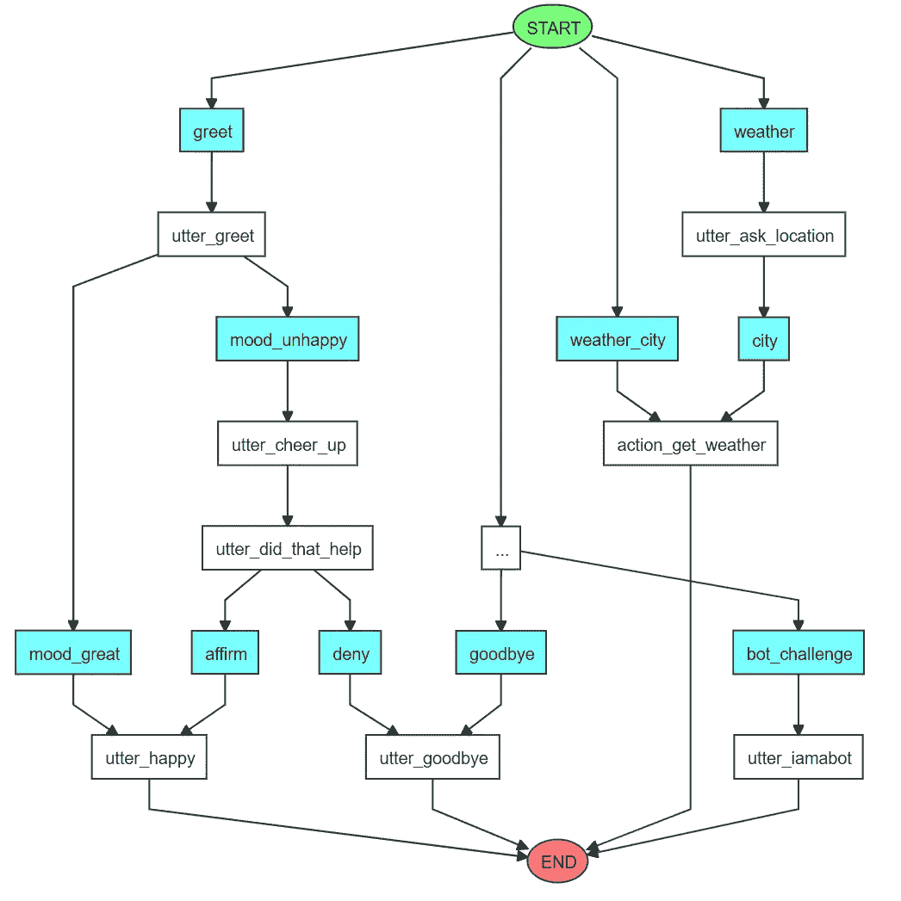

# Rasa 101:构建天气助手

> 原文：<https://pub.towardsai.net/rasa-101-building-a-weather-assistant-244489316d11?source=collection_archive---------1----------------------->

## [自然语言处理](https://towardsai.net/p/category/nlp)

## 您将了解什么是 RASA 框架以及如何使用它


[来源:[拉莎](https://rasa.com/) ]

**首先，什么是 Rasa？**

> Rasa 是一个开源的机器学习框架，用于自动化基于文本和语音的对话。Rasa 帮助您构建能够进行分层对话的上下文助手，其中包含大量的来回对话。为了让人类与上下文助手进行有意义的交流，助手需要能够使用上下文来构建之前讨论过的东西——Rasa 使您能够构建能够以可扩展的方式完成这一任务的助手。[来源: [Rasa](https://github.com/RasaHQ/rasa)

这意味着使用 Rasa，我们可以用最少的编程工作创建聊天机器人。部署更关注对话本身，而不是复杂的编程任务。

## 安装 Rasa

我们既可以从源代码安装 Rasa，也可以使用`pip` (Rasa 需要 Python 3.6、3.7 或 3.8)。我建议后者，因为它更简单。我还建议创建一个虚拟环境，因为 Rasa 有许多依赖项，可能会干扰您的其他包。

首先，让我们检查一下安装的 Python 和 pip 版本:

```
$ python3 --version
$ pip3 --version
```

然后我们更新我们的系统:

```
$ sudo apt update
$ sudo apt install python3-dev python3-pip
```

我们创建一个保存在`./venv`目录中的虚拟环境，并激活它:

```
$ python3 -m venv ./venv
$ source ./venv/bin/activate
```

现在我们必须更新我们的 pip 版本:

```
$ pip3 install -U pip
```

我们准备安装 Rasa 和 pip:

```
$ pip3 install rasa
**Check the installed rasa version with:** $ rasa --version
```

我的系统中安装了`rasa 2.0.2`版本。已经发布了更新的版本，但是不要担心，我们的简单实现可以毫无问题地适应它们。

**创建第一个 Rasa 项目**

一个很好的用途是为您正在处理的每个 Rasa 项目创建一个单独的文件夹。然后，在该文件夹中创建一个 Rasa 结构项目，包含:

```
$ mkdir weather-assistant
$ cd weather-assistant
$ rasa init --no-prompt
```

`rasa init`命令创建一个包含所有需要的数据、动作和配置文件的新项目。通过使用`--no-prompt`,我们将跳过一些关于新项目的问题，以及我们是否希望训练一个默认的 Rasa 模型。初始模型将基于一些琐碎的例子进行训练，项目结构如下:

```
.
├── actions
│   ├── __init__.py
│   └── actions.py
├── config.yml
├── credentials.yml
├── data
│   ├── nlu.yml
│   ├── rules.yml
│   └── stories.yml
├── domain.yml
├── endpoints.yml
├── models
│   └── <timestamp>.tar.gz
└── tests
   └── test_stories.yml
```

简单介绍一下。 ***actions.py*** 文件包含了我们希望我们的助手执行的所有定制动作(我们将在后面详细讨论)。 ***config.yml*** 包含 Rasa 用于训练的管道。***credentials . yml***包含您的机器人正在使用的语音和聊天平台的凭证。在 ***nlu.yml*** ， ***stories.yml*** 和 ***rules.yml*** 中定义了我们助手的所有 nlu 训练数据。 ***domain.yml*** 定义了你的助手运作的宇宙。 ***端点. yml*** 包含了你的 bot 可以使用的不同端点。最后，每个训练好的模型都存储在 ***模型*** 文件夹中，所有用于测试的数据都应该存储在 ***测试*** 文件夹中。

当然，我们不会全部使用。我们将首先写入所有 NLU 数据，我们将在域文件中定义它们，最后，我们将创建一个自定义操作来获取我们想要的天气数据。

## 创建 NLU 数据

Rasa 使用 3 个文件管理 bot 的训练 NLU 数据， ***nlu.yml*** ， ***stories.yml*** 和 ***rules.yml*** 。你可能会碰到 ***。md*** 文件，因为 Rasa 在以前的 Rasa 开源 1.x 版本中使用了它们。它们仍然受到支持，但不推荐使用，因为它们会降低训练速度。

回到我们的助手。我们将稍微修改前两个文件。

**nlu . yml:**

对于助手来说，无论用户如何表达他们的信息，都要识别用户在说什么，我们需要提供助手可以学习的示例信息。

> 我们根据信息表达的想法或目标对这些例子进行分组，这也被称为意图。

意图及其示例被用作助手的自然语言理解(NLU)模型的训练数据。

默认设置创造了这些琐碎的意图:问候，再见，肯定，否认，心情好，心情不好和机器人挑战。我们将添加另外 3 个意图:天气，天气 _ 城市和城市。

第一个意图是`weather`，用户说他想知道天气:

```
- intent: weather
  examples: |
    - tell me the weather
    - I want to know the weather
    - weather please
    - what's the weather today
    - what's the temperature right now
    - hows the weather going to be
    - i want to know the temperature
```

在第二个例子中，`weather_city`用户说他想知道一个特定城市的天气。

```
- intent: weather_city
  examples: |
    - tell me the weather in [Paris](location)
    - I want to know the weather in [London](location)
    - weather for [Athens](location) please
    - what's the weather today in [Berlin](location)
    - what's the temperature in [Washington](location) right now
    - hows the weather in [Brussels](location)
    - i want the temperature at [Rome](location)
```

在最后一个例子中，`city`用户只提供了一个城市。

```
- intent: city
  examples: |
    - [Liverpool](location)
    - [Milan](location)
    - [Frankfurt](location)
    - [Porto](location)
    - [Madrid](location)
    - [Barcelona](location)
    - [Oslo](location)
```

机器人被训练来识别说出的意图并提取其中的实体。在我们的例子中，唯一的实体是城市名`location`。

**The stories.yml:**

故事是训练助手根据用户之前在对话中所说的内容做出正确反应的示例对话。故事格式显示了用户消息的意图，随后是助手的动作或响应。你的第一个故事应该展示一个对话流，在这个对话流中，助手以一种直接的方式帮助用户完成他们的目标(愉快的路径)。稍后，您可以为用户不想提供他们的信息或切换到不相关的主题(不愉快的路径)的情况添加故事。

我们将为我们的简单助手创建 2 条快乐的路径，但可以随意添加更多快乐或不快乐的路径。每个故事都有以下格式。它有一个专门用于调试和步骤的名称。这里给出了 3 种步骤，*意图*(用户所说的话)*动作*(机器人如何响应)和 *slot_was_set* (表示一个槽的值已经被修改)。

在这里，我们可以检查插槽和实体之间的区别。**槽**保存你想在对话中跟踪的信息。它们是助手的记忆。它们充当键值存储，可用于存储用户提供的信息(例如，城市)。**实体**是用户消息中的结构化信息。“实体”部分列出了助理在对话过程中提取的所有实体。

> 这意味着机器人理解意图中的实体，我们希望这些实体存储在槽中，以便在以后的对话中使用它们的值。

这里重要的是，如果我们用相同的名称定义一个槽和一个实体，它们会被自动映射。当然，您可以手动对它们进行不同的映射，但这超出了本文的范围。

让我们看看，现在，我们的两个故事。在第一个例子中，用户询问天气。由于我们不知道是哪个城市，机器人通过 *utter_ask_location* 动作来请求它。这称为**响应**，在域文件中定义。然后提取*城市*，并进行槽实体映射。我们执行自定义动作 *action_get_weather* ，它在 actions.py 文件中有详细的定义。最后，为了更好的用户体验，我们将插槽重置为`null`。

```
- story: ask weather happy path
  steps:
  - intent: weather
  - action: utter_ask_location
  - intent: city
    entities:
    - location: Madrid
  - slot_was_set:
    - location: Madrid
  - action: action_get_weather
  - slot_was_set:
    - location: null
```

在第二种情况下，用户的意图是`weather_city`，这意味着他首先提供了确切的位置。因此，我们将实体映射到插槽，执行自定义操作并重置插槽。

```
- story: ask weather with city happy path
  steps:
  - intent: weather_city
    entities:
    - location: Rome
  - slot_was_set:
    - location: Rome
  - action: action_get_weather
  - slot_was_set:
    - location: null
```

作为机器人的一个例子，你可以看到实体和插槽被特别设置在一个故事中(这里是马德里和罗马)。这有助于助手了解如何将实体的值映射到适当的槽。

**domain . yml:**

这个文件是最重要的。它明确地定义了我们模型的所有配置，助手将在其中运行的世界。在这个文件中，我们列出了我们想要助手理解和处理的所有意图、响应、实体、槽和动作。下面我们在适当的部分为我们的天气助手添加数据。

```
intents:
  - weather
  - weather_city
  - cityentities:
  - locationslots:
  location:
    type: text
    influence_conversation: trueresponses:
  utter_ask_location:
  - text: "For which city?"actions:
  - action_get_weather
```

## 编写自定义操作

我们最后要修改的文件是 ***actions.py*** 。自定义操作用于运行您想要的任何代码，例如调用 API 或查询数据库。我们将在这里做第一个。我们使用 [OpenWeatherMap](https://openweathermap.org/) API，因为它简单且免费。你只需要创建一个基本的免费账户，你就可以通过 API 密匙访问他们的数据。

为了使 Rasa 能够与这些自定义操作(即*操作服务器*)进行交互，必须启用该端点。接下来的两行在***endpoints . yml***文件中被注释掉，我们必须撤销它。如您所见，Rasa 通过 5055 端口与动作服务器通信。

```
action_endpoint:
 url: "[http://localhost:5055/webhook](http://localhost:5055/webhook)"
```

我们创建一个动作类，并将其名称定义为`action_get_weather`。该名称必须在 actions 部分下的域文件中定义。

```
import requests
from rasa_sdk import Action
from rasa_sdk.events import SlotSetclass ActionGetWeather(Action):
    """ Return today's weather forecast"""def name(self):
      return "action_get_weather"
```

接下来，当我们的助手触发这个动作时，将执行`run`方法。该方法使用了*调度器*、*、*、*跟踪器*和*域*组件。*调度器*用于通过`utter_message`方法将消息发送回用户。状态*跟踪器*跟踪整个对话，这里用于使用`tracker.get_slot(location)`访问槽值。*域*包含机器人的域。

在下一个方法中，检索槽的值，向天气 API 发出一个 *get* 请求，并将结果返回给用户。如果出现问题，机器人会说出来。最后，`SlotSet("location", None)`重置插槽。这样，用户可以再次请求不同城市的天气预报。我认为最好有一个更通用的助手。更现实的实现是，如果存储了一个永久的城市，机器人会要求用户确认这是否是他们想要了解的城市。

```
def run(self, dispatcher, tracker, domain):city = tracker.get_slot('location')
  api_token = <YOUR_API_TOKEN>
  url = "[https://api.openweathermap.org/data/2.5/weather](https://api.openweathermap.org/data/2.5/weather)"
  payload = {"q": city, "appid": api_token, "units": "metric", "lang": "en"}
  response = requests.get(url, params=payload)
  if response.ok:
    description = response.json()["weather"][0]["description"]
    temp = round(response.json()["main"]["temp"])
    city = response.json()["name"]
    msg = f"The current temperature in {city} is {temp} degree Celsius. Today's forecast is {description}"
  else:
    msg = "I'm sorry, an error with the requested city as occured."dispatcher.utter_message(msg)
  return [SlotSet("location", None)]
```

## 训练你的模型

现在我们准备训练我们的模型。很简单，我们输入:

```
$ rasa train
```

培训完成后，我们可以开始和我们的助理交谈。首先，我们必须初始化动作服务器，代码写在 *actions.py* 文件中。

```
$ rasa run actions
```

然后，我们打开一个新的 bash，并与助手聊天，我们将使用最简单的选择。使用下一个命令，我们可以通过命令提示符与我们的模型聊天。

```
$ rasa shell
```

当然，还有更高级的选择，比如 [Rasa X](https://rasa.com/docs/rasa-x/) ，它包含一个 GUI，是改进你的模型的一个很好的工具。您也可以使用`rasa run`来启动 Rasa 服务器，并且您可以通过 POST 请求与助手通信。

**可视化模型**

Rasa 附带了一个工具，可以通过下一个命令生成您的故事的可视化表示。

```
$ rasa visualize
```

在下一张图中，所有的故事都被可视化了。意图显示在蓝色方框中，机器人的响应显示在白色方框中。因为我们没有删除最初的 Rasa 数据，所以你会看到很多故事。我们的天气助手，两个创建的故事，在右边的两个管道中可视化。

> 这个图是一个很好的工具，可以清楚地了解所创建的代理。



> 谢谢大家！你可以在这个 [**GitHub** repo](https://github.com/malamasn/rasa-weather-assistant) 里找到以上所有代码。

**参考文献**

*   Rasa 官方文件:[https://rasa.com/docs/rasa/](https://rasa.com/docs/rasa/)
*   Udemy 的 Rasa 工作坊:[https://www.udemy.com/course/rasa-certification-workshop/](https://www.udemy.com/course/rasa-certification-workshop/)
*   Rasa 官方大师班:[https://www.youtube.com/playlist?list = pl 75 E0 QA 87 dlhqny 7 z 43 nduzhpo 6 qd-cRc](https://www.youtube.com/playlist?list=PL75e0qA87dlHQny7z43NduZHPo6qd-cRc)
*   项目 GitHub 回购:[https://github.com/malamasn/rasa-weather-assistant](https://github.com/malamasn/rasa-weather-assistant)