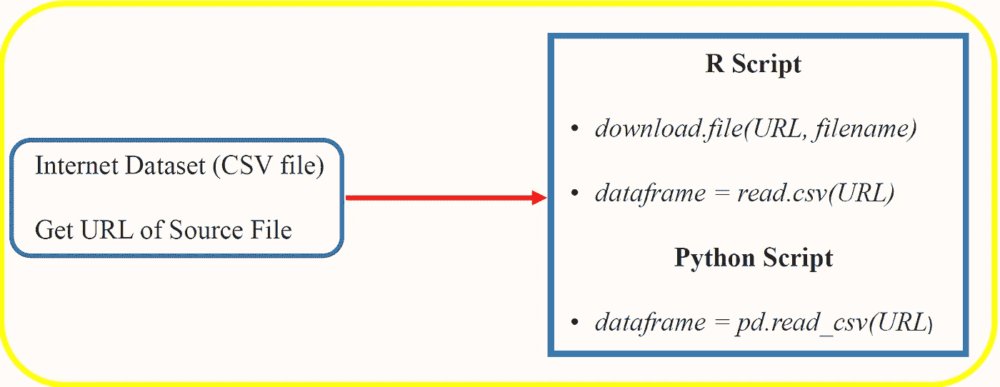

# 从互联网上直接读取 CSV 文件到您的代码中

> 原文：<https://pub.towardsai.net/read-a-csv-file-from-the-internet-directly-into-your-code-3607191742e7?source=collection_archive---------2----------------------->

## [编程](https://towardsai.net/p/category/programming)

## 使用 download.file()、read.csv()和 pd.read_csv()等函数将 csv 文件从互联网直接读入 R 或 Python 代码



Benjamin O. Tayo 的图片

# 介绍

在进行任何数据分析之前，我们首先需要有一个可靠的数据来源。一个可靠的数据来源是互联网数据。有很多网站可以获取数据集进行分析或建模。数据有不同的格式，如数字数据、文本数据、语音数据、图像数据或视频数据。在本文中，我们将重点关注以逗号分隔值(CSV)文件格式存储的数字数据。

存储在 CSV 文件中的免费数据集的一些示例可下载用于分析，包括:

## a)加州大学欧文分校(UCI)机器学习知识库

UCI 目前维护着 487 个[数据集](https://archive.ics.uci.edu/ml/datasets.php)作为对机器学习社区的服务，可用于数据科学课程和研讨会中的数据分析实践、家庭作业和项目。

## b) Kaggle 数据集

[Kaggle datasets](https://www.kaggle.com/datasets) 也包含了大量非常具有挑战性的数据科学和机器学习项目的数据集。

## c) GitHub

GitHub 包含数以千计的存储库，其中有现成的数据集，可以随时下载。

在本教程中，我们将展示如何从以下 GitHub 资源库下载文件:"*introduction _ to _ physics _ grades . CSV*:[https://github.com/bot13956/datasets](https://github.com/bot13956/datasets)。

# 方法 1:在 R 中使用 download.file()函数

使用函数 ***setwd()*** 选择保存文件的目录:

```
setwd(“C:\\Users\\btayo\\Desktop\\grade_classifier”)
```

然后使用 ***函数 download.file(URL，filename)*** 下载文件。这里， **URL** (统一资源定位符)是包含源文件的 URL 的字符串， ***filename*** 是目标文件的文件名。

# 关于提供正确 URL 的注意事项

如果你导航到 GitHub 库[https://github.com/bot13956/datasets](https://github.com/bot13956/datasets)并点击文件:“我*ntroduction _ to _ physics _ grades . CSV*，它会带你到以下网址:[https://GitHub . com/bot 13956/datasets/blob/master/introduction _ to _ physics _ grades . CSV](https://github.com/bot13956/datasets/blob/master/introduction_to_physics_grades.csv)

如果您将此 URL 输入到您的 ***download.file()*** 函数中，例如使用命令:

```
URL = “[https://github.com/bot13956/datasets/blob/master/introduction_to_physics_grades.csv](https://github.com/bot13956/datasets/blob/master/introduction_to_physics_grades.csv)"download.file(URL, “grades.csv”)
```

您会收到以下消息:

```
**trying URL ‘**[**https://github.com/bot13956/datasets/blob/master/introduction_to_physics_grades.csv'**](https://github.com/bot13956/datasets/blob/master/introduction_to_physics_grades.csv')**Content type ‘text/html; charset=utf-8’ length unknown****downloaded 195 KB**
```

文件下载不正确，因为内容类型设置为 *text/html* 。如果您导航到您的工作目录(在本例中是"*C:/Users/btayo/Desktop/grade _ classifier*"目录)并单击本地目录中下载的" *grades.csv* "文件，您将注意到该文件已经以 html 格式下载。这肯定不是正确的格式。因为我们正在下载一个 csv 文件，所以我们希望将内容类型设置为*文本/纯文本*，而不是*文本/html* 。

要下载 t *ext/plain* 格式的 csv 文件，请遵循以下步骤:

*   导航到 GitHub 库:[https://github.com/bot13956/datasets](https://github.com/bot13956/datasets)
*   然后点击 csv 文件:“*简介 _ 到 _ 物理 _ 成绩. csv* ”
*   然后点击右上方的 **Raw** 按钮。这将打开一个 csv 格式的文件。
*   现在复制这个页面的网址:[https://raw . githubusercontent . com/bot 13956/datasets/master/introduction _ to _ physics _ grades . CSV](https://raw.githubusercontent.com/bot13956/datasets/master/introduction_to_physics_grades.csv)

这是您应该在***download . file()***函数中用作参数的 URL。因此，正确的代码是:

```
URL = “[https://raw.githubusercontent.com/bot13956/datasets/master/introduction_to_physics_grades.csv](https://raw.githubusercontent.com/bot13956/datasets/master/introduction_to_physics_grades.csv)"download.file(URL, “grades.csv”)
```

请注意，发出该命令后，将生成以下消息:

```
**trying URL ‘**[**https://raw.githubusercontent.com/bot13956/datasets/master/introduction_to_physics_grades.csv'**](https://raw.githubusercontent.com/bot13956/datasets/master/introduction_to_physics_grades.csv')**Content type ‘text/plain; charset=utf-8’ length 9562 bytes****downloaded 9562 bytes**
```

这表明文件已经以正确的格式下载，内容类型设置为*文本/普通*。

要查看和分析下载的“ *grades.csv* ”文件中包含的数据，您可以使用以下命令:

```
library(readr)df<-read.csv(“grades.csv”)head(df)
```

# 方法 2:在 R 中使用 read.csv()函数

我们可以使用 ***read.csv()*** 函数将数据直接读入我们的工作区，并使用以下命令将其分配给一个新的 dataframe 对象:

```
library(readr)URL = “[https://raw.githubusercontent.com/bot13956/datasets/master/introduction_to_physics_grades.csv](https://raw.githubusercontent.com/bot13956/datasets/master/introduction_to_physics_grades.csv)"df<-read.csv(URL)head(df)
```

# **方法三:在 Python 中使用 pd.read_csv()函数**

```
import pandas as pdURL = 'https://archive.ics.uci.edu/ml/machinelearning-databases/breast-cancer-wisconsin/wdbc.data'df = pd.read_csv(URL,header = None)df.head()
```

# 摘要

从互联网上下载数据集有很多不同的方式。在本教程中，我们展示了如何使用函数 **d *ownload.file()* 、 *read.csv()* 、**和 ***pd.read_csv()*** 使用源文件的正确 URL 将 csv 数据集直接读入代码。

# 其他数据科学/机器学习资源

[数据科学需要多少数学？](https://medium.com/towards-artificial-intelligence/how-much-math-do-i-need-in-data-science-d05d83f8cb19)

[数据科学课程](https://medium.com/towards-artificial-intelligence/data-science-curriculum-bf3bb6805576)

[进入数据科学的 5 个最佳学位](https://towardsdatascience.com/5-best-degrees-for-getting-into-data-science-c3eb067883b1)

[数据科学的理论基础——我应该关心还是仅仅关注实践技能？](https://towardsdatascience.com/theoretical-foundations-of-data-science-should-i-care-or-simply-focus-on-hands-on-skills-c53fb0caba66)

[机器学习项目规划](https://towardsdatascience.com/machine-learning-project-planning-71bdb3a44349)

[如何组织你的数据科学项目](https://towardsdatascience.com/how-to-organize-your-data-science-project-dd6599cf000a)

[大型数据科学项目的生产力工具](https://medium.com/towards-artificial-intelligence/productivity-tools-for-large-scale-data-science-projects-64810dfbb971)

[数据科学作品集比简历更有价值](https://towardsdatascience.com/a-data-science-portfolio-is-more-valuable-than-a-resume-2d031d6ce518)

***如有疑问，请发邮件给我***:benjaminobi@gmail.com