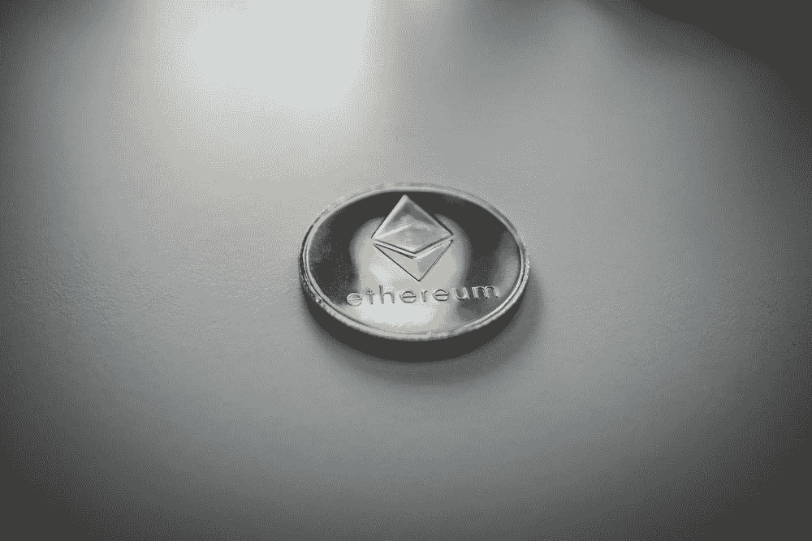

# 用简单的 Web 编程从以太网上读取公共消息

> 原文：<https://pub.towardsai.net/read-public-messages-from-the-ethereum-network-with-simple-web-programming-70d8650e54e2?source=collection_archive---------1----------------------->



## 新技术的实践学习

## 我最近向您展示了如何在以太坊网络中发布永久不被破坏的消息。在这里，我向你展示了如何浏览、搜索和阅读人们在上面写的东西——包括曾经保存的所有合同的内容。没有什么不合法的，因为内容是公开的，而且是免费的。

想通过一些实验来了解区块链，同时了解更多关于 JavaScript 编程的知识吗？那么，这篇文章就送给你了。

在最近的一篇文章中，我向您展示了如何在以太坊网络中发布“永远不会被破坏”的消息——或者至少在当前的技术下，只要网络存在:

[](https://medium.com/technology-hits/how-to-easily-post-data-in-the-ethereum-blockchain-network-forever-with-no-programming-ef957dff4539) [## 如何轻松地在以太坊区块链网络中永久发布数据——无需编程

### 与去中心化的区块链互动的软件已经变得足够简单，你现在只需几个步骤就可以做事情…

medium.com](https://medium.com/technology-hits/how-to-easily-post-data-in-the-ethereum-blockchain-network-forever-with-no-programming-ef957dff4539) 

这可能包括您希望公开存储的数据或声明，或许可以作为您首先发明某项内容的证据。事实上，立法者和州政府正在认真考虑智能合同的力量，例如在其他应用中保护知识产权:

[](https://www.ibm.com/blogs/blockchain/2021/02/disrupting-the-patent-ecosystem-with-blockchain-and-ai/) [## 用和 AI IBM 供应链和区块链博客颠覆专利生态系统

### 区块链和人工智能正在破坏知识产权生态系统——这是互联网上最有价值的资产类别之一

www.ibm.com](https://www.ibm.com/blogs/blockchain/2021/02/disrupting-the-patent-ecosystem-with-blockchain-and-ai/) [](https://www.wipo.int/wipo_magazine/en/2018/01/article_0005.html) [## 区块链和知识产权法:密码天堂里的一对？

### 2018 年 2 月英国伦敦贝克·麦坚时律师事务所 Birgit Clark 区块链及相关分布式账本…

www.wipo.int](https://www.wipo.int/wipo_magazine/en/2018/01/article_0005.html) 

现在，在这篇新文章中，我将向你展示如何通过使用我在上一篇文章中解释的张贴方法来浏览、搜索和阅读人们在以太坊网络上写的东西。更准确地说，我们要做的是查看以太坊网络块中存储的交易输入字段的内容。为此，我们将在常规的 HTML 网页中使用一些 JavaScript 代码。

**注 1:** 这段代码只能在安装了元掩码插件的浏览器上运行！在我的例子中，我在 Brave 浏览器上用 MetaMask 测试了所有这些。

MetaMask 是一个“钱包”，可以让你持有、发送和接收加密货币。你可以在 https://metamask.io/的[免费获得 MetaMask。只要用你的浏览器打开那个链接，点击下载，它就会被安装并链接到浏览器。一个像狐狸脸一样的小图标会出现在你的浏览器上。](https://metamask.io/)

**注意 2:** 你不需要在你的账户上有任何 ETH 来运行这个，因为阅读它的内容不会花费任何汽油(与写作相反，正如你可能已经在我关于[张贴到以太坊网络](https://medium.com/technology-hits/how-to-easily-post-data-in-the-ethereum-blockchain-network-forever-with-no-programming-ef957dff4539)的文章中看到的)。

# 绝对码

您只需要创建一个包含我将在下面描述的内容的常规 HTML 网页，并在您的元掩码注入浏览器上打开它。

下面这段 HTML+JavaScript 代码检索并报告给定块中的所有事务(在 **ablocknumber** 处输入)。web 应用程序将块内每个事务的输入字段的所有内容写入文档(从十六进制转换为人类可读的 ASCII)。

```
<html>
<head>
 <meta charset=”utf-8">
 <meta name=”generator” content=”AlterVista — Editor HTML”/>
 <title></title>
 <script src=”[https://cdn.jsdelivr.net/gh/ethereum/web3.js/dist/web3.min.js](https://cdn.jsdelivr.net/gh/ethereum/web3.js/dist/web3.min.js)"></script>
</head>
<body><script>
async function getTransactions() {
 var web3 = new Web3(window.ethereum)
 let block = await web3.eth.getBlock(**ablocknumber**, true);
 block.transactions.forEach(tx => {
 //console.log(tx); // Uncommenting will log all transaction objects, in case you want to explore some of them in the console
 var tmptext = web3.utils.hexToAscii(tx.input)
 document.write(“<p>Block hash “ + tx.hash + “<p>” + tmptext + “<p> — — — — — — — — — — — — — — — — — <br>”)
 }
}getTransactions()</script></body>
</html>
```

## **理解代码和了解更多的几点:**

*   在 HTML 的 head 部分，我们从[https://cdn . jsdelivr . net/GH/ether eum/web 3 . js/dist/web 3 . min . js](https://cdn.jsdelivr.net/gh/ethereum/web3.js/dist/web3.min.js)获取一个库。这是 [web3.js 库](https://web3js.readthedocs.io/en/v1.7.0/)，可以连接以太坊网络。“Web3”指的是基于区块链技术的互联网新版本的想法(此处[来自维基百科](https://en.wikipedia.org/wiki/Web3))
*   在显示*var web 3 = new web 3(window . ether eum)*的行中，我们正在访问*窗口*对象中的*以太坊*对象。*以太坊*物体不存在于常规环境中；它是由 MetaMask 注入的。
*   注意对网络的调用是异步处理的:我们用 *async* 定义 *getTransactions()* 函数，用 *await* 调用 *web3.eth.getBlock()* 。
*   该调用返回一个事务数组( *block.transactions* )。如果你输出一个 *tx* 对象到控制台，你会看到它的所有内容，包括发送者、接收者、块号、输入等。我们这里对 *tx.input* 感兴趣，所以抢。
*   但是回想一下，输入字段中的数据是十六进制格式的。web3 库包括一个从十六进制代码转换成 ASCII 文本的函数。

在随后的例子中，我展示了这个 web 应用程序的修改版本，其中我尝试了不同的用例。

# 例 1:寻找爱情

作为第一个例子，让我们寻找输入字段中包含单词“love”的交易。但是，我们不要查看特定的块，而是从一个块随机跳到另一个块。您可以在这里访问该页面(记住，要运行该页面，您需要一个注入元掩码的浏览器):

[**https://lucianoabriata . alter vista . org/cryptotests/ethereumchecks/text web 3 js-love . html**](http://lucianoabriata.altervista.org/cryptotests/ethereumchecks/textweb3js-love.html)

如果您检查它的代码，您会发现它与上面的代码非常相似，除了它:

*   从最后的 278，430 个块中选择一个随机块(当然可以修改):

```
let block = await web3.eth.getBlock(Math.round(14000000+Math.random()*278430), true);
```

*   仅当单词“love”包含在输入字段的字符串中时，才写入文档:

```
if (tmptext.search(‘ love ‘)>-1) {
 document.write(“<p>Block hash “ + tx.hash + “<p>” + tmptext + “<p> — — — — — — — — — — — — — — — — — <br>”)
 }
```

*   在过程的最后，它递归地调用自己来对下一个随机选择的块执行搜索。

## 我在“寻找‘爱’”时发现的示例记录

(我已经截断了块散列，以不损害所涉及的帐户的身份)

> 块哈希 0x 118 ad…cfe 829…..023 af 50 c…6a F10 e 42 f
> ；千像素很好。但是你考虑过给你的爱人一个拥抱吗？
> 
> 块哈希 0xef418…94468a…..5f 2664d…47a 79a。
> 
> 当我连自己都不爱自己的时候，我怎么能爱你呢
> 
> block hash 0xf 59…ECE AFC 6 b 7…b8 AFC 4…d43e 4
> èoCR # xD *兰拉我爱你
> 
> block hash 0x ad4 a8c…a7 abbe 62 ebcb 5594…b 45565 c 7…91348 a87
> f-我不再爱你了 joanne。
> 
> 块哈希 0x4ef 520733 AFE…039…7 caf 339…c 9461 c0a 849…604306。
> 
> 你喜欢做的事情很重要

# 示例 2:扫描所有交易中的可读文本

大多数交易的输入字段为空，因为它们只是 ETH 传输；其他的确实有内容，但是即使在 hex-to-ascii 转换之后也是不可读的形式(例如，一些包含智能契约的程序函数部分)。事实上，你会发现只有一小部分交易包含一些我们人类可以理解的文本。

如果你运行上面的例子，你可能只看到一些可读的文本。这是因为我们专门保留了那些输入字段包含“love”的交易。

现在，让我们尝试用一些可读的文本来保留和显示所有这些输入字段，不管是什么。这是一种有趣的方式，可以看到人们在里面写了什么，而不是寻找非常具体的东西。

所以我做了一个小小的修改，你可以在这里试试:

[**https://lucianabriata . alter vista . org/cryptotests/ethereumchecks/text web 3 js-scan-all . html**](https://lucianoabriata.altervista.org/cryptotests/ethereumchecks/textweb3js-scan-all.html)

这个应用程序从指定的起始块开始向后扫描网络的所有块(即向后检查时间-当然你也可以反过来这样做，或者像前面的例子一样随机跳跃)。对于每个块的每个事务，应用程序从输入字段获取内容，并将其附加到网页上的输出中。但不是所有的内容都会显示出来，因为许多内容不包含任何文本。因此，该应用程序根据两个标准筛选要显示的内容:

*   检查它是否包含“is”或“the ”,这两个词很可能包含在一段英语文本中。当然，这个文本检测功能可以做得更加复杂！
*   检查大小是否在 20 到 1000 个字符之间。通常，很长的文本块只是函数；而且往往很短的文字也不是很有意思。

以下是这个 web 应用程序的代码:

```
<html>
<head>
 <meta charset=”utf-8">
 <meta name=”generator” content=”AlterVista — Editor HTML”/>
 <title></title>
 <script src=”[https://cdn.jsdelivr.net/gh/ethereum/web3.js/dist/web3.min.js](https://cdn.jsdelivr.net/gh/ethereum/web3.js/dist/web3.min.js)"></script>
</head>
<body><p id=’p_output’>&nbsp;</p><script>var nblock=14315200   //Last block of the network when I ran this examplevar txt = ""async function getCount() {
 var web3 = new Web3(window.ethereum)
 let block = await web3.eth.getBlock(nblock, true);
 console.log(block.number)
 block.transactions.forEach(tx => {
 var tmptext = web3.utils.hexToAscii(tx.input)
 tmptext = tmptext.replace(/[^A-Za-z0–9\s!?]/g,’’).trim()
 if (tmptext.search(‘ is ‘)>-1 || tmptext.search(‘ the ‘)>-1) {// && tmptext.search(‘i’)>-1 && tmptext.search(‘o’)>-1 && tmptext.search(‘u’)>-1) {
 if (tmptext.length > 20 && tmptext.length < 1000) {
 txt = txt + “<p>Block hash “ + tx.hash + “<p>” + tmptext + “<p> — — — — — — — — — — — — — — — — — <br>”
 document.getElementById(‘p_output’).innerHTML = txt
 }
 }
 })
 nblock — 
 getCount()
}getCount()
</script></body>
</html>
```

几个注意事项:

*   一个 *replace()* 调用删除了大量不可读的字符(尽管您会看到一些仍然存在)
*   应用程序记录当前块以确保它正在运行，特别是当它没有找到并因此没有显示内容时。
*   检查应用程序应用上述过滤器的 *if* 语句。
*   nblock - -减少数字，这是++的反义词！
*   这个应用程序更新文档的 HTML(使用*document . getelementbyid(‘p _ output’)。innerHTML* )而不是写入其中。这样，功能就不会被阻塞。

## 示例记录

在这样做的时候，我发现许多人写消息只是为了好玩，也许是因为他们学会了与区块链一起工作。例如:

> 块哈希 0x2722d9de42d484....................a499db72a3f41
> 
> 这里躺着死面包

其他人做不同的事情，包括一些像…

设置会议(嗯，不确定，这只是我对此的解读！):

> 块哈希 0x1ba 37947 DCF 6 ………. 1 f7f 5 aae 672 b 8da 5a b5 BD 5
> 
> 在 XXX 中心的双道 XXX 面向主干道，关闭 XXX

发布带链接的笔记:

> 块哈希 0xaae7033ffa0f9fb2ca8f......2c459ae86a73ce5938446d
> 
> 周年纪念花我的创世纪作品灵感来自观看我的另一半的周年纪念花慢慢开花和凋谢创建于 18 x 24 数字画布 http....

合同和第一次报告索赔的种类:

> 块哈希 0xf931ef799f4.....ca 56242 f 77 ab 77705 b 8 f
> qmykwedungd D1 dpwgchdcyqputeduddvxliptqsaefthkf 9 v9 bcwoo 20 bibstti 0 mgjvmwk 2 qyxmrqa 2 NHL 4 eio 9 bcwoo 20 bibstti 0 mgjvmwk 2 qyxmrqa 2 NHL 4 eiowhalesharkprowhale 标志 1 与 Ekaitza 合作制作，这是 2020 年 8 月 10 日第一次也是目前的黑色鲸鱼标志
> 
> 块哈希 0x948780743a715d.....b35b3aed84e14862cc
> 
> 8q ist 我用 InfiNFT 创建的第一个令牌
> 
> 块哈希 0x5133660b...............bf49627afebfec4c2cb5e
> 
> d 标题描述第一笔道对道保险交易 2430 TLido Finance 和 Unslashed Finance 进行了第一笔道对道保险交易

区块链托管的测试和彩票:

> 块哈希 0xf39ca08370……..d 60 b 48 EC 59 F9 a
> 
> 你好，这是一个由…发起的测试，我们的目标是得到一个关于…的统计样本..…如果您想参加测试，只需…彩票将由地址为 0xe…00442 c 的智能合同管理。可以使用 Etherscan 或任何其他提供商在合同地址检查反馈的时序。

包括旋转系统:

> 块哈希 0x168542f27……..aa4489657bc8b
> 
> jvghem oIDIEvqp1 模拟测试投票！投票要求您……..投票仪表板主页 jUO！DHa7sca！Pajy sRMMmYNW

也出现了许多政治观点，有些相当强烈。我没有在这里展示，但我指出它们的存在，因为匿名的不受审查的声明的可能性是区块链技术的一个重要的潜在应用。

# 假设您想了解某个特定消息的更多信息

然后，只需将块哈希插入到以下 URL 中:

**https://etherscan.io/tx/0x….**

这将在 Etherscan.io 打开一个页面，您可以在其中浏览交易的所有字段。这些都不违法；事实上，这项技术的要点是所有的数据都是公开和安全的。

# 进一步阅读

 [## 入门- web3.js 1.0.0 文档

### web3.js 库是包含以太坊生态系统特定功能的模块集合。

web3js.readthedocs.io](https://web3js.readthedocs.io/en/v1.2.9/getting-started.html) [](https://github.com/ChainSafe/web3.js) [## GitHub - ChainSafe/web3.js:以太坊 JavaScript API

### 以太坊 JavaScript API。在 GitHub 上创建一个帐户，为 ChainSafe/web3.js 的开发做出贡献。

github.com](https://github.com/ChainSafe/web3.js) [](https://ethereum.stackexchange.com/questions/55745/web3-js-browser-version-only) [## 仅限 Web3.js 浏览器版本

### 感谢为以太坊栈交换贡献一个答案！请务必回答问题。提供详细信息…

ethereum.stackexchange.com](https://ethereum.stackexchange.com/questions/55745/web3-js-browser-version-only) [](https://ethereum.org/en/developers/docs/programming-languages/javascript/) [## 面向 JavaScript 开发者的以太坊| ethereum.org

### 了解如何使用基于 JavaScript 的项目和工具为以太坊开发。

ethereum.org](https://ethereum.org/en/developers/docs/programming-languages/javascript/) 

www.lucianoabriata.com*我写作并拍摄我广泛兴趣范围内的一切事物:自然、科学、技术、编程等等。* [***成为媒介会员***](https://lucianosphere.medium.com/membership) *访问其所有故事(我免费获得小额收入的平台的附属链接)和* [***订阅获取我的新故事***](https://lucianosphere.medium.com/subscribe) ***通过电子邮件*** *。到* ***咨询关于小职位*** *查看我的* [***服务页面这里***](https://lucianoabriata.altervista.org/services/index.html) *。你可以* [***这里联系我***](https://lucianoabriata.altervista.org/office/contact.html) ***。***