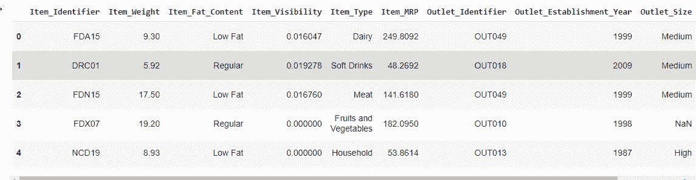
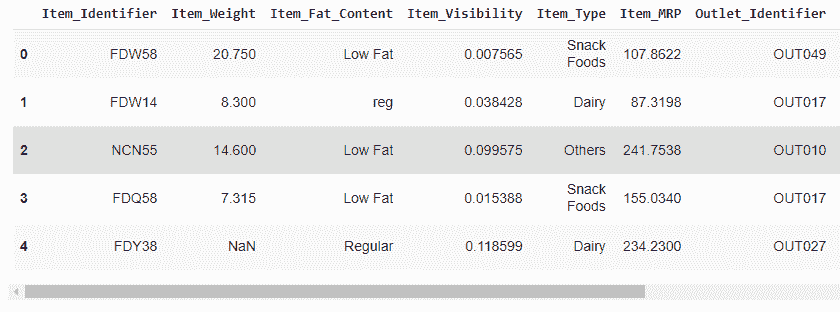
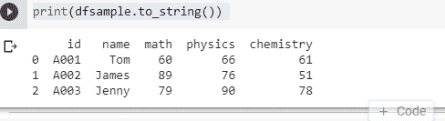
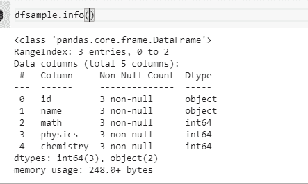
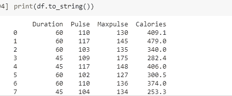
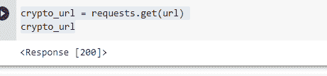
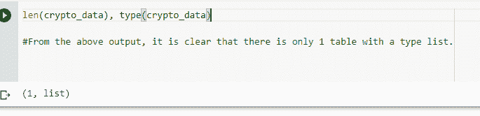
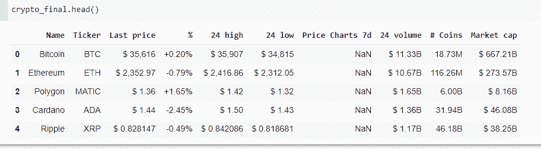

# 在熊猫中读取 CSV()、Excel()、JSON()和 HTML()文件格式

> 原文：<https://pub.towardsai.net/reading-csv-excel-json-and-html-file-formats-in-pandas-2e1e417d1d12?source=collection_archive---------1----------------------->

## 熊猫读取 csv，txt，excel 和更多文件格式的数据


布莱克·康纳利在 [Unsplash](https://unsplash.com?utm_source=medium&utm_medium=referral) 上的照片

> ***什么是熊猫？***

Pandas 是一个 Python 库，包含一系列功能和特定的信息结构，旨在帮助 Python 开发人员以有组织的方式执行信息检查任务。

导入数据是任何信息相关工作中最基本、最绝对的初始阶段。准确导入信息的能力是每个数据科学家必须具备的技能。

数据以多种不同的形式存在，我们不仅应该知道如何导入各种数据格式，还应该知道如何分析和处理数据以推断见解。

pandas 应该做的大多数事情都可以用基本的 Python 来实现，但是 pandas 功能和信息结构的集中安排使得信息检查任务在标点符号方面更加可靠，并且以这种方式有助于可读性。

我们将会看到熊猫的特别亮点，这几个场景包括:

*   读取存储在 CSV 文档中的信息
*   对数据帧中的信息进行切片和子集化(表！)
*   处理缺失信息
*   重塑信息(长→宽，宽→长)
*   从数据结构中插入和删除列
*   数据集的连接(在它们被堆叠成数据帧之后)

如果你问我为什么用小写字母“p”组成 pandas，因为它是包的名字，而 Python 是区分大小写的。

现在让我们看看 panda 如何从 csv、txt、excel 和更多文件格式读取数据:

## 1.加载 CSV 文件

CSV(逗号分隔值)文件是传输和存储数据的常用文件格式。

对于任何数据科学家或业务分析人员来说，利用 Python 在 CSV 文档中读取、写入和操作数据的能力都是至关重要的专业技能

将 CSV 文档中的数据加载到 Pandas 数据框架中的基本交互(所有工作都以良好的方式进行)是利用 Pandas 中的“read_csv”工作来完成的。

```
# Loading the Pandas library with the alias as 'pd'  
import pandas as pd # Read data from file 'test.csv'   
data = pd.read_csv("Test.csv") # Check the first 5 lines of the loaded data  
data.head(5)
```


作者的照片

显而易见，read_csv 将第一行作为列名。给列取不同的名称是可行的。出于这个原因，我们需要通过将参数“header”设置为 0 来跳过第一行，并且我们需要用列名分配一个列列表

有利的一面是:

*   CSV 设计非常普遍，几乎任何软件都可以堆叠信息。
*   CSV 记录易于理解，使用基本的文本编辑器进行故障排除
*   CSV 记录可在分析前快速创建并加载到内存中。

## 2.读取 Excel 文件

要读取 excel 文件，我们需要使用 *read_excel* 。

```
# Read data from file 'filename.csv'
train2 = pd.read_excel("Train_BigMart.xlsx")# Check the first 5 lines of the loaded data
train2.head(5)
```


作者的照片

如果文档“BigMart.xlsx”包含两个工作表，我们可以使用同一个 read_excel 来读取。一个完整的 Excel 文档可以由许多工作表组成，可以这样阅读:

```
#Reading Multiple sheets of excel
Excel = pd.ExcelFile("Train_Test_BigMart.xlsx")# Creating two different data frames for the Excel files
df1 = pd.read_excel(Excel,"Train_BigMart")
df2 = pd.read_excel(Excel,"Test_BigMart")# Preview the first 5 lines of the loaded data (sheet 1 - df1)
df1.head(5)
```



作者的照片

```
# Check the first 5 lines of the loaded data (sheet 2 - df2)

df2.head(5)
```



作者的照片

在 Excel file()调用过程中会加载整个 Excel 文件。这只是让我们不必每次访问一个新的工作表时都要读取同一个文件。

## 3.阅读 JSON

JSON 记录是一个文档，它在 JavaScript 对象符号(JSON)设计中存储简单的数据结构和对象。这是一个标准的信息交换设计。它用于在 web 应用程序和工作人员之间交流信息。JSON 文档是轻量级的、基于文本的、用户友好的，并且可以利用文本编辑器进行修改。

要通过 Pandas 读取 JSON 文件，我们可以使用 read_json()方法。

```
dfsample = pd.read_json("sample.json")# use to_string() to print the whole DataFrame.
print(dfsample.to_string())
```



作者的照片

结果看起来很酷。让我们来看看使用 [df.info](http://df.info/) ()的数据类型。默认情况下，数字列被分配为数字类型，例如，数学、物理和化学列被分配为 int64。



作者的照片

> ***从 URL*** 加载 JSON

要从 URL (API)加载 JSON，请使用以下代码:

```
# Insert the URL you want to get the data fromURL = '<https://www.w3schools.com/python/pandas/data.js>'
df = pd.read_json(URL)# use to_string() to print the dataFrame
print(df.to_string())
```



作者的照片

与从本地文件中读取一样，它返回一个 DataFrame，默认情况下，数值列被分配为数值类型。

> ***加载 HTML 数据***

HTML 是一种超文本标记语言，主要用于创建 web 应用程序和页面。web 浏览器从 web 服务器接收 HTML 文档，并将其提供给多媒体网页。

`pandas`使用`read_html()`读取 HTML 文档。

所以，每当我们传递一个 HTML 给 pandas 并期望它输出一个好看的数据帧时，我们应该确保 HTML 页面中有一个表格！

我们将使用加密货币网站作为 HTML 数据集。它上面有各种各样的加密硬币，并且有关于每个加密的各种细节

```
import requests
url = '<https://www.worldcoinindex.com/>'crypto_url = requests.get(url)
crypto_url
```



作者的照片

这里，我们定义了 URL，然后使用 requests.get()向该 URL 发送了一个请求，并收到了一个作为确认的响应[200]，这意味着我们能够连接到该 web 服务器。

最后，我们将 crypto_url.text 传递给 pd.read_html()函数，该函数将返回一个数据帧列表，其中列表中的每个元素都是加密货币网页中的一个表格(数据帧)。

```
#print the length and the type of the dataframe
len(crypto_data), type(crypto_data)
```



作者的照片

```
crypto_data = crypto_data[0]

#Let's remove the first and second columns since they do not have any #useful information in them and keep all the rows.crypto_final = crypto_data.iloc[:,2:]

#Finally, it's time to print the cryptocurrency dataframe!
crypto_final.head()
```

你可以观察到比特币的市场资本最多。



作者的照片

我希望你喜欢这篇文章。通过我的 [LinkedIn](https://www.linkedin.com/in/data-scientist-95040a1ab/) 和 [twitter](https://twitter.com/amitprius) 联系我。

# 推荐文章

[1。NLP —零到英雄与 Python](https://medium.com/towards-artificial-intelligence/nlp-zero-to-hero-with-python-2df6fcebff6e?sk=2231d868766e96b13d1e9d7db6064df1)
2。 [Python 数据结构数据类型和对象](https://medium.com/towards-artificial-intelligence/python-data-structures-data-types-and-objects-244d0a86c3cf?sk=42f4b462499f3fc3a160b21e2c94dba6)3 .[Python 中的异常处理概念](/exception-handling-concepts-in-python-4d5116decac3?source=friends_link&sk=a0ed49d9fdeaa67925eac34ecb55ea30)
4。[为什么 LSTM 在深度学习方面比 RNN 更有用？](/deep-learning-88e218b74a14?source=friends_link&sk=540bf9088d31859d50dbddab7524ba35)
5。[神经网络:递归神经网络的兴起](/neural-networks-the-rise-of-recurrent-neural-networks-df740252da88?source=friends_link&sk=6844935e3de14e478ce00f0b22e419eb)
6。[用 Python](https://medium.com/towards-artificial-intelligence/fully-explained-linear-regression-with-python-fe2b313f32f3?source=friends_link&sk=53c91a2a51347ec2d93f8222c0e06402)
7 全面讲解了线性回归。[用 Python](https://medium.com/towards-artificial-intelligence/fully-explained-logistic-regression-with-python-f4a16413ddcd?source=friends_link&sk=528181f15a44e48ea38fdd9579241a78)
充分解释了 Logistic 回归 8。[concat()、merge()和 join()与 Python](/differences-between-concat-merge-and-join-with-python-1a6541abc08d?source=friends_link&sk=3b37b694fb90db16275059ea752fc16a)
的区别 9。[套索(l1)和脊(l2)正则化技术](/lasso-l1-and-ridge-l2-regularization-techniques-33b7f12ac0b?source=friends_link&sk=b77a29aac0ab8d63ba6b449c03180cd5)
10。[机器学习中的混淆矩阵](https://medium.com/analytics-vidhya/confusion-matrix-in-machine-learning-91b6e2b3f9af?source=friends_link&sk=11c6531da0bab7b504d518d02746d4cc)