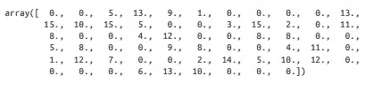
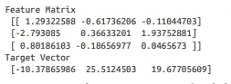
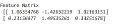
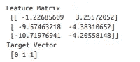
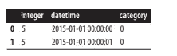
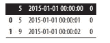
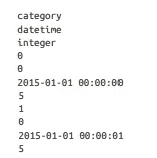
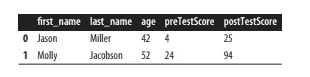

# 使用 Python 读取机器学习中的不同数据输入

> 原文：<https://pub.towardsai.net/reading-different-data-inputs-in-machine-learning-with-python-ddae1d73c157?source=collection_archive---------1----------------------->

## [机器学习](https://towardsai.net/p/category/machine-learning)

## 用 python 读取输入的有用方法


在 [Unsplash](https://unsplash.com?utm_source=medium&utm_medium=referral) 上[的照片](https://unsplash.com/@ffstop?utm_source=medium&utm_medium=referral)

## 介绍

机器学习的第一步是加载数据。数据可以是结构化或非结构化数据，也可以是日志文件、数据集文件或数据集。从各种来源加载数据的一般方法，包括 CSV 文件和 SQL 数据集。

[](/become-a-data-scientist-in-2021-with-these-following-steps-5bf70a0fe0a1) [## 按照以下步骤，在 2021 年成为一名数据科学家

### 走上数据科学家之路需要具备的基本点

pub.towardsai.net](/become-a-data-scientist-in-2021-with-these-following-steps-5bf70a0fe0a1) 

## 加载样本数据集

我们可以在 scikit-learn 的帮助下加载一个预先存在的样本数据集，它有几个流行的数据集。

```
# Load scikit-learn’s datasets
from sklearn import datasets# Load digits dataset
digits = datasets.load_digits()# Create features matrix
features = digits.data# Create target vector
target = digits.target# View first observation
features[0]
```



作者的照片

现实世界的数据集，我们通常执行加载、转换和清理。scikit 学习的 Fortune 有公共数据集，我们可以直接加载它们。

几个数据集示例如下:

1.  波士顿装货
2.  负载 _ 虹膜
3.  负载数字

[](/z-statistics-t-statistics-p-statistics-are-still-confusing-you-87557047e20a) [## Z-统计量，T-统计量，P-统计量还在迷惑你？

### 机器学习统计学中的定义和概念

pub.towardsai.net](/z-statistics-t-statistics-p-statistics-are-still-confusing-you-87557047e20a) 

## 创建模拟数据集

我们可以从模拟数据中生成数据集。Scikit-learn 提供了许多创建模拟数据的方法。经常使用三种方法。

**与“线性回归”一起使用—“make _ Regression”**

```
# Load library
from sklearn.datasets import make_regression#methods to generate vector and matrix
features, target, coefficients = make_regression(n_samples = 100,
 n_features = 3,
 n_informative = 3,
 n_targets = 1,
 noise = 0.0,
 coef = True,
 random_state = 1)# View feature matrix and target vector
print(‘Feature Matrix\n’, features[:3])
print(‘Target Vector\n’, target[:3])
```



作者的照片

**与“分类”一起使用—“make _ Classification”**

```
# Load library
from sklearn.datasets import make_classification# Generate features matrix and target vector
features, target = make_classification(n_samples = 100,
 n_features = 3,
 n_informative = 3,
 n_redundant = 0,
 n_classes = 2,
 weights = [.25, .75],
 random_state = 1)# View feature matrix and target vector
print(‘Feature Matrix\n’, features[:3])
print(‘Target Vector\n’, target[:3])
```



作者的照片

**与“聚类”一起使用—“make _ blobs”**

```
# Load library
from sklearn.datasets import make_blobs# Generate feature matrix and target vector
features, target = make_blobs(n_samples = 100,
 n_features = 2,
 centers = 3,
 cluster_std = 0.5,
 shuffle = True,
 random_state = 1)# View feature matrix and target vector
print(‘Feature Matrix\n’, features[:3])
print(‘Target Vector\n’, target[:3])
```



作者的照片

***make _ regression***返回一个矩阵和目标向量的浮点值。

***make _ classification***返回一个浮点值的特征矩阵和整数的目标向量，表示类中的成员关系。

***make_blobs*** 返回一个浮点值的特征矩阵和一个目标整数向量，该向量代表一个类中的成员。

scikit-learn 模拟数据集提供了一个有效的选项来控制生成的数据类型，其中包含所有参数的完整描述和其他值得了解的选项。

在 make_regression 和 make_classification 中，n _ informative 参数定义了可用于生成目标矢量的要素数量。

如果 n _ informative 参数小于特征的总数(n_features ),则结果数据集将具有冗余特征，该冗余特征可以通过机器学习管道中的特征选择技术来识别。

***make _ classification***由一个权重参数组成，允许我们模拟具有不平衡类的数据集。

***make_blobs*** 具有中心参数，该参数确定生成的簇的数量。我们可以使用 matplotlib 库进行可视化，可视化 make _ blobs 生成的集群。

```
# Load library
import matplotlib.pyplot as plt# View scatterplot
plt.scatter(features[:,0], features[:,1], c=target)
plt.show()
```


作者的照片

## 加载 CSV 文件

Pandas 库提供“read_csv”来加载本地或托管的 csv 文件。CSV 文件有助于在加载前快速浏览文件内容。查看数据集是结构化的还是非结构化的，以及检查加载到文件中的参数是非常有用和有帮助的。实际上“read_csv”有 30 多个参数。幸运的是，这些参数大多允许它处理各种 CSV 格式。有一个“header”参数，它允许我们指定标题行是否存在或存在于何处。

```
# Load library
import pandas as pd# Create URL
url = ‘[https://tinyurl.com/simulated_data'](https://tinyurl.com/simulated_data')# Load dataset
dataframe = pd.read_csv(url)# View first two rows
dataframe.head(2)
```



作者的照片

## 加载 Excel 文件

要导入 excel 电子表格，我们可以使用“read_excel”熊猫库。

```
# Load library
import pandas as pd# Create URL
url = ‘[https://tinyurl.com/simulated_excel'](https://tinyurl.com/simulated_excel')# Load data
dataframe = pd.read_excel(url, sheetname=0, header=1)# View the first two rows
dataframe.head(2)
```



作者的照片

这非常类似于 CSV 文件读取。这两个库之间的区别是额外的参数，如工作表名称，它指定了我们正在加载的 excel 文件中的工作表。“工作表名称”可以接受包含工作表名称的字符串和指向工作表位置(零索引)的整数。

[](/python-zero-to-hero-with-examples-c7a5dedb968b) [## Python:从零到英雄(带示例)

### python 初学者手册指南

pub.towardsai.net](/python-zero-to-hero-with-examples-c7a5dedb968b) [](/fundamentals-of-series-and-data-frame-in-pandas-with-python-6e0b8a168a0d) [## 用 python 实现熊猫系列和数据框架的基础

### 数据框中常用参数的基础知识

pub.towardsai.net](/fundamentals-of-series-and-data-frame-in-pandas-with-python-6e0b8a168a0d) 

## 加载 JSON 文件

我们可以在“read_json”熊猫库的帮助下加载 JSON 文件。这将把一个 JSON 文件转换成一个 pandas 对象。

```
# Load library
import pandas as pd# Create URL
url = ‘[https://tinyurl.com/simulated_json'](https://tinyurl.com/simulated_json')# Load data
dataframe = pd.read_json(url, orient=’columns’)# View the first two rows
dataframe.head(2)
```



作者的照片

把 JSON 文件导入熊猫很熟悉。区别在于“orient”参数，它告诉 pandas JSON 文件是如何构造的。我们必须找出哪个参数(拆分、记录、索引、列和值)是正确的。Pandas 提供的“json_normalize”帮助我们将半结构化的 json 数据转换成 pandas 数据框架。

## 查询 SQL 数据库

我们可以从结构化查询语言(SQL)的数据库引擎加载数据。

Pandas 库提供“read_sql”对数据库进行 sql 查询并加载。

```
# Load libraries
import pandas as pd
from sqlalchemy import create_engine# Create a connection to the database
database_connection = create_engine(‘sqlite:///sample.db’)# Load data
dataframe = pd.read_sql_query(‘SELECT * FROM data’, database_connection)# View first two rows
dataframe.head(2)
```



作者的照片

我们可以使用“create_engine”来建立到名为“SQLite”的 SQL 数据库引擎的连接。然后我们要用熊猫“read_sql_query”用 sql 查询数据库，把结果放到数据框里。

## 结论:

本文将给出在管道结构化模型中有用的不同类型的 python 数据输入。

我希望你喜欢这篇文章。通过我的 [LinkedIn](https://www.linkedin.com/in/data-scientist-95040a1ab/) 和 [twitter](https://twitter.com/amitprius) 联系我。

# 推荐文章

1.  [NLP —用 Python 从零到英雄](https://medium.com/towards-artificial-intelligence/nlp-zero-to-hero-with-python-2df6fcebff6e?sk=2231d868766e96b13d1e9d7db6064df1)

2. [Python 数据结构数据类型和对象](https://medium.com/towards-artificial-intelligence/python-data-structures-data-types-and-objects-244d0a86c3cf?sk=42f4b462499f3fc3a160b21e2c94dba6)

3.[用 Python 进行数据预处理的概念](/data-preprocessing-concepts-with-python-b93c63f14bb6?source=friends_link&sk=5cc4ac66c6c02a6f02077fd43df9681a)

4.[用 Python 进行主成分分析降维](/principal-component-analysis-in-dimensionality-reduction-with-python-1a613006d531?source=friends_link&sk=3ed0671fdc04ba395dd36478bcea8a55)

5.[用 Python 全面解释 K-means 聚类](https://medium.com/towards-artificial-intelligence/fully-explained-k-means-clustering-with-python-e7caa573176a?source=friends_link&sk=9c5c613ceb10f2d203712634f3b6fb28)

6.[用 Python 全面解释线性回归](https://medium.com/towards-artificial-intelligence/fully-explained-linear-regression-with-python-fe2b313f32f3?source=friends_link&sk=53c91a2a51347ec2d93f8222c0e06402)

7.[用 Python 全面解释逻辑回归](https://medium.com/towards-artificial-intelligence/fully-explained-logistic-regression-with-python-f4a16413ddcd?source=friends_link&sk=528181f15a44e48ea38fdd9579241a78)

8.[Python 时间序列基础](https://medium.com/towards-artificial-intelligence/basic-of-time-series-with-python-a2f7cb451a76?source=friends_link&sk=09d77be2d6b8779973e41ab54ebcf6c5)

9.[与 Python 的数据争论—第 1 部分](/data-wrangling-with-python-part-1-969e3cc81d69?source=friends_link&sk=9c3649cf20f31a5c9ead51c50c89ba0b)

10.[机器学习中的混淆矩阵](https://medium.com/analytics-vidhya/confusion-matrix-in-machine-learning-91b6e2b3f9af?source=friends_link&sk=11c6531da0bab7b504d518d02746d4cc)