# 阅读:增强的超分辨率生成对抗网络

> 原文：<https://pub.towardsai.net/reading-esrgan-enhanced-super-resolution-generative-adversarial-networks-super-resolution-e8533ad006b5?source=collection_archive---------1----------------------->

## 深度学习

## 胜过 [SRCNN](https://medium.com/coinmonks/review-srcnn-super-resolution-3cb3a4f67a7c?source=post_page---------------------------) 、 [EDSR](https://medium.com/@sh.tsang/review-edsr-mdsr-enhanced-deep-residual-networks-for-single-image-super-resolution-super-4364f3b7f86f) 和 [RCAN](https://medium.com/@sh.tsang/review-rcan-deep-residual-channel-attention-networks-super-resolution-fbbf04224c22) ，以及 [SRGAN](https://medium.com/@sh.tsang/review-srgan-srresnet-photo-realistic-super-resolution-gan-super-resolution-96a6fa19490) 。还获得 PIRM2018-SR 挑战赛第一名

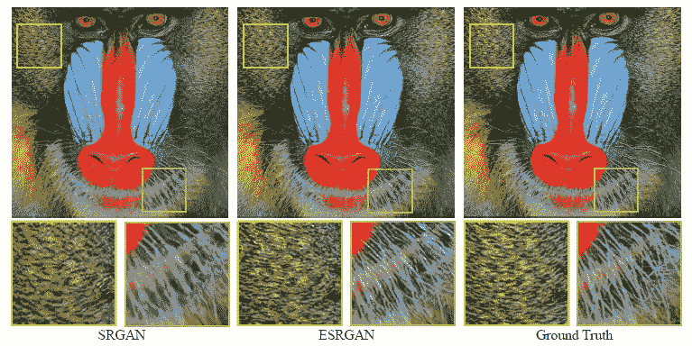

**ESRGAN 可以比** [**SRGAN**](https://medium.com/@sh.tsang/review-srgan-srresnet-photo-realistic-super-resolution-gan-super-resolution-96a6fa19490) 有更清晰的结果

在这个故事中，描述了由香港中文大学、中国科学院、中国科学院大学和南洋理工大学合作的增强型超分辨率生成对抗网络(ESRGAN)。在 ESRGAN 中:

*   **引入无批量归一化**的残差中残差密集块(RRDB)。
*   来自**相对论甘**的想法是让鉴别器预测相对真实度而不是绝对值。
*   使用激活前使用**特征的**感知损失**，为亮度一致性和纹理恢复提供更强的监督。**

最终， **ESRGAN 获得 PIRM2018-SR 挑战赛**第一名。这是一篇在 **2018 ECCVW (ECCV 研讨会)**中超过 **300 次引用**的论文。( [Sik-Ho Tsang](https://medium.com/u/aff72a0c1243?source=post_page-----e8533ad006b5--------------------------------) @中)

# 概述

1.  **感性质量和客观质量**
2.  **残中残致密块(RRDB)**
3.  **相对论甘**
4.  **知觉丧失**
5.  **网络插值**
6.  **消融研究**
7.  **SOTA 比较**

# 1.感性质量和客观质量

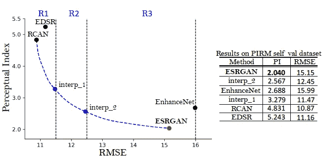

**感性质量和客观质量**

*   RMSE 是对客观质量的一种衡量。RMSE 越高，客观质量越低。它是以客观的方式来衡量的。
*   感知指数(PI)是感知质量的量度。PI 越高，感知质量越低。感知质量是一种非常接近人眼的质量。
*   **ESRGAN 意在提高感性质量而非客观质量，如 PSNR。**

# 2.残余致密岩块中的残余(RRDB)

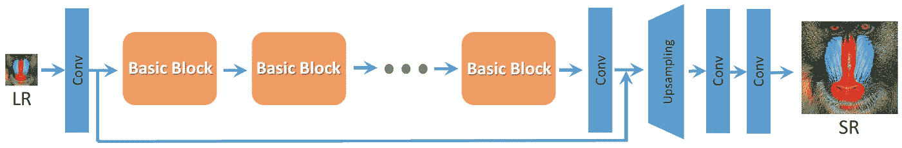

**[**SRResNet/SRGAN**](https://medium.com/@sh.tsang/review-srgan-srresnet-photo-realistic-super-resolution-gan-super-resolution-96a6fa19490)的基本架构**

**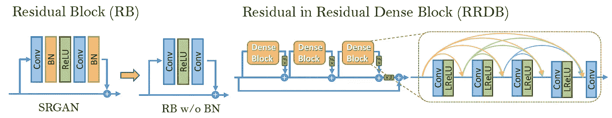**

****RRDB 被用作 ESRGAN 中的基本块****

*   **首先，[**【BN】**](https://medium.com/@sh.tsang/review-batch-normalization-inception-v2-bn-inception-the-2nd-to-surpass-human-level-18e2d0f56651)**批量归一化被删除。**移除 [BN](https://medium.com/@sh.tsang/review-batch-normalization-inception-v2-bn-inception-the-2nd-to-surpass-human-level-18e2d0f56651) 层已被证明在不同的面向 PSNR 的任务中提高了性能并降低了计算复杂度，包括 SR。因为 [BN](https://medium.com/@sh.tsang/review-batch-normalization-inception-v2-bn-inception-the-2nd-to-surpass-human-level-18e2d0f56651) 会带来伪像。**
*   **第二，**密集块，起源于**[**DenseNet**](https://towardsdatascience.com/review-densenet-image-classification-b6631a8ef803?source=post_page---------------------------)**，用于替换剩余块**来增强网络。(如果有兴趣，请随意阅读我关于 [DenseNet](https://towardsdatascience.com/review-densenet-image-classification-b6631a8ef803?source=post_page---------------------------) 的故事。)**

# **3.相对论 GAN**

**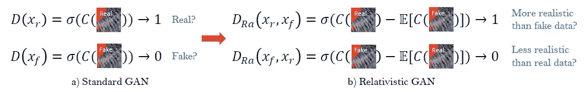**

****标准甄别器和相对论甄别器的区别****

*   **[SRGAN](https://medium.com/@sh.tsang/review-srgan-srresnet-photo-realistic-super-resolution-gan-super-resolution-96a6fa19490) 中的标准鉴别器 *D* ，用于估计一幅输入图像 *x* 真实自然的概率。**
*   **(如果有兴趣，请阅读我关于 [GAN](https://medium.com/@sh.tsang/review-gan-generative-adversarial-nets-gan-e12793e1fb75) 和 [SRGAN](https://medium.com/@sh.tsang/review-srgan-srresnet-photo-realistic-super-resolution-gan-super-resolution-96a6fa19490) 的故事。)**
*   **相比之下，**相对论性鉴别器试图预测真实图像 XR 比假图像 *xf* 相对更真实的概率。****
*   **带有相对论平均甄别器的标准甄别器 *Dra* 。**
*   *****E* 是对小批量中所有伪数据取平均值的操作。**鉴频器损耗为:**

**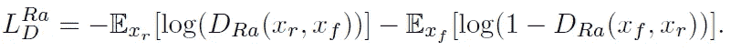**

*   **发电机的不利损失是对称的:**

**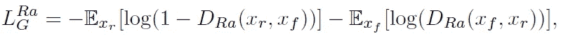**

*   **观察到**发电机的不利损失包含 XR 和 *xf*** 。因此，**生成器在对抗训练中受益于来自生成数据和真实数据的梯度**，而在 [SRGAN](https://medium.com/@sh.tsang/review-srgan-srresnet-photo-realistic-super-resolution-gan-super-resolution-96a6fa19490) 中，只有生成部分起作用。**

# **4.知觉丧失**

*   ****在 ESRGAN 中，使用激活层之前的特性。****

**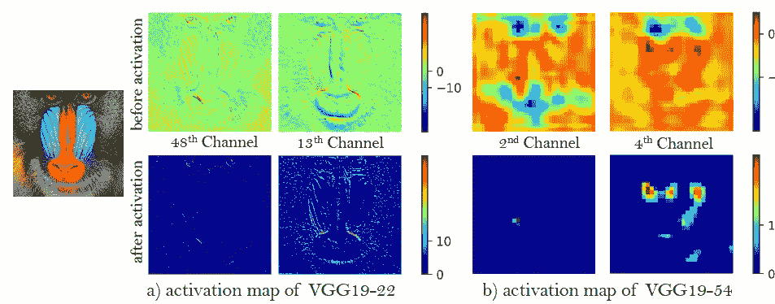**

****激活前后特征图示例****

**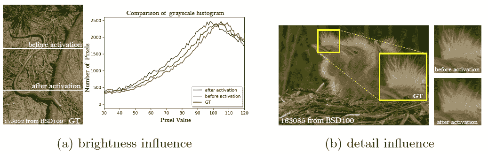**

****激活前后对特征地图的影响示例****

*   **如果使用激活层之后的特征，将会有缺点:**

1.  **第一，**激活的特征非常稀疏**，如上图，特别是在非常深的网络之后。例如，在 vgg 19–546 层之后，图像“狒狒”的激活神经元的平均百分比仅为 11.17%。稀疏激活**提供弱监管**并因此导致低性能。**
2.  **第二，**使用激活后的特征也会导致重建亮度**与地面实况图像不一致。**

*   **因此，总损失为:**

**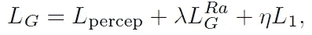**

*   **其中 *Lpercep* 为 VGG 损失， *LGRA* 为对抗性损失，L1 为标准 L1 损失，即作为内容损失。**
*   **(在 PIRM-SR 挑战中，使用了另一种称为 MINC 损失的损失。但是我没有详细提到它，因为它也没有在论文中提到。)**

# **4.网络插值**

*   **首先，我们训练一个面向 PSNR 的网络 *GPSNR，*，然后我们通过微调获得一个基于 GAN 的网络 *GGAN* 。**
*   **对这两个网络的所有相应参数进行插值，得到插值模型 *GINTERP* :**

**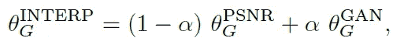**

*   **其中 *α* 在 0 到 1 之间。有两个优点:**
*   **首先，插值模型能够产生任何可行的有意义的结果，而不会引入伪像。**
*   **第二，我们可以在不重新训练模型的情况下持续平衡感知质量和保真度。**

# **5.消融研究**

## **5.1.数据**

*   **训练数据:使用包含 800 幅图像的 DIV2K、由 2650 幅 2K 高分辨率图像组成的 Flickr2K 数据集和 OutdoorSceneTraining (OST)数据集。**
*   **模型在 RGB 通道中训练，训练数据集用随机水平翻转和 90 度旋转来扩充。**
*   **基准数据集:Set5，Set14，BSD100，Urban100 和 PIRM 自验证数据集。**

## **5.2.消融实验**

****

****消融实验****

*   **[**BN**](https://medium.com/@sh.tsang/review-batch-normalization-inception-v2-bn-inception-the-2nd-to-surpass-human-level-18e2d0f56651) **移除(第 3 列)**:观察到比第 2 列略有改善。**
*   ****感知损失激活前(第 4 列)**:与第 3 列相比，产生了更清晰的边缘和更丰富的纹理。**
*   ****RaGAN(第 5 列)**:与第 4 列相比，再次学习生成更锐利的边缘和更详细的纹理。**
*   ****具有 RRDB 的更深的网络(第 6 列)**:提出的 RRDB 可以进一步改善恢复的纹理，特别是对于像图像 6 的屋顶这样的规则结构，因为深度模型具有捕捉语义信息的强大表示能力。**

## **5.3.网络插值**

**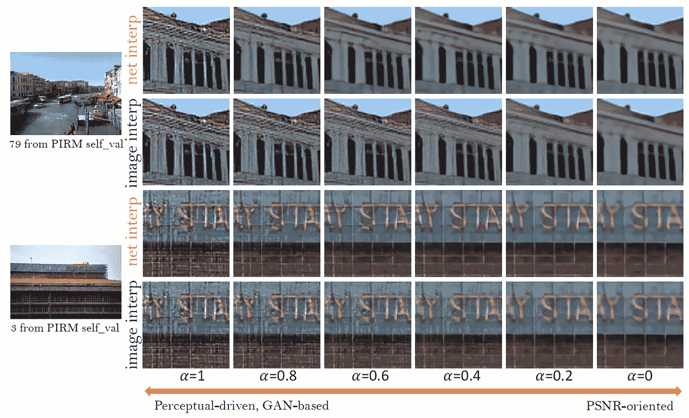**

*   ***α* 从 0 到 1 中选取，间隔为 0.2。**
*   **基于**纯 GAN** 的方法产生**锐利的边缘和更丰富的纹理，但带有一些令人不快的伪像**，而面向**纯 PSNR** 的方法输出**卡通风格的模糊图像**。**
*   ****通过采用网络插值，在保持纹理的同时减少了不愉快的伪像。****

# **7.SOTA 比较**

## **7.1.基准数据集**

**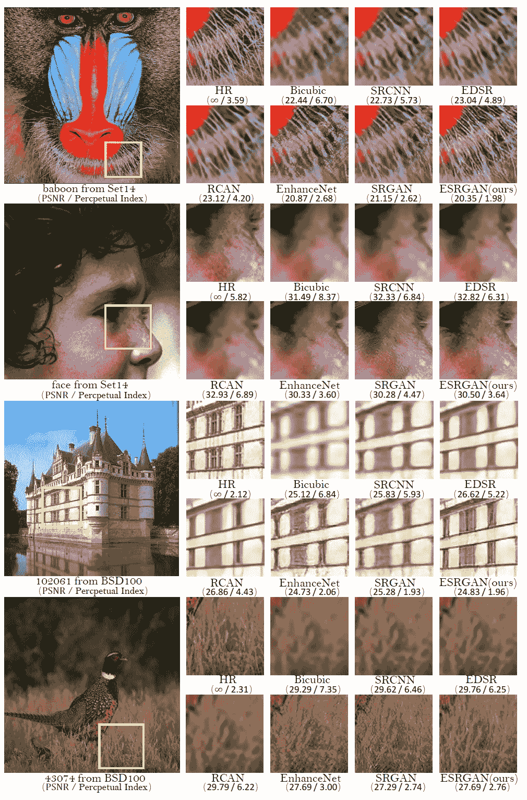**

****左边的数字:PSNR，右边的数字:感知指数(PI)****

*   **面向 PSNR 的方法，如 [SRCNN](https://medium.com/coinmonks/review-srcnn-super-resolution-3cb3a4f67a7c?source=post_page---------------------------) 、 [EDSR](https://medium.com/@sh.tsang/review-edsr-mdsr-enhanced-deep-residual-networks-for-single-image-super-resolution-super-4364f3b7f86f) 和 [RCAN](https://medium.com/@sh.tsang/review-rcan-deep-residual-channel-attention-networks-super-resolution-fbbf04224c22) ，往往会产生模糊的结果**
*   **以前基于 GAN 的方法，即 EnhanceNet 和 [SRGAN](https://medium.com/@sh.tsang/review-srgan-srresnet-photo-realistic-super-resolution-gan-super-resolution-96a6fa19490) ，往往会产生不自然的纹理，并且包含令人不愉快的噪声。**
*   **ESRGAN 消除了这些伪像，产生了自然的结果。**

## **7.2.PIRM-SR 挑战**

*   **使用具有 MINC 损失的 16 个剩余块的 ESRGAN。(还有其他细节。)**
*   **并且它**以最佳感知指数(PI)获得 PIRM-SR 挑战赛(3 区)**第一名。**

> ***在冠状病毒肆虐的日子里，给我一个挑战，这个月再写 30 个故事..？好吃吗？这是本月的第 16 个故事。感谢访问我的故事..***

## **参考**

**【2018 ECC VW】【ESR gan】
[ESR gan:增强型超分辨率生成对抗网络](https://arxiv.org/abs/1809.00219)**

## **超分辨率**

**)(我)(们)(都)(不)(想)(要)(让)(这)(些)(人)(都)(有)(这)(些)(的)(情)(况)(,)(我)(们)(都)(不)(想)(会)(有)(什)(么)(情)(况)(,)(我)(们)(都)(不)(想)(会)(有)(什)(么)(情)(况)(,)(我)(们)(还)(没)(有)(什)(么)(情)(况)(,)(我)(们)(还)(有)(什)(么)(情)(况)(,)(我)(们)(还)(没)(有)(什)(么)(好)(的)(情)(感)(。 )(我)(们)(都)(不)(知)(道)(,)(我)(们)(还)(是)(不)(知)(道)(,)(我)(们)(还)(是)(不)(知)(道)(,)(我)(们)(还)(是)(不)(知)(道)(,)(我)(们)(还)(是)(不)(知)(道)(,)(我)(们)(还)(是)(不)(知)(道)(。**

## **生成对抗网络**

**[ [甘](https://medium.com/@sh.tsang/review-gan-generative-adversarial-nets-gan-e12793e1fb75)[[CGAN](https://medium.com/@sh.tsang/review-cgan-conditional-gan-gan-78dd42eee41)][[拉普甘](https://medium.com/@sh.tsang/review-lapgan-laplacian-generative-adversarial-network-gan-e87200bbd827)][[DCGAN](https://medium.com/@sh.tsang/review-dcgan-deep-convolutional-generative-adversarial-network-gan-ec390cded63c)][[SRGAN&SRResNet](https://medium.com/@sh.tsang/review-srgan-srresnet-photo-realistic-super-resolution-gan-super-resolution-96a6fa19490)]**

## **[我之前的其他阅读材料](https://medium.com/@sh.tsang/overview-my-reviewed-paper-lists-tutorials-946ce59fbf9e)**

**通过[向 AI](https://towardsai.net/) 发布**