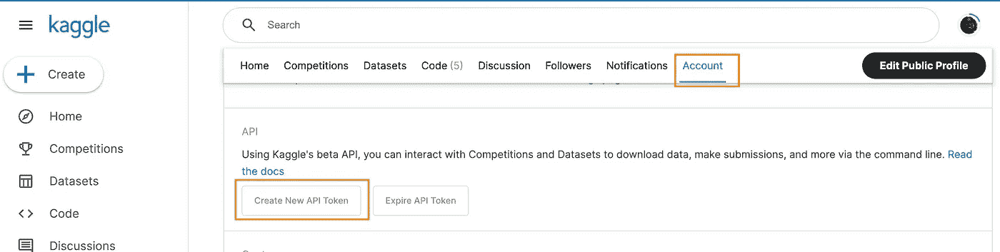
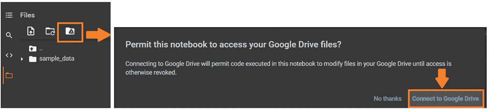
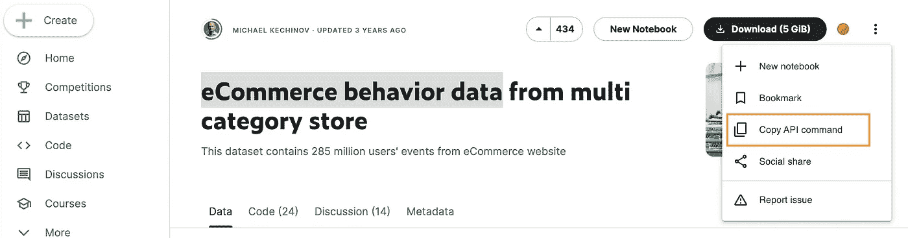
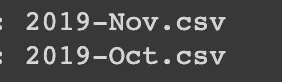
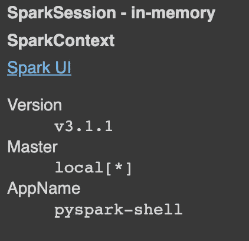

# 使用 PySpark 在 Google Colab 中读取大型 Kaggle 数据集

> 原文：<https://pub.towardsai.net/reading-large-kaggle-dataset-with-pyspark-in-google-colab-41aebb7a89c8?source=collection_archive---------0----------------------->

## 减少本地下载/安装过程，远程和可重复地完成大部分部件


图片来自 [Unsplash](https://unsplash.com/photos/pB3__mUOTFE)

和我的许多同行一样，我尽可能避免在本地安装或设置环境。我尝试用远程环境替代工作，并远程完成/存储 80%的工作。这包括避免在本地下载文件或在本地长时间保存文件。

> 这可能是因为我无法在本地高效地跟踪依赖版本，或者我对拥有一个干净整洁的本地文件夹有多么挑剔，或者前面提到的两个原因带来了不必要的压力。再现性也是一个问题。
> 
> 除非你把它和 course🧐联系起来

当试图在本地安装时，Pyspark 通常是一个麻烦。根据您之前安装的软件包/软件，它可能会与 Pyspark 的安装步骤冲突。与其试图去理解背后的“**火箭科学**”，不如用几行代码来说明如何安装 Pyspark 并在 Google Colabs 上远程使用它。

> 此外，如果您像我一样对快速设置环境或进行 POC(概念验证)不耐烦，这会给您带来快乐😋

# 第一步

## 为了跟随这个演示并在 Colabs 上读取 Pyspark 中的实际数据，我们需要利用 Kaggle 数据集 API

*   确保您有一个 Kaggle 帐户。
*   前往你的 Kaggle 个人资料页面，点击**账户**
*   在页面上向下滚动到 **API。**点击**创建新的 API。**自动下载一个名为 **kaggle.json** 的文件。它包含您的 API 凭证。



图片来自作者

> 我保证这是你为这篇文章做的唯一下载

*   打开你谷歌硬盘，把下载的文件上传到你的谷歌硬盘。最好不要放在 google drive 的文件夹中

> 此时，您可以删除本地计算机上的文件。这是最棒的部分

*   打开一个新的 Colabs 笔记本
*   接下来，在 Colab 中安装你的 google drive，如下图所示



图片来自本文[文章](https://www.analyticsvidhya.com/blog/2021/06/how-to-load-kaggle-datasets-directly-into-google-colab/)

> 干得好！，您已经完成了 25%,下一步是在 notebook🥳.设置 kaggle

# 第二步

假设我们想要分析来自这个数据点超过 1 亿行的[ka ggle 页面的电子商务数据。](https://www.kaggle.com/datasets/mkechinov/ecommerce-behavior-data-from-multi-category-store)

第一件事是通过输入以下代码从 Kaggle 获取数据

```
! pip install kaggle! mkdir ~/.kaggle!cp /content/drive/MyDrive/kaggle.json ~/.kaggle/kaggle.json! kaggle datasets download -d mkechinov/ecommerce-behavior-data-from-multi-category-store!unzip ecommerce-behavior-data-from-multi-category-store.zip
```

前三行代码

*   安装 Kaggle 库以便能够使用 Kaggle API
*   创建一个名为**的目录/文件夹。根目录中的 kaggle**
*   将您之前保存在驱动器中的 **kaggle.json** 复制到您上面创建的新目录中。

接下来的两行代码

*   下载您需要的特定数据。在我的案例中:“**电子商务-行为-数据-来自-多类别-商店”**。当您转到所选数据的右侧并单击:**复制 API 命令**时，您可以很容易地获得那一行代码。



> 没有麻烦。哈哈的笑

*   解压文件，在我的例子中是:"**电子商务-行为-数据-来自-多类别-商店"**

> Kaggle 数据集通常以 zip 文件的形式下载

对于这个特定的数据集，下载了两个文件，称为



图片来自作者

> 干得好！，你完成了 50%。重要的部分来了:在 pyspark 上安装和阅读🤓

# 第三步

下面的代码用于安装 Pyspark 依赖项

```
!apt-get install openjdk-8-jdk-headless -qq > /dev/null!wget -q http://archive.apache.org/dist/spark/spark-3.1.1/spark-3.1.1-bin-hadoop3.2.tgz!tar xf spark-3.1.1-bin-hadoop3.2.tgz!pip install -q findspark
```

上面的依赖项包括安装 Java 8、Apache spark with Hadoop(随意切换到最新版本[这里](https://spark.apache.org/downloads.html))和 FindSpark，后者用于在系统中定位 spark

接下来是通过设置 Java 和 Spark 的位置来设置允许我们在 Colab 环境中运行 PySpark 的环境路径

```
import osos.environ["JAVA_HOME"] = "/usr/lib/jvm/java-8-openjdk-amd64"os.environ["SPARK_HOME"] = "/content/spark-3.1.1-bin-hadoop3.2"
```

> 最后，运行一个本地 spark 会话来测试我们的安装😏。

```
import findsparkfindspark.init()from pyspark.sql import SparkSessionspark = SparkSession.builder.master("local[*]").getOrCreate()spark.conf.set("spark.sql.repl.eagerEval.enabled", True) # Property used to format output tables betterspark
```

当您运行上面的代码时，您会看到类似下图的内容



> 这表明你可以走了

我们来读一下 pyspark 上从 Kaggle 下载的数据

```
df = spark.read.csv('2019*.csv', header=True, sep=",")df.show(5)
```

上面的代码读取 Pyspark 中 collab 笔记本中的所有 CSV 文件，并显示前五行

> 类似于熊猫的 **df.head()**

在我的例子中，结果是这样的


图片来自作者

这表明您可以开始在 Pyspark 中分析该表。

**在这里找到笔记本** [**的链接**](https://colab.research.google.com/drive/1NPvAX_XKfv0sflWTT0Ouboz6_D-VzRY3#scrollTo=qVXoZBzSZu-e)

这个过程需要 10-15 分钟

> 减去决定使用哪些数据的时间😓

# 最后的话

是的，每次需要在 Colabs 上运行 Pyspark 时，您都需要重新运行所有这些设置代码。然而，这是一个几乎无关紧要的麻烦，因为您可以存储/保存这些代码行，并在需要时重新运行它们。它在某种程度上也是可复制的，因为任何人都可以拥有该笔记本，并在他们的终端上重新运行它

> 除了不应该共享的 Kaggle 凭证部分