# 阅读:MegDet —大型微型批次物体探测器，COCO 2017 探测挑战赛(物体探测)第一名

> 原文：<https://pub.towardsai.net/reading-megdet-a-large-mini-batch-object-detector-1st-place-of-coco-2017-detection-challenge-e82072e9b7f?source=collection_archive---------3----------------------->

## 计算机视觉

## 使用预热学习率策略和跨 GPU 批处理标准化，训练时间从 33 小时减少到 4 小时

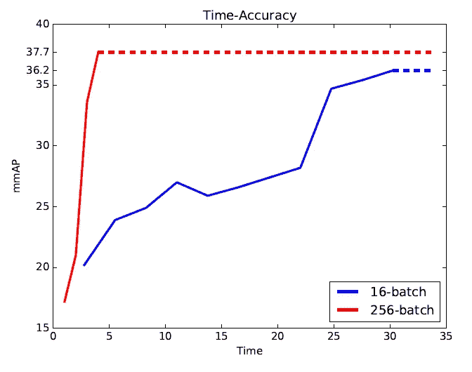

**mmAP 在 256 批次时增长更快**

在这篇文章中，简单介绍了由北京大学和清华大学合作的 **MegDet:一个大型微型批量天体探测器**。在本文中:

*   提出了一个大型小批量对象检测器(MegDet ),以便能够使用高达 256 个的**大型小批量进行训练，这样我们可以有效地利用最多 **128 个 GPU**来显著缩短训练时间。**
*   **提出了预热学习率策略**和**跨 GPU 批处理规范化**，它们一起允许我们在更短的时间内成功训练大型小型批处理检测器(例如**从 33 小时到 4 小时**)，并实现更好的准确性。
*   MegDet 是我们向 **COCO 2017 挑战赛**提交(mmAP 52.5%)的支柱，在那里我们**获得了探测任务**的第一名。

这是一篇[论文](https://arxiv.org/abs/1711.07240)发表在 **2018 CVPR** 上，引用超过 **100 次**。

# 概述

1.  **预热学习率政策**
2.  **跨 GPU 批量规格化(CGBN)**
3.  **实验结果**

# **1。热身学习率政策**

## 1.1.一般物体探测损失

*   通常，物体探测损失为:

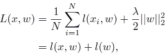

*   其中 *N* 为小批量， *l* ( *x* ， *w* )为特定任务损失， *l* ( *w* )为规则化损失。
*   *l* ( *xi* ， *w* )是 RPN 预测损失，RPN 包围盒回归损失，预测损失，包围盒回归损失。

## 1.2.方差等价

*   在图像分类中，每个图像只有一个注释，并且 *l* ( *x* ， *w* )是交叉熵的简单形式。
*   **关于对象检测，每个图像具有不同数量的框注释，导致图像之间不同的地面实况分布。**在目标检测中，不同小批量之间的梯度等效假设可能不太可能出现。
*   与梯度等效假设不同，**我们假设梯度的方差在 *k* 步中保持不变。**
*   对于每个样品的梯度∇ *l* ( *xi* ， *w* )，一个**正常小批量** *l* ( *x* ， *w* ):

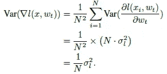

*   同样，对于**大型小批量^*n*=*k*×*n***:

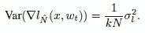

> *这里我们要维护* ***大批量^* N *中一次更新的方差等于* k *小批量* N *中的累计步数。***

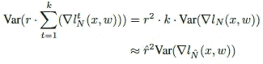

*   当且仅当**^*r*=*k*×*r***时，上述等式成立，其中**为^ *r*** 给出相同的线性缩放规则。
*   经过上述推导，虽然最终的缩放规则实际上与图像分类规则相同，但给出了新的解释。

## 1.3.预热策略

*   **线性渐进预热**来自 arXiv 的另一份技术报告:[使用精确的大型迷你批次 SGD:1 小时训练 ImageNet](https://arxiv.org/abs/1706.02677)。
*   也就是**学习率一开始就设置得足够小，比如 *r* 。然后，在每次迭代之后，学习率以恒定的速度增加，直到到达^ *r* 。**

# **2。跨 GPU 批量归一化**

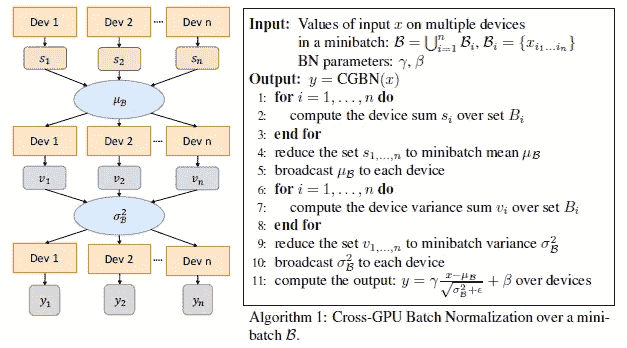

**跨 GPU 批量归一化**

*   对于目标检测，检测器需要处理各种尺度的目标，因此需要更高分辨率的图像作为其输入。
*   对于使用 800×800 大小的输入，**一个设备上可能的样本数量非常有限。**
*   因此，**应在多个 GPU**之间执行批量标准化，以从更多样本中收集足够的统计数据。
*   给定总数为 *n* 的 GPU 设备，首先根据分配给设备 *k* 的训练样本计算和值 *sk* 。
*   通过平均所有装置的总和值，我们获得当前小批量的平均值 *μβ* 。该步骤需要一个**全缩减操作**。
*   计算每个器件的方差，得到σ *β* 。
*   将σ *β* 广播到各器件后，我们可以通过以下方式执行标准归一化:

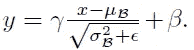

*   NVIDIA 集体通信库(NCCL)用于有效地执行接收和广播的所有减少操作。

# **3。实验结果**

*   **使用 COCO 检测数据集**，分为训练、验证、测试，包含 80 个类别，超过 250，000 张图片。
*   **超过 118000 张训练图像**用于训练， **5000 张验证图像**用于评估。
*   ImageNet 预训练[ResNetT7**-50**作为**骨干网**。](https://towardsdatascience.com/review-resnet-winner-of-ilsvrc-2015-image-classification-localization-detection-e39402bfa5d8?source=post_page---------------------------)
*   [**特征金字塔网络(FPN)**](https://towardsdatascience.com/review-fpn-feature-pyramid-network-object-detection-262fc7482610?source=post_page---------------------------) 用作**检测框架**。

## 3.1.大小型批量，无 BN

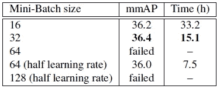

**不同小批量的比较，无 BN。**

*   **对于小批量 32** ，培训已经开始有**一些失败的机会**，即使使用预热策略。
*   与使用 16 的基线相比，没有**精度损失**。
*   **对于小批量 64** ，即使预热，训练**也无法收敛。** **将学习率降低一半**可以让训练到**收敛**。但是有**明显的精度损失。**
*   **对于小批量 128，训练失败**，预热和学习率减半。
*   当小批量和学习率较大时，即使采用预热策略，训练也会更加困难甚至不可能。

## 3.2.大小型批量，带 CGBN

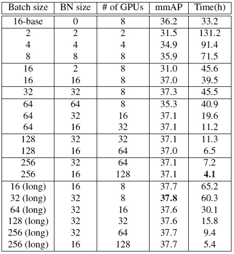

**不同小批量和 BN 大小的 mmAP 和训练时间。**

*   **在小批量的增长过程中，准确度几乎保持在同一水平**，始终优于基线(16 碱基)。
*   **小批量越大，培训周期越短。**例如，**具有 128 个 GPU 的 256 个小批量实验仅用 4.1 小时就完成了 COCO 训练**，这意味着与 33.2 小时的基线相比，加速了 8 倍。
*   **最佳 BN 大小(用于 BN 统计的图像数量)是 32。图像太少，例如 2、4 或 8，BN 统计非常不准确**，从而导致性能下降。
*   但是，**增加到 64，精度下降。**这证明了图像分类和对象检测任务之间的不匹配。
*   还尝试了长期训练策略。较长的训练时间会略微提高准确性。
*   比如“32(长)”就比对应的(37.8 v.s. 37.3)好。

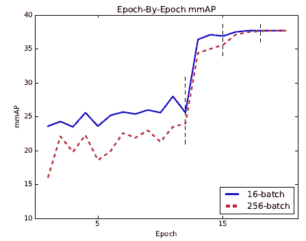

**使用长训练策略**验证 16(长)和 256(长)探测器的准确性

*   256(长)在早期更差，但在最后阶段赶上了 16(长)(在第二次学习速率衰减之后)。

## 3.3.可可检测挑战

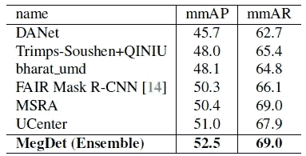

**(增强的)MegDet 对 COCO 数据集测试开发的结果。**

*   **提出的 MegDet 集成了多种技术**，包括 OHEM【35】，atrous 卷积( [DilatedNet](https://towardsdatascience.com/review-dilated-convolution-semantic-segmentation-9d5a5bd768f5?source=post_page---------------------------) ，[deeplab v1&deeplab v2](https://towardsdatascience.com/review-deeplabv1-deeplabv2-atrous-convolution-semantic-segmentation-b51c5fbde92d?source=post_page---------------------------))【40，2】，更强的基本模型( [ResNeXt](https://towardsdatascience.com/review-resnext-1st-runner-up-of-ilsvrc-2016-image-classification-15d7f17b42ac?source=post_page---------------------------) ，[SENet](https://towardsdatascience.com/review-senet-squeeze-and-excitation-network-winner-of-ilsvrc-2017-image-classification-a887b98b2883?source=post_page---------------------------))【38，18】，大核([GCN](https://towardsdatascience.com/review-gcn-global-convolutional-network-large-kernel-matters-semantic-segmentation-c830073492d2?source=post_page---------------------------))【28】，分段监督【27，34】，多样的网络结构([max(如果感兴趣，请阅读那些参考文献的故事或论文。有些我没覆盖，太多了……)](https://towardsdatascience.com/review-maxout-network-image-classification-40ecd77f7ce4?source=post_page---------------------------)
*   **在验证集**上获得 50.5 mmAP，在测试开发上获得 **50.6 mmAP。**
*   四个探测器的集合最终达到 52.5 mmAP。上表汇总了 COCO 2017 挑战赛排行榜的参赛作品。
*   下图给出了一些典型结果。

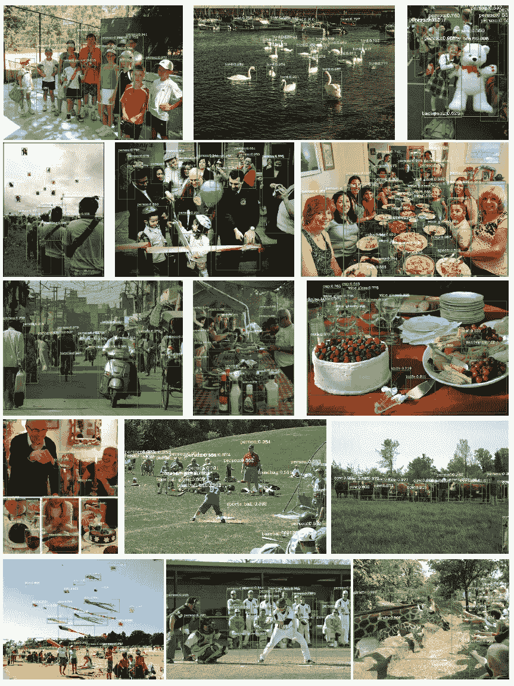

**可可上的 MegNet**

> 在冠状病毒的日子里，这个月再写 30 和 35 个故事的挑战已经完成。让我挑战 40 层楼！！这是本月的第 36 个故事..感谢访问我的故事..

## 参考

【2018 CVPR】【MegDet】
论文: [MegDet:大型迷你批量物体探测器](https://arxiv.org/abs/1711.07240)

## 目标检测

[ [过食](https://medium.com/coinmonks/review-of-overfeat-winner-of-ilsvrc-2013-localization-task-object-detection-a6f8b9044754?source=post_page---------------------------) ] [ [R-CNN](https://medium.com/coinmonks/review-r-cnn-object-detection-b476aba290d1?source=post_page---------------------------) ] [ [快 R-CNN](https://medium.com/coinmonks/review-fast-r-cnn-object-detection-a82e172e87ba?source=post_page---------------------------) ] [ [快 R-CNN](https://towardsdatascience.com/review-faster-r-cnn-object-detection-f5685cb30202?source=post_page---------------------------)][[MR-CNN&S-CNN](https://towardsdatascience.com/review-mr-cnn-s-cnn-multi-region-semantic-aware-cnns-object-detection-3bd4e5648fde?source=post_page---------------------------)][[DeepID-Net](https://towardsdatascience.com/review-deepid-net-def-pooling-layer-object-detection-f72486f1a0f6?source=post_page---------------------------)][[CRAFT](https://towardsdatascience.com/review-craft-cascade-region-proposal-network-and-fast-r-cnn-object-detection-2ce987361858?source=post_page---------------------------)][[R-FCN](https://towardsdatascience.com/review-r-fcn-positive-sensitive-score-maps-object-detection-91cd2389345c?source=post_page---------------------------)][[ION](https://towardsdatascience.com/review-ion-inside-outside-net-2nd-runner-up-in-2015-coco-detection-object-detection-da19993f4766?source=post_page---------------------------)][[multipath ne [TDM](https://medium.com/datadriveninvestor/review-tdm-top-down-modulation-object-detection-3f0efe9e0151?source=post_page---------------------------)][[SSD](https://towardsdatascience.com/review-ssd-single-shot-detector-object-detection-851a94607d11?source=post_page---------------------------)][[DSSD](https://towardsdatascience.com/review-dssd-deconvolutional-single-shot-detector-object-detection-d4821a2bbeb5?source=post_page---------------------------)][[yolov 1](https://towardsdatascience.com/yolov1-you-only-look-once-object-detection-e1f3ffec8a89?source=post_page---------------------------)][[yolov 2/yolo 9000](https://towardsdatascience.com/review-yolov2-yolo9000-you-only-look-once-object-detection-7883d2b02a65?source=post_page---------------------------)][[yolov 3](https://towardsdatascience.com/review-yolov3-you-only-look-once-object-detection-eab75d7a1ba6?source=post_page---------------------------)][[FPN](https://towardsdatascience.com/review-fpn-feature-pyramid-network-object-detection-262fc7482610?source=post_page---------------------------)][[retina net](https://towardsdatascience.com/review-retinanet-focal-loss-object-detection-38fba6afabe4?source=post_page---------------------------)[[DCN/DCN v1](https://towardsdatascience.com/review-dcn-deformable-convolutional-networks-2nd-runner-up-in-2017-coco-detection-object-14e488efce44?source=post_page---------------------------)[[级联 R-1](https://medium.com/@sh.tsang/reading-cascade-r-cnn-delving-into-high-quality-object-detection-object-detection-8c7901cc7864)

## [我之前的其他阅读材料](https://medium.com/@sh.tsang/overview-my-reviewed-paper-lists-tutorials-946ce59fbf9e)